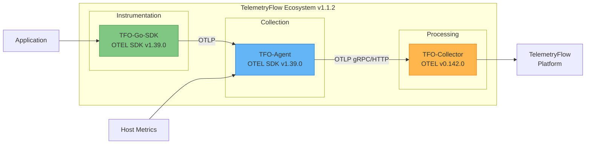

<div align="center">
  <picture>
    <source media="(prefers-color-scheme: dark)" srcset="https://github.com/telemetryflow/.github/raw/main/docs/assets/tfo-logo-agent-dark.svg">
    <source media="(prefers-color-scheme: light)" srcset="https://github.com/telemetryflow/.github/raw/main/docs/assets/tfo-logo-agent-light.svg">
    
  </picture>

  <h3>TelemetryFlow Agent (OTEL Agent)</h3>

[](CHANGELOG.md)
[](https://opensource.org/licenses/Apache-2.0)
[](https://golang.org/)
[](https://opentelemetry.io/)
[](https://opentelemetry.io/)

</div>

---

Enterprise-grade telemetry collection agent built on **OpenTelemetry Go SDK v1.39.0**. Provides comprehensive system monitoring with metrics collection, heartbeat monitoring, and OTLP telemetry export for the **TelemetryFlow Platform**.

This agent works as the **client-side counterpart** to the TelemetryFlow Backend Agent Module (NestJS), providing:

- Agent registration & lifecycle management
- Heartbeat & health monitoring
- System metrics collection
- OTLP telemetry export

## TelemetryFlow Ecosystem

TFO-Agent is fully aligned with the TelemetryFlow ecosystem, sharing the same OpenTelemetry SDK version:



| Component         | Version | OTEL Base          | Description                 |
| ----------------- | ------- | ------------------ | --------------------------- |
| **TFO-Agent**     | v1.1.2  | SDK v1.39.0        | Telemetry collection agent  |
| **TFO-Go-SDK**    | v1.1.2  | SDK v1.39.0        | Go instrumentation SDK      |
| **TFO-Collector** | v1.1.2  | Collector v0.142.0 | Central telemetry collector |

## Features

### OpenTelemetry Core

- **OpenTelemetry SDK v1.39.0**: Built on standard OTEL Go SDK (aligned with TFO-Go-SDK)
- **OTLP Export**: OpenTelemetry Protocol for metrics, logs, and traces
- **Multi-Signal Support**: Metrics, logs, and traces collection

### Agent Lifecycle (Backend Integration)

- **Agent Registration**: Auto-register with TelemetryFlow backend
- **Heartbeat Monitoring**: Regular health checks to backend
- **Health Status Sync**: Report agent health and system info
- **Activation/Deactivation**: Remote agent control from backend

### System Monitoring

- **System Metrics Collection**: CPU, memory, disk, and network metrics
- **Process Monitoring**: Track running processes
- **Resource Detection**: Auto-detect host, OS, and container info

### Reliability

- **Disk-Backed Buffer**: Resilient retry buffer for offline scenarios
- **Auto-Reconnection**: Automatic retry with exponential backoff
- **Graceful Shutdown**: Signal handling (SIGINT, SIGTERM, SIGHUP)

### Platform

- **Cross-Platform**: Linux, macOS, and Windows support
- **LEGO Building Blocks**: Modular architecture for easy extensibility

## Quick Start

### From Source

```bash
# Clone the repository
git clone https://github.com/telemetryflow/telemetryflow-agent.git
cd telemetryflow-agent

# Build
make build

# Run
./build/tfo-agent --help
```

### Docker

#### Using Docker Compose (Recommended)

```bash
# Copy environment template
cp .env.example .env

# Edit .env with your configuration
vim .env

# Build and start
docker-compose up -d --build

# View logs
docker-compose logs -f tfo-agent

# Stop
docker-compose down
```

#### Using Docker Directly

```bash
# Build image
docker build \
  --build-arg VERSION=1.1.2 \
  --build-arg GIT_COMMIT=$(git rev-parse --short HEAD) \
  --build-arg GIT_BRANCH=$(git rev-parse --abbrev-ref HEAD) \
  --build-arg BUILD_TIME=$(date -u '+%Y-%m-%dT%H:%M:%SZ') \
  -t telemetryflow/telemetryflow-agent:1.1.2 .

# Run container
docker run -d --name tfo-agent \
  -p 4317:4317 \
  -p 4318:4318 \
  -p 8888:8888 \
  -p 13133:13133 \
  -v /path/to/config.yaml:/etc/tfo-agent/tfo-agent.yaml:ro \
  -v /var/lib/tfo-agent:/var/lib/tfo-agent \
  telemetryflow/telemetryflow-agent:1.1.2
```

### OTEL Collector Ports

| Port  | Protocol | Description            |
| ----- | -------- | ---------------------- |
| 4317  | gRPC     | OTLP gRPC (v1 & v2)    |
| 4318  | HTTP     | OTLP HTTP (v1 & v2)    |
| 8888  | HTTP     | OTEL Collector metrics |
| 8889  | HTTP     | Prometheus exporter    |
| 13133 | HTTP     | Health check           |
| 55679 | HTTP     | zPages (debugging)     |
| 1777  | HTTP     | pprof (profiling)      |

### OTLP Endpoints (Dual Ingestion)

The TFO-Collector supports both TelemetryFlow (v2) and OTEL Community (v1) endpoints:

**TelemetryFlow Platform (Recommended):**

```text
POST http://localhost:4318/v2/traces
POST http://localhost:4318/v2/metrics
POST http://localhost:4318/v2/logs
```

**OTEL Community (Backwards Compatible):**

```text
POST http://localhost:4318/v1/traces
POST http://localhost:4318/v1/metrics
POST http://localhost:4318/v1/logs
```

**gRPC:** `localhost:4317` (both v1 and v2)

## Configuration

Create configuration file at `/etc/tfo-agent/tfo-agent.yaml`:

```yaml
# TelemetryFlow Platform Configuration (v1.1.2+)
telemetryflow:
  api_key_id: "${TELEMETRYFLOW_API_KEY_ID}"
  api_key_secret: "${TELEMETRYFLOW_API_KEY_SECRET}"
  endpoint: "${TELEMETRYFLOW_ENDPOINT:-localhost:4317}"
  protocol: grpc # grpc or http
  tls:
    enabled: true
    skip_verify: false
  retry:
    enabled: true
    max_attempts: 3
    initial_interval: 1s
    max_interval: 30s

agent:
  name: "TelemetryFlow Agent"
  hostname: "" # Auto-detected if empty
  tags:
    environment: production

heartbeat:
  interval: 60s
  timeout: 10s

collector:
  system:
    enabled: true
    interval: 15s
    cpu: true
    memory: true
    disk: true
    network: true

exporter:
  otlp:
    enabled: true
    batch_size: 100
    flush_interval: 10s
    compression: gzip

buffer:
  enabled: true
  path: "/var/lib/tfo-agent/buffer"
  max_size_mb: 100
```

### Environment Variables

```bash
# TelemetryFlow Platform (v1.1.2+)
export TELEMETRYFLOW_ENDPOINT="localhost:4317"
export TELEMETRYFLOW_API_KEY_ID="tfk_your_key_id"
export TELEMETRYFLOW_API_KEY_SECRET="tfs_your_key_secret"
export TELEMETRYFLOW_ENVIRONMENT="production"

# Agent Configuration
export TELEMETRYFLOW_AGENT_ID="your-agent-id"
export TELEMETRYFLOW_AGENT_NAME="my-agent"

# Logging
export TELEMETRYFLOW_LOG_LEVEL="info"
```

## Usage

```bash
# Start agent
tfo-agent start

# Start with custom config
tfo-agent start --config /path/to/config.yaml

# Validate configuration
tfo-agent config validate

# Show version
tfo-agent version
```

## Project Structure

```
tfo-agent/
├── cmd/tfo-agent/         # CLI entry point
├── internal/
│   ├── agent/             # Core agent lifecycle
│   ├── buffer/            # Disk-backed retry buffer
│   ├── collector/         # Metric collectors
│   │   └── system/        # System metrics collector
│   ├── config/            # Configuration management
│   ├── exporter/          # OTLP data exporters
│   └── version/           # Version and banner info
├── pkg/                   # LEGO Building Blocks
│   ├── api/               # HTTP API client
│   ├── banner/            # Startup banner
│   ├── config/            # Config loader utilities
│   └── plugin/            # Plugin registry system
├── configs/               # Configuration templates
├── scripts/               # Build/install scripts
├── build/                 # Build output
├── Makefile
├── Dockerfile             # Docker build
├── docker-compose.yml     # Docker Compose
├── .env.example           # Environment template
└── README.md
```

## LEGO Building Blocks

The `pkg/` directory contains reusable building blocks:

| Block        | Description                           |
| ------------ | ------------------------------------- |
| `pkg/banner` | ASCII art startup banner              |
| `pkg/config` | Flexible configuration loader         |
| `pkg/plugin` | Plugin registry for extensibility     |
| `pkg/api`    | HTTP client for backend communication |

### Adding Custom Plugins

```go
import "github.com/telemetryflow/telemetryflow/telemetryflow-agent/pkg/plugin"

// Register a custom collector
plugin.Register("my-collector", func() plugin.Plugin {
    return &MyCustomCollector{}
})

// Use the plugin
p, _ := plugin.Get("my-collector")
p.Init(config)
p.Start()
```

## Collected Metrics

| Metric                      | Type    | Description              |
| --------------------------- | ------- | ------------------------ |
| `system.cpu.usage`          | gauge   | CPU usage percentage     |
| `system.cpu.cores`          | gauge   | Number of CPU cores      |
| `system.memory.total`       | gauge   | Total memory (bytes)     |
| `system.memory.used`        | gauge   | Used memory (bytes)      |
| `system.memory.usage`       | gauge   | Memory usage percentage  |
| `system.disk.total`         | gauge   | Total disk space (bytes) |
| `system.disk.used`          | gauge   | Used disk space (bytes)  |
| `system.disk.usage`         | gauge   | Disk usage percentage    |
| `system.network.bytes_sent` | counter | Total bytes sent         |
| `system.network.bytes_recv` | counter | Total bytes received     |

## Development

### Prerequisites

- Go 1.24 or later
- Make

### Build Commands

```bash
# Show all commands
make help

# Build Commands
make                # Build agent (default)
make build          # Build agent for current platform
make build-all      # Build agent for all platforms
make build-linux    # Build for Linux (amd64 and arm64)
make build-darwin   # Build for macOS (amd64 and arm64)

# Development Commands
make run            # Build and run agent
make dev            # Run with go run (faster for development)
make lint           # Run linter
make fmt            # Format code
make vet            # Run go vet

# Dependencies
make deps           # Download dependencies
make deps-update    # Update dependencies
make tidy           # Tidy go modules

# Other Commands
make clean          # Clean build artifacts
make install        # Install binary to /usr/local/bin
make uninstall      # Uninstall binary
make docker-build   # Build Docker image
make docker-push    # Push Docker image
make version        # Show version information
```

### Testing

```bash
# Run all tests
make test                    # Run unit and integration tests
make test-all                # Run unit, integration, and E2E tests
make test-unit               # Run unit tests only
make test-integration        # Run integration tests only
make test-e2e                # Run E2E tests only

# Run specific tests
make test-run PKG=integrations                      # Run all integration tests
make test-run PKG=domain/agent                      # Run agent domain tests
make test-run TEST=TestPerconaCollector             # Run test by name pattern
make test-run PKG=integrations TEST=TestKafka       # Run specific test in package
make test-list                                       # List available test packages

# Coverage and CI
make test-coverage           # Generate coverage report
make ci-test                 # Run with race detection (CI mode)

# Using test script directly
./scripts/test-specific.sh integrations             # Run all integration tests
./scripts/test-specific.sh -c domain/agent          # Run with coverage
./scripts/test-specific.sh -r TestExporter          # Run with race detector
./scripts/test-specific.sh --ci infrastructure      # CI mode (race + coverage)
./scripts/test-specific.sh -l                       # List available packages
```

#### Test Packages

| Package                   | Description                 | Test Files |
| ------------------------- | --------------------------- | ---------- |
| `application`             | CLI commands, configuration | 3          |
| `domain/agent`            | Agent lifecycle management  | 2          |
| `domain/plugin`           | Plugin registry             | 1          |
| `domain/telemetry`        | Telemetry collection        | 2          |
| `infrastructure/api`      | API client                  | 1          |
| `infrastructure/buffer`   | Disk-backed buffer          | 1          |
| `infrastructure/config`   | Configuration loader        | 1          |
| `infrastructure/exporter` | OTLP exporters              | 3          |
| `integrations`            | 3rd party integrations      | 36         |
| `presentation/banner`     | Startup banner              | 1          |

## Systemd Service

```ini
# /etc/systemd/system/tfo-agent.service
[Unit]
Description=TelemetryFlow Agent - CEOP
After=network.target

[Service]
Type=simple
User=telemetryflow
ExecStart=/usr/local/bin/tfo-agent start --config /etc/tfo-agent/tfo-agent.yaml
Restart=always
RestartSec=5

[Install]
WantedBy=multi-user.target
```

```bash
sudo systemctl daemon-reload
sudo systemctl enable tfo-agent
sudo systemctl start tfo-agent
```

## 3rd Party Integrations

TelemetryFlow Agent supports **39+ integrations** for enterprise environments across multiple categories.

### Integration Categories

| Category              | Integrations                                                 | Count |
| --------------------- | ------------------------------------------------------------ | ----- |
| **Cloud Providers**   | GCP, Azure, Alibaba Cloud, AWS CloudWatch                    | 4     |
| **Infrastructure**    | Proxmox, VMware vSphere, Nutanix, Azure Arc                  | 4     |
| **Network & IoT**     | Cisco (DNA Center/Meraki), SNMP v1/v2c/v3, MQTT              | 3     |
| **Kernel/System**     | eBPF (syscalls, network, file I/O, scheduler), Cilium Hubble | 2     |
| **APM Platforms**     | Dynatrace, IBM Instana, Datadog, New Relic                   | 4     |
| **OSS Observability** | SigNoz, Coroot, HyperDX, OpenObserve, Netdata                | 5     |
| **Observability**     | Prometheus, Splunk, Elasticsearch                            | 3     |
| **Streaming & Logs**  | Kafka, Loki, InfluxDB                                        | 3     |
| **Tracing**           | Jaeger, Zipkin                                               | 2     |
| **Monitoring Tools**  | Telegraf, Grafana Alloy, Percona PMM, Blackbox, ManageEngine | 5     |
| **Custom**            | Webhook                                                      | 1     |

### Data Type Support Matrix

| Integration        | Metrics | Logs | Traces | Protocol       |
| ------------------ | :-----: | :--: | :----: | -------------- |
| **Cloud**          |         |      |        |                |
| GCP                |   ✅    |  ✅  |   ✅   | gRPC/REST      |
| Azure              |   ✅    |  ✅  |   ✅   | REST           |
| Alibaba Cloud      |   ✅    |  ✅  |   ✅   | REST           |
| AWS CloudWatch     |   ✅    |  ✅  |   ❌   | REST           |
| **Infrastructure** |         |      |        |                |
| Proxmox            |   ✅    |  ❌  |   ❌   | REST           |
| VMware vSphere     |   ✅    |  ❌  |   ❌   | REST/SOAP      |
| Nutanix            |   ✅    |  ❌  |   ❌   | REST           |
| Azure Arc          |   ✅    |  ❌  |   ❌   | REST           |
| **Network**        |         |      |        |                |
| Cisco              |   ✅    |  ❌  |   ❌   | REST           |
| SNMP               |   ✅    |  ❌  |   ❌   | SNMP v1/v2c/v3 |
| MQTT               |   ✅    |  ✅  |   ✅   | MQTT           |
| **System**         |         |      |        |                |
| eBPF               |   ✅    |  ❌  |   ❌   | Kernel         |
| Cilium Hubble      |   ✅    |  ❌  |   ✅   | gRPC           |
| **APM Platforms**  |         |      |        |                |
| Dynatrace          |   ✅    |  ✅  |   ✅   | REST/OTLP      |
| IBM Instana        |   ✅    |  ✅  |   ✅   | REST           |
| Datadog            |   ✅    |  ✅  |   ✅   | REST           |
| New Relic          |   ✅    |  ✅  |   ✅   | REST           |
| **OSS Observ.**    |         |      |        |                |
| SigNoz             |   ✅    |  ✅  |   ✅   | OTLP/HTTP      |
| Coroot             |   ✅    |  ✅  |   ✅   | OTLP/HTTP      |
| HyperDX            |   ✅    |  ✅  |   ✅   | OTLP/HTTP      |
| OpenObserve        |   ✅    |  ✅  |   ✅   | OTLP/HTTP      |
| Netdata            |   ✅    |  ❌  |   ❌   | REST           |
| **Observability**  |         |      |        |                |
| Prometheus         |   ✅    |  ❌  |   ❌   | Remote Write   |
| Splunk             |   ✅    |  ✅  |   ❌   | HEC            |
| Elasticsearch      |   ✅    |  ✅  |   ❌   | REST           |
| ManageEngine       |   ✅    |  ✅  |   ❌   | REST           |
| **Streaming**      |         |      |        |                |
| Kafka              |   ✅    |  ✅  |   ✅   | Kafka Protocol |
| Loki               |   ❌    |  ✅  |   ❌   | REST           |
| InfluxDB           |   ✅    |  ❌  |   ❌   | Line Protocol  |
| **Tracing**        |         |      |        |                |
| Jaeger             |   ❌    |  ❌  |   ✅   | gRPC/Thrift    |
| Zipkin             |   ❌    |  ❌  |   ✅   | REST           |
| **Tools**          |         |      |        |                |
| Telegraf           |   ✅    |  ❌  |   ❌   | InfluxDB LP    |
| Grafana Alloy      |   ✅    |  ✅  |   ✅   | OTLP           |
| Percona PMM        |   ✅    |  ❌  |   ❌   | REST           |
| Blackbox           |   ✅    |  ❌  |   ❌   | HTTP Probe     |
| Webhook            |   ✅    |  ✅  |   ✅   | HTTP/HTTPS     |

### Integration Capabilities Comparison

| Feature                   | TFO-Agent | Datadog | New Relic | Dynatrace | Instana | Splunk | ManageEngine | Grafana Stack (OSS) |
| ------------------------- | :-------: | :-----: | :-------: | :-------: | :-----: | :----: | :----------: | :-----------------: |
| **OTLP Native**           |    ✅     |   ⚠️    |    ⚠️     |    ✅     |   ⚠️    |   ⚠️   |      ❌      |         ✅          |
| **Multi-Cloud**           |    ✅     |   ✅    |    ✅     |    ✅     |   ✅    |   ✅   |      ⚠️      |         ✅          |
| **Hybrid Infrastructure** |    ✅     |   ⚠️    |    ⚠️     |    ✅     |   ✅    |   ⚠️   |      ✅      |         ⚠️          |
| **eBPF Support**          |    ✅     |   ✅    |    ⚠️     |    ✅     |   ✅    |   ❌   |      ❌      |         ⚠️          |
| **Network Devices**       |    ✅     |   ⚠️    |    ⚠️     |    ⚠️     |   ⚠️    |   ✅   |      ✅      |         ⚠️          |
| **IoT/MQTT**              |    ✅     |   ❌    |    ❌     |    ⚠️     |   ⚠️    |   ⚠️   |      ⚠️      |         ⚠️          |
| **Disk-Backed Buffer**    |    ✅     |   ✅    |    ✅     |    ✅     |   ✅    |   ✅   |      ❌      |         ✅          |
| **APM/Traces**            |    ✅     |   ✅    |    ✅     |    ✅     |   ✅    |   ⚠️   |      ⚠️      |         ✅          |
| **Log Management**        |    ✅     |   ✅    |    ✅     |    ✅     |   ⚠️    |   ✅   |      ✅      |         ✅          |
| **Real-time Metrics**     |    ✅     |   ✅    |    ✅     |    ✅     |   ✅    |   ✅   |      ✅      |         ✅          |
| **Auto-Discovery**        |    ✅     |   ✅    |    ✅     |    ✅     |   ✅    |   ⚠️   |      ✅      |         ⚠️          |
| **On-Premise Deploy**     |    ✅     |   ❌    |    ❌     |    ✅     |   ✅    |   ✅   |      ✅      |         ✅          |
| **License**               | Apache 2  |  Prop.  |   Prop.   |   Prop.   |  Prop.  | Prop.  |    Prop.     |       AGPLv3        |

Legend: ✅ Full Support | ⚠️ Partial/Plugin | ❌ Not Supported

> **Note**: Grafana Stack (OSS) refers to the self-hosted open-source LGTM stack (Loki, Grafana, Tempo, Mimir) with Grafana Alloy as the agent. For Grafana Cloud (SaaS), capabilities may differ.

### Open Source Observability Comparison

| Feature            | TFO Platform | SigNoz | Coroot | HyperDX | OpenObserve | Netdata |
| ------------------ | :----------: | :----: | :----: | :-----: | :---------: | :-----: |
| **OTLP Native**    |      ✅      |   ✅   |   ✅   |   ✅    |     ✅      |   ❌    |
| **Metrics**        |      ✅      |   ✅   |   ✅   |   ✅    |     ✅      |   ✅    |
| **Logs**           |      ✅      |   ✅   |   ✅   |   ✅    |     ✅      |   ❌    |
| **Traces**         |      ✅      |   ✅   |   ✅   |   ✅    |     ✅      |   ❌    |
| **eBPF Support**   |      ✅      |   ⚠️   |   ✅   |   ❌    |     ❌      |   ✅    |
| **Auto-Discovery** |      ✅      |   ✅   |   ✅   |   ⚠️    |     ⚠️      |   ✅    |
| **Service Maps**   |      ✅      |   ✅   |   ✅   |   ✅    |     ⚠️      |   ❌    |
| **ClickHouse**     |      ✅      |   ✅   |   ✅   |   ✅    |     ❌      |   ❌    |
| **Self-Hosted**    |      ✅      |   ✅   |   ✅   |   ✅    |     ✅      |   ✅    |
| **Cloud Offering** |      ✅      |   ✅   |   ✅   |   ✅    |     ✅      |   ✅    |
| **License**        |   Apache 2   | MIT/EE | Apache | MIT/EE  |  Apache/EE  |  GPLv3  |

Legend: ✅ Full Support | ⚠️ Partial/Plugin | ❌ Not Supported

> **Note**: TFO Platform refers to the complete TelemetryFlow ecosystem (TFO-Agent + TFO-Collector + TFO-Backend) with ClickHouse storage and service map visualization.

### Key Differentiators

| Capability                | Description                                                 |
| ------------------------- | ----------------------------------------------------------- |
| **Unified Agent**         | Single agent for cloud, infrastructure, network, and system |
| **OTLP-First**            | Native OpenTelemetry Protocol support (gRPC & HTTP)         |
| **Enterprise Ready**      | TLS, mTLS, API key authentication, retry with backoff       |
| **Hybrid Cloud**          | Proxmox, VMware, Nutanix, Azure Arc in one agent            |
| **Network Observability** | Cisco DNA/Meraki, SNMP v3, MQTT for IoT                     |
| **Kernel-Level**          | eBPF for syscalls, network, file I/O, scheduler metrics     |
| **Resilient**             | Disk-backed buffer with automatic retry and flush           |
| **Extensible**            | Plugin architecture for custom integrations                 |

See [Integration Documentation](docs/integrations/README.md) for detailed configuration.

## Documentation

| Document                                     | Description                               |
| -------------------------------------------- | ----------------------------------------- |
| [README](docs/README.md)                     | Documentation overview                    |
| [ARCHITECTURE](docs/ARCHITECTURE.md)         | System architecture with Mermaid diagrams |
| [INSTALLATION](docs/INSTALLATION.md)         | Installation guide for all platforms      |
| [CONFIGURATION](docs/CONFIGURATION.md)       | Configuration options and examples        |
| [COMMANDS](docs/COMMANDS.md)                 | CLI commands reference                    |
| [DEVELOPMENT](docs/DEVELOPMENT.md)           | Development guide and coding standards    |
| [TROUBLESHOOTING](docs/TROUBLESHOOTING.md)   | Troubleshooting guide and common issues   |
| [GITHUB-WORKFLOWS](docs/GITHUB-WORKFLOWS.md) | CI/CD workflows documentation             |
| [INTEGRATIONS](docs/integrations/README.md)  | 3rd party integration guides              |
| [CHANGELOG](CHANGELOG.md)                    | Version history and changes               |

## License

Apache License 2.0 - See [LICENSE](../LICENSE)

## Links

- **Website**: [https://telemetryflow.id](https://telemetryflow.id)
- **Documentation**: [https://docs.telemetryflow.id](https://docs.telemetryflow.id)
- **OpenTelemetry**: [https://opentelemetry.io](https://opentelemetry.io)
- **Developer**: [DevOpsCorner Indonesia](https://devopscorner.id)

---

**Copyright (c) 2024-2026 DevOpsCorner Indonesia. All rights reserved.**
