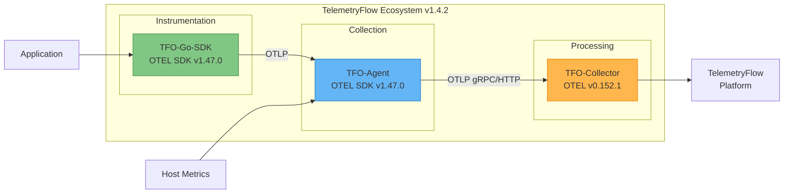

<div align="center">
  <picture>
    <source media="(prefers-color-scheme: dark)" srcset="https://github.com/telemetryflow/.github/raw/main/docs/assets/tfo-logo-agent-dark.svg">
    <source media="(prefers-color-scheme: light)" srcset="https://github.com/telemetryflow/.github/raw/main/docs/assets/tfo-logo-agent-light.svg">
    
  </picture>

  <h3>TelemetryFlow Agent (OTEL Agent)</h3>

[](CHANGELOG.md)
[](https://opensource.org/licenses/Apache-2.0)
[](https://golang.org/)
[](https://opentelemetry.io/)
[](CHANGELOG.md)
[](https://opentelemetry.io/)

</div>

---

Enterprise-grade telemetry collection agent built on **OpenTelemetry Go SDK v1.47.0**. Provides comprehensive system monitoring with metrics collection, heartbeat monitoring, and OTLP telemetry export for the **TelemetryFlow Platform**.

This agent works as the **client-side counterpart** to the TelemetryFlow Backend Agent Module (NestJS), providing:

- Agent registration & lifecycle management
- Heartbeat & health monitoring
- System metrics collection
- OTLP telemetry export

## TelemetryFlow Ecosystem

TFO-Agent is fully aligned with the TelemetryFlow ecosystem, sharing the same OpenTelemetry SDK version:


```mermaid
graph LR
    subgraph "TelemetryFlow Ecosystem v1.4.2"
        subgraph "Instrumentation"
            SDK[TFO-Go-SDK<br/>OTEL SDK v1.47.0]
        end

        subgraph "Collection"
            AGENT[TFO-Agent<br/>OTEL SDK v1.47.0]
        end

        subgraph "Processing"
            COLLECTOR[TFO-Collector<br/>OTEL v0.152.1]
        end
    end

    APP[Application] --> SDK
    SDK -->|OTLP| AGENT
    HOST[Host Metrics] --> AGENT
    AGENT -->|OTLP gRPC/HTTP| COLLECTOR
    COLLECTOR --> BACKEND[TelemetryFlow<br/>Platform]

    style SDK fill:#81C784,stroke:#388E3C
    style AGENT fill:#64B5F6,stroke:#1976D2
    style COLLECTOR fill:#FFB74D,stroke:#F57C00
```

| Component         | Version     | OTEL Base          | Description                 |
| ----------------- | ----------- | ------------------ | --------------------------- |
| **TFO-Agent**     | v1.3.0-dev  | SDK v1.47.0        | Telemetry collection agent  |
| **TFO-Go-SDK**    | v1.3.0-dev  | SDK v1.47.0        | Go instrumentation SDK      |
| **TFO-Collector** | v1.2.0      | Collector v0.151.0 | Central telemetry collector |

## Features

### OpenTelemetry Core

- **OpenTelemetry SDK v1.47.0**: Built on standard OTEL Go SDK (aligned with TFO-Go-SDK)
- **OTLP Export**: OpenTelemetry Protocol for metrics, logs, and traces
- **Multi-Signal Support**: Metrics, logs, and traces collection

### Agent Lifecycle (Backend Integration)

- **Agent Registration**: Auto-register with TelemetryFlow backend
- **Heartbeat Monitoring**: Regular health checks to backend
- **Health Status Sync**: Report agent health and system info
- **Activation/Deactivation**: Remote agent control from backend

### System Monitoring

- **System Metrics Collection**: CPU, memory, disk, and network metrics
- **Docker Container Monitoring**: Per-container CPU, memory, network, disk I/O, and PID metrics via Docker Engine API
- **cAdvisor Metrics Scraping**: Prometheus endpoint scraper for cAdvisor container metrics
- **Process Monitoring**: Track running processes
- **Resource Detection**: Auto-detect host, OS, and container info

### Reliability

- **Disk-Backed Buffer**: Resilient retry buffer for offline scenarios
- **Auto-Reconnection**: Automatic retry with exponential backoff
- **Graceful Shutdown**: Signal handling (SIGINT, SIGTERM, SIGHUP)

### Platform

- **Cross-Platform**: Linux, macOS, and Windows support
- **LEGO Building Blocks**: Modular architecture for easy extensibility

## Roadmap Status (1.3.0-dev)

The `1.3.0` line is a multi-milestone rollout that closes the Telegraf capability gap. All features are opt-in via the new `collectors.*` / `pipeline.*` / `outputs.*` config keys — existing 1.2.x configurations continue to work unchanged.

| Milestone                              | Status | Scope                                                                                                                                                                                                                                                                                                                              |
| -------------------------------------- | :----: | ---------------------------------------------------------------------------------------------------------------------------------------------------------------------------------------------------------------------------------------------------------------------------------------------------------------------------------- |
| **M1 Foundation**                      |   ✅   | Plugin system (`internal/plugin/`), disk-backed retry buffer wired into the OTLP sink, channel-based processor pipeline engine (`internal/pipeline/`), `@{store:key}` SecretStore (env / file / Vault), atomic plugin state persister (`internal/persister/`), self-observability layer (`internal/selfstat/`), config migration framework |
| **M2 Network Monitoring**              |   ✅   | `ping` (ICMP), `dns` (miekg/dns), `tcp_probe`, `http_probe`, `snmp` (v1/v2c/v3 via gosnmp), `netflow` (v5/v9/IPFIX listener), `syslog_listener` (RFC 3164/5424/Cisco), `sflow` v5 listener                                                                                                                                           |
| **M3 Logs & Self-Observation**         |   ✅   | OTLP log bridge wired (`LogCollector` → OTLP `/v1/logs`), 4 log parser processors (`multiline`, `grok_parser`, `json_parser`, `regex_parser`), `tail_sampling` probabilistic + policy sampler, `log_to_metric` extractor, `internalstats` selfstat internal collector, selfstat counters wired into `MetricForwarder` + `BufferRetrySink`, tail offset persistence via `StatefulPlugin`, Grafana self-observability dashboard |
| **M4 Database & Application**          |   ✅   | `nginx` (stub_status), `apache` (server-status), `haproxy` (CSV stats), `influxdb` (/debug/vars), `elasticsearch` (cluster + node stats), `opensearch` (ES fork), `couchbase` (pools/default), `vault` (Prometheus metrics), `sql_generic` (user-defined SQL via database/sql), `pgbouncer` (SHOW STATS / POOLS). Redis + Valkey enhanced with cluster + latency + version metrics. |
| **M5 Multi-Output**                    |   ✅   | `prometheus_remote_write` (proper protobuf + snappy — P0 fix), OTLP gRPC exporter (`protocol: grpc`), `file` output (JSON / Influx LP / Prom text + rotation), `kafka` producer (JSON / OTLP protobuf / Prom remote write), `loki` logs output (stream grouping + label templates), `cloudwatch` (AWS SDK v2 PutMetricData), `datadog` (Metrics v2 API) |

**All 5 milestones shipped.** 34 native collectors, 12 processors, 7 output plugins, 48 config files. See [CHANGELOG.md](CHANGELOG.md) for full details.

## Quick Start

> **🚀 New to TFO-Agent?** Check the [Quick Start Guide](docs/QUICK-START.md) for step-by-step setup with Docker, Kubernetes, or binary installation.

### From Source

```bash
# Clone the repository
git clone https://github.com/telemetryflow/telemetryflow-agent.git
cd telemetryflow-agent

# Build
make build

# Run
./build/tfo-agent --help
```

### Docker

#### Using Docker Compose (Recommended)

```bash
# Copy environment template
cp .env.example .env

# Edit .env with your configuration
vim .env

# Build and start
docker-compose up -d --build

# View logs
docker-compose logs -f tfo-agent

# Stop
docker-compose down
```

#### Using Docker Directly

```bash
# Build image
docker build \
  --build-arg VERSION=1.3.0-dev \
  --build-arg GIT_COMMIT=$(git rev-parse --short HEAD) \
  --build-arg GIT_BRANCH=$(git rev-parse --abbrev-ref HEAD) \
  --build-arg BUILD_TIME=$(date -u '+%Y-%m-%dT%H:%M:%SZ') \
  -t telemetryflow/telemetryflow-agent:1.3.0-dev .

# Run container
docker run -d --name tfo-agent \
  -p 4317:4317 \
  -p 4318:4318 \
  -p 8888:8888 \
  -p 13133:13133 \
  -v /path/to/config.yaml:/etc/tfo-agent/tfo-agent.yaml:ro \
  -v /var/lib/tfo-agent:/var/lib/tfo-agent \
  telemetryflow/telemetryflow-agent:1.3.0-dev
```

### OTEL Collector Ports

| Port  | Protocol | Description            |
| ----- | -------- | ---------------------- |
| 4317  | gRPC     | OTLP gRPC (v1 & v2)    |
| 4318  | HTTP     | OTLP HTTP (v1 & v2)    |
| 8888  | HTTP     | OTEL Collector metrics |
| 8889  | HTTP     | Prometheus exporter    |
| 13133 | HTTP     | Health check           |
| 55679 | HTTP     | zPages (debugging)     |
| 1777  | HTTP     | pprof (profiling)      |

### OTLP Endpoints (Dual Ingestion)

The TFO-Collector supports both TelemetryFlow (v2) and OTEL Community (v1) endpoints:

**TelemetryFlow Platform (Recommended):**

```text
POST http://localhost:4318/v2/traces
POST http://localhost:4318/v2/metrics
POST http://localhost:4318/v2/logs
```

**OTEL Community (Backwards Compatible):**

```text
POST http://localhost:4318/v1/traces
POST http://localhost:4318/v1/metrics
POST http://localhost:4318/v1/logs
```

**gRPC:** `localhost:4317` (both v1 and v2)

## Configuration

> **📋 Complete Configuration:** See [`configs/tfo-agent.default.yaml`](configs/tfo-agent.default.yaml) for a full configuration example showing Node Exporter, Kubernetes, and eBPF collectors integrated with TFO Platform.
> **🔗 Integration Guide:** See [TFO Platform Integration Guide](docs/TFO-PLATFORM-INTEGRATION.md) for architecture diagrams, data flow, and production deployment examples.

Create configuration file at `/etc/tfo-agent/tfo-agent.yaml`:

```yaml
# TelemetryFlow Platform Configuration
telemetryflow:
  api_key_id: "${TELEMETRYFLOW_API_KEY_ID}"
  api_key_secret: "${TELEMETRYFLOW_API_KEY_SECRET}"
  # OTLP collector endpoint (metrics/traces/logs export)
  endpoint: "${TELEMETRYFLOW_ENDPOINT:-localhost:4317}"
  # Platform backend API (heartbeat, QAN, agent registration)
  backend_endpoint: "${TELEMETRYFLOW_BACKEND_ENDPOINT:-http://localhost:3000/api/v2}"
  protocol: "${TELEMETRYFLOW_PROTOCOL:-grpc}" # grpc or http
  tls:
    enabled: true
    skip_verify: false
  retry:
    enabled: true
    max_attempts: 3
    initial_interval: 1s
    max_interval: 30s

agent:
  name: "TelemetryFlow Agent"
  hostname: "" # Auto-detected if empty
  tags:
    environment: production

heartbeat:
  interval: 60s
  timeout: 10s

collector:
  system:
    enabled: true
    interval: 15s
    cpu: true
    memory: true
    disk: true
    network: true

exporter:
  otlp:
    enabled: true
    batch_size: 100
    flush_interval: 10s
    compression: gzip

buffer:
  enabled: true
  path: "/var/lib/tfo-agent/buffer"
  max_size_mb: 100
```

### Environment Variables

```bash
# TelemetryFlow Platform
export TELEMETRYFLOW_ENDPOINT="localhost:4317"                         # OTLP collector
export TELEMETRYFLOW_BACKEND_ENDPOINT="http://localhost:3000/api/v2"   # Platform backend API
export TELEMETRYFLOW_API_KEY_ID="tfk_your_key_id"
export TELEMETRYFLOW_API_KEY_SECRET="tfs_your_key_secret"
export TELEMETRYFLOW_ENVIRONMENT="production"

# Agent Configuration
export TELEMETRYFLOW_AGENT_ID="your-agent-id"
export TELEMETRYFLOW_AGENT_NAME="my-agent"

# Logging
export TELEMETRYFLOW_LOG_LEVEL="info"
```

## Usage

```bash
# Start agent
tfo-agent start

# Start with custom config
tfo-agent start --config /path/to/config.yaml

# Validate configuration
tfo-agent config validate

# Show version
tfo-agent version
```

## Project Structure

```
tfo-agent/
├── cmd/tfo-agent/         # CLI entry point
├── internal/
│   ├── agent/             # Core agent lifecycle
│   ├── buffer/            # Disk-backed retry buffer (wired into OTLP sink)
│   ├── collector/         # Metric collectors
│   │   ├── aurora/        # Amazon Aurora CloudWatch/PI/RDS collector
│   │   ├── cadvisor/      # cAdvisor Prometheus scraper collector
│   │   ├── clickhouse/    # ClickHouse database collector
│   │   ├── cockroachdb/   # CockroachDB database collector
│   │   ├── confluent_kafka/ # Confluent Kafka Metrics API collector
│   │   ├── dns/           # DNS query probe (M2)
│   │   ├── docker/        # Docker container metrics collector
│   │   ├── ebpf/          # eBPF kernel-level metrics collector
│   │   ├── http_probe/    # HTTP synthetic probe (M2)
│   │   ├── internalstats/ # Selfstat internal collector (M3)
│   │   ├── kafka/         # Apache Kafka (JMX exporter) collector
│   │   ├── kubernetes/    # Kubernetes metrics collector
│   │   ├── memcache/      # Memcached cache collector
│   │   ├── mongodb/       # MongoDB database collector
│   │   ├── mssql/         # Microsoft SQL Server collector
│   │   ├── mysql/         # MySQL/MariaDB/Percona collector
│   │   ├── nats/          # NATS messaging collector
│   │   ├── netflow/       # NetFlow v5/v9/IPFIX listener (M2)
│   │   ├── nodeexporter/  # Node Exporter metrics collector
│   │   ├── ping/          # ICMP ping probe (M2)
│   │   ├── postgresql/    # PostgreSQL/RDS PostgreSQL collector
│   │   ├── pubsub/        # Google Cloud Pub/Sub collector
│   │   ├── rabbitmq/      # RabbitMQ (Management API) collector
│   │   ├── redis/         # Redis cache collector
│   │   ├── sflow/         # sFlow v5 listener (M2)
│   │   ├── snmp/          # SNMP v1/v2c/v3 collector (M2)
│   │   ├── sqlite3/       # SQLite3 database collector
│   │   ├── syslog_listener/ # Syslog (RFC 3164/5424/Cisco) receiver (M2)
│   │   ├── system/        # System metrics collector
│   │   ├── tcp_probe/     # TCP/UDP port probe (M2)
│   │   ├── timescaledb/   # TimescaleDB collector
│   │   └── valkey/        # Valkey cache collector
│   ├── config/            # Configuration management
│   ├── exporter/          # OTLP data exporters
│   ├── migration/         # Versioned config schema migration framework (M1)
│   ├── persister/         # Disk-backed plugin state persistence (M1)
│   ├── pipeline/          # Channel-based metric pipeline engine (M1)
│   ├── plugin/            # Typed plugin contracts + registry (M1)
│   ├── processor/         # Processor plugins (M1 + M3)
│   │   ├── all/           # Registry aggregator
│   │   ├── converter/     # Float rounding
│   │   ├── defaults/      # Default tag values
│   │   ├── drop/          # Drop-by-rule
│   │   ├── enum/          # Value mapping
│   │   ├── filter/        # Keep/drop by name + tag
│   │   ├── grok_parser/   # Grok pattern parser (M3)
│   │   ├── json_parser/   # JSON dotted-path parser (M3)
│   │   ├── keep/          # Keep-by-rule
│   │   ├── multiline/     # Continuation line aggregator (M3)
│   │   ├── regex_parser/  # RE2 named-capture parser (M3)
│   │   ├── rename/        # Metric name rename
│   │   ├── starlark/      # Turing-complete Starlark scripts
│   │   └── tail_sampling/ # Probabilistic + policy sampler (M3)
│   ├── secret/            # SecretStore backends: env / file / vault (M1)
│   ├── selfstat/          # Internal self-observability stats (M1)
│   └── version/           # Version and banner info
├── pkg/                   # LEGO Building Blocks
│   ├── api/               # HTTP API client
│   ├── banner/            # Startup banner
│   ├── config/            # Config loader utilities
│   └── plugin/            # Plugin registry system
├── configs/               # Configuration templates
├── scripts/               # Build/install scripts
├── build/                 # Build output
├── Makefile
├── Dockerfile             # Docker build
├── docker-compose.yml     # Docker Compose
├── .env.example           # Environment template
└── README.md
```

## LEGO Building Blocks

The `pkg/` directory contains reusable building blocks:

| Block        | Description                           |
| ------------ | ------------------------------------- |
| `pkg/banner` | ASCII art startup banner              |
| `pkg/config` | Flexible configuration loader         |
| `pkg/plugin` | Plugin registry for extensibility     |
| `pkg/api`    | HTTP client for backend communication |

### Adding Custom Plugins

```go
import "github.com/telemetryflow/telemetryflow/telemetryflow-agent/pkg/plugin"

// Register a custom collector
plugin.Register("my-collector", func() plugin.Plugin {
    return &MyCustomCollector{}
})

// Use the plugin
p, _ := plugin.Get("my-collector")
p.Init(config)
p.Start()
```

## Collected Metrics

| Metric                      | Type    | Description              |
| --------------------------- | ------- | ------------------------ |
| `system.cpu.usage`          | gauge   | CPU usage percentage     |
| `system.cpu.cores`          | gauge   | Number of CPU cores      |
| `system.memory.total`       | gauge   | Total memory (bytes)     |
| `system.memory.used`        | gauge   | Used memory (bytes)      |
| `system.memory.usage`       | gauge   | Memory usage percentage  |
| `system.disk.total`         | gauge   | Total disk space (bytes) |
| `system.disk.used`          | gauge   | Used disk space (bytes)  |
| `system.disk.usage`         | gauge   | Disk usage percentage    |
| `system.network.bytes_sent` | counter | Total bytes sent         |
| `system.network.bytes_recv` | counter | Total bytes received     |

### Docker Container Metrics

The Docker collector provides 32 per-container metrics via Docker Engine API:

- **CPU**: `container.cpu.{usage_percent,usage_total,user,kernel,online_cpus,throttled_periods,throttled_time}`
- **Memory**: `container.memory.{usage,working_set,limit,max_usage,rss,cache,usage_percent}`
- **Network**: `container.network.{rx,tx}_{bytes,packets,errors,dropped}` (per-interface)
- **Disk I/O**: `container.diskio.{read,write}_{bytes,ops}`
- **PIDs**: `container.pids.current`
- **State**: `container.state.{running,stopped,paused,restarting,total}`

### cAdvisor Metrics

The cAdvisor collector scrapes Prometheus metrics from a running cAdvisor instance:

- Collects `container_*` and `machine_*` metric families
- Supports counter, gauge, histogram, summary, and untyped metric types
- Optional metric name allowlist for selective collection

### Database Monitoring

The agent provides native collectors for popular databases via direct connection or cloud SDK:

| Collector         | Source                                          | Metrics                                                                                                                                                 |
| ----------------- | ----------------------------------------------- | ------------------------------------------------------------------------------------------------------------------------------------------------------- |
| **Amazon Aurora** | AWS SDK (CloudWatch, RDS, Performance Insights) | 60+ CloudWatch metrics across storage, replication, cache, latency, transactions, availability, backtrack, serverless, global, instance, volume         |
| **MySQL/MariaDB** | Direct connection                               | Global status, InnoDB, replication, Galera, query analytics, schema, MariaDB-specific (Aria, ColumnStore, Spider, query cache, thread pool, user stats) |
| **PostgreSQL**    | Direct connection                               | pg_stat_activity, pg_stat_database, pg_stat_bgwriter, pg_stat_statements, table stats, replication                                                      |
| **MSSQL**         | Direct connection                               | Wait stats, perf counters, index usage, tempdb, agent jobs, query store, file I/O                                                                       |
| **MongoDB**       | Direct connection                               | Server status, replica set, sharding, query profiler, collection stats                                                                                  |
| **ClickHouse**    | HTTP API                                        | System tables, query metrics, merge stats, replication queue                                                                                            |
| **CockroachDB**   | Direct connection                               | SQL stats, range stats, store metrics, replication                                                                                                      |
| **TimescaleDB**   | Direct connection                               | Hypertable stats, chunk stats, compression ratios, continuous aggregates, job health                                                                    |
| **SQLite3**       | File access                                     | Page cache, WAL metrics, lock contention, integrity checks, table stats                                                                                 |

### Cache, Queueing & Messaging Monitoring

The agent monitors cache, queueing, and messaging systems over their native wire protocols or management APIs (no external client libraries required):

| Collector           | Source                        | Metrics                                                                                      |
| ------------------- | ----------------------------- | -------------------------------------------------------------------------------------------- |
| **Redis**           | RESP (INFO, commandstats)     | Connections, memory, keyspace hits/misses, evictions, per-DB keys, per-command stats         |
| **Valkey**          | RESP (INFO, commandstats)     | Same coverage as Redis under `db.valkey.*` (Valkey speaks RESP)                              |
| **Memcached**       | TCP (stats, stats slabs)      | Connections, cmd counts, hit/miss ratios, bytes, items, evictions, per-slab stats            |
| **RabbitMQ**        | Management HTTP API           | Cluster object/queue totals, message flow counters & rates, per-node mem/disk/FD, per-queue  |
| **Apache Kafka**    | JMX Prometheus exporter       | Broker/topic counters & gauges (`queue.kafka.*`) normalized from the JMX exporter exposition |
| **Confluent Kafka** | Confluent Metrics API         | Per-topic received/sent bytes & records, retained bytes, partition count                     |
| **NATS**            | HTTP monitoring (/varz, /jsz) | Connections, subscriptions, sent/received msgs & bytes, routes, JetStream streams/consumers  |
| **Google Pub/Sub**  | Cloud Monitoring API          | Undelivered/outstanding messages, oldest unacked age, sent/ack counts per subscription       |

### eBPF Metrics (Linux-only)

The eBPF collector provides 28 kernel-level metrics across 7 categories:

- **Syscall**: `ebpf.syscall.{count,latency_ns,errors}` with `pid`, `comm`, `syscall` labels
- **Network**: `ebpf.tcp.{connections,bytes_sent,bytes_recv,rtt_ns,retransmits}`, `ebpf.udp.{packets_sent,packets_recv}`
- **File I/O**: `ebpf.fileio.{operations,bytes,latency_ns}` with `operation` label
- **Scheduler**: `ebpf.sched.{context_switches,runq_latency_ns,oncpu_ns,migrations}`
- **Memory**: `ebpf.memory.{page_faults,major_faults,minor_faults}`
- **TCP State**: `ebpf.tcp.state_transitions` with `old_state`, `new_state` labels
- **Hubble**: `hubble.{flows,drops,policy_verdicts,http_requests,dns_queries,l7_errors}`

See [eBPF Metrics Documentation](docs/integrations/eBPF/METRICS.md) for complete catalog.

## Development

### Prerequisites

- Go 1.26 or later
- Make

### Build Commands

```bash
# Show all commands
make help

# Build Commands
make                # Build agent (default)
make build          # Build agent for current platform
make build-all      # Build agent for all platforms
make build-linux    # Build for Linux (amd64 and arm64)
make build-darwin   # Build for macOS (amd64 and arm64)

# Development Commands
make run            # Build and run agent
make dev            # Run with go run (faster for development)
make lint           # Run linter
make fmt            # Format code
make vet            # Run go vet

# Dependencies
make deps           # Download dependencies
make deps-update    # Update dependencies
make tidy           # Tidy go modules

# Other Commands
make clean          # Clean build artifacts
make install        # Install binary to /usr/local/bin
make uninstall      # Uninstall binary
make docker-build   # Build Docker image
make docker-push    # Push Docker image
make version        # Show version information
```

### Testing

```bash
# Run all tests
make test                    # Run unit and integration tests
make test-all                # Run unit, integration, and E2E tests
make test-unit               # Run unit tests only
make test-integration        # Run integration tests only
make test-e2e                # Run E2E tests only

# Run specific tests
make test-run PKG=integrations                      # Run all integration tests
make test-run PKG=domain/agent                      # Run agent domain tests
make test-run TEST=TestPerconaCollector             # Run test by name pattern
make test-run PKG=integrations TEST=TestKafka       # Run specific test in package
make test-list                                       # List available test packages

# Coverage and CI
make test-coverage           # Generate coverage report
make ci-test                 # Run with race detection (CI mode)

# Using test script directly
./scripts/test-specific.sh integrations             # Run all integration tests
./scripts/test-specific.sh -c domain/agent          # Run with coverage
./scripts/test-specific.sh -r TestExporter          # Run with race detector
./scripts/test-specific.sh --ci infrastructure      # CI mode (race + coverage)
./scripts/test-specific.sh -l                       # List available packages
```

#### Test Packages

| Package                        | Description                 | Test Files |
| ------------------------------ | --------------------------- | ---------- |
| `application`                  | CLI commands, configuration | 3          |
| `domain/agent`                 | Agent lifecycle management  | 2          |
| `domain/collector/mysql`       | MySQL/MariaDB collector     | 3          |
| `domain/collector/mongodb`     | MongoDB collector           | 3          |
| `domain/collector/postgresql`  | PostgreSQL collector        | 3          |
| `domain/collector/timescaledb` | TimescaleDB collector       | 1          |
| `domain/ebpf`                  | eBPF collector              | 4          |
| `domain/kubernetes`            | Kubernetes collector        | 1          |
| `domain/nodeexporter`          | Node Exporter collector     | 1          |
| `domain/plugin`                | Plugin registry             | 1          |
| `domain/telemetry`             | Telemetry collection        | 2          |
| `infrastructure/api`           | API client                  | 1          |
| `infrastructure/buffer`        | Disk-backed buffer          | 1          |
| `infrastructure/config`        | Configuration loader        | 1          |
| `infrastructure/exporter`      | OTLP exporters              | 3          |
| `integrations`                 | 3rd party integrations      | 36         |
| `presentation/banner`          | Startup banner              | 1          |

## Systemd Service

```ini
# /etc/systemd/system/tfo-agent.service
[Unit]
Description=TelemetryFlow Agent - CEOP
After=network.target

[Service]
Type=simple
User=telemetryflow
ExecStart=/usr/local/bin/tfo-agent start --config /etc/tfo-agent/tfo-agent.yaml
Restart=always
RestartSec=5

[Install]
WantedBy=multi-user.target
```

```bash
sudo systemctl daemon-reload
sudo systemctl enable tfo-agent
sudo systemctl start tfo-agent
```

## 3rd Party Integrations

TelemetryFlow Agent supports **47+ integrations** across 34 native collectors and the 3rd-party ecosystem, spanning network monitoring, cache, database, kernel, and pipeline categories.

### Integration Categories

| Category                   | Integrations                                                                                              | Count |
| -------------------------- | --------------------------------------------------------------------------------------------------------- | ----- |
| **Cloud Providers**        | GCP, Azure, Alibaba Cloud, AWS CloudWatch                                                                 | 4     |
| **Infrastructure**         | Proxmox, VMware vSphere, Nutanix, Azure Arc                                                               | 4     |
| **Network Monitoring (M2)**| ICMP Ping, DNS Query, TCP/UDP Probe, HTTP Probe, SNMP v1/v2c/v3, NetFlow v5/v9/IPFIX, sFlow v5, Syslog    | 8     |
| **Network & IoT**          | Cisco (DNA Center/Meraki), SNMP v1/v2c/v3 (legacy wiring), MQTT                                           | 3     |
| **Kernel/System**          | eBPF (syscalls, network, file I/O, scheduler), Cilium Hubble                                              | 2     |
| **APM Platforms**          | Dynatrace, IBM Instana, Datadog, New Relic                                                                | 4     |
| **OSS Observability**      | SigNoz, Coroot, HyperDX, OpenObserve, Netdata                                                             | 5     |
| **Observability**          | Prometheus, Splunk, Elasticsearch                                                                         | 3     |
| **Streaming & Logs**       | Kafka, Loki, InfluxDB                                                                                     | 3     |
| **Tracing**                | Jaeger, Zipkin                                                                                            | 2     |
| **Monitoring Tools**       | Telegraf, Grafana Alloy, Percona PMM, Blackbox, ManageEngine                                              | 5     |
| **Cache (enhanced)**       | Redis (cluster + latency + version), Valkey (cluster + latency + version)                                 | 2     |
| **Pipeline (M1+M3)**       | filter / drop / keep / rename / converter / enum / defaults / starlark / multiline / grok / json / regex / tail_sampling | 13 |
| **Foundation (M1)**        | Disk-backed retry buffer, Secret management (env/file/vault), Plugin state persister, Config migration    | 4     |
| **Custom**                 | Webhook                                                                                                   | 1     |

### Data Type Support Matrix

| Integration        | Metrics | Logs | Traces | Protocol       |
| ------------------ | :-----: | :--: | :----: | -------------- |
| **Cloud**          |         |      |        |                |
| GCP                |   ✅    |  ✅  |   ✅   | gRPC/REST      |
| Azure              |   ✅    |  ✅  |   ✅   | REST           |
| Alibaba Cloud      |   ✅    |  ✅  |   ✅   | REST           |
| AWS CloudWatch     |   ✅    |  ✅  |   ❌   | REST           |
| **Infrastructure** |         |      |        |                |
| Proxmox            |   ✅    |  ❌  |   ❌   | REST           |
| VMware vSphere     |   ✅    |  ❌  |   ❌   | REST/SOAP      |
| Nutanix            |   ✅    |  ❌  |   ❌   | REST           |
| Azure Arc          |   ✅    |  ❌  |   ❌   | REST           |
| **Network**        |         |      |        |                |
| Cisco              |   ✅    |  ❌  |   ❌   | REST           |
| SNMP               |   ✅    |  ❌  |   ❌   | SNMP v1/v2c/v3 |
| MQTT               |   ✅    |  ✅  |   ✅   | MQTT           |
| **Network Mon. (M2)** |      |      |        |                |
| ICMP Ping          |   ✅    |  ❌  |   ❌   | ICMP           |
| DNS Query          |   ✅    |  ❌  |   ❌   | DNS            |
| TCP/UDP Probe      |   ✅    |  ❌  |   ❌   | TCP/UDP        |
| HTTP Probe         |   ✅    |  ❌  |   ❌   | HTTP(S)        |
| NetFlow            |   ✅    |  ❌  |   ❌   | NetFlow v5/v9  |
| sFlow              |   ✅    |  ❌  |   ❌   | sFlow v5       |
| Syslog Receiver    |   ❌    |  ✅  |   ❌   | UDP/TCP/Unix   |
| **Cache (enhanced)** |       |      |        |                |
| Redis              |   ✅    |  ❌  |   ❌   | RESP           |
| Valkey             |   ✅    |  ❌  |   ❌   | RESP           |
| **System**         |         |      |        |                |
| eBPF               |   ✅    |  ❌  |   ❌   | Kernel         |
| Cilium Hubble      |   ✅    |  ❌  |   ✅   | gRPC           |
| **APM Platforms**  |         |      |        |                |
| Dynatrace          |   ✅    |  ✅  |   ✅   | REST/OTLP      |
| IBM Instana        |   ✅    |  ✅  |   ✅   | REST           |
| Datadog            |   ✅    |  ✅  |   ✅   | REST           |
| New Relic          |   ✅    |  ✅  |   ✅   | REST           |
| **OSS Observ.**    |         |      |        |                |
| SigNoz             |   ✅    |  ✅  |   ✅   | OTLP/HTTP      |
| Coroot             |   ✅    |  ✅  |   ✅   | OTLP/HTTP      |
| HyperDX            |   ✅    |  ✅  |   ✅   | OTLP/HTTP      |
| OpenObserve        |   ✅    |  ✅  |   ✅   | OTLP/HTTP      |
| Netdata            |   ✅    |  ❌  |   ❌   | REST           |
| **Observability**  |         |      |        |                |
| Prometheus         |   ✅    |  ❌  |   ❌   | Remote Write   |
| Splunk             |   ✅    |  ✅  |   ❌   | HEC            |
| Elasticsearch      |   ✅    |  ✅  |   ❌   | REST           |
| ManageEngine       |   ✅    |  ✅  |   ❌   | REST           |
| **Streaming**      |         |      |        |                |
| Kafka              |   ✅    |  ✅  |   ✅   | Kafka Protocol |
| Loki               |   ❌    |  ✅  |   ❌   | REST           |
| InfluxDB           |   ✅    |  ❌  |   ❌   | Line Protocol  |
| **Tracing**        |         |      |        |                |
| Jaeger             |   ❌    |  ❌  |   ✅   | gRPC/Thrift    |
| Zipkin             |   ❌    |  ❌  |   ✅   | REST           |
| **Tools**          |         |      |        |                |
| Telegraf           |   ✅    |  ❌  |   ❌   | InfluxDB LP    |
| Grafana Alloy      |   ✅    |  ✅  |   ✅   | OTLP           |
| Percona PMM        |   ✅    |  ❌  |   ❌   | REST           |
| Blackbox           |   ✅    |  ❌  |   ❌   | HTTP Probe     |
| Webhook            |   ✅    |  ✅  |   ✅   | HTTP/HTTPS     |

### Integration Capabilities Comparison

| Feature                   | TFO-Agent | Datadog | New Relic | Dynatrace | Instana | Splunk | ManageEngine | Grafana Stack (OSS) |
| ------------------------- | :-------: | :-----: | :-------: | :-------: | :-----: | :----: | :----------: | :-----------------: |
| **OTLP Native**           |    ✅     |   ⚠️    |    ⚠️     |    ✅     |   ⚠️    |   ⚠️   |      ❌      |         ✅          |
| **Multi-Cloud**           |    ✅     |   ✅    |    ✅     |    ✅     |   ✅    |   ✅   |      ⚠️      |         ✅          |
| **Hybrid Infrastructure** |    ✅     |   ⚠️    |    ⚠️     |    ✅     |   ✅    |   ⚠️   |      ✅      |         ⚠️          |
| **eBPF Support**          |    ✅     |   ✅    |    ⚠️     |    ✅     |   ✅    |   ❌   |      ❌      |         ⚠️          |
| **Network Devices**       |    ✅     |   ⚠️    |    ⚠️     |    ⚠️     |   ⚠️    |   ✅   |      ✅      |         ⚠️          |
| **Synthetic Probes**      |    ✅     |   ✅    |    ✅     |    ✅     |   ✅    |   ⚠️   |      ⚠️      |         ✅          |
| **Flow Collectors**       |    ✅     |   ⚠️    |    ⚠️     |    ⚠️     |   ⚠️    |   ✅   |      ❌      |         ⚠️          |
| **Syslog Ingest**         |    ✅     |   ✅    |    ✅     |    ✅     |   ✅    |   ✅   |      ✅      |         ✅          |
| **Processor Pipeline**    |    ✅     |   ✅    |    ✅     |    ✅     |   ✅    |   ✅   |      ⚠️      |         ✅          |
| **Starlark Scripts**      |    ✅     |   ❌    |    ❌     |    ⚠️     |   ❌    |   ❌   |      ❌      |         ❌          |
| **Tail Sampling**         |    ✅     |   ✅    |    ✅     |    ✅     |   ✅    |   ✅   |      ⚠️      |         ✅          |
| **SecretStore (vault)**   |    ✅     |   ✅    |    ✅     |    ✅     |   ✅    |   ✅   |      ⚠️      |         ✅          |
| **Plugin Persistence**    |    ✅     |   ✅    |    ✅     |    ✅     |   ✅    |   ⚠️   |      ⚠️      |         ✅          |
| **Config Migration**      |    ✅     |   ⚠️    |    ⚠️     |    ⚠️     |   ⚠️    |   ⚠️   |      ⚠️      |         ⚠️          |
| **IoT/MQTT**              |    ✅     |   ❌    |    ❌     |    ⚠️     |   ⚠️    |   ⚠️   |      ⚠️      |         ⚠️          |
| **Disk-Backed Buffer**    |    ✅     |   ✅    |    ✅     |    ✅     |   ✅    |   ✅   |      ❌      |         ✅          |
| **APM/Traces**            |    ✅     |   ✅    |    ✅     |    ✅     |   ✅    |   ⚠️   |      ⚠️      |         ✅          |
| **Log Management**        |    ✅     |   ✅    |    ✅     |    ✅     |   ⚠️    |   ✅   |      ✅      |         ✅          |
| **Real-time Metrics**     |    ✅     |   ✅    |    ✅     |    ✅     |   ✅    |   ✅   |      ✅      |         ✅          |
| **Auto-Discovery**        |    ✅     |   ✅    |    ✅     |    ✅     |   ✅    |   ⚠️   |      ✅      |         ⚠️          |
| **On-Premise Deploy**     |    ✅     |   ❌    |    ❌     |    ✅     |   ✅    |   ✅   |      ✅      |         ✅          |
| **License**               | Apache 2  |  Prop.  |   Prop.   |   Prop.   |  Prop.  | Prop.  |    Prop.     |       AGPLv3        |

Legend: ✅ Full Support | ⚠️ Partial/Plugin | ❌ Not Supported

> **Note**: Grafana Stack (OSS) refers to the self-hosted open-source LGTM stack (Loki, Grafana, Tempo, Mimir) with Grafana Alloy as the agent. For Grafana Cloud (SaaS), capabilities may differ.

### Open Source Observability Comparison

| Feature            | TFO Platform | SigNoz | Coroot | HyperDX | OpenObserve | Netdata |
| ------------------ | :----------: | :----: | :----: | :-----: | :---------: | :-----: |
| **OTLP Native**    |      ✅      |   ✅   |   ✅   |   ✅    |     ✅      |   ❌    |
| **Metrics**        |      ✅      |   ✅   |   ✅   |   ✅    |     ✅      |   ✅    |
| **Logs**           |      ✅      |   ✅   |   ✅   |   ✅    |     ✅      |   ❌    |
| **Traces**         |      ✅      |   ✅   |   ✅   |   ✅    |     ✅      |   ❌    |
| **eBPF Support**   |      ✅      |   ⚠️   |   ✅   |   ❌    |     ❌      |   ✅    |
| **Auto-Discovery** |      ✅      |   ✅   |   ✅   |   ⚠️    |     ⚠️      |   ✅    |
| **Service Maps**   |      ✅      |   ✅   |   ✅   |   ✅    |     ⚠️      |   ❌    |
| **ClickHouse**     |      ✅      |   ✅   |   ✅   |   ✅    |     ❌      |   ❌    |
| **Self-Hosted**    |      ✅      |   ✅   |   ✅   |   ✅    |     ✅      |   ✅    |
| **Cloud Offering** |      ✅      |   ✅   |   ✅   |   ✅    |     ✅      |   ✅    |
| **License**        |   Apache 2   | MIT/EE | Apache | MIT/EE  |  Apache/EE  |  GPLv3  |

Legend: ✅ Full Support | ⚠️ Partial/Plugin | ❌ Not Supported

> **Note**: TFO Platform refers to the complete TelemetryFlow ecosystem (TFO-Agent + TFO-Collector + TFO-Backend) with ClickHouse storage and service map visualization.

### Key Differentiators

| Capability                | Description                                                 |
| ------------------------- | ----------------------------------------------------------- |
| **Unified Agent**         | Single agent for cloud, infrastructure, network, and system |
| **OTLP-First**            | Native OpenTelemetry Protocol support (gRPC & HTTP)         |
| **Enterprise Ready**      | TLS, mTLS, API key authentication, retry with backoff       |
| **Hybrid Cloud**          | Proxmox, VMware, Nutanix, Azure Arc in one agent            |
| **Network Observability** | Cisco DNA/Meraki, SNMP v3, MQTT for IoT                     |
| **Kernel-Level**          | eBPF for syscalls, network, file I/O, scheduler metrics     |
| **Resilient**             | Disk-backed buffer with automatic retry and flush           |
| **Extensible**            | Plugin architecture for custom integrations                 |

See [Integration Documentation](docs/integrations/README.md) for detailed configuration.

## Documentation

| Document                                            | Description                                                    |
| --------------------------------------------------- | -------------------------------------------------------------- |
| [README](docs/README.md)                            | Documentation overview                                         |
| [ARCHITECTURE](docs/ARCHITECTURE.md)                | System architecture with Mermaid diagrams                      |
| [INSTALLATION](docs/INSTALLATION.md)                | Installation guide for all platforms                           |
| [CONFIGURATION](docs/CONFIGURATION.md)              | Configuration options and examples                             |
| [COMMANDS](docs/COMMANDS.md)                        | CLI commands reference                                         |
| [DEVELOPMENT](docs/DEVELOPMENT.md)                  | Development guide and coding standards                         |
| [TROUBLESHOOTING](docs/TROUBLESHOOTING.md)          | Troubleshooting guide and common issues                        |
| [GITHUB-WORKFLOWS](docs/GITHUB-WORKFLOWS.md)        | CI/CD workflows documentation                                  |
| [INTEGRATIONS](docs/integrations/README.md)         | 3rd party integration guides                                   |
| [eBPF](docs/integrations/eBPF/README.md)            | eBPF kernel-level observability (28 metrics)                   |
| [QUICK-START](docs/QUICK-START.md)                  | Quick start guide (Docker/K8s/Binary)                          |
| [TFO-INTEGRATION](docs/TFO-PLATFORM-INTEGRATION.md) | TFO Platform integration guide (architecture, metrics catalog) |
| [CHANGELOG](CHANGELOG.md)                           | Version history and changes                                    |

## License

Apache License 2.0 - See [LICENSE](../LICENSE)

## Links

- **Website**: [https://telemetryflow.id](https://telemetryflow.id)
- **Documentation**: [https://docs.telemetryflow.id](https://docs.telemetryflow.id)
- **OpenTelemetry**: [https://opentelemetry.io](https://opentelemetry.io)
- **Developer**: [Telemetri Data Indonesia](https://telemetridata.id)

---

**Copyright (c) 2024-2026 Telemetri Data Indonesia. All rights reserved.**
