# TelemetryFlow Agent Architecture

## Overview

TelemetryFlow Agent is part of the TelemetryFlow Community Enterprise Observability Platform (CEOP). This document describes the architecture and integration with other TelemetryFlow components.

## System Architecture

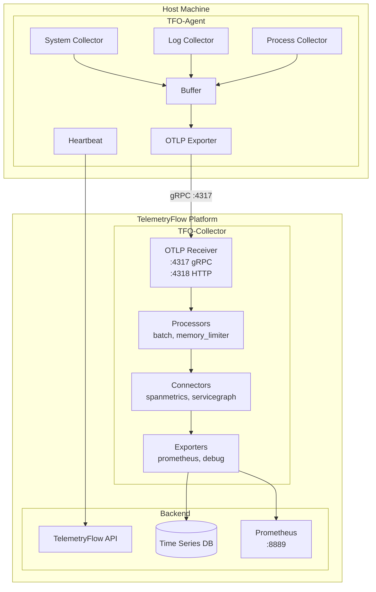

## Component Diagram

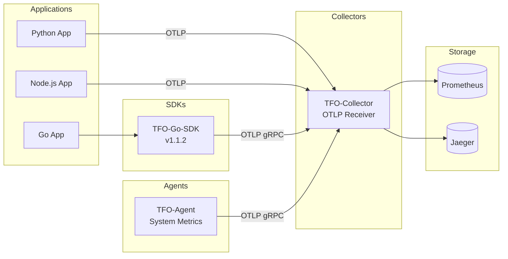

## Data Flow

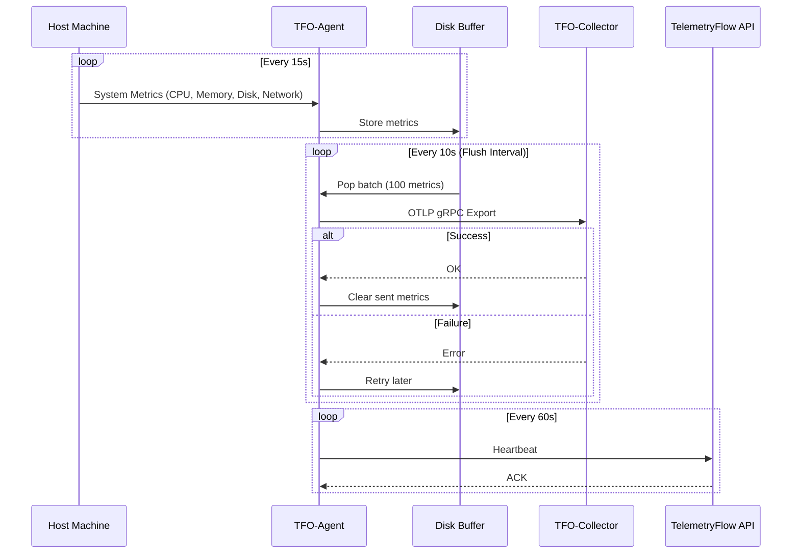

## System Information Payload

The agent collects comprehensive system information and submits it to the backend via heartbeat. This enables full infrastructure visibility in the TelemetryFlow Platform.

### Collected Data Categories

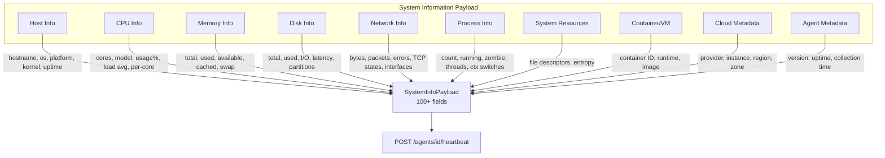

### Data Fields Reference

**Host Information** - Host identification and OS details

- `hostname`, `os`, `osVersion`, `platform`, `platformFamily`
- `kernelVersion`, `architecture`, `uptime`, `bootTime`, `hostId`, `timezone`

**CPU Information** - CPU specifications and utilization

- `cpuCores`, `cpuLogicalCores`, `cpuPhysicalCores`, `cpuModel`, `cpuVendor`, `cpuMhz`, `cpuCacheSize`
- `cpuUsage`, `cpuUserPercent`, `cpuSystemPercent`, `cpuIdlePercent`, `cpuIowaitPercent`, `cpuStealPercent`
- `loadAvg1`, `loadAvg5`, `loadAvg15`, `cpuPerCore[]`

**Memory Information** - Memory and swap statistics

- `memoryTotal`, `memoryUsed`, `memoryAvailable`, `memoryFree`, `memoryUsage`
- `memoryCached`, `memoryBuffers`, `memoryActive`, `memoryInactive`, `memoryWired`, `memorySlab`
- `swapTotal`, `swapUsed`, `swapFree`, `swapUsage`, `swapIn`, `swapOut`

**Disk Information** - Storage capacity and I/O metrics

- `diskTotal`, `diskUsed`, `diskAvailable`, `diskUsage`, `diskInodes`
- `diskReadBytes`, `diskWriteBytes`, `diskReadOps`, `diskWriteOps`, `diskIOTime`
- `diskLatencyRead`, `diskLatencyWrite`, `diskPartitions[]`

**Network Information** - Network traffic and TCP states

- `networkBytesSent`, `networkBytesRecv`, `networkPacketsSent`, `networkPacketsRecv`
- `networkErrorsIn`, `networkErrorsOut`, `networkDropsIn`, `networkDropsOut`
- `tcpConnectionsEstablished`, `tcpConnectionsTimeWait`, `tcpConnectionsCloseWait`, `tcpConnectionsListen`
- `networkInterfaces[]`

**Process Information** - Process and scheduling statistics

- `processCount`, `processRunning`, `processSleeping`, `processStopped`, `processZombie`, `processBlocked`
- `threadCount`, `contextSwitches`, `interrupts`, `softInterrupts`

**System Resources** - System resource limits

- `openFileDescriptors`, `maxFileDescriptors`, `fileDescriptorsUsage`, `entropyAvailable`

**Container Detection** - Docker, containerd, cri-o

- `isContainer`, `containerId`, `containerRuntime`, `containerName`, `containerImage`

**Virtualization Detection** - KVM, VMware, Xen, Hyper-V

- `isVirtualized`, `virtualizationType`

**Cloud Metadata** - AWS, GCP, Azure

- `cloudProvider`, `cloudInstanceId`, `cloudInstanceType`, `cloudRegion`, `cloudZone`

**Agent Metadata** - Agent telemetry

- `agentVersion`, `agentStartTime`, `agentUptime`, `collectionTime`, `collectionDuration`

### Heartbeat Data Flow

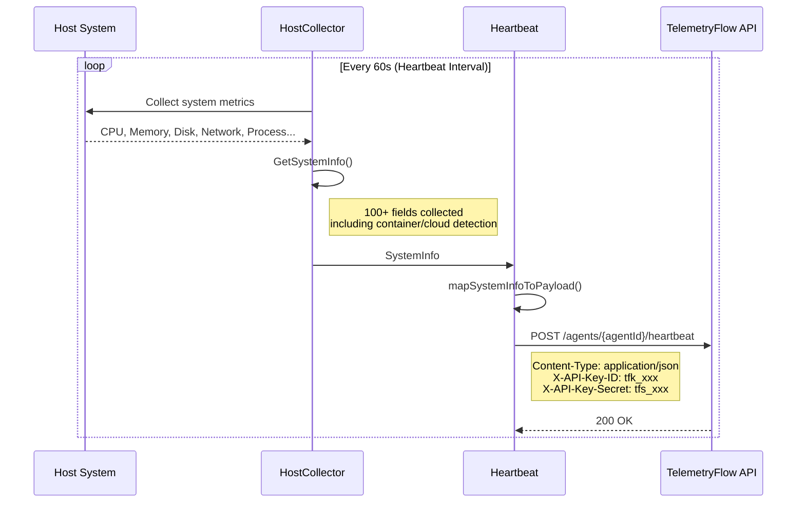

### Example Payload

```json
{
  "systemInfo": {
    "hostname": "prod-server-01",
    "os": "linux",
    "osVersion": "22.04",
    "platform": "ubuntu",
    "kernelVersion": "5.15.0-91-generic",
    "architecture": "amd64",
    "uptime": 864000,
    "cpuCores": 8,
    "cpuModel": "Intel(R) Xeon(R) CPU E5-2686 v4",
    "cpuUsage": 45.2,
    "loadAvg1": 2.1,
    "loadAvg5": 1.8,
    "loadAvg15": 1.5,
    "memoryTotal": 17179869184,
    "memoryUsed": 12884901888,
    "memoryUsage": 75.0,
    "diskTotal": 107374182400,
    "diskUsed": 53687091200,
    "diskUsage": 50.0,
    "networkBytesSent": 1073741824,
    "networkBytesRecv": 2147483648,
    "tcpConnectionsEstablished": 150,
    "processCount": 245,
    "threadCount": 1200,
    "isContainer": true,
    "containerRuntime": "docker",
    "cloudProvider": "aws",
    "cloudRegion": "us-west-2",
    "agentVersion": "1.1.2",
    "agentUptime": 86400
  }
}
```

---

## Configuration Structure

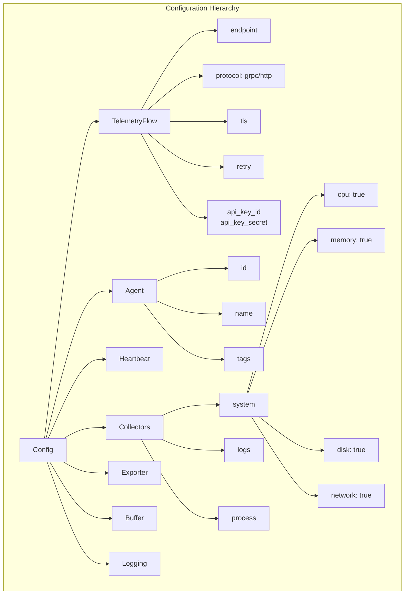

## Authentication Flow

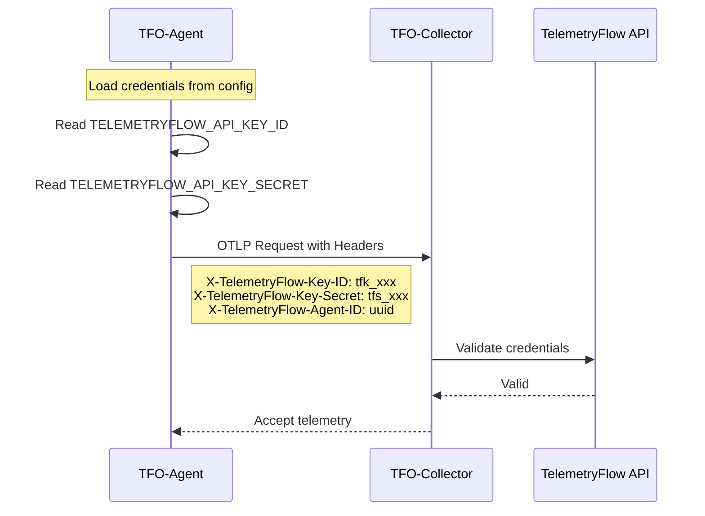

## Environment Variables

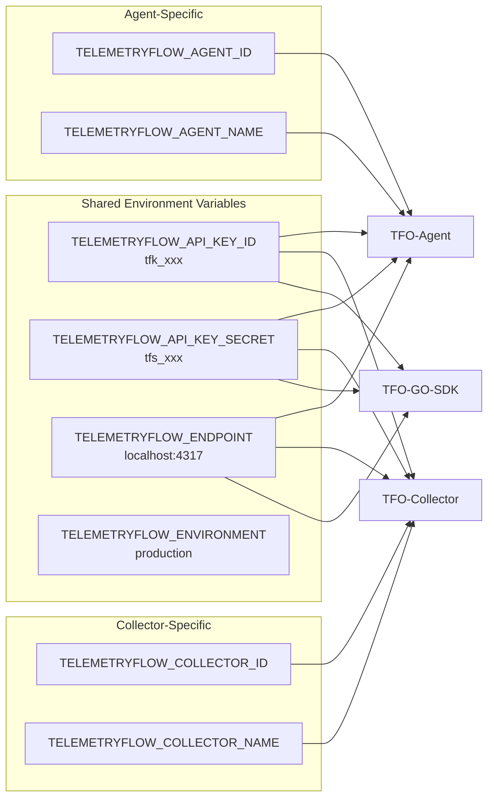

## Buffer Strategy

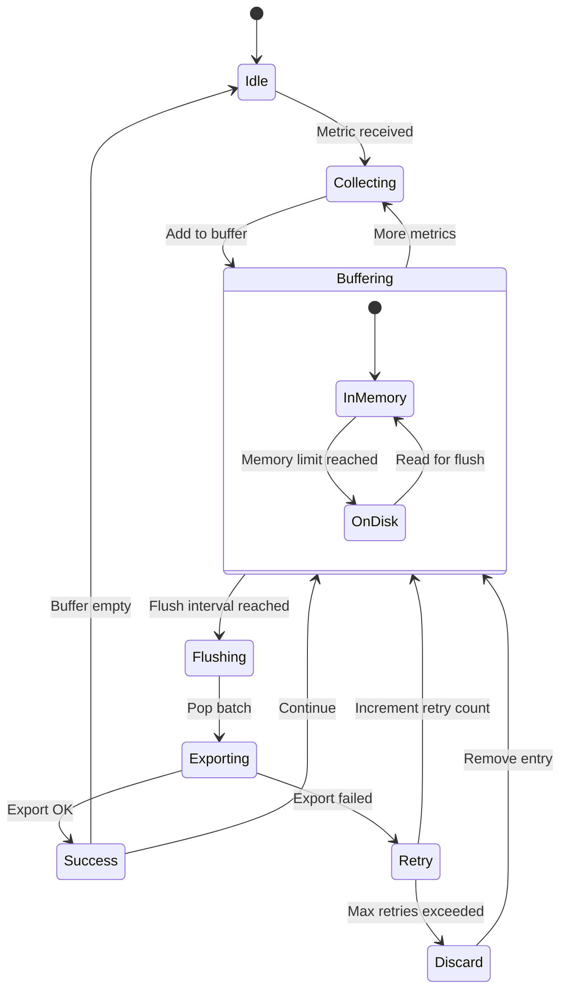

## OTLP Export Protocols

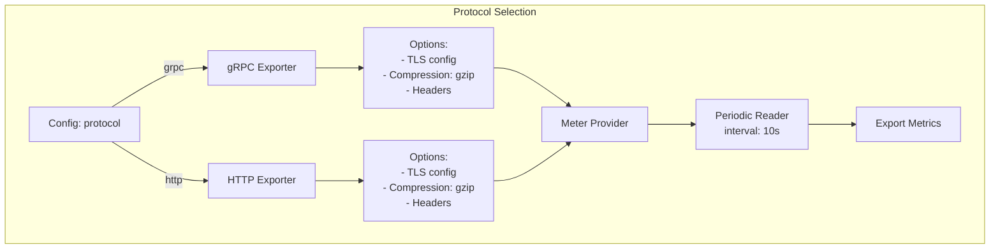

## Deployment Architecture

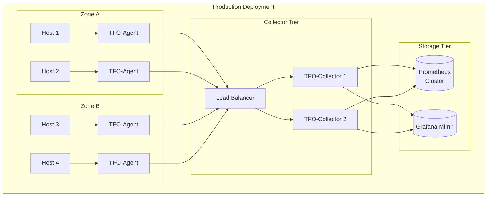

## Package Structure

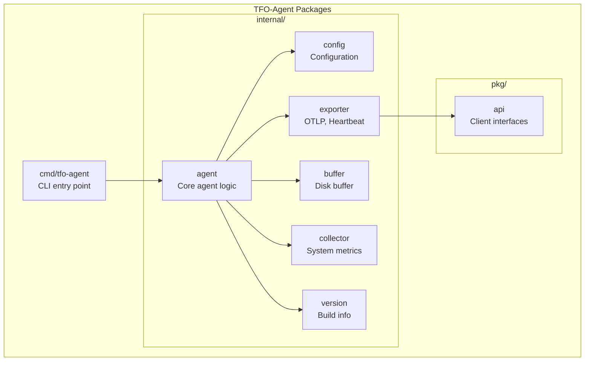

## Version Compatibility

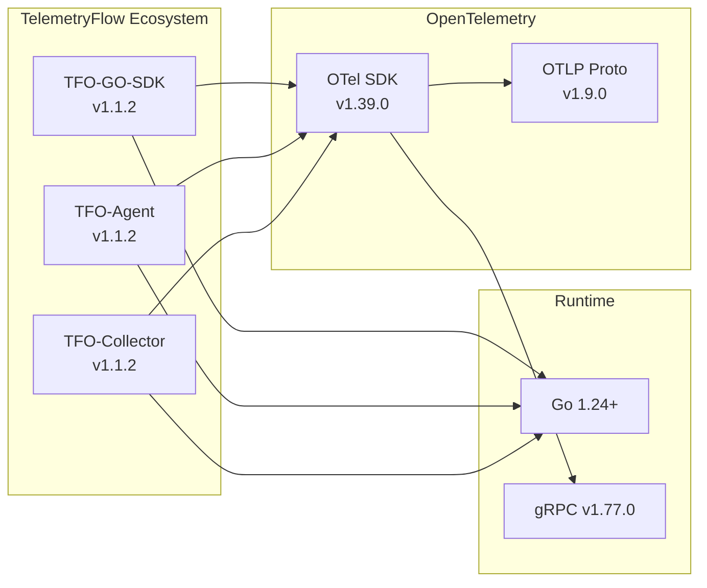

## Related Documentation

- [TFO-Collector Configuration](../../telemetryflow-collector/docs/CONFIGURATION.md)
- [TFO-GO-SDK Usage](../../telemetryflow-go-sdk/docs/USAGE.md)
- [Deployment Guide](./DEPLOYMENT.md)
