# TelemetryFlow Agent Architecture

## Overview

TelemetryFlow Agent is part of the TelemetryFlow Community Enterprise Observability Platform (CEOP). This document describes the architecture and integration with other TelemetryFlow components.

## System Architecture

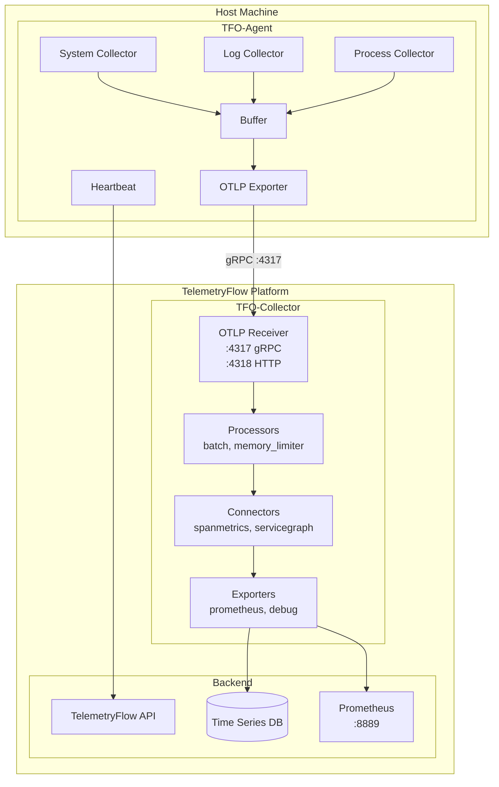
```mermaid
graph TB
    subgraph "Host Machine"
        subgraph "TFO-Agent"
            SC[System Collector]
            LC[Log Collector]
            PC[Process Collector]
            HB[Heartbeat]
            BUF[Buffer]
            OTLP[OTLP Exporter]
        end
    end

    subgraph "TelemetryFlow Platform"
        subgraph "TFO-Collector"
            RECV[OTLP Receiver<br/>:4317 gRPC<br/>:4318 HTTP]
            PROC[Processors<br/>batch, memory_limiter]
            CONN[Connectors<br/>spanmetrics, servicegraph]
            EXP[Exporters<br/>prometheus, debug]
        end

        subgraph "Backend"
            API[TelemetryFlow API]
            DB[(Time Series DB)]
            PROM[Prometheus<br/>:8889]
        end
    end

    SC --> BUF
    LC --> BUF
    PC --> BUF
    BUF --> OTLP
    HB --> API

    OTLP -->|gRPC :4317| RECV
    RECV --> PROC
    PROC --> CONN
    CONN --> EXP
    EXP --> PROM
    EXP --> DB
```

## Component Diagram

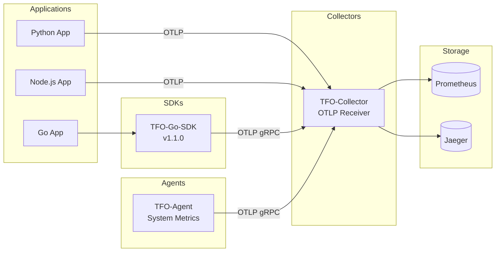
```mermaid
graph LR
    subgraph "Applications"
        APP1[Go App]
        APP2[Python App]
        APP3[Node.js App]
    end

    subgraph "SDKs"
        SDK[TFO-Go-SDK<br/>v1.1.0]
    end

    subgraph "Agents"
        AGENT[TFO-Agent<br/>System Metrics]
    end

    subgraph "Collectors"
        COLL[TFO-Collector<br/>OTLP Receiver]
    end

    subgraph "Storage"
        PROM[(Prometheus)]
        JAEGER[(Jaeger)]
    end

    APP1 --> SDK
    APP2 -->|OTLP| COLL
    APP3 -->|OTLP| COLL
    SDK -->|OTLP gRPC| COLL
    AGENT -->|OTLP gRPC| COLL
    COLL --> PROM
    COLL --> JAEGER
```

## Data Flow

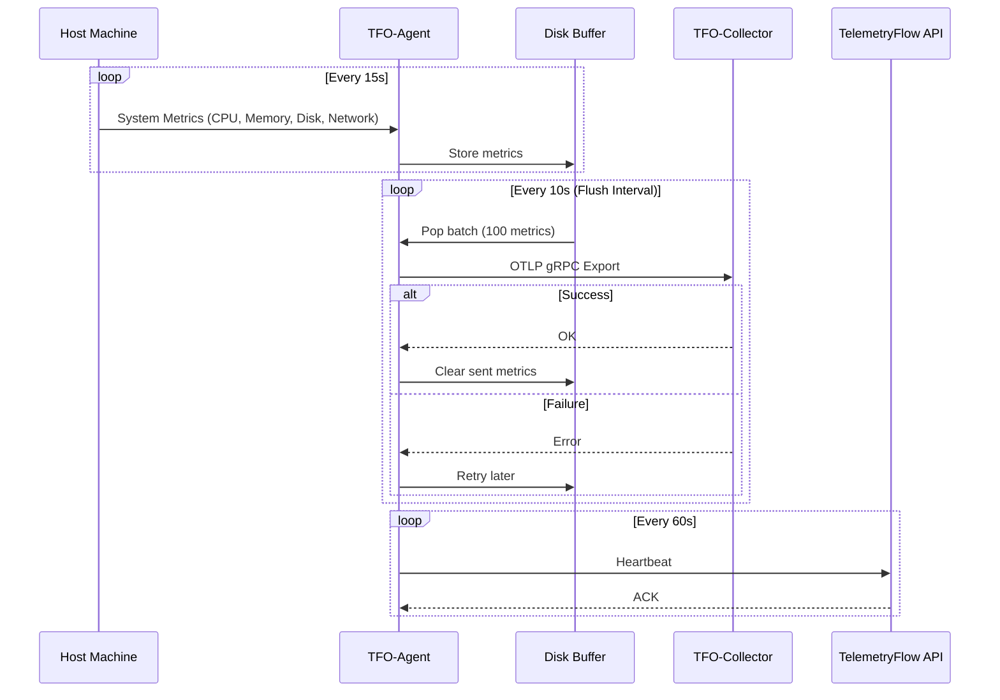
```mermaid
sequenceDiagram
    participant Host as Host Machine
    participant Agent as TFO-Agent
    participant Buffer as Disk Buffer
    participant Collector as TFO-Collector
    participant Backend as TelemetryFlow API

    loop Every 15s
        Host->>Agent: System Metrics (CPU, Memory, Disk, Network)
        Agent->>Buffer: Store metrics
    end

    loop Every 10s (Flush Interval)
        Buffer->>Agent: Pop batch (100 metrics)
        Agent->>Collector: OTLP gRPC Export
        alt Success
            Collector-->>Agent: OK
            Agent->>Buffer: Clear sent metrics
        else Failure
            Collector-->>Agent: Error
            Agent->>Buffer: Retry later
        end
    end

    loop Every 60s
        Agent->>Backend: Heartbeat
        Backend-->>Agent: ACK
    end
```

## Configuration Structure

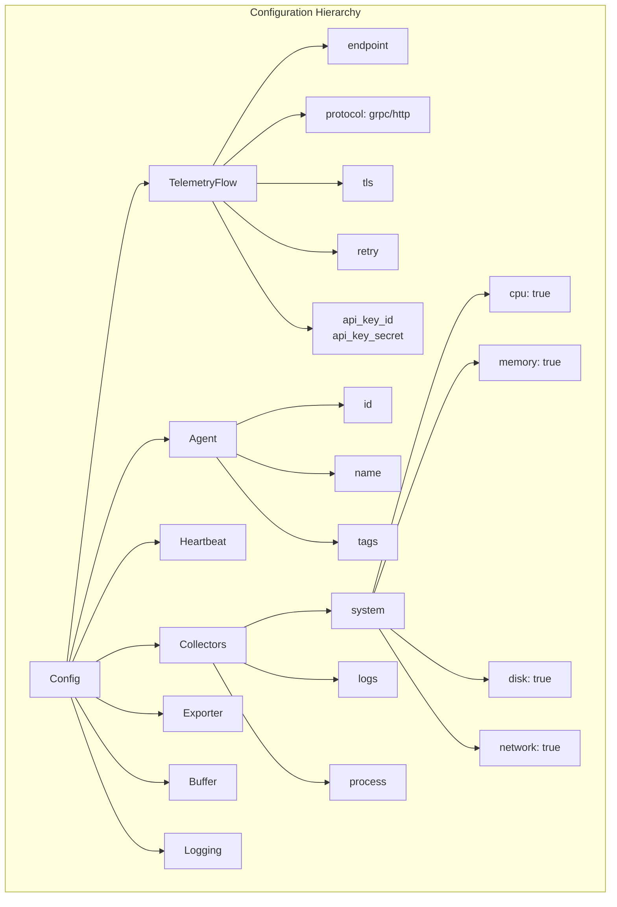
```mermaid
graph TD
    subgraph "Configuration Hierarchy"
        CFG[Config]

        CFG --> TF[TelemetryFlow]
        CFG --> AGT[Agent]
        CFG --> HB[Heartbeat]
        CFG --> COL[Collectors]
        CFG --> EXP[Exporter]
        CFG --> BUF[Buffer]
        CFG --> LOG[Logging]

        TF --> TF_EP[endpoint]
        TF --> TF_PROTO[protocol: grpc/http]
        TF --> TF_TLS[tls]
        TF --> TF_RETRY[retry]
        TF --> TF_AUTH[api_key_id<br/>api_key_secret]

        AGT --> AGT_ID[id]
        AGT --> AGT_NAME[name]
        AGT --> AGT_TAGS[tags]

        COL --> COL_SYS[system]
        COL --> COL_LOG[logs]
        COL --> COL_PROC[process]

        COL_SYS --> SYS_CPU[cpu: true]
        COL_SYS --> SYS_MEM[memory: true]
        COL_SYS --> SYS_DISK[disk: true]
        COL_SYS --> SYS_NET[network: true]
    end
```

## Authentication Flow

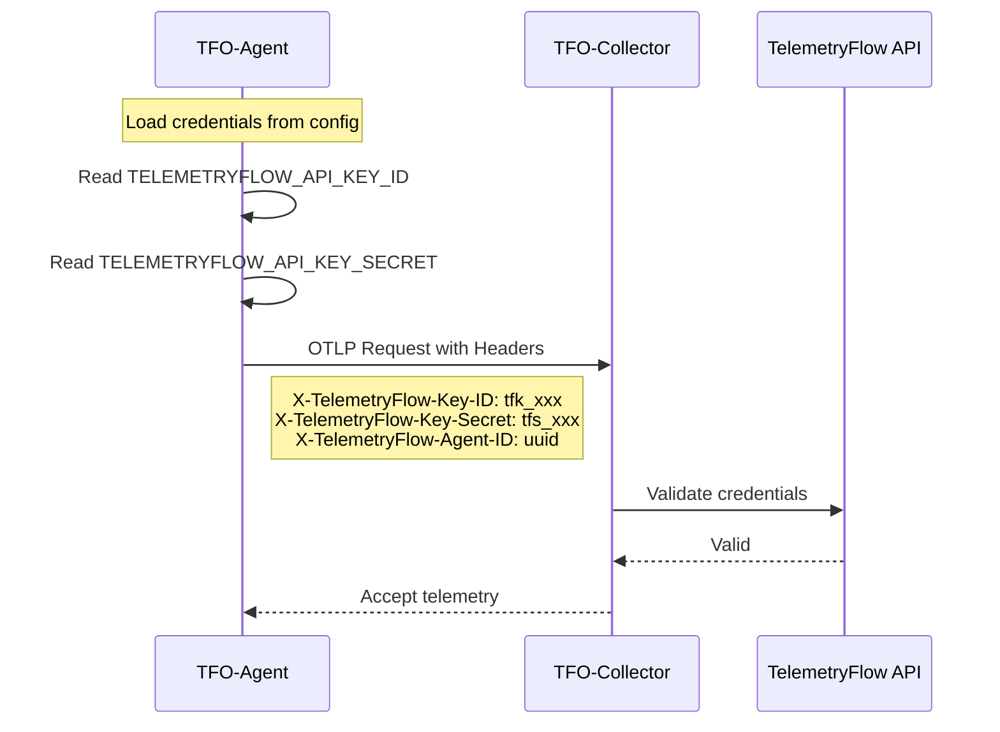
```mermaid
sequenceDiagram
    participant Agent as TFO-Agent
    participant Collector as TFO-Collector
    participant Backend as TelemetryFlow API

    Note over Agent: Load credentials from config
    Agent->>Agent: Read TELEMETRYFLOW_API_KEY_ID
    Agent->>Agent: Read TELEMETRYFLOW_API_KEY_SECRET

    Agent->>Collector: OTLP Request with Headers
    Note right of Agent: X-TelemetryFlow-Key-ID: tfk_xxx<br/>X-TelemetryFlow-Key-Secret: tfs_xxx<br/>X-TelemetryFlow-Agent-ID: uuid

    Collector->>Backend: Validate credentials
    Backend-->>Collector: Valid
    Collector-->>Agent: Accept telemetry
```

## Environment Variables

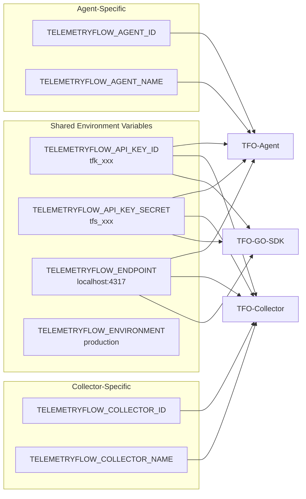
```mermaid
graph LR
    subgraph "Shared Environment Variables"
        ENV_KEY_ID[TELEMETRYFLOW_API_KEY_ID<br/>tfk_xxx]
        ENV_KEY_SECRET[TELEMETRYFLOW_API_KEY_SECRET<br/>tfs_xxx]
        ENV_ENDPOINT[TELEMETRYFLOW_ENDPOINT<br/>localhost:4317]
        ENV_ENV[TELEMETRYFLOW_ENVIRONMENT<br/>production]
    end

    subgraph "Agent-Specific"
        ENV_AGENT_ID[TELEMETRYFLOW_AGENT_ID]
        ENV_AGENT_NAME[TELEMETRYFLOW_AGENT_NAME]
    end

    subgraph "Collector-Specific"
        ENV_COLL_ID[TELEMETRYFLOW_COLLECTOR_ID]
        ENV_COLL_NAME[TELEMETRYFLOW_COLLECTOR_NAME]
    end

    ENV_KEY_ID --> AGENT[TFO-Agent]
    ENV_KEY_ID --> COLL[TFO-Collector]
    ENV_KEY_ID --> SDK[TFO-GO-SDK]

    ENV_KEY_SECRET --> AGENT
    ENV_KEY_SECRET --> COLL
    ENV_KEY_SECRET --> SDK

    ENV_ENDPOINT --> AGENT
    ENV_ENDPOINT --> COLL
    ENV_ENDPOINT --> SDK

    ENV_AGENT_ID --> AGENT
    ENV_AGENT_NAME --> AGENT

    ENV_COLL_ID --> COLL
    ENV_COLL_NAME --> COLL
```

## Buffer Strategy

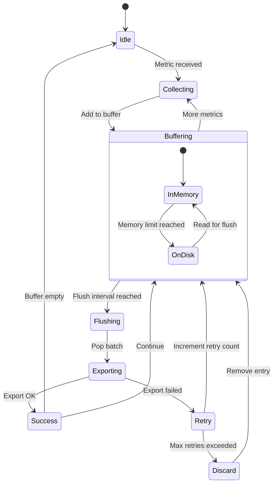
```mermaid
stateDiagram-v2
    [*] --> Idle

    Idle --> Collecting: Metric received
    Collecting --> Buffering: Add to buffer
    Buffering --> Collecting: More metrics
    Buffering --> Flushing: Flush interval reached

    Flushing --> Exporting: Pop batch
    Exporting --> Success: Export OK
    Exporting --> Retry: Export failed

    Success --> Buffering: Continue
    Success --> Idle: Buffer empty

    Retry --> Buffering: Increment retry count
    Retry --> Discard: Max retries exceeded

    Discard --> Buffering: Remove entry

    state Buffering {
        [*] --> InMemory
        InMemory --> OnDisk: Memory limit reached
        OnDisk --> InMemory: Read for flush
    }
```

## OTLP Export Protocols

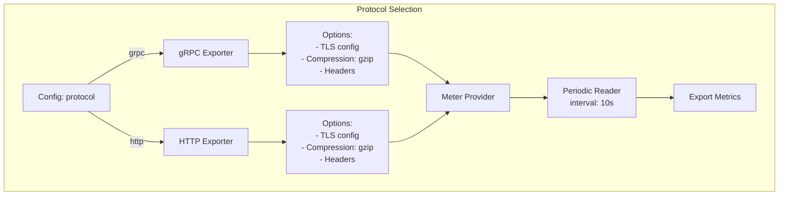
```mermaid
graph TB
    subgraph "Protocol Selection"
        CFG[Config: protocol]

        CFG -->|grpc| GRPC[gRPC Exporter]
        CFG -->|http| HTTP[HTTP Exporter]

        GRPC --> GRPC_OPTS[Options:<br/>- TLS config<br/>- Compression: gzip<br/>- Headers]
        HTTP --> HTTP_OPTS[Options:<br/>- TLS config<br/>- Compression: gzip<br/>- Headers]

        GRPC_OPTS --> METER[Meter Provider]
        HTTP_OPTS --> METER

        METER --> PERIODIC[Periodic Reader<br/>interval: 10s]
        PERIODIC --> EXPORT[Export Metrics]
    end
```

## Deployment Architecture

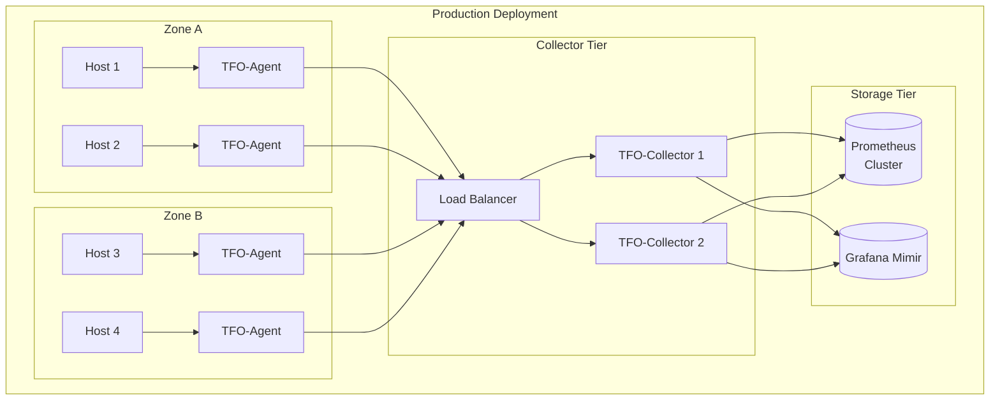
```mermaid
graph TB
    subgraph "Production Deployment"
        subgraph "Zone A"
            HOST1[Host 1]
            HOST2[Host 2]
            AGENT1[TFO-Agent]
            AGENT2[TFO-Agent]
        end

        subgraph "Zone B"
            HOST3[Host 3]
            HOST4[Host 4]
            AGENT3[TFO-Agent]
            AGENT4[TFO-Agent]
        end

        subgraph "Collector Tier"
            LB[Load Balancer]
            COLL1[TFO-Collector 1]
            COLL2[TFO-Collector 2]
        end

        subgraph "Storage Tier"
            PROM[(Prometheus<br/>Cluster)]
            MIMIR[(Grafana Mimir)]
        end
    end

    HOST1 --> AGENT1
    HOST2 --> AGENT2
    HOST3 --> AGENT3
    HOST4 --> AGENT4

    AGENT1 --> LB
    AGENT2 --> LB
    AGENT3 --> LB
    AGENT4 --> LB

    LB --> COLL1
    LB --> COLL2

    COLL1 --> PROM
    COLL2 --> PROM
    COLL1 --> MIMIR
    COLL2 --> MIMIR
```

## Package Structure

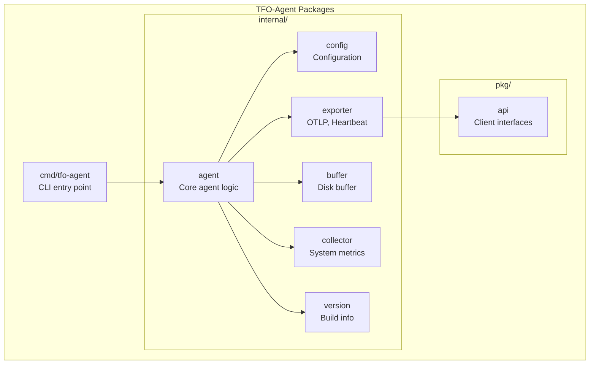
```mermaid
graph TD
    subgraph "TFO-Agent Packages"
        CMD[cmd/tfo-agent<br/>CLI entry point]

        subgraph "internal/"
            AGENT[agent<br/>Core agent logic]
            CONFIG[config<br/>Configuration]
            EXPORTER[exporter<br/>OTLP, Heartbeat]
            BUFFER[buffer<br/>Disk buffer]
            COLLECTOR[collector<br/>System metrics]
            VERSION[version<br/>Build info]
        end

        subgraph "pkg/"
            API[api<br/>Client interfaces]
        end
    end

    CMD --> AGENT
    AGENT --> CONFIG
    AGENT --> EXPORTER
    AGENT --> BUFFER
    AGENT --> COLLECTOR
    AGENT --> VERSION
    EXPORTER --> API
```

## Version Compatibility

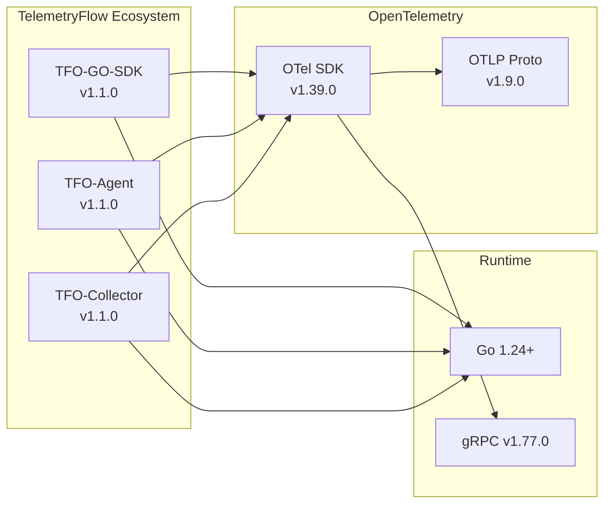
```mermaid
graph LR
    subgraph "TelemetryFlow Ecosystem"
        SDK[TFO-GO-SDK<br/>v1.1.0]
        AGENT[TFO-Agent<br/>v1.1.0]
        COLL[TFO-Collector<br/>v1.1.0]
    end

    subgraph "OpenTelemetry"
        OTEL[OTel SDK<br/>v1.39.0]
        PROTO[OTLP Proto<br/>v1.9.0]
    end

    subgraph "Runtime"
        GO[Go 1.24+]
        GRPC[gRPC v1.77.0]
    end

    SDK --> OTEL
    AGENT --> OTEL
    COLL --> OTEL

    OTEL --> PROTO
    OTEL --> GRPC

    SDK --> GO
    AGENT --> GO
    COLL --> GO
```

## Related Documentation

- [TFO-Collector Configuration](../../telemetryflow-collector/docs/CONFIGURATION.md)
- [TFO-GO-SDK Usage](../../telemetryflow-go-sdk/docs/USAGE.md)
- [Deployment Guide](./DEPLOYMENT.md)
