# TelemetryFlow Agent Architecture

## Overview

TelemetryFlow Agent is part of the TelemetryFlow AI-Powered Observability & Incident Response Management (IRM) Platform. This document describes the architecture and integration with other TelemetryFlow components.

## System Architecture

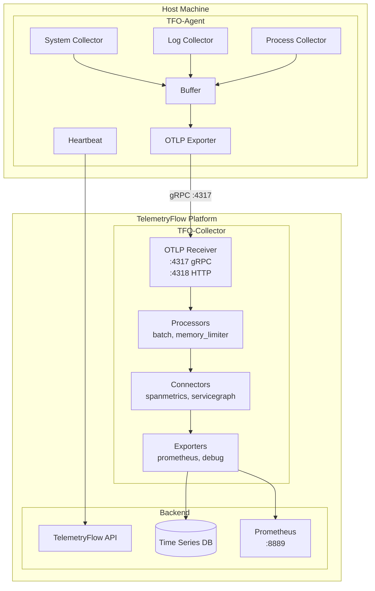
```mermaid
graph TB
    subgraph "Host Machine"
        subgraph "TFO-Agent"
            SC[System Collector]
            LC[Log Collector]
            PC[Process Collector]
            HB[Heartbeat]
            BUF[Buffer]
            OTLP[OTLP Exporter]
        end
    end

    subgraph "TelemetryFlow Platform"
        subgraph "TFO-Collector"
            RECV[OTLP Receiver<br/>:4317 gRPC<br/>:4318 HTTP]
            PROC[Processors<br/>batch, memory_limiter]
            CONN[Connectors<br/>spanmetrics, servicegraph]
            EXP[Exporters<br/>prometheus, debug]
        end

        subgraph "Backend"
            API[TelemetryFlow API]
            DB[(Time Series DB)]
            PROM[Prometheus<br/>:8889]
        end
    end

    SC --> BUF
    LC --> BUF
    PC --> BUF
    BUF --> OTLP
    HB --> API

    OTLP -->|gRPC :4317| RECV
    RECV --> PROC
    PROC --> CONN
    CONN --> EXP
    EXP --> PROM
    EXP --> DB
```

## Component Diagram

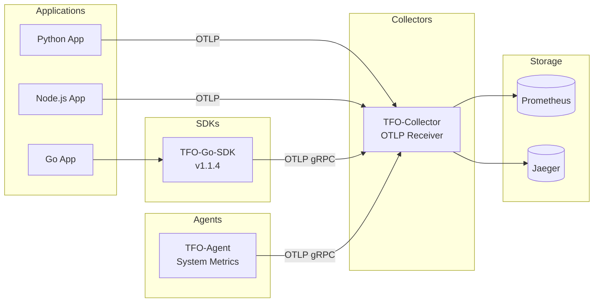
```mermaid
graph LR
    subgraph "Applications"
        APP1[Go App]
        APP2[Python App]
        APP3[Node.js App]
    end

    subgraph "SDKs"
        SDK[TFO-Go-SDK<br/>v1.1.4]
    end

    subgraph "Agents"
        AGENT[TFO-Agent<br/>System Metrics]
    end

    subgraph "Collectors"
        COLL[TFO-Collector<br/>OTLP Receiver]
    end

    subgraph "Storage"
        PROM[(Prometheus)]
        JAEGER[(Jaeger)]
    end

    APP1 --> SDK
    APP2 -->|OTLP| COLL
    APP3 -->|OTLP| COLL
    SDK -->|OTLP gRPC| COLL
    AGENT -->|OTLP gRPC| COLL
    COLL --> PROM
    COLL --> JAEGER
```

## Data Flow

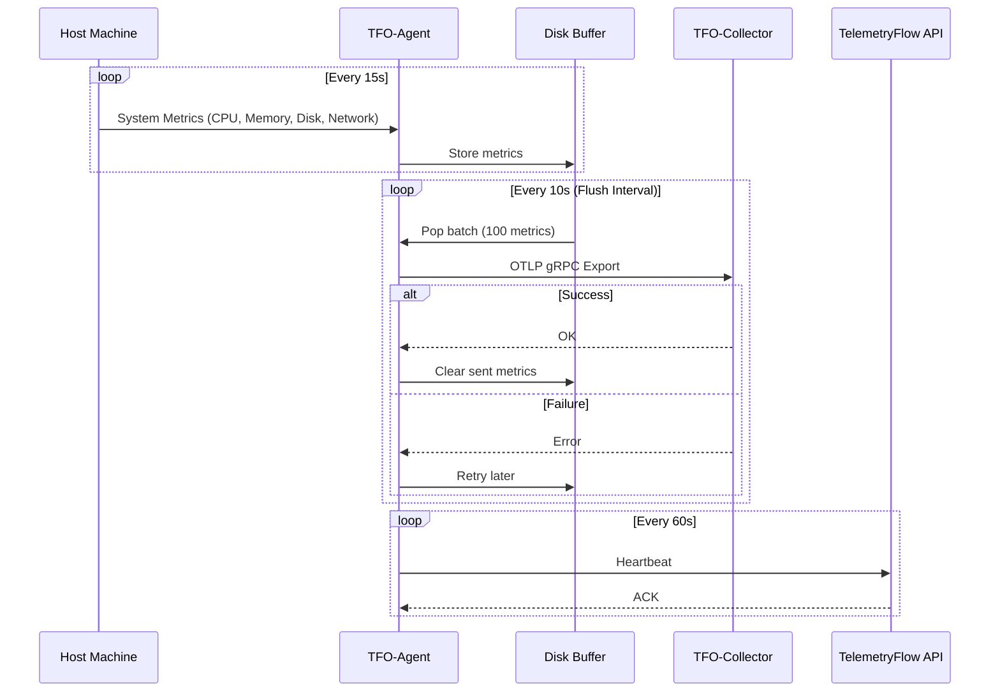
```mermaid
sequenceDiagram
    participant Host as Host Machine
    participant Agent as TFO-Agent
    participant Buffer as Disk Buffer
    participant Collector as TFO-Collector
    participant Backend as TelemetryFlow API

    loop Every 15s
        Host->>Agent: System Metrics (CPU, Memory, Disk, Network)
        Agent->>Buffer: Store metrics
    end

    loop Every 10s (Flush Interval)
        Buffer->>Agent: Pop batch (100 metrics)
        Agent->>Collector: OTLP gRPC Export
        alt Success
            Collector-->>Agent: OK
            Agent->>Buffer: Clear sent metrics
        else Failure
            Collector-->>Agent: Error
            Agent->>Buffer: Retry later
        end
    end

    loop Every 60s
        Agent->>Backend: Heartbeat
        Backend-->>Agent: ACK
    end
```

## System Information Payload

The agent collects comprehensive system information and submits it to the backend via heartbeat. This enables full infrastructure visibility in the TelemetryFlow Platform.

### Collected Data Categories

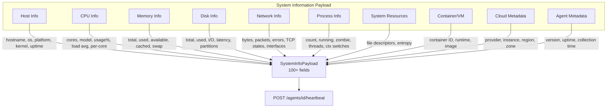
```mermaid
graph TB
    subgraph "System Information Payload"
        HOST[Host Info]
        CPU[CPU Info]
        MEM[Memory Info]
        DISK[Disk Info]
        NET[Network Info]
        PROC[Process Info]
        SYS[System Resources]
        CONT[Container/VM]
        CLOUD[Cloud Metadata]
        AGENT[Agent Metadata]
    end

    PAYLOAD[SystemInfoPayload<br/>100+ fields]
    API[POST /agents/id/heartbeat]

    HOST -->|hostname, os, platform, kernel, uptime| PAYLOAD
    CPU -->|cores, model, usage%, load avg, per-core| PAYLOAD
    MEM -->|total, used, available, cached, swap| PAYLOAD
    DISK -->|total, used, I/O, latency, partitions| PAYLOAD
    NET -->|bytes, packets, errors, TCP states, interfaces| PAYLOAD
    PROC -->|count, running, zombie, threads, ctx switches| PAYLOAD
    SYS -->|file descriptors, entropy| PAYLOAD
    CONT -->|container ID, runtime, image| PAYLOAD
    CLOUD -->|provider, instance, region, zone| PAYLOAD
    AGENT -->|version, uptime, collection time| PAYLOAD

    PAYLOAD --> API
```

### Data Fields Reference

**Host Information** - Host identification and OS details

- `hostname`, `os`, `osVersion`, `platform`, `platformFamily`
- `kernelVersion`, `architecture`, `uptime`, `bootTime`, `hostId`, `timezone`

**CPU Information** - CPU specifications and utilization

- `cpuCores`, `cpuLogicalCores`, `cpuPhysicalCores`, `cpuModel`, `cpuVendor`, `cpuMhz`, `cpuCacheSize`
- `cpuUsage`, `cpuUserPercent`, `cpuSystemPercent`, `cpuIdlePercent`, `cpuIowaitPercent`, `cpuStealPercent`
- `loadAvg1`, `loadAvg5`, `loadAvg15`, `cpuPerCore[]`

**Memory Information** - Memory and swap statistics

- `memoryTotal`, `memoryUsed`, `memoryAvailable`, `memoryFree`, `memoryUsage`
- `memoryCached`, `memoryBuffers`, `memoryActive`, `memoryInactive`, `memoryWired`, `memorySlab`
- `swapTotal`, `swapUsed`, `swapFree`, `swapUsage`, `swapIn`, `swapOut`

**Disk Information** - Storage capacity and I/O metrics

- `diskTotal`, `diskUsed`, `diskAvailable`, `diskUsage`, `diskInodes`
- `diskReadBytes`, `diskWriteBytes`, `diskReadOps`, `diskWriteOps`, `diskIOTime`
- `diskLatencyRead`, `diskLatencyWrite`, `diskPartitions[]`

**Network Information** - Network traffic and TCP states

- `networkBytesSent`, `networkBytesRecv`, `networkPacketsSent`, `networkPacketsRecv`
- `networkErrorsIn`, `networkErrorsOut`, `networkDropsIn`, `networkDropsOut`
- `tcpConnectionsEstablished`, `tcpConnectionsTimeWait`, `tcpConnectionsCloseWait`, `tcpConnectionsListen`
- `networkInterfaces[]`

**Process Information** - Process and scheduling statistics

- `processCount`, `processRunning`, `processSleeping`, `processStopped`, `processZombie`, `processBlocked`
- `threadCount`, `contextSwitches`, `interrupts`, `softInterrupts`

**System Resources** - System resource limits

- `openFileDescriptors`, `maxFileDescriptors`, `fileDescriptorsUsage`, `entropyAvailable`

**Container Detection** - Docker, containerd, cri-o

- `isContainer`, `containerId`, `containerRuntime`, `containerName`, `containerImage`

**Virtualization Detection** - KVM, VMware, Xen, Hyper-V

- `isVirtualized`, `virtualizationType`

**Cloud Metadata** - AWS, GCP, Azure

- `cloudProvider`, `cloudInstanceId`, `cloudInstanceType`, `cloudRegion`, `cloudZone`

**Agent Metadata** - Agent telemetry

- `agentVersion`, `agentStartTime`, `agentUptime`, `collectionTime`, `collectionDuration`

### Heartbeat Data Flow

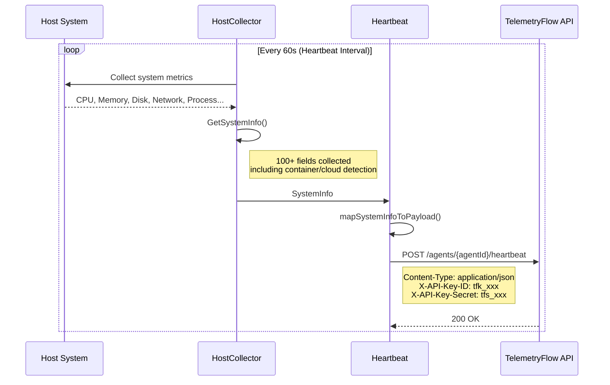
```mermaid
sequenceDiagram
    participant Host as Host System
    participant Collector as HostCollector
    participant Heartbeat as Heartbeat
    participant API as TelemetryFlow API

    loop Every 60s (Heartbeat Interval)
        Collector->>Host: Collect system metrics
        Host-->>Collector: CPU, Memory, Disk, Network, Process...

        Collector->>Collector: GetSystemInfo()
        Note right of Collector: 100+ fields collected<br/>including container/cloud detection

        Collector->>Heartbeat: SystemInfo
        Heartbeat->>Heartbeat: mapSystemInfoToPayload()

        Heartbeat->>API: POST /agents/{agentId}/heartbeat
        Note right of Heartbeat: Content-Type: application/json<br/>X-API-Key-ID: tfk_xxx<br/>X-API-Key-Secret: tfs_xxx

        API-->>Heartbeat: 200 OK
    end
```

### Example Payload

```json
{
  "systemInfo": {
    "hostname": "prod-server-01",
    "os": "linux",
    "osVersion": "22.04",
    "platform": "ubuntu",
    "kernelVersion": "5.15.0-91-generic",
    "architecture": "amd64",
    "uptime": 864000,
    "cpuCores": 8,
    "cpuModel": "Intel(R) Xeon(R) CPU E5-2686 v4",
    "cpuUsage": 45.2,
    "loadAvg1": 2.1,
    "loadAvg5": 1.8,
    "loadAvg15": 1.5,
    "memoryTotal": 17179869184,
    "memoryUsed": 12884901888,
    "memoryUsage": 75.0,
    "diskTotal": 107374182400,
    "diskUsed": 53687091200,
    "diskUsage": 50.0,
    "networkBytesSent": 1073741824,
    "networkBytesRecv": 2147483648,
    "tcpConnectionsEstablished": 150,
    "processCount": 245,
    "threadCount": 1200,
    "isContainer": true,
    "containerRuntime": "docker",
    "cloudProvider": "aws",
    "cloudRegion": "us-west-2",
    "agentVersion": "1.2.2",
    "agentUptime": 86400
  }
}
```

---

## Configuration Structure

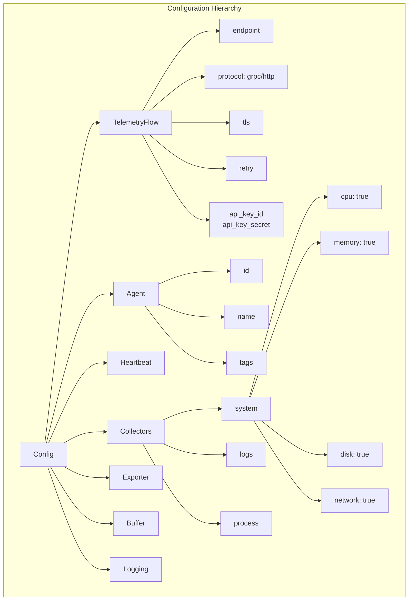
```mermaid
graph TD
    subgraph "Configuration Hierarchy"
        CFG[Config]

        CFG --> TF[TelemetryFlow]
        CFG --> AGT[Agent]
        CFG --> HB[Heartbeat]
        CFG --> COL[Collectors]
        CFG --> EXP[Exporter]
        CFG --> BUF[Buffer]
        CFG --> LOG[Logging]

        TF --> TF_EP[endpoint]
        TF --> TF_PROTO[protocol: grpc/http]
        TF --> TF_TLS[tls]
        TF --> TF_RETRY[retry]
        TF --> TF_AUTH[api_key_id<br/>api_key_secret]

        AGT --> AGT_ID[id]
        AGT --> AGT_NAME[name]
        AGT --> AGT_TAGS[tags]

        COL --> COL_SYS[system]
        COL --> COL_LOG[logs]
        COL --> COL_PROC[process]

        COL_SYS --> SYS_CPU[cpu: true]
        COL_SYS --> SYS_MEM[memory: true]
        COL_SYS --> SYS_DISK[disk: true]
        COL_SYS --> SYS_NET[network: true]
    end
```

## Authentication Flow

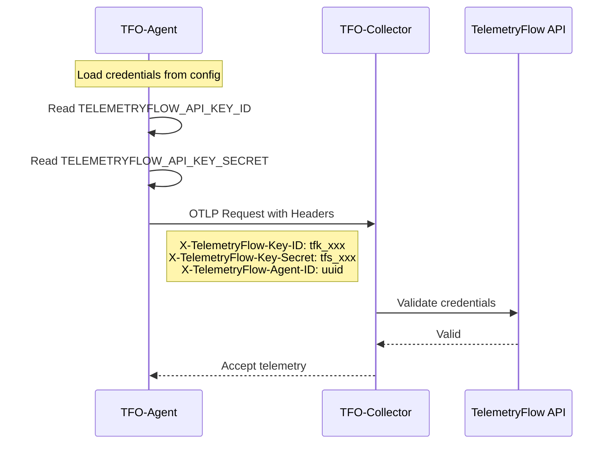
```mermaid
sequenceDiagram
    participant Agent as TFO-Agent
    participant Collector as TFO-Collector
    participant Backend as TelemetryFlow API

    Note over Agent: Load credentials from config
    Agent->>Agent: Read TELEMETRYFLOW_API_KEY_ID
    Agent->>Agent: Read TELEMETRYFLOW_API_KEY_SECRET

    Agent->>Collector: OTLP Request with Headers
    Note right of Agent: X-TelemetryFlow-Key-ID: tfk_xxx<br/>X-TelemetryFlow-Key-Secret: tfs_xxx<br/>X-TelemetryFlow-Agent-ID: uuid

    Collector->>Backend: Validate credentials
    Backend-->>Collector: Valid
    Collector-->>Agent: Accept telemetry
```

## Environment Variables

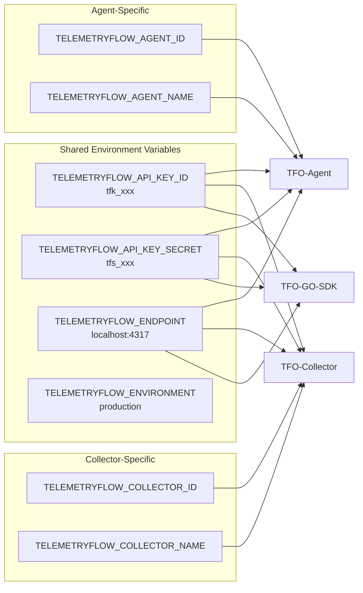
```mermaid
graph LR
    subgraph "Shared Environment Variables"
        ENV_KEY_ID[TELEMETRYFLOW_API_KEY_ID<br/>tfk_xxx]
        ENV_KEY_SECRET[TELEMETRYFLOW_API_KEY_SECRET<br/>tfs_xxx]
        ENV_ENDPOINT[TELEMETRYFLOW_ENDPOINT<br/>localhost:4317]
        ENV_ENV[TELEMETRYFLOW_ENVIRONMENT<br/>production]
    end

    subgraph "Agent-Specific"
        ENV_AGENT_ID[TELEMETRYFLOW_AGENT_ID]
        ENV_AGENT_NAME[TELEMETRYFLOW_AGENT_NAME]
    end

    subgraph "Collector-Specific"
        ENV_COLL_ID[TELEMETRYFLOW_COLLECTOR_ID]
        ENV_COLL_NAME[TELEMETRYFLOW_COLLECTOR_NAME]
    end

    ENV_KEY_ID --> AGENT[TFO-Agent]
    ENV_KEY_ID --> COLL[TFO-Collector]
    ENV_KEY_ID --> SDK[TFO-GO-SDK]

    ENV_KEY_SECRET --> AGENT
    ENV_KEY_SECRET --> COLL
    ENV_KEY_SECRET --> SDK

    ENV_ENDPOINT --> AGENT
    ENV_ENDPOINT --> COLL
    ENV_ENDPOINT --> SDK

    ENV_AGENT_ID --> AGENT
    ENV_AGENT_NAME --> AGENT

    ENV_COLL_ID --> COLL
    ENV_COLL_NAME --> COLL
```

## Buffer Strategy

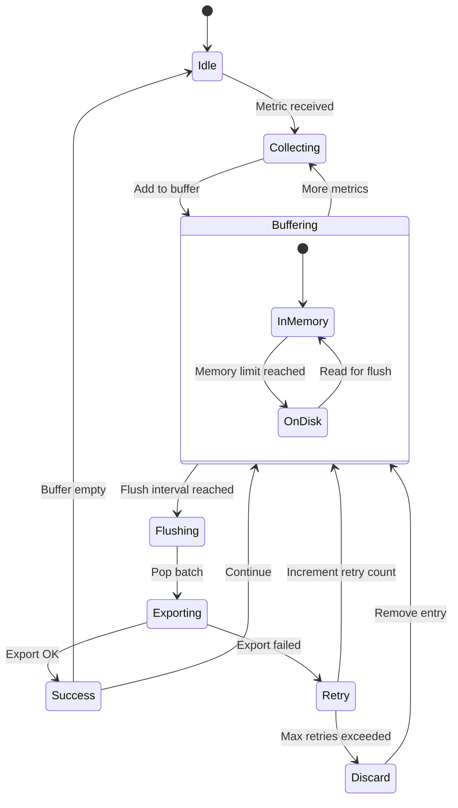
```mermaid
stateDiagram-v2
    [*] --> Idle

    Idle --> Collecting: Metric received
    Collecting --> Buffering: Add to buffer
    Buffering --> Collecting: More metrics
    Buffering --> Flushing: Flush interval reached

    Flushing --> Exporting: Pop batch
    Exporting --> Success: Export OK
    Exporting --> Retry: Export failed

    Success --> Buffering: Continue
    Success --> Idle: Buffer empty

    Retry --> Buffering: Increment retry count
    Retry --> Discard: Max retries exceeded

    Discard --> Buffering: Remove entry

    state Buffering {
        [*] --> InMemory
        InMemory --> OnDisk: Memory limit reached
        OnDisk --> InMemory: Read for flush
    }
```

## OTLP Export Pipeline

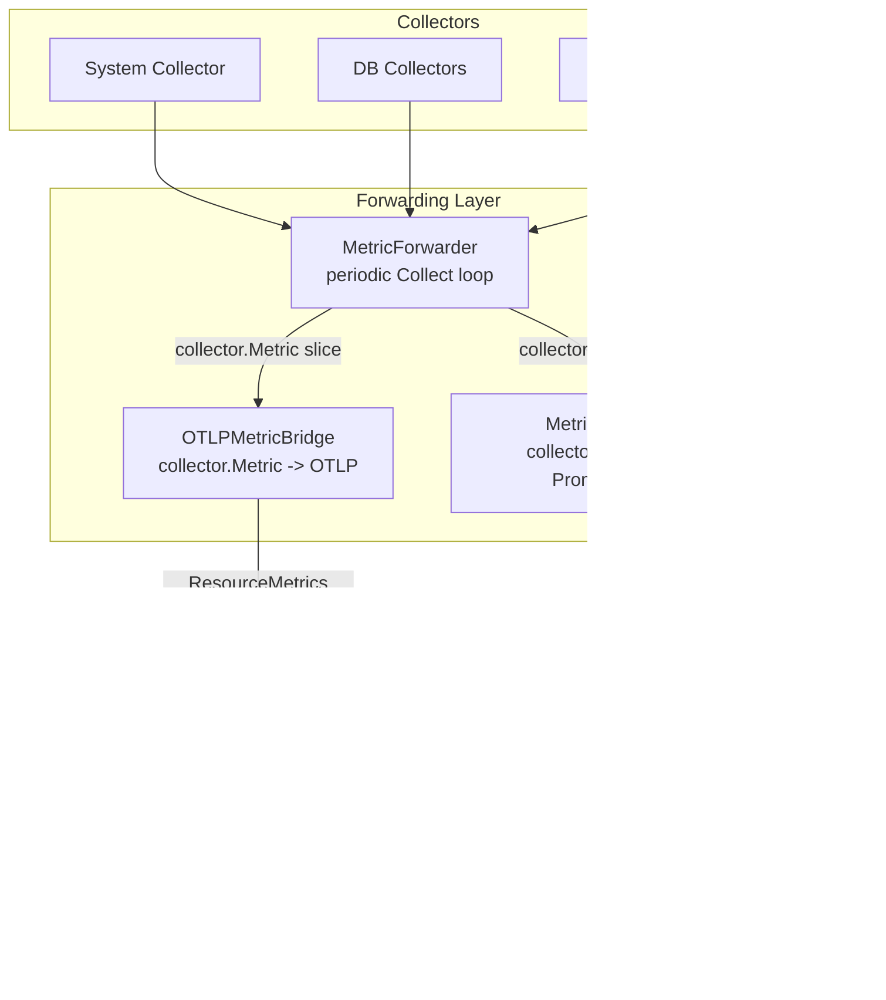
```mermaid
graph TB
    subgraph "Collectors"
        SYS[System Collector]
        DB[DB Collectors]
        INFRA[Infrastructure Collectors]
    end

    subgraph "Forwarding Layer"
        FWD[MetricForwarder<br/>periodic Collect loop]
        BRIDGE[OTLPMetricBridge<br/>collector.Metric -> OTLP]
        PROM[MetricsBridge<br/>collector.Metric -> Prometheus]
    end

    subgraph "Export"
        OTLP_HTTP[OTLP HTTP Exporter<br/>otlpmetrichttp v1.43.0]
        PROM_SVR[Prometheus Server<br/>:8888 /metrics]
    end

    SYS --> FWD
    DB --> FWD
    INFRA --> FWD

    FWD -->|collector.Metric slice| BRIDGE
    FWD -->|collector.Metric slice| PROM

    BRIDGE -->|ResourceMetrics<br/>value-type Gauge/Sum| OTLP_HTTP
    PROM --> PROM_SVR

    OTLP_HTTP -->|HTTP POST| COLLECTOR[TFO-Collector<br/>:4318/v1/metrics]
```

**Key design decisions:**

- `MetricForwarder` is the sole collection driver — collectors' `Start()` only manages lifecycle (subprocesses, connections), `Collect()` is called by the forwarder loop.
- `OTLPMetricBridge.Export()` converts `[]collector.Metric` into `metricdata.ResourceMetrics` using **value-type** aggregations (`metricdata.Gauge[float64]`, not pointers). The OTel SDK v1.43.0 transform pipeline type-switches on value types — pointer types are silently rejected as "unknown aggregation".
- Counter metrics use `CumulativeTemporality` (collectors report totals since process start, not per-interval deltas).

## Deployment Architecture

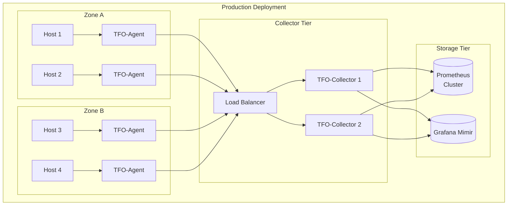
```mermaid
graph TB
    subgraph "Production Deployment"
        subgraph "Zone A"
            HOST1[Host 1]
            HOST2[Host 2]
            AGENT1[TFO-Agent]
            AGENT2[TFO-Agent]
        end

        subgraph "Zone B"
            HOST3[Host 3]
            HOST4[Host 4]
            AGENT3[TFO-Agent]
            AGENT4[TFO-Agent]
        end

        subgraph "Collector Tier"
            LB[Load Balancer]
            COLL1[TFO-Collector 1]
            COLL2[TFO-Collector 2]
        end

        subgraph "Storage Tier"
            PROM[(Prometheus<br/>Cluster)]
            MIMIR[(Grafana Mimir)]
        end
    end

    HOST1 --> AGENT1
    HOST2 --> AGENT2
    HOST3 --> AGENT3
    HOST4 --> AGENT4

    AGENT1 --> LB
    AGENT2 --> LB
    AGENT3 --> LB
    AGENT4 --> LB

    LB --> COLL1
    LB --> COLL2

    COLL1 --> PROM
    COLL2 --> PROM
    COLL1 --> MIMIR
    COLL2 --> MIMIR
```

## Package Structure

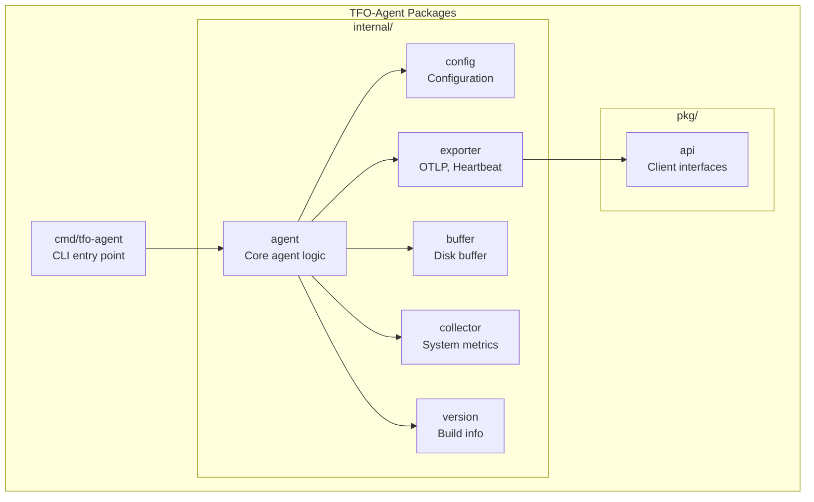
```mermaid
graph TD
    subgraph "TFO-Agent Packages"
        CMD[cmd/tfo-agent<br/>CLI entry point]

        subgraph "internal/"
            AGENT[agent<br/>Core agent logic]
            CONFIG[config<br/>Configuration]
            EXPORTER[exporter<br/>OTLP, Heartbeat]
            BUFFER[buffer<br/>Disk buffer]
            COLLECTOR[collector<br/>System metrics]
            VERSION[version<br/>Build info]
        end

        subgraph "pkg/"
            API[api<br/>Client interfaces]
        end
    end

    CMD --> AGENT
    AGENT --> CONFIG
    AGENT --> EXPORTER
    AGENT --> BUFFER
    AGENT --> COLLECTOR
    AGENT --> VERSION
    EXPORTER --> API
```

## Version Compatibility

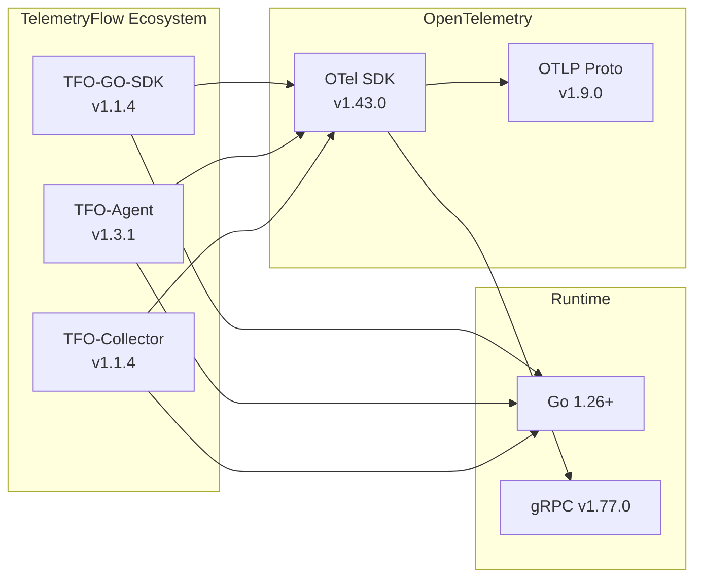
```mermaid
graph LR
    subgraph "TelemetryFlow Ecosystem"
        SDK[TFO-GO-SDK<br/>v1.1.4]
        AGENT[TFO-Agent<br/>v1.3.1]
        COLL[TFO-Collector<br/>v1.1.4]
    end

    subgraph "OpenTelemetry"
        OTEL[OTel SDK<br/>v1.43.0]
        PROTO[OTLP Proto<br/>v1.9.0]
    end

    subgraph "Runtime"
        GO[Go 1.26+]
        GRPC[gRPC v1.77.0]
    end

    SDK --> OTEL
    AGENT --> OTEL
    COLL --> OTEL

    OTEL --> PROTO
    OTEL --> GRPC

    SDK --> GO
    AGENT --> GO
    COLL --> GO
```

## Plugin System & Pipeline (1.3.0+)

Starting with the `1.3.0` dev cycle, the agent ships a Telegraf-style plugin
system and a channel-based pipeline engine. The new foundation is **opt-in**:
an empty `pipeline:` section reproduces the v1.2.x behaviour exactly, legacy
collectors keep working through `plugin.CollectorAdapter`, and the buffer,
persister, secret resolver, and migration framework are no-ops until their
config keys are set. The master roadmap lives in
`telemetryflow-platform-monolith/docs/tfo-agent-roadmap/`; per-release change
history is in [`CHANGELOG.md`](../CHANGELOG.md). Canonical interface
definitions live in [`internal/plugin/types.go`](../internal/plugin/types.go).

### A. Plugin Contracts

The `internal/plugin/` package defines typed plugin interfaces that mirror
Telegraf's taxonomy. Each interface is small and composable; capability
mixins are injected by type-assertion so a plugin only implements what it
needs. Plugins self-register via `init()` + `plugin.MustAddXxx()` and a
top-level `all` package blank-imports every concrete plugin so the binary
links them in (identical pattern to Telegraf's `plugins/all`).

**8 typed interfaces** (see `internal/plugin/types.go`):

| Interface           | Purpose                                                        |
| ------------------- | ------------------------------------------------------------- |
| `Collector`         | Poll-style input (mirrors `collector.Collector`)              |
| `ServiceCollector`  | Streaming/listener input (SNMP trap, NetFlow, syslog)         |
| `StreamingProcessor`| Async-capable processor with `Start`/`Add`/`Stop` lifecycle   |
| `SyncProcessor`     | Legacy synchronous `Apply([]Metric) []Metric` processor       |
| `Aggregator`        | Windowed rollups via `Add` / `Push` / `Reset` / `DropOriginal`|
| `Output`            | Synchronous sink (`Connect` / `Write` / `Close`)              |
| `Parser`            | `[]byte → []Metric` decoder (injectable into Collectors)      |
| `Serializer`        | `Metric → []byte` encoder (injectable into Outputs)           |

**6 capability mixins** (optional interfaces, checked by type assertion):

| Mixin              | Hook                                  | Purpose                                            |
| ------------------ | ------------------------------------- | -------------------------------------------------- |
| `Initializer`      | `Init() error`                        | Post-config, pre-Start setup                       |
| `PluginWithID`     | `ID() string`                         | Deterministic persister key (multi-instance)       |
| `StatefulPlugin`   | `GetState()` / `SetState()`           | Persister-backed state save/restore                |
| `ProbePlugin`      | `Probe() error`                       | Startup health probe (`startup_error_behavior: probe`) |
| `ParserPlugin`     | `SetParser(Parser)`                   | Parser injection (e.g. http scrape)                |
| `SerializerPlugin` | `SetSerializer(Serializer)`           | Serializer injection                               |

`plugin.CollectorAdapter` wraps the existing `internal/collector.Collector`
interface so all 26 legacy collectors participate in the new registry without
rewrite. `plugin.SyncProcessorAdapter` upgrades a `SyncProcessor` to the
`StreamingProcessor` contract (batches up to 1000 metrics per flush).

```mermaid
classDiagram
    class PluginDescriber {
        <<interface>>
        +Info() Info
    }
    class Initializer {
        <<interface>>
        +Init() error
    }
    class StatefulPlugin {
        <<interface>>
        +GetState() interface{}
        +SetState(state interface{})
    }
    class ProbePlugin {
        <<interface>>
        +Probe() error
    }
    class PluginWithID {
        <<interface>>
        +ID() string
    }
    class Collector {
        <<interface>>
        +Name() string
        +Start(ctx) error
        +Stop() error
        +Collect(ctx) ([]Metric, error)
        +IsRunning() bool
    }
    class ServiceCollector {
        <<interface>>
        +Start(ctx, acc) error
        +Stop() error
        +Collect(ctx) ([]Metric, error)
        +IsRunning() bool
    }
    class StreamingProcessor {
        <<interface>>
        +Name() string
        +Start(acc) error
        +Add(metric, acc) error
        +Stop() error
    }
    class SyncProcessor {
        <<interface>>
        +Name() string
        +Apply([]Metric) []Metric
    }
    class Aggregator {
        <<interface>>
        +Name() string
        +Add(Metric)
        +Push(acc)
        +Reset()
        +DropOriginal() bool
    }
    class Output {
        <<interface>>
        +Name() string
        +Connect() error
        +Close() error
        +Write([]Metric) error
    }
    class Parser {
        +Parse([]byte) ([]Metric, error)
    }
    class Serializer {
        +Serialize(Metric) ([]byte, error)
    }
    class CollectorAdapter {
        +Name() string
        +Start(ctx) error
        +Stop() error
        +Collect(ctx) ([]Metric, error)
        +IsRunning() bool
        +Impl() LegacyCollector
    }
    class Accumulator {
        <<interface>>
        +Add(Metric)
        +AddGauge(name, value, labels, t)
        +AddCounter(name, value, labels, t)
        +AddError(err)
    }
    Collector ..|> PluginDescriber : describes
    ServiceCollector ..|> PluginDescriber : describes
    StreamingProcessor ..|> PluginDescriber : describes
    Output ..|> PluginDescriber : describes
    Aggregator ..|> PluginDescriber : describes
    CollectorAdapter ..|> Collector : wraps legacy
    Collector ..>| Initializer : optional mixin
    Collector ..>| StatefulPlugin : optional mixin
    Collector ..>| ProbePlugin : optional mixin
    Collector ..>| PluginWithID : optional mixin
    ServiceCollector ..>| Accumulator : emits via
    StreamingProcessor ..>| Accumulator : emits via
    Aggregator ..>| Accumulator : emits via
    Collector ..>| Parser : injectable via ParserPlugin
    Output ..>| Serializer : injectable via SerializerPlugin
```

### B. Pipeline Topology

`internal/pipeline/` wires plugins into a channel-based DAG. Every stage is
a buffered Go channel of `plugin.Metric`; the queue size and drop policy are
configurable per pipeline instance. Aggregators window on a fixed
`AggregatorPeriod`; the output stage batches up to 1000 metrics and flushes
every `FlushInterval`.

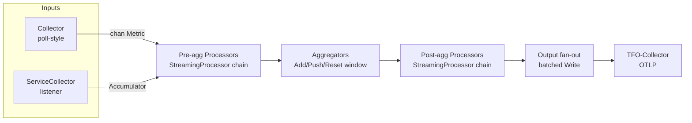
```mermaid
flowchart LR
    subgraph Inputs
        POLL[Collector<br/>poll-style]
        SVC[ServiceCollector<br/>listener]
    end
    PRE[Pre-agg Processors<br/>StreamingProcessor chain]
    AGG[Aggregators<br/>Add/Push/Reset window]
    POST[Post-agg Processors<br/>StreamingProcessor chain]
    OUT[Output fan-out<br/>batched Write]
    SINK[TFO-Collector<br/>OTLP]

    POLL -->|chan Metric| PRE
    SVC -->|Accumulator| PRE
    PRE --> AGG
    AGG --> POST
    POST --> OUT
    OUT --> SINK
```

**Queue sizing & drop policies** (`pipeline.Config.DropPolicy`):

| Policy         | Behaviour when the channel is full                                       |
| -------------- | ------------------------------------------------------------------------ |
| `block`        | Producer blocks until room is available. Strong back-pressure, can stall. |
| `drop_oldest`  | Evict the oldest queued metric to make room. Bounded latency.            |
| `drop_newest`  | Drop the incoming metric. **Default.** Preserves history over freshness. |

Default queue size is 10000 per stage; default aggregator window is 30s;
default flush interval is 5s.

**Backpressure semantics.** Each stage owns its own goroutine and channel.
Slow downstream stages fill their channel and engage the configured drop
policy at the producer side. `DropPolicyBlock` propagates backpressure all
the way to the collector `Gather` loop; the other two isolate the producer
and silently shed load. The `ChannelAccumulator` emits an
`ErrAccumulatorFull` on every drop so the selfstat layer can count them.

**Backwards compatibility.** When no `pipeline:` section is present (or
every stage list is empty), `agent.NewWithConfigFile` skips building a
`Pipeline` and falls back to the existing `MetricForwarder → OTLP bridge`
path used since v1.2.x. Legacy collectors registered through
`CollectorAdapter` work in both modes.

### C. Buffer & Retry Layer

`internal/exporter/buffer_retry_sink.go` wraps any `MetricSink` with
disk-backed retry. It implements `MetricSink`, so `agent.go` can swap the
bare OTLP bridge for `NewBufferRetrySink(otlpBridge, cfg)` without touching
`MetricForwarder`. Enabled via `buffer.enabled: true`.

- On a successful `Export`, the call passes through to the inner sink.
- On failure, the batch is marshalled as a `retryEntry` and pushed into
  `internal/buffer.Buffer` (the disk-backed store). If the disk buffer is
  unavailable, an in-memory fallback queue capped at 100 entries is used.
- A background goroutine (`StartRetryLoop`) wakes every `RetryInterval`
  (default 5s), drains the disk buffer and the in-memory queue, and retries
  each entry against the inner sink. Entries that exceed `MaxRetries`
  (default 0 = unlimited) are dropped with a warning.
- Writes are atomic from the caller's perspective: `Export` never returns
  the underlying error once the entry is buffered, so the forwarder never
  double-counts.
- When `buffer.enabled: true`, queued entries survive an agent restart
  because they live in the on-disk buffer until successfully exported.

### D. Secret Management

Configuration values can reference a secret store with the `@{store:key}`
syntax. The resolver is wired into the config loader as the third stage of
the preprocess pipeline:

```
migration.ApplyLatest  →  os.ExpandEnv  →  secret.Resolver
```

1. `migration.ApplyLatest` upgrades older YAML schemas (e.g. the
   `insecure_skip_verify → tls_skip_verify` rename handled by
   `internal/migration/v1_3/`).
2. `os.ExpandEnv` resolves `${VAR}` references — this lets operators inject
   secret-store configuration (a Vault token, a file path) from the process
   environment.
3. `secret.Resolver` looks up each `@{store:key}` against the named
   `SecretStore` backend and substitutes the resolved value.

Three backends ship out of the box under `internal/secret/`:
`env` (os.Getenv), `file` (JSON map), and `vault` (HashiCorp Vault KV-v2
over `net/http`, no SDK dependency). Backends self-register via
`plugin.MustAddSecretStore`. Failures in any stage are logged but
non-fatal — the resulting YAML surfaces a more actionable parse error from
Viper.

### E. Persister

`internal/persister/` provides disk-backed state persistence for plugins
that implement `plugin.StatefulPlugin`. The agent lifecycle wiring is:

1. **Load** the JSON state file before collectors start. Each entry is
   dispatched by id to the matching registered plugin via `SetState`. A
   missing file is a first run (not an error); a corrupt file is
   quarantined to `<path>.corrupt-<timestamp>` and Load returns nil so the
   agent can start fresh.
2. **Store** snapshots every registered plugin's `GetState()` atomically:
   write to `<path>.tmp` then rename over the final path, mode `0600`.
   Concurrent Stores are serialised.
3. **StartSaveLoop** runs in its own goroutine and calls `Store` every
   interval until the context is cancelled. Wired into agent shutdown so
   the final Store flushes on graceful exit.

Opt-in via `persister.enabled: true`. Plugin ids are taken from
`PluginWithID.ID()` when available so multiple instances of the same plugin
(e.g. several MySQL collectors) persist independent state.

### F. Selfstat Layer

`internal/selfstat/` is the agent's internal self-observability registry,
mirroring Telegraf's `internal` plugin. Subsystems acquire a counter via
`selfstat.RegisterStat(name, labels)` or a timing via
`selfstat.RegisterTimingStat(name, labels)`; the handles are atomic
(`int64`) / mutex-guarded and safe for concurrent mutation.

- Pre-registered agent-level globals: metrics written/rejected/dropped,
  gather errors, buffer size/limit, version info.
- `selfstat.ForCollector()` and `selfstat.ForExporter()` emit per-plugin
  stats keyed by plugin name.
- `selfstat.AllMetrics()` snapshots the registry into a slice of
  `plugin.Metric` for pipeline emission. `TimingStat.Get()` is destructive:
  it returns the running average since the previous call and clears the
  accumulator, so each tick reports only samples observed since the last
  tick.

The `internalstats` collector (`internal/collector/internalstats/`) is the
bridge: on every `Collect` cycle it calls `selfstat.AllMetrics()` and
forwards the snapshot into the normal metric pipeline under the
Telegraf-compatible collector name `internal`. This makes the agent's own
behaviour observable by the same dashboards that consume host metrics.

### M2 Collector Documentation

The M2 network-monitoring collectors are documented under
[`docs/collectors/`](./collectors/):

- ICMP probing — see [docs/collectors/](./collectors/) (ping entry)
- DNS, TCP, HTTP probes — same directory
- SNMP, NetFlow, syslog, sFlow — same directory

Master roadmap: `telemetryflow-platform-monolith/docs/tfo-agent-roadmap/`.

## Related Documentation

- [TFO-Collector Configuration](../../telemetryflow-collector/docs/CONFIGURATION.md)
- [TFO-GO-SDK Usage](../../telemetryflow-go-sdk/docs/USAGE.md)
- [Deployment Guide](./DEPLOYMENT.md)
- [Collector Reference](./collectors/README.md)
- [CLI Commands](./COMMANDS.md)
- [Change History](../CHANGELOG.md)
- [Plugin Interface Definitions](../internal/plugin/types.go)
- [Master Roadmap](../../telemetryflow-platform-monolith/docs/tfo-agent-roadmap/)
