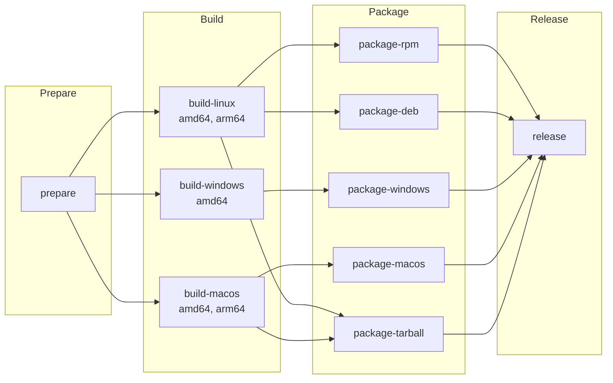
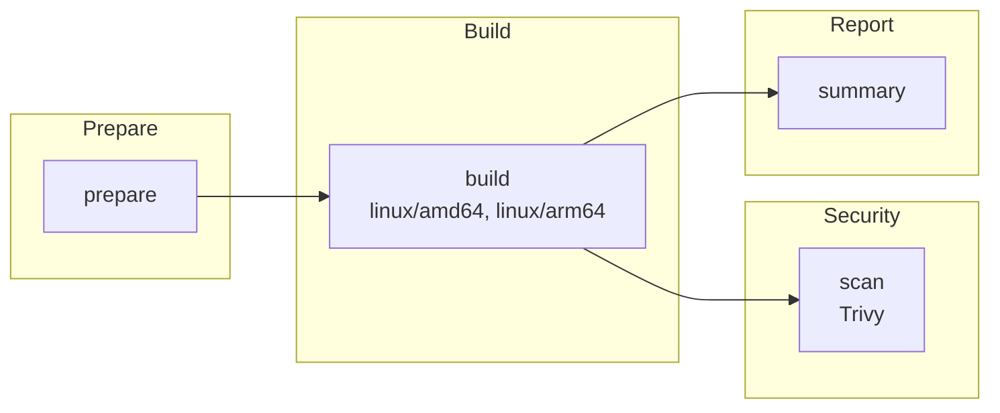
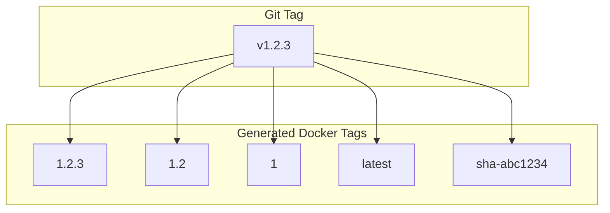

# TelemetryFlow Agent - GitHub Workflows

This document describes the GitHub Actions workflows available for TelemetryFlow Agent.

## Overview

| Workflow | File | Purpose |
|----------|------|---------|
| Release | `release.yml` | Build and release binaries for all platforms |
| Docker Build | `docker.yml` | Build and publish Docker images |

---

## Release Workflow

**File:** `.github/workflows/release.yml`

Builds and releases TelemetryFlow Agent for multiple platforms with native packages.

### Triggers

| Trigger | Description |
|---------|-------------|
| Push tag `v*.*.*` | Automatically triggered on semantic version tags |
| Manual dispatch | Run manually with custom version |

### Supported Platforms

| Platform | Architecture | Package Format |
|----------|--------------|----------------|
| Linux | amd64, arm64 | RPM, DEB, tar.gz |
| Windows | amd64 | ZIP (with installer) |
| macOS | amd64 (Intel), arm64 (Apple Silicon) | DMG, tar.gz |

### Manual Trigger

```yaml
workflow_dispatch:
  inputs:
    version:
      description: 'Version to release (e.g., 1.0.0)'
      required: true
      default: '1.0.0'
    prerelease:
      description: 'Mark as pre-release'
      required: false
      type: boolean
      default: false
```

### Usage

#### Automatic Release (Recommended)

```bash
# Create and push a version tag
git tag v1.0.0
git push origin v1.0.0
```

#### Manual Release

1. Go to **Actions** > **Release**
2. Click **Run workflow**
3. Enter version (e.g., `1.0.0`)
4. Optionally check "Mark as pre-release"
5. Click **Run workflow**

### Artifacts

The workflow produces:

- **RPM packages**: `tfo-agent-{version}-1.{arch}.rpm`
- **DEB packages**: `tfo-agent_{version}_{arch}.deb`
- **Windows ZIP**: `tfo-agent-{version}-windows-amd64.zip`
- **macOS DMG**: `tfo-agent-{version}-darwin-{arch}.dmg`
- **Tarballs**: `tfo-agent-{version}-{os}-{arch}.tar.gz`
- **Checksums**: `checksums-sha256.txt`

---

## Docker Build Workflow

**File:** `.github/workflows/docker.yml`

Builds and publishes multi-platform Docker images with semantic versioning.

### Triggers

| Trigger | Description |
|---------|-------------|
| Push to `main`/`master` | Build and push `latest` tag |
| Push tag `v*.*.*` | Build and push version tags |
| Pull request | Build only (no push) |
| Manual dispatch | Run with custom options |

### Path Filters

The workflow only runs when relevant files change:

- `Dockerfile`
- `cmd/**`
- `internal/**`
- `pkg/**`
- `go.mod`, `go.sum`
- `.github/workflows/docker.yml`

### Registries

| Registry | Image |
|----------|-------|
| GitHub Container Registry | `ghcr.io/{owner}/telemetryflow-agent` |
| Docker Hub | `telemetryflow/telemetryflow-agent` |

### Image Tags

| Tag Pattern | Description | Example |
|-------------|-------------|---------|
| `{version}` | Full semantic version | `1.0.0` |
| `{major}.{minor}` | Major.minor version | `1.0` |
| `{major}` | Major version only | `1` |
| `latest` | Latest from main branch | `latest` |
| `sha-{commit}` | Git commit SHA | `sha-abc1234` |

### Platforms

- `linux/amd64`
- `linux/arm64`

### Manual Trigger

```yaml
workflow_dispatch:
  inputs:
    version:
      description: 'Version tag (e.g., 1.0.0)'
      required: false
    push:
      description: 'Push images to registry'
      type: boolean
      default: true
    platforms:
      description: 'Target platforms'
      default: 'linux/amd64,linux/arm64'
```

### Usage

#### Automatic Build

```bash
# Push to main branch - builds 'latest' tag
git push origin main

# Create version tag - builds version tags
git tag v1.0.0
git push origin v1.0.0
```

#### Manual Build

1. Go to **Actions** > **Docker Build**
2. Click **Run workflow**
3. Optionally enter version
4. Choose whether to push
5. Select platforms
6. Click **Run workflow**

### Pull Commands

```bash
# GitHub Container Registry
docker pull ghcr.io/{owner}/telemetryflow-agent:latest
docker pull ghcr.io/{owner}/telemetryflow-agent:1.0.0

# Docker Hub
docker pull telemetryflow/telemetryflow-agent:latest
docker pull telemetryflow/telemetryflow-agent:1.0.0
```

### Security Features

- **SBOM Generation**: Software Bill of Materials in SPDX format
- **Trivy Scanning**: Vulnerability scanning for CRITICAL and HIGH severity
- **Provenance**: Build provenance attestation
- **Layer Caching**: GitHub Actions cache for faster builds

---

## Environment Variables

### Required Secrets

| Secret | Description | Required For |
|--------|-------------|--------------|
| `GITHUB_TOKEN` | Auto-provided by GitHub | All workflows |
| `DOCKERHUB_TOKEN` | Docker Hub access token | Docker Hub push |

### Required Variables

| Variable | Description | Required For |
|----------|-------------|--------------|
| `DOCKERHUB_USERNAME` | Docker Hub username | Docker Hub push |

### Setting Up Docker Hub (Optional)

1. Go to **Settings** > **Secrets and variables** > **Actions**
2. Add secret: `DOCKERHUB_TOKEN` with your Docker Hub token
3. Add variable: `DOCKERHUB_USERNAME` with your Docker Hub username

---

## Build Information

Both workflows inject build information into the binary:

| Variable | Description |
|----------|-------------|
| `VERSION` | Semantic version |
| `GIT_COMMIT` | Short commit SHA |
| `GIT_BRANCH` | Git branch name |
| `BUILD_TIME` | UTC build timestamp |

Access via CLI:

```bash
tfo-agent version
```

---

## Workflow Jobs

### Release Workflow Jobs



### Docker Workflow Jobs



### Semantic Versioning Tags



---

## Troubleshooting

### Common Issues

#### 1. Docker Hub Push Fails

**Cause**: Missing Docker Hub credentials

**Solution**:
```
1. Create Docker Hub access token
2. Add DOCKERHUB_TOKEN secret
3. Add DOCKERHUB_USERNAME variable
```

#### 2. Build Cache Miss

**Cause**: Cache expired or first build

**Solution**: Re-run the workflow; cache will be populated

#### 3. Trivy Scan Fails

**Cause**: Image not available in registry

**Solution**: Ensure the build job completed successfully

#### 4. RPM/DEB Build Fails

**Cause**: Missing config file

**Solution**: Ensure `configs/tfo-agent.yaml` exists

---

## Links

- [GitHub Actions Documentation](https://docs.github.com/en/actions)
- [Docker Build Push Action](https://github.com/docker/build-push-action)
- [Docker Metadata Action](https://github.com/docker/metadata-action)
- [Trivy Action](https://github.com/aquasecurity/trivy-action)
