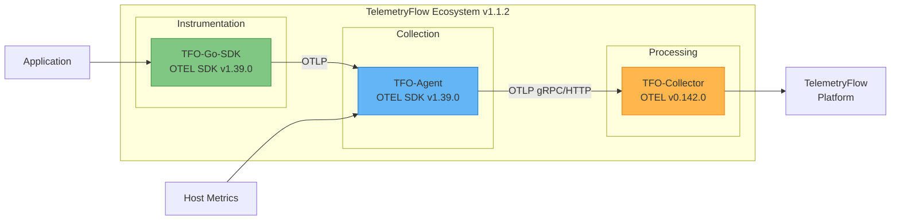
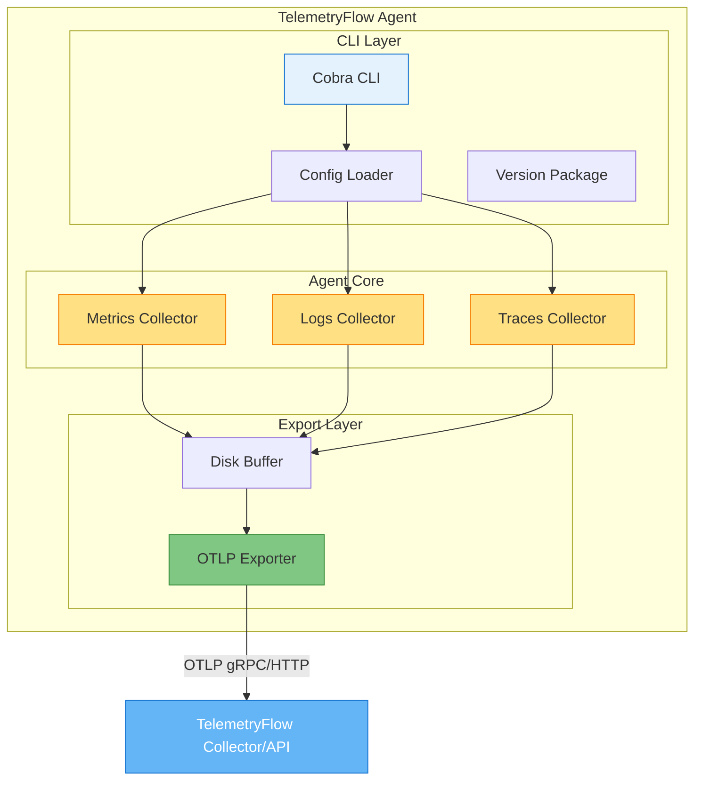
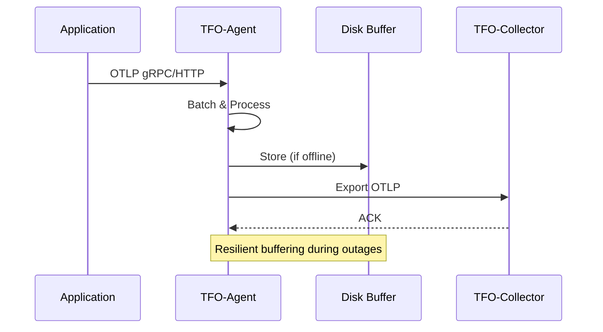

# TelemetryFlow Agent Documentation

- **Version:** 1.1.2
- **OTEL SDK Version:** 1.39.0
- **Last Updated:** January 2026
- **Status:** Production Ready

---

## Overview

TelemetryFlow Agent (`tfo-agent`) is a custom-built enterprise-grade telemetry collection agent written in Go. Built on the standard OpenTelemetry Go SDK v1.39.0, `tfo-agent` provides a purpose-built CLI with Cobra commands, custom configuration format, and TelemetryFlow-specific features while maintaining full compatibility with the OTEL ecosystem.

### Key Differentiators

| Feature | tfo-agent (Custom) | OTEL Collector |
|---------|-------------------|----------------|
| SDK Base | OpenTelemetry SDK v1.39.0 | OTEL Collector |
| CLI Framework | Cobra with subcommands | Standard OTEL |
| Config Format | Custom YAML with `enabled` flags | Standard OTEL YAML |
| Banner/Branding | Custom ASCII art banner | None |
| Build System | Single Go binary | OCB-generated |
| Commands | `start`, `version`, `config` | `--config` only |

### TelemetryFlow Ecosystem Alignment

TFO-Agent is fully aligned with the TelemetryFlow ecosystem, sharing the same OpenTelemetry SDK version across all components:



| Component | Version | OTEL Base | Description |
|-----------|---------|-----------|-------------|
| **TFO-Agent** | v1.1.2 | SDK v1.39.0 | Telemetry collection agent |
| **TFO-Go-SDK** | v1.1.2 | SDK v1.39.0 | Go instrumentation SDK |
| **TFO-Collector** | v1.1.2 | Collector v0.142.0 | Central telemetry collector |

This alignment ensures:
- **Consistent telemetry format** across all components
- **Seamless integration** between agent and SDK instrumentation
- **Unified authentication** using TelemetryFlow credentials (tfk_xxx / tfs_xxx)
- **Compatible OTLP protocols** (gRPC and HTTP)

---

## Documentation Index

### Core Documentation

| Document | Description |
|----------|-------------|
| [README.md](README.md) | This file - Overview and quick reference |
| [INSTALLATION.md](INSTALLATION.md) | Installation and deployment guide |
| [CONFIGURATION.md](CONFIGURATION.md) | Configuration reference |
| [COMMANDS.md](COMMANDS.md) | CLI commands reference |
| [ARCHITECTURE.md](ARCHITECTURE.md) | Internal architecture with Mermaid diagrams |
| [SYSTEM-INFO.md](SYSTEM-INFO.md) | System information collection capabilities (130+ metrics) |
| [DEVELOPMENT.md](DEVELOPMENT.md) | Development guide, coding standards, and testing |
| [TROUBLESHOOTING.md](TROUBLESHOOTING.md) | Troubleshooting guide and common issues |
| [GITHUB-WORKFLOWS.md](GITHUB-WORKFLOWS.md) | CI/CD workflows documentation |

### Integration Documentation

| Document | Description |
|----------|-------------|
| [integrations/README.md](integrations/README.md) | Integration overview and architecture |
| [integrations/CLOUD-PROVIDERS.md](integrations/CLOUD-PROVIDERS.md) | GCP, Azure, Alibaba Cloud |
| [integrations/INFRASTRUCTURE.md](integrations/INFRASTRUCTURE.md) | Proxmox, VMware, Nutanix, Azure Arc |
| [integrations/NETWORK.md](integrations/NETWORK.md) | Cisco, SNMP, MQTT integrations |
| [integrations/KERNEL.md](integrations/KERNEL.md) | eBPF kernel-level observability |
| [integrations/OBSERVABILITY.md](integrations/OBSERVABILITY.md) | APM platforms (Dynatrace, Instana, etc.) |

---

## Quick Start

### Build

```bash
# Build the agent
make build

# Output: ./build/tfo-agent
```

### Run

```bash
# Show version with banner
./build/tfo-agent version

# Start with configuration
./build/tfo-agent start --config configs/tfo-agent.yaml

# Show parsed configuration
./build/tfo-agent config --config configs/tfo-agent.yaml
```

### Verify

```bash
# Check health
curl http://localhost:13133/

# Check metrics
curl http://localhost:8888/metrics
```

---

## Architecture Overview



### Data Flow



---

## Features

### System Metrics Collection

- CPU usage (per core and total)
- Memory usage (used, available, cached)
- Disk I/O and space
- Network statistics
- Process metrics

### Log Collection

- File-based log tailing
- Syslog receiver
- Structured JSON parsing
- Multi-line log support

### Trace Collection

- OTLP receiver (gRPC/HTTP)
- Trace context propagation
- Span processing

### Resilience Features

- Automatic retry with exponential backoff
- Disk-backed buffering during outages
- Graceful shutdown with signal handling
- Heartbeat monitoring with auto-reconnection

---

## Configuration Overview

```yaml
# tfo-agent configuration (custom format)
agent:
  id: "agent-001"
  hostname: ""  # auto-detected
  description: "Production Agent"
  tags:
    environment: "production"

collectors:
  metrics:
    enabled: true
    interval: 60s
  logs:
    enabled: true
    paths:
      - /var/log/*.log
  traces:
    enabled: true

exporter:
  otlp:
    enabled: true
    endpoint: "http://tfo-collector:4317"
    compression: "gzip"

buffer:
  enabled: true
  path: "/var/lib/tfo-agent/buffer"
  max_size_mb: 100
```

---

## Exposed Ports

| Port | Protocol | Description |
|------|----------|-------------|
| 4317 | gRPC | OTLP gRPC receiver |
| 4318 | HTTP | OTLP HTTP receiver |
| 8888 | HTTP | Prometheus metrics (self) |
| 13133 | HTTP | Health check |

---

## Project Structure

```
tfo-agent/
├── cmd/tfo-agent/          # CLI entry point
│   └── main.go             # Cobra CLI with commands
├── internal/
│   ├── agent/              # Core agent implementation
│   ├── collector/          # Metric/log/trace collectors
│   ├── config/             # Configuration management
│   ├── exporter/           # OTLP exporter
│   └── version/            # Version and banner
├── pkg/                    # Shared packages
├── configs/
│   └── tfo-agent.yaml      # Default configuration
├── tests/
│   ├── unit/               # Unit tests
│   └── integration/        # Integration tests
├── build/                  # Build output
├── docs/                   # Documentation
├── Makefile
├── Dockerfile
└── README.md
```

---

## Build System

### Make Targets

```bash
# Build Commands
make                # Build agent (default)
make build          # Build for current platform
make build-all      # Build for all platforms
make build-linux    # Build for Linux
make build-darwin   # Build for macOS

# Development
make run            # Build and run
make dev            # Run with go run
make test           # Run tests
make lint           # Run linter

# Other
make clean          # Clean artifacts
make version        # Show version info
make help           # Show all commands
```

### Build Flags

Version information is injected at build time via ldflags:

```makefile
LDFLAGS := -s -w \
    -X 'github.com/telemetryflow/telemetryflow-agent/internal/version.Version=$(VERSION)' \
    -X 'github.com/telemetryflow/telemetryflow-agent/internal/version.GitCommit=$(GIT_COMMIT)' \
    -X 'github.com/telemetryflow/telemetryflow-agent/internal/version.GitBranch=$(GIT_BRANCH)' \
    -X 'github.com/telemetryflow/telemetryflow-agent/internal/version.BuildTime=$(BUILD_TIME)'
```

---

## Deployment Options

### Docker

```bash
docker run -d \
  --name tfo-agent \
  -p 4317:4317 \
  -p 4318:4318 \
  -v /path/to/config.yaml:/etc/tfo-agent/tfo-agent.yaml \
  telemetryflow/telemetryflow-agent:latest \
  start --config /etc/tfo-agent/tfo-agent.yaml
```

### Kubernetes (DaemonSet)

```yaml
apiVersion: apps/v1
kind: DaemonSet
metadata:
  name: tfo-agent
spec:
  selector:
    matchLabels:
      app: tfo-agent
  template:
    spec:
      containers:
      - name: tfo-agent
        image: telemetryflow/telemetryflow-agent:latest
        args: ["start", "--config", "/etc/tfo-agent/config.yaml"]
```

### Systemd

```ini
[Unit]
Description=TelemetryFlow Agent - CEOP
After=network.target

[Service]
Type=simple
ExecStart=/usr/local/bin/tfo-agent start --config /etc/tfo-agent/tfo-agent.yaml
Restart=always

[Install]
WantedBy=multi-user.target
```

---

## Links

- **Website**: [https://telemetryflow.id](https://telemetryflow.id)
- **Documentation**: [https://docs.telemetryflow.id](https://docs.telemetryflow.id)
- **Developer**: [DevOpsCorner Indonesia](https://devopscorner.id)

---

**Copyright (c) 2024-2026 DevOpsCorner Indonesia. All rights reserved.**
