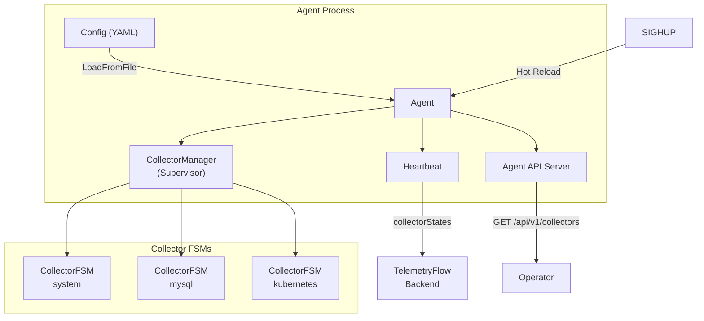
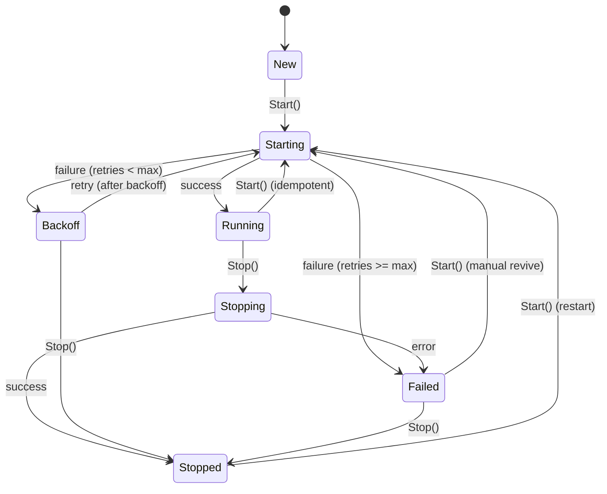
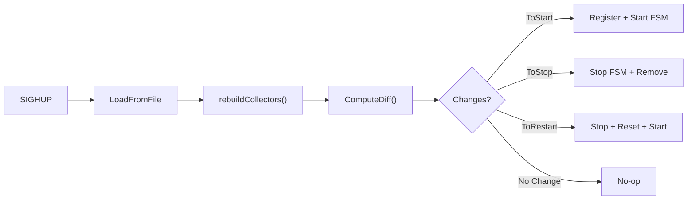
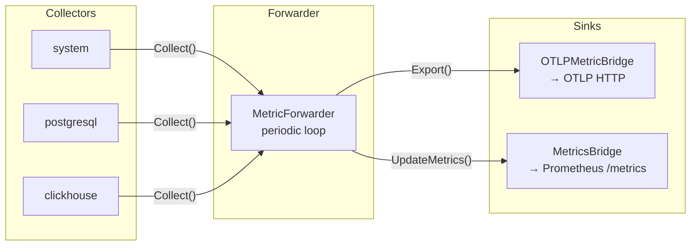
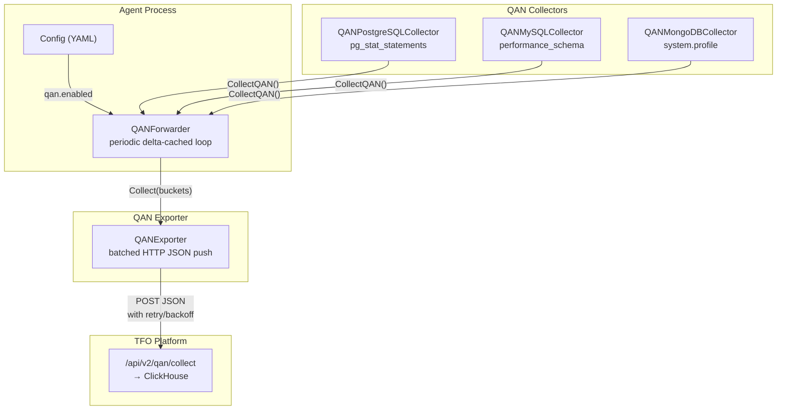

# Supervisor Architecture

The TelemetryFlow Agent supervisor is an optional subsystem inspired by Percona Monitoring and Management (PMM) Agent. It provides per-collector lifecycle management, automatic retry with exponential backoff, runtime configuration reload, and collector state reporting.

## Overview



## Feature Flag

Supervisor mode is **disabled by default** for zero-overhead when not in use:

```yaml
supervisor:
  enabled: true # Master switch
  hot_reload: true # SIGHUP triggers config reload
  status_report: true # Include collector states in heartbeat
  fsm:
    max_start_retries: 3
    backoff_initial: 5s
    backoff_max: 60s
    backoff_multiplier: 2.0
    restart_on_config_change: true
```

When `supervisor.enabled: false`, the agent uses the legacy static collector initialization path with no additional memory or goroutines.

## CollectorFSM State Machine

Each collector is wrapped in a `CollectorFSM` that manages its lifecycle:



### States

| State      | Description                                    |
| ---------- | ---------------------------------------------- |
| `new`      | Initial state after creation                   |
| `starting` | Transition state during `collector.Start(ctx)` |
| `running`  | Collector is active and collecting             |
| `stopping` | Transition state during `collector.Stop()`     |
| `stopped`  | Cleanly stopped                                |
| `failed`   | Permanently failed after max retries           |
| `backoff`  | Temporarily failed, waiting for retry          |

## Config Diff Engine

When hot reload is triggered (SIGHUP), the agent:

1. Re-reads the YAML config from disk
2. Rebuilds collectors from new config
3. Computes a **SHA-256 config hash** per collector
4. Calls `ComputeDiff()` to determine changes
5. Applies the diff via `Manager.ApplyDiff()`



### Diff Algorithm

```
running = set of FSMs currently managed
desired = set of CollectorEntry from new config

ToStop   = running - desired (names only)
ToStart  = desired - running (names only)
ToRestart= intersection where ConfigHash changed
```

All result lists are sorted deterministically.

## Exponential Backoff with Jitter

Failed collectors retry with exponential backoff + ±10% jitter to avoid thundering herd:

```
duration = initial × multiplier^attempt
duration = min(duration, max)
duration += random_jitter(±10%)
duration = max(duration, initial)
```

The manager runs a retry loop (5-second tick) that scans for collectors in `Backoff` state and attempts restart.

## Heartbeat Integration

When `supervisor.status_report: true`, heartbeat payloads include live collector states:

```json
{
  "systemInfo": {
    "hostname": "prod-web-01",
    "collectorStates": [
      { "name": "system", "state": "running", "startedAt": 1718000000 },
      {
        "name": "mysql",
        "state": "backoff",
        "failureCount": 2,
        "lastError": "connection refused"
      }
    ]
  }
}
```

## Agent API Endpoints

Available when `agent_api.enabled: true` (no longer requires K8s collector):

| Method | Path                           | Description                             |
| ------ | ------------------------------ | --------------------------------------- |
| `GET`  | `/api/v1/health`               | Health check (includes `agent_running`) |
| `GET`  | `/api/v1/collectors`           | Collector states (supervisor mode)      |
| `POST` | `/api/v1/reload`               | Trigger config reload                   |
| `GET`  | `/api/v1/pods/{ns}/{pod}/logs` | K8s pod log streaming (requires K8s)    |

All endpoints (except `/health`) require API key authentication via `X-TelemetryFlow-Key-ID` header.

## Prometheus Self-Metrics

| Metric                                          | Type    | Labels      | Description                       |
| ----------------------------------------------- | ------- | ----------- | --------------------------------- |
| `tfo_agent_supervisor_collectors`               | Gauge   | `state`     | Number of collectors by FSM state |
| `tfo_agent_supervisor_collector_restarts_total` | Counter | `collector` | Restarts due to config change     |

## Thread Safety

- **CollectorFSM**: `sync.RWMutex` protects all state transitions. Reads use `RLock`, writes use `Lock`.
- **Manager**: `sync.RWMutex` for FSM registry. Retry loop snapshots FSMs under `RLock`, spawns goroutines outside lock.
- **Agent**: `sync.RWMutex` for config and running state.

## Future Phases

- **Phase 2**: gRPC control plane (remote management from TelemetryFlow Platform)
- **Phase 3**: Job scheduler and broker (on-demand collection, QAN)

## Metric Forwarder (Data-Path Pipeline)

The `MetricForwarder` is the component that connects collector output to export destinations. Without it, collectors call `Collect()` but the results are discarded — metrics never reach the OTLP backend or Prometheus endpoint.

### Architecture



### How It Works

1. On agent startup, `agent.New()` creates a `MetricForwarder` with all registered collectors
2. The forwarder starts alongside collectors in `agent.Run()`
3. Every interval (defaults to the system collector interval, typically 30s), the forwarder:
   - Calls `Collect(ctx)` on every **running** collector
   - Skips collectors that return errors (logged as warnings)
   - Aggregates all metrics into a single batch
   - Pushes the batch to the Prometheus bridge (`UpdateMetrics`)
   - Exports the batch via the OTLP HTTP bridge (`Export`)
4. On shutdown, the forwarder stops first, then the OTLP bridge flushes and closes

### Configuration

The forwarder activates automatically when collectors are present — no explicit configuration needed. The collection interval is inherited from `collector.system.interval`.

```yaml
collector:
  system:
    interval: 30s # Also used by MetricForwarder

exporter:
  otlp:
    enabled: true # Enables OTLPMetricBridge

prometheus_server:
  enabled: true # Enables Prometheus bridge
```

### Statistics

The forwarder tracks:

| Stat           | Description                        |
| -------------- | ---------------------------------- |
| `totalExports` | Successful OTLP export cycles      |
| `totalMetrics` | Total metric data points forwarded |
| `totalErrors`  | Failed OTLP export cycles          |

---

## QAN (Query Analytics) Data Path

QAN is a **completely separate data path** from the OTLP metric pipeline. Inspired by PMM's architecture, it carries high-cardinality per-query analytics data to a dedicated ClickHouse-backed endpoint, bypassing VictoriaMetrics/OTLP entirely.

### Why a Separate Path?

| Concern             | OTLP Metrics Path             | QAN Path                           |
| ------------------- | ----------------------------- | ---------------------------------- |
| Data shape          | Low-cardinality time series   | High-cardinality per-query buckets |
| Backend             | VictoriaMetrics via OTLP HTTP | ClickHouse via dedicated API       |
| Aggregation         | Agent collects raw counters   | Agent computes deltas + stats      |
| Collection interval | 10–30s                        | 60s (configurable)                 |
| Protocol            | OTLP protobuf over HTTP       | JSON over HTTP                     |

### Architecture



### How It Works

1. When `qan.enabled: true`, `agent.New()` creates QAN collectors for any enabled DB collectors (PostgreSQL, MySQL, MongoDB) that have instances configured
2. Each QAN collector maintains a per-instance delta cache (previous snapshot of query stats)
3. The `QANForwarder` runs on its own interval (default 60s), calling `CollectQAN()` on each running QAN collector
4. Each collector:
   - Queries the DB (pg_stat_statements / performance_schema / system.profile)
   - Computes deltas from the previous snapshot
   - Returns `[]QANMetricsBucket` with rich per-query stats (`{cnt, sum, min, max, p99}` + DB-specific metrics)
   - Skips the first cycle (no baseline to diff against)
5. The `QANExporter` buffers buckets and flushes to `/api/v2/qan/collect` via HTTP JSON:
   - Auto-flush when batch size is reached (default 100)
   - Periodic flush every 10s
   - Retry with exponential backoff (default 3 attempts)
   - Auth via `X-API-Key-ID` and `X-API-Key-Secret` headers

### Data Model

Each `QANMetricsBucket` contains:

| Field            | Description                                    |
| ---------------- | ---------------------------------------------- |
| `query_id`       | SHA-256 fingerprint of normalized query text   |
| `fingerprint`    | Same as query_id (for PMM compatibility)       |
| `example`        | Sample query text (truncated to 512 chars)     |
| `period_start`   | Unix timestamp of period start                 |
| `period_length`  | Period duration in seconds                     |
| `database`       | Database name                                  |
| `num_queries`    | Delta query count for the period               |
| `m_query_time_*` | `{cnt, sum, min, max, p99}` for query time     |
| `postgresql`     | PostgreSQL-specific metrics (rows, blks, I/O)  |
| `mysql`          | MySQL-specific metrics (lock, rows, temp tbls) |
| `mongodb`        | MongoDB-specific metrics (docs, keys, plans)   |

### Configuration

```yaml
qan:
  enabled: true
  interval: 60s
  endpoint: "https://api.telemetryflow.id"
  api_key_id: "tfk_xxx"
  api_key_secret: "tfs_xxx"
  batch_size: 100
  flush_interval: 10s
  timeout: 30s
  max_retry_attempts: 3
  top_queries_limit: 200
```

QAN collectors are auto-created from existing DB collector instance configs — no separate instance list needed:

```yaml
collectors:
  postgresql:
    enabled: true
    instances:
      - name: "prod-pg"
        host: "db.internal"
        port: 5432
        user: "monitor"
        password: "secret"
        dbname: "app"

qan:
  enabled: true # Reuses postgresql.instances automatically
```

### Zero Overhead When Disabled

When `qan.enabled: false` (the default), no QAN collectors, forwarder, or exporter are created. The `qan` package is imported but unused at runtime — the agent has the same memory and CPU footprint as if QAN didn't exist.
