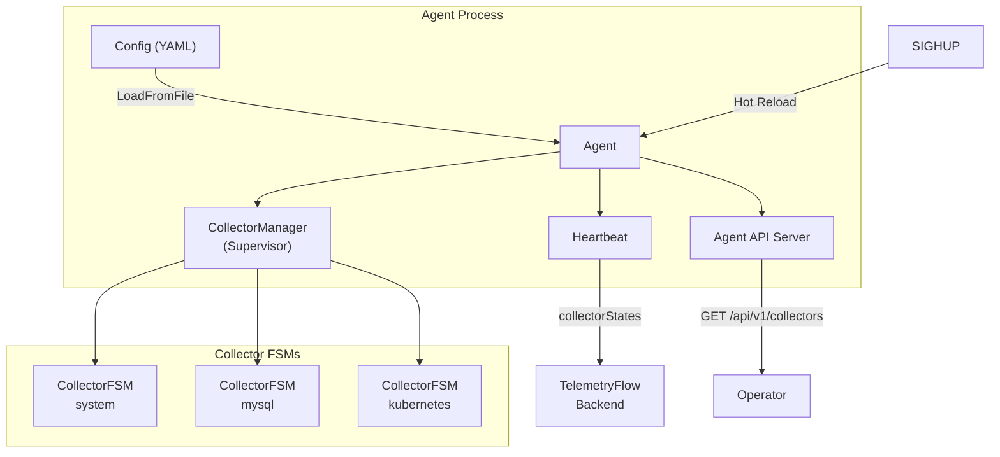
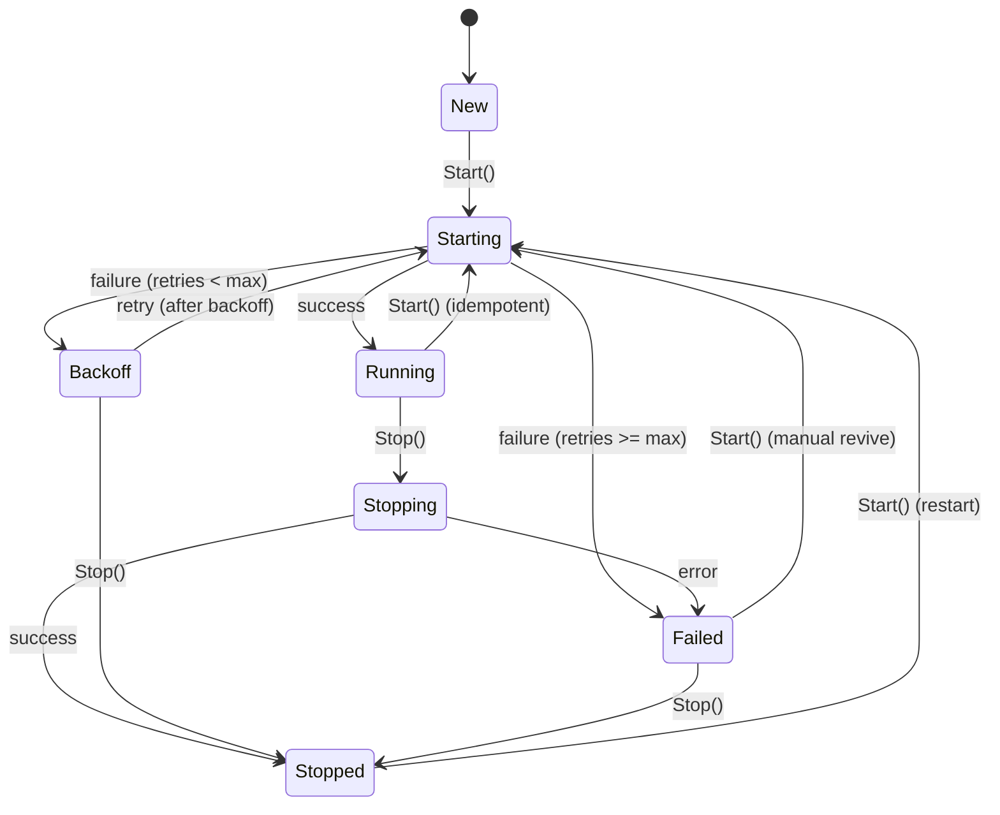
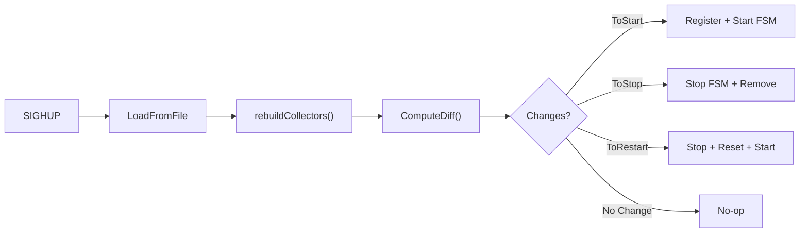

# Supervisor Architecture

The TelemetryFlow Agent supervisor is an optional subsystem inspired by Percona Monitoring and Management (PMM) Agent. It provides per-collector lifecycle management, automatic retry with exponential backoff, runtime configuration reload, and collector state reporting.

## Overview



## Feature Flag

Supervisor mode is **disabled by default** for zero-overhead when not in use:

```yaml
supervisor:
  enabled: true # Master switch
  hot_reload: true # SIGHUP triggers config reload
  status_report: true # Include collector states in heartbeat
  fsm:
    max_start_retries: 3
    backoff_initial: 5s
    backoff_max: 60s
    backoff_multiplier: 2.0
    restart_on_config_change: true
```

When `supervisor.enabled: false`, the agent uses the legacy static collector initialization path with no additional memory or goroutines.

## CollectorFSM State Machine

Each collector is wrapped in a `CollectorFSM` that manages its lifecycle:



### States

| State      | Description                                    |
| ---------- | ---------------------------------------------- |
| `new`      | Initial state after creation                   |
| `starting` | Transition state during `collector.Start(ctx)` |
| `running`  | Collector is active and collecting             |
| `stopping` | Transition state during `collector.Stop()`     |
| `stopped`  | Cleanly stopped                                |
| `failed`   | Permanently failed after max retries           |
| `backoff`  | Temporarily failed, waiting for retry          |

## Config Diff Engine

When hot reload is triggered (SIGHUP), the agent:

1. Re-reads the YAML config from disk
2. Rebuilds collectors from new config
3. Computes a **SHA-256 config hash** per collector
4. Calls `ComputeDiff()` to determine changes
5. Applies the diff via `Manager.ApplyDiff()`



### Diff Algorithm

```
running = set of FSMs currently managed
desired = set of CollectorEntry from new config

ToStop   = running - desired (names only)
ToStart  = desired - running (names only)
ToRestart= intersection where ConfigHash changed
```

All result lists are sorted deterministically.

## Exponential Backoff with Jitter

Failed collectors retry with exponential backoff + ±10% jitter to avoid thundering herd:

```
duration = initial × multiplier^attempt
duration = min(duration, max)
duration += random_jitter(±10%)
duration = max(duration, initial)
```

The manager runs a retry loop (5-second tick) that scans for collectors in `Backoff` state and attempts restart.

## Heartbeat Integration

When `supervisor.status_report: true`, heartbeat payloads include live collector states:

```json
{
  "systemInfo": {
    "hostname": "prod-web-01",
    "collectorStates": [
      { "name": "system", "state": "running", "startedAt": 1718000000 },
      {
        "name": "mysql",
        "state": "backoff",
        "failureCount": 2,
        "lastError": "connection refused"
      }
    ]
  }
}
```

## Agent API Endpoints

Available when `agent_api.enabled: true` (no longer requires K8s collector):

| Method | Path                           | Description                             |
| ------ | ------------------------------ | --------------------------------------- |
| `GET`  | `/api/v1/health`               | Health check (includes `agent_running`) |
| `GET`  | `/api/v1/collectors`           | Collector states (supervisor mode)      |
| `POST` | `/api/v1/reload`               | Trigger config reload                   |
| `GET`  | `/api/v1/pods/{ns}/{pod}/logs` | K8s pod log streaming (requires K8s)    |

All endpoints (except `/health`) require API key authentication via `X-TelemetryFlow-Key-ID` header.

## Prometheus Self-Metrics

| Metric                                          | Type    | Labels      | Description                       |
| ----------------------------------------------- | ------- | ----------- | --------------------------------- |
| `tfo_agent_supervisor_collectors`               | Gauge   | `state`     | Number of collectors by FSM state |
| `tfo_agent_supervisor_collector_restarts_total` | Counter | `collector` | Restarts due to config change     |

## Thread Safety

- **CollectorFSM**: `sync.RWMutex` protects all state transitions. Reads use `RLock`, writes use `Lock`.
- **Manager**: `sync.RWMutex` for FSM registry. Retry loop snapshots FSMs under `RLock`, spawns goroutines outside lock.
- **Agent**: `sync.RWMutex` for config and running state.

## Future Phases

- **Phase 2**: gRPC control plane (remote management from TelemetryFlow Platform)
- **Phase 3**: Job scheduler and broker (on-demand collection, QAN)
