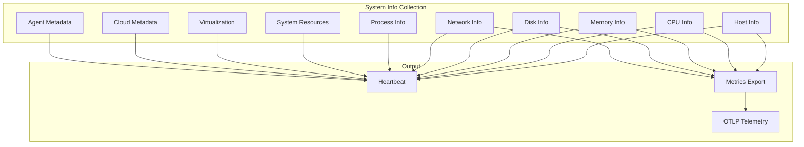
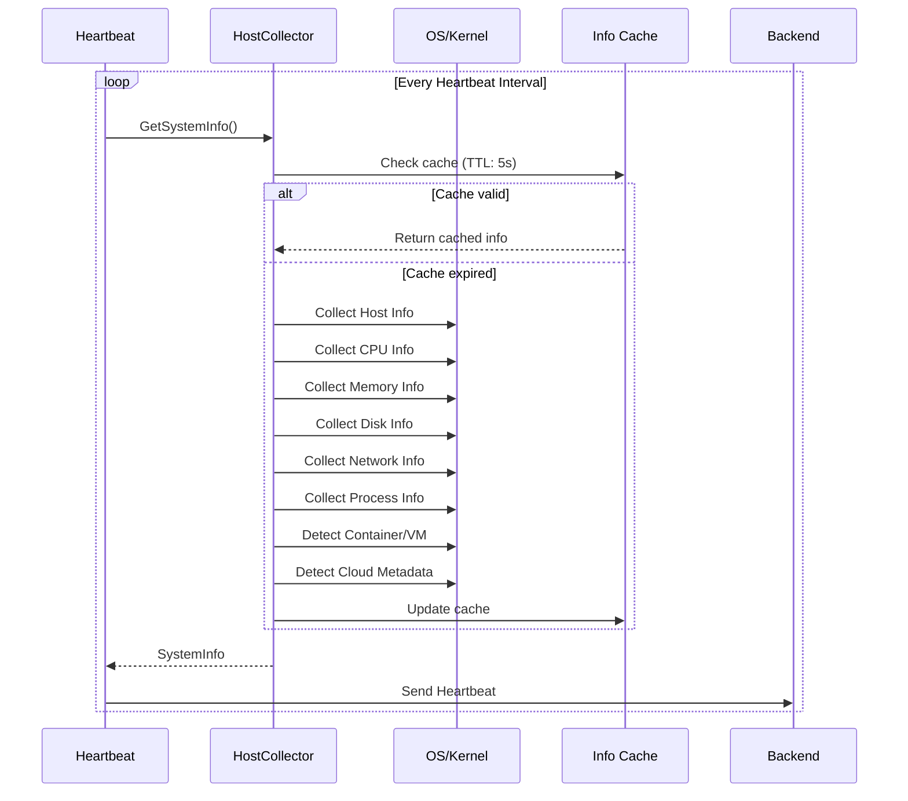

# TelemetryFlow Agent - System Information Capabilities

[](../CHANGELOG.md)

This document describes the comprehensive system information collected by the TelemetryFlow Agent during heartbeat and telemetry operations.

## Overview



## Collection Summary

| Category            | Metrics Count | Update Interval    | Platform    |
| ------------------- | ------------- | ------------------ | ----------- |
| Host Information    | 12            | Heartbeat          | All         |
| CPU Information     | 25+           | 15s (configurable) | All         |
| Memory Information  | 22+           | 15s (configurable) | All         |
| Disk Information    | 20+           | 15s (configurable) | All         |
| Network Information | 25+           | 15s (configurable) | All         |
| Process Information | 7             | 15s (configurable) | All         |
| System Resources    | 5             | Heartbeat          | Linux       |
| Virtualization      | 5             | Heartbeat          | Linux/macOS |
| Cloud Metadata      | 5             | Heartbeat          | All         |
| Agent Metadata      | 5             | Heartbeat          | All         |

**Total: 130+ system data points**

---

## Host Information

Basic host identification and system information.

| Field             | Type   | Description             | Example                        |
| ----------------- | ------ | ----------------------- | ------------------------------ |
| `hostname`        | string | System hostname         | `server-prod-01`               |
| `os`              | string | Operating system        | `linux`, `darwin`, `windows`   |
| `os_version`      | string | OS version              | `22.04`, `14.2.1`              |
| `platform`        | string | Platform name           | `ubuntu`, `darwin`, `windows`  |
| `platform_family` | string | Platform family         | `debian`, `rhel`, `standalone` |
| `kernel_version`  | string | Kernel version          | `6.5.0-15-generic`             |
| `architecture`    | string | CPU architecture        | `x86_64`, `arm64`              |
| `uptime`          | uint64 | System uptime (seconds) | `2592000`                      |
| `boot_time`       | uint64 | Boot timestamp (Unix)   | `1704067200`                   |
| `host_id`         | string | Unique host identifier  | `550e8400-e29b-41d4`           |
| `timezone`        | string | System timezone         | `Asia/Jakarta`, `UTC`          |

---

## CPU Information

Comprehensive CPU metrics including per-core data.

### CPU Static Info

| Field                | Type    | Description         | Example                        |
| -------------------- | ------- | ------------------- | ------------------------------ |
| `cpu_model`          | string  | CPU model name      | `Intel(R) Core(TM) i7-12700K`  |
| `cpu_vendor`         | string  | CPU vendor          | `GenuineIntel`, `AuthenticAMD` |
| `cpu_family`         | string  | CPU family          | `6`                            |
| `cpu_mhz`            | float64 | CPU frequency (MHz) | `3600.0`                       |
| `cpu_cache_size`     | int32   | L2 cache size (KB)  | `12288`                        |
| `cpu_cores`          | int     | Total logical cores | `20`                           |
| `cpu_physical_cores` | int     | Physical cores      | `12`                           |
| `cpu_logical_cores`  | int     | Logical cores       | `20`                           |

### CPU Usage Metrics

| Field                 | Type    | Unit | Description             |
| --------------------- | ------- | ---- | ----------------------- |
| `cpu_usage`           | float64 | %    | Total CPU usage         |
| `cpu_user_percent`    | float64 | %    | User space usage        |
| `cpu_system_percent`  | float64 | %    | Kernel space usage      |
| `cpu_idle_percent`    | float64 | %    | Idle time               |
| `cpu_iowait_percent`  | float64 | %    | I/O wait time           |
| `cpu_steal_percent`   | float64 | %    | Stolen by hypervisor    |
| `cpu_guest_percent`   | float64 | %    | Running guest VMs       |
| `cpu_irq_percent`     | float64 | %    | Hardware interrupts     |
| `cpu_softirq_percent` | float64 | %    | Software interrupts     |
| `cpu_nice_percent`    | float64 | %    | Nice priority processes |

### Load Averages (Unix-like systems)

| Field         | Type    | Description            |
| ------------- | ------- | ---------------------- |
| `load_avg_1`  | float64 | 1-minute load average  |
| `load_avg_5`  | float64 | 5-minute load average  |
| `load_avg_15` | float64 | 15-minute load average |

### Per-Core CPU Usage

```go
type CPUCoreInfo struct {
    CoreID int     // Core identifier (0, 1, 2, ...)
    Usage  float64 // Usage percentage per core
}
```

---

## Memory Information

### Virtual Memory

| Field                 | Type    | Unit  | Description             |
| --------------------- | ------- | ----- | ----------------------- |
| `memory_total`        | uint64  | bytes | Total physical memory   |
| `memory_used`         | uint64  | bytes | Used memory             |
| `memory_available`    | uint64  | bytes | Available memory        |
| `memory_free`         | uint64  | bytes | Free memory             |
| `memory_usage`        | float64 | %     | Memory usage percentage |
| `memory_cached`       | uint64  | bytes | Cached memory           |
| `memory_buffers`      | uint64  | bytes | Buffer memory           |
| `memory_active`       | uint64  | bytes | Active memory           |
| `memory_inactive`     | uint64  | bytes | Inactive memory         |
| `memory_wired`        | uint64  | bytes | Wired memory (macOS)    |
| `memory_shared`       | uint64  | bytes | Shared memory           |
| `memory_slab`         | uint64  | bytes | Slab memory (Linux)     |
| `memory_page_tables`  | uint64  | bytes | Page tables             |
| `memory_committed`    | uint64  | bytes | Committed memory        |
| `memory_commit_limit` | uint64  | bytes | Commit limit            |
| `memory_dirty`        | uint64  | bytes | Dirty pages             |
| `memory_writeback`    | uint64  | bytes | Writeback pages         |

### Swap Memory

| Field        | Type    | Unit  | Description              |
| ------------ | ------- | ----- | ------------------------ |
| `swap_total` | uint64  | bytes | Total swap space         |
| `swap_used`  | uint64  | bytes | Used swap                |
| `swap_free`  | uint64  | bytes | Free swap                |
| `swap_usage` | float64 | %     | Swap usage percentage    |
| `swap_in`    | uint64  | bytes | Swap in (pages read)     |
| `swap_out`   | uint64  | bytes | Swap out (pages written) |

---

## Disk Information

### Disk Usage

| Field               | Type    | Unit  | Description            |
| ------------------- | ------- | ----- | ---------------------- |
| `disk_total`        | uint64  | bytes | Total disk space       |
| `disk_used`         | uint64  | bytes | Used disk space        |
| `disk_available`    | uint64  | bytes | Available disk space   |
| `disk_usage`        | float64 | %     | Disk usage percentage  |
| `disk_inodes`       | uint64  | count | Total inodes           |
| `disk_inodes_free`  | uint64  | count | Free inodes            |
| `disk_inodes_used`  | uint64  | count | Used inodes            |
| `disk_inodes_usage` | float64 | %     | Inode usage percentage |

### Disk I/O Counters

| Field                 | Type    | Unit  | Description                |
| --------------------- | ------- | ----- | -------------------------- |
| `disk_read_bytes`     | uint64  | bytes | Total bytes read           |
| `disk_write_bytes`    | uint64  | bytes | Total bytes written        |
| `disk_read_ops`       | uint64  | count | Total read operations      |
| `disk_write_ops`      | uint64  | count | Total write operations     |
| `disk_read_time`      | uint64  | ms    | Time spent reading         |
| `disk_write_time`     | uint64  | ms    | Time spent writing         |
| `disk_io_time`        | uint64  | ms    | Total I/O time             |
| `disk_weighted_io`    | uint64  | ms    | Weighted I/O time          |
| `disk_io_in_progress` | uint64  | count | I/O operations in progress |
| `disk_latency_read`   | float64 | ms    | Average read latency       |
| `disk_latency_write`  | float64 | ms    | Average write latency      |

### Per-Partition Information

```go
type DiskPartitionInfo struct {
    Device      string  // Device name (/dev/sda1)
    Mountpoint  string  // Mount path (/)
    Fstype      string  // Filesystem type (ext4, xfs)
    Total       uint64  // Total space (bytes)
    Used        uint64  // Used space (bytes)
    Free        uint64  // Free space (bytes)
    Usage       float64 // Usage percentage
    Inodes      uint64  // Total inodes
    InodesFree  uint64  // Free inodes
    InodesUsage float64 // Inode usage percentage
}
```

---

## Network Information

### Network I/O Counters

| Field                  | Type   | Unit  | Description            |
| ---------------------- | ------ | ----- | ---------------------- |
| `network_bytes_sent`   | uint64 | bytes | Total bytes sent       |
| `network_bytes_recv`   | uint64 | bytes | Total bytes received   |
| `network_packets_sent` | uint64 | count | Total packets sent     |
| `network_packets_recv` | uint64 | count | Total packets received |
| `network_errors_in`    | uint64 | count | Incoming errors        |
| `network_errors_out`   | uint64 | count | Outgoing errors        |
| `network_drops_in`     | uint64 | count | Incoming drops         |
| `network_drops_out`    | uint64 | count | Outgoing drops         |
| `network_fifo_in`      | uint64 | count | FIFO buffer errors in  |
| `network_fifo_out`     | uint64 | count | FIFO buffer errors out |

### TCP Connection States

| Field                         | Type   | Description             |
| ----------------------------- | ------ | ----------------------- |
| `tcp_connections_established` | uint64 | ESTABLISHED connections |
| `tcp_connections_time_wait`   | uint64 | TIME_WAIT connections   |
| `tcp_connections_close_wait`  | uint64 | CLOSE_WAIT connections  |
| `tcp_connections_listen`      | uint64 | LISTEN sockets          |
| `tcp_connections_syn_sent`    | uint64 | SYN_SENT connections    |
| `tcp_connections_syn_recv`    | uint64 | SYN_RECV connections    |
| `tcp_connections_fin_wait1`   | uint64 | FIN_WAIT1 connections   |
| `tcp_connections_fin_wait2`   | uint64 | FIN_WAIT2 connections   |
| `tcp_connections_last_ack`    | uint64 | LAST_ACK connections    |
| `tcp_connections_closing`     | uint64 | CLOSING connections     |

### Per-Interface Information

```go
type NetworkInterfaceInfo struct {
    Name        string   // Interface name (eth0, en0)
    MacAddress  string   // Hardware address
    MTU         int      // Maximum transmission unit
    IsUp        bool     // Interface is up
    IsLoopback  bool     // Is loopback interface
    IPAddresses []string // IP addresses
    BytesSent   uint64   // Bytes sent
    BytesRecv   uint64   // Bytes received
    PacketsSent uint64   // Packets sent
    PacketsRecv uint64   // Packets received
    ErrorsIn    uint64   // Incoming errors
    ErrorsOut   uint64   // Outgoing errors
    DropsIn     uint64   // Incoming drops
    DropsOut    uint64   // Outgoing drops
}
```

---

## Process Information

| Field              | Type   | Description         |
| ------------------ | ------ | ------------------- |
| `process_count`    | uint64 | Total process count |
| `process_running`  | uint64 | Running processes   |
| `process_sleeping` | uint64 | Sleeping processes  |
| `process_stopped`  | uint64 | Stopped processes   |
| `process_zombie`   | uint64 | Zombie processes    |
| `process_blocked`  | uint64 | Blocked processes   |
| `thread_count`     | uint64 | Total thread count  |

---

## System Resources (Linux-specific)

| Field                    | Type    | Description               |
| ------------------------ | ------- | ------------------------- |
| `open_file_descriptors`  | uint64  | Open file descriptors     |
| `max_file_descriptors`   | uint64  | Maximum file descriptors  |
| `file_descriptors_usage` | float64 | FD usage percentage       |
| `entropy_available`      | uint64  | Available entropy bits    |
| `context_switches`       | uint64  | Total context switches    |
| `interrupts`             | uint64  | Total hardware interrupts |
| `soft_interrupts`        | uint64  | Total software interrupts |

---

## Virtualization Detection

### Container Detection

| Field               | Type   | Description                  |
| ------------------- | ------ | ---------------------------- |
| `is_container`      | bool   | Running in container         |
| `container_id`      | string | Container ID (if applicable) |
| `container_runtime` | string | Container runtime            |

**Detected Container Runtimes:**

- Docker
- containerd
- CRI-O
- Kubernetes (Pod)

**Detection Methods:**

1. `/.dockerenv` file existence
2. `/proc/1/cgroup` analysis
3. `KUBERNETES_SERVICE_HOST` environment variable

### Virtualization Detection

| Field                 | Type   | Description               |
| --------------------- | ------ | ------------------------- |
| `is_virtualized`      | bool   | Running in VM             |
| `virtualization_type` | string | Virtualization technology |

**Detected Hypervisors:**
| Type | Detection Source |
|------|------------------|
| VMware | DMI/SMBIOS |
| VirtualBox | DMI/SMBIOS |
| KVM/QEMU | DMI/SMBIOS |
| Xen | DMI/SMBIOS |
| Hyper-V | DMI/SMBIOS |
| AWS (Nitro) | Hypervisor UUID |
| GCP | DMI product name |

---

## Cloud Metadata Detection

| Field                 | Type   | Description                      |
| --------------------- | ------ | -------------------------------- |
| `cloud_provider`      | string | Cloud provider (aws, gcp, azure) |
| `cloud_instance_id`   | string | Instance ID                      |
| `cloud_instance_type` | string | Instance type (t3.micro)         |
| `cloud_region`        | string | Cloud region                     |
| `cloud_zone`          | string | Availability zone                |

**Detection Methods:**

| Provider | Detection Method                             |
| -------- | -------------------------------------------- |
| AWS      | `/sys/hypervisor/uuid`, `AWS_REGION` env     |
| GCP      | DMI product name, `GOOGLE_CLOUD_PROJECT` env |
| Azure    | DMI sys_vendor                               |

---

## Agent Metadata

| Field                 | Type   | Description                  |
| --------------------- | ------ | ---------------------------- |
| `agent_version`       | string | TFO-Agent version (1.1.2)    |
| `agent_start_time`    | uint64 | Agent start timestamp (Unix) |
| `agent_uptime`        | uint64 | Agent uptime (seconds)       |
| `collection_time`     | int64  | Collection timestamp         |
| `collection_duration` | int64  | Collection duration (ns)     |

---

## Collection Architecture



## Reliability Features

### Internal Caching

The agent implements internal caching for reliability:

```go
type systemInfoCache struct {
    info      *SystemInfo
    timestamp time.Time
    ttl       time.Duration // Default: 5 seconds
}
```

**Benefits:**

- Reduces system load during high-frequency collection
- Provides fallback data during transient failures
- Ensures heartbeat reliability

### Fallback Behavior

If collection fails:

1. Return cached data (if available and within stale TTL)
2. Return minimal info (hostname only)
3. Continue operation without blocking

---

## Configuration

```yaml
# System collector configuration
collectors:
  system:
    enabled: true
    interval: 15s # Collection interval
    cpu: true # Collect CPU metrics
    memory: true # Collect memory metrics
    disk: true # Collect disk metrics
    network: true # Collect network metrics
    disk_paths: [] # Specific disk paths (empty = all)

# Heartbeat includes full system info
heartbeat:
  interval: 60s
  include_system_info: true
```

---

## Metric Names (OTLP Export)

| Metric Name                      | Type    | Unit    |
| -------------------------------- | ------- | ------- |
| `system.cpu.usage`               | Gauge   | percent |
| `system.cpu.cores`               | Gauge   | count   |
| `system.memory.total`            | Gauge   | bytes   |
| `system.memory.used`             | Gauge   | bytes   |
| `system.memory.available`        | Gauge   | bytes   |
| `system.memory.usage`            | Gauge   | percent |
| `system.disk.total`              | Gauge   | bytes   |
| `system.disk.used`               | Gauge   | bytes   |
| `system.disk.free`               | Gauge   | bytes   |
| `system.disk.usage`              | Gauge   | percent |
| `system.network.bytes_sent`      | Counter | bytes   |
| `system.network.bytes_recv`      | Counter | bytes   |
| `system.network.packets_sent`    | Counter | count   |
| `system.network.packets_recv`    | Counter | count   |
| `system.network.errors_in`       | Counter | count   |
| `system.network.errors_out`      | Counter | count   |
| `system.network.bytes_sent_rate` | Gauge   | bytes/s |
| `system.network.bytes_recv_rate` | Gauge   | bytes/s |

---

## Cross-Platform Support

| Feature             | Linux | macOS | Windows |
| ------------------- | ----- | ----- | ------- |
| Host Info           | ✅    | ✅    | ✅      |
| CPU Metrics         | ✅    | ✅    | ✅      |
| Memory Metrics      | ✅    | ✅    | ✅      |
| Disk Metrics        | ✅    | ✅    | ✅      |
| Network Metrics     | ✅    | ✅    | ✅      |
| Process Metrics     | ✅    | ✅    | ✅      |
| Load Average        | ✅    | ✅    | ❌      |
| File Descriptors    | ✅    | ❌    | ❌      |
| Entropy             | ✅    | ❌    | ❌      |
| Context Switches    | ✅    | ❌    | ❌      |
| Container Detection | ✅    | ✅    | ⚠️      |
| VM Detection        | ✅    | ⚠️    | ⚠️      |
| Cloud Detection     | ✅    | ✅    | ✅      |

Legend: ✅ Full Support | ⚠️ Partial Support | ❌ Not Available

---

**Copyright (c) 2024-2026 DevOpsCorner Indonesia. All rights reserved.**
