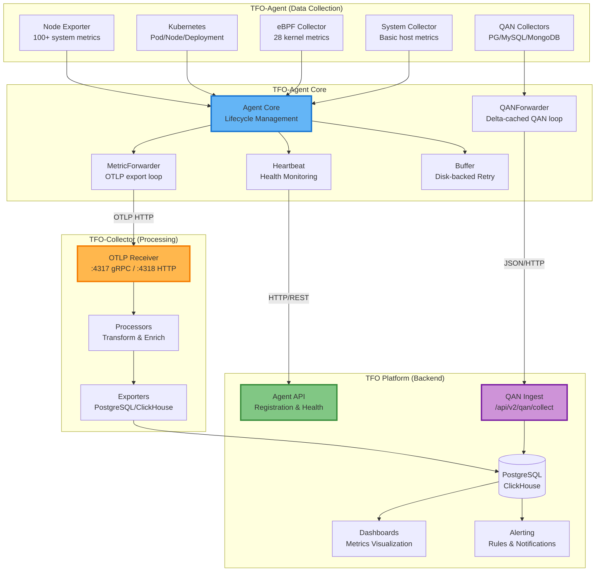
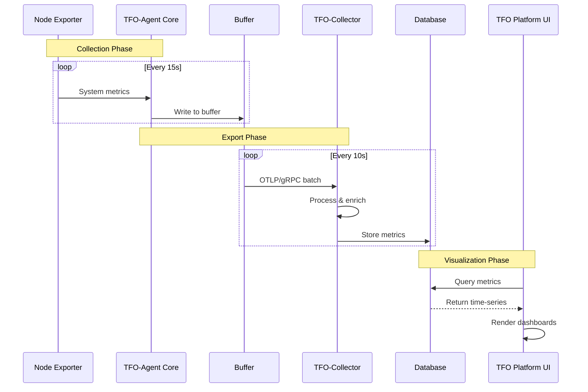
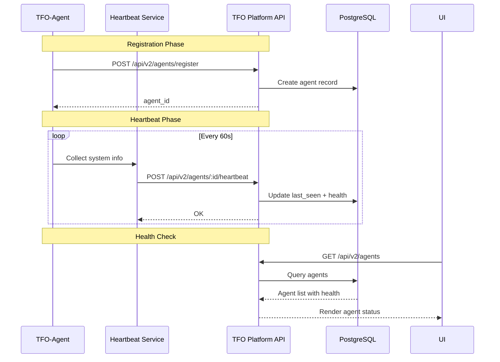

# TFO Platform Integration Guide

Complete guide for integrating TFO-Agent with the TelemetryFlow Platform.

## Architecture Overview



## Integration Components

### 1. TFO-Agent Collectors

| Collector                  | Metrics                                                                                  | Protocol  | Target           |
| -------------------------- | ---------------------------------------------------------------------------------------- | --------- | ---------------- |
| **Node Exporter**          | 100+ system metrics                                                                      | OTLP      | TFO-Collector    |
| **Kubernetes**             | Pod/Node/Service/Deployment                                                              | OTLP      | TFO-Collector    |
| **eBPF**                   | 28 kernel-level metrics                                                                  | OTLP      | TFO-Collector    |
| **System**                 | Basic host metrics                                                                       | OTLP      | TFO-Collector    |
| **Database Collectors**    | MySQL, PostgreSQL, MSSQL, MongoDB, ClickHouse, CockroachDB, TimescaleDB, SQLite3, Aurora | OTLP      | TFO-Collector    |
| **QAN (PG/MySQL/MongoDB)** | Per-query analytics buckets                                                              | JSON/HTTP | TFO Platform API |
| **Cache Collectors**       | Redis, Valkey, Memcached                                                                 | OTLP      | TFO-Collector    |
| **Queueing Collectors**    | RabbitMQ, Kafka, Confluent Kafka                                                         | OTLP      | TFO-Collector    |
| **Messaging Collectors**   | NATS, Google Cloud Pub/Sub                                                               | OTLP      | TFO-Collector    |
| **Heartbeat**              | Agent health & status                                                                    | HTTP/REST | TFO Platform API |

> **Cache / Queueing / Messaging**: Redis, Valkey, Memcached, RabbitMQ, Apache Kafka
> (JMX exporter scrape), Confluent Kafka (Metrics API), NATS (monitoring API), and
> Google Cloud Pub/Sub (Cloud Monitoring API) are collected over their native
> protocols/management APIs and forwarded through the standard OTLP pipeline — no
> external client libraries required. Metric namespaces: `db.{redis,valkey,memcache}.*`,
> `queue.{rabbitmq,kafka,confluent_kafka}.*`, `messaging.{nats,pubsub}.*`.

### 2. TFO-Collector Endpoints

| Endpoint      | Protocol | Description                     |
| ------------- | -------- | ------------------------------- |
| `:4317`       | gRPC     | OTLP gRPC receiver (v1 & v2)    |
| `:4318`       | HTTP     | OTLP HTTP receiver (v1 & v2)    |
| `/v1/traces`  | HTTP     | OTEL community traces endpoint  |
| `/v1/metrics` | HTTP     | OTEL community metrics endpoint |
| `/v1/logs`    | HTTP     | OTEL community logs endpoint    |
| `/v2/traces`  | HTTP     | TFO enhanced traces endpoint    |
| `/v2/metrics` | HTTP     | TFO enhanced metrics endpoint   |
| `/v2/logs`    | HTTP     | TFO enhanced logs endpoint      |

### 3. TFO Platform Backend API

| Endpoint                       | Method | Description                          |
| ------------------------------ | ------ | ------------------------------------ |
| `/api/v2/agents/register`      | POST   | Agent registration                   |
| `/api/v2/agents/:id/heartbeat` | POST   | Agent heartbeat                      |
| `/api/v2/agents/:id/status`    | GET    | Agent status                         |
| `/api/v2/agents/:id/config`    | GET    | Remote config                        |
| `/api/v2/qan/collect`          | POST   | QAN (Query Analytics) data ingestion |

## Configuration Examples

### Minimal Configuration (Development)

```yaml
telemetryflow:
  api_key_id: "tfk_dev_12345"
  api_key_secret: "tfs_dev_secret"
  endpoint: "localhost:4317"
  protocol: grpc
  tls:
    enabled: false

agent:
  name: "dev-agent"
  tags:
    environment: development

collectors:
  node_exporter:
    enabled: true
    interval: 15s

exporter:
  otlp:
    enabled: true
```

### Production Configuration (Full Stack)

```yaml
telemetryflow:
  api_key_id: "${TELEMETRYFLOW_API_KEY_ID}"
  api_key_secret: "${TELEMETRYFLOW_API_KEY_SECRET}"
  endpoint: "tfo-collector.telemetryflow.svc.cluster.local:4317"
  protocol: grpc
  tls:
    enabled: true
    skip_verify: false
  retry:
    enabled: true
    max_attempts: 3

agent:
  name: "${HOSTNAME}"
  tags:
    environment: production
    region: us-east-1
    cluster: main
    datacenter: dc1

heartbeat:
  enabled: true
  interval: 60s
  include_system_info: true

collectors:
  node_exporter:
    enabled: true
    interval: 15s
    cpu: true
    memory: true
    disk_io: true
    filesystem: true
    network: true
    load_avg: true

  kubernetes:
    enabled: true
    interval: 30s
    collect_pods: true
    collect_nodes: true
    collect_deployments: true
    exclude_namespaces:
      - kube-system

  ebpf:
    enabled: true
    interval: 15s
    collect_syscalls: true
    collect_network: true
    collect_file_io: true
    exclude_processes:
      - tfo-agent
      - systemd

exporter:
  otlp:
    enabled: true
    batch_size: 100
    compression: gzip

buffer:
  enabled: true
  max_size_mb: 500
```

### OTLP Endpoint Configuration

The agent supports per-signal OTLP endpoint overrides. When a full URL is provided (e.g. `http://tfo-collector:4318/v1/metrics`), the agent parses it into `host:port` + `/path` for the OTLP SDK:

```yaml
exporter:
  otlp:
    enabled: true
    # Simple host:port (uses /v1/metrics default path)
    endpoint: "tfo-collector:4318"

    # Per-signal full-URL overrides (optional)
    metrics_endpoint: "http://tfo-collector:4318/v1/metrics"
    traces_endpoint: "http://tfo-collector:4318/v1/traces"
    logs_endpoint: "http://tfo-collector:4318/v1/logs"
```

### QAN (Query Analytics) Configuration

QAN is a separate data path from OTLP metrics. It carries high-cardinality per-query analytics directly to the platform backend's `/api/v2/qan/collect` endpoint:

```yaml
qan:
  enabled: true
  interval: 60s
  # Must be reachable from the agent's network context.
  # In Docker, use the bridge gateway IP (172.151.0.1) to reach host services.
  # In Kubernetes, use the backend service DNS name.
  endpoint: "http://172.151.0.1:3000" # Docker
  # endpoint: "http://telemetryflow-platform:3000" # Kubernetes
  api_key_id: "${TELEMETRYFLOW_API_KEY_ID}"
  api_key_secret: "${TELEMETRYFLOW_API_KEY_SECRET}"
  batch_size: 100
  flush_interval: 10s
  timeout: 30s
  max_retry_attempts: 3
  top_queries_limit: 200

# QAN collectors auto-reuse existing DB instance configs:
collectors:
  postgresql:
    enabled: true
    instances:
      - name: "prod-pg"
        host: "db.internal"
        port: 5432
        user: "monitor"
        password: "secret"
        dbname: "app"
```

### Kubernetes DaemonSet Configuration

```yaml
apiVersion: v1
kind: ConfigMap
metadata:
  name: tfo-agent-config
  namespace: telemetryflow
data:
  tfo-agent.yaml: |
    telemetryflow:
      api_key_id: "${TELEMETRYFLOW_API_KEY_ID}"
      api_key_secret: "${TELEMETRYFLOW_API_KEY_SECRET}"
      endpoint: "tfo-collector.telemetryflow.svc.cluster.local:4317"
      protocol: grpc

    agent:
      name: "${HOSTNAME}"
      tags:
        environment: production
        cluster: "${CLUSTER_NAME}"

    collectors:
      node_exporter:
        enabled: true
        interval: 15s

      kubernetes:
        enabled: true
        interval: 30s
        kubeconfig_path: ""  # Use in-cluster config

    exporter:
      otlp:
        enabled: true

---
apiVersion: apps/v1
kind: DaemonSet
metadata:
  name: tfo-agent
  namespace: telemetryflow
spec:
  selector:
    matchLabels:
      app: tfo-agent
  template:
    metadata:
      labels:
        app: tfo-agent
    spec:
      serviceAccountName: tfo-agent
      hostNetwork: true
      hostPID: true
      containers:
        - name: tfo-agent
          image: telemetryflow/telemetryflow-agent:1.3.2
          securityContext:
            privileged: true # Required for eBPF
          env:
            - name: HOSTNAME
              valueFrom:
                fieldRef:
                  fieldPath: spec.nodeName
            - name: TELEMETRYFLOW_API_KEY_ID
              valueFrom:
                secretKeyRef:
                  name: tfo-credentials
                  key: api-key-id
            - name: TELEMETRYFLOW_API_KEY_SECRET
              valueFrom:
                secretKeyRef:
                  name: tfo-credentials
                  key: api-key-secret
            - name: CLUSTER_NAME
              value: "main"
          volumeMounts:
            - name: config
              mountPath: /etc/tfo-agent
            - name: buffer
              mountPath: /var/lib/tfo-agent
            - name: bpf
              mountPath: /sys/fs/bpf
            - name: btf
              mountPath: /sys/kernel/btf
              readOnly: true
          resources:
            requests:
              cpu: 100m
              memory: 128Mi
            limits:
              cpu: 500m
              memory: 512Mi
      volumes:
        - name: config
          configMap:
            name: tfo-agent-config
        - name: buffer
          hostPath:
            path: /var/lib/tfo-agent
        - name: bpf
          hostPath:
            path: /sys/fs/bpf
        - name: btf
          hostPath:
            path: /sys/kernel/btf
```

## Data Flow

### Metrics Collection Flow



### Heartbeat Flow



## Metrics Catalog

### Node Exporter Metrics (100+)

| Category   | Example Metrics                                                  | Count |
| ---------- | ---------------------------------------------------------------- | ----- |
| CPU        | `node.cpu.usage`, `node.cpu.frequency`, `node.cpu.thermal`       | 15    |
| Memory     | `node.memory.total`, `node.memory.available`, `node.memory.swap` | 20    |
| Disk       | `node.disk.io.read_bytes`, `node.disk.io.write_bytes`            | 12    |
| Filesystem | `node.filesystem.usage`, `node.filesystem.free`                  | 8     |
| Network    | `node.network.bytes_sent`, `node.network.bytes_recv`             | 18    |
| Load       | `node.load.1m`, `node.load.5m`, `node.load.15m`                  | 3     |
| Others     | Thermal, PSI, VMStat, Sockstat, Entropy, File descriptors        | 24    |

### Kubernetes Metrics (50+)

| Category    | Example Metrics                                                        | Count |
| ----------- | ---------------------------------------------------------------------- | ----- |
| Pods        | `k8s.pod.phase`, `k8s.pod.containers.ready`                            | 12    |
| Nodes       | `k8s.node.capacity.cpu`, `k8s.node.allocatable.memory`                 | 10    |
| Deployments | `k8s.deployment.replicas.desired`, `k8s.deployment.replicas.available` | 8     |
| Services    | `k8s.service.spec.type`, `k8s.service.endpoints`                       | 5     |
| Events      | `k8s.event.reason`, `k8s.event.type`                                   | 5     |
| Namespaces  | `k8s.namespace.phase`, `k8s.namespace.resource_quotas`                 | 10    |

### eBPF Metrics (28)

| Category  | Example Metrics                                                         | Count |
| --------- | ----------------------------------------------------------------------- | ----- |
| Syscalls  | `ebpf.syscall.count`, `ebpf.syscall.latency_ns`, `ebpf.syscall.errors`  | 3     |
| Network   | `ebpf.tcp.connections`, `ebpf.tcp.bytes_sent`, `ebpf.udp.packets_sent`  | 7     |
| File I/O  | `ebpf.fileio.operations`, `ebpf.fileio.bytes`, `ebpf.fileio.latency_ns` | 3     |
| Scheduler | `ebpf.sched.context_switches`, `ebpf.sched.runq_latency_ns`             | 4     |
| Memory    | `ebpf.memory.page_faults`, `ebpf.memory.major_faults`                   | 3     |
| TCP State | `ebpf.tcp.state_transitions`                                            | 1     |
| Hubble    | `hubble.flows`, `hubble.drops`, `hubble.http_requests`                  | 6     |

## Troubleshooting

### Connection Issues

```bash
# Test TFO-Collector connectivity
curl -v http://tfo-collector:4318/v1/metrics

# Check agent logs
docker logs tfo-agent
kubectl logs -n telemetryflow -l app=tfo-agent

# Verify DNS resolution
nslookup tfo-collector.telemetryflow.svc.cluster.local
```

### Metrics Not Appearing

```bash
# Check buffer status
ls -lh /var/lib/tfo-agent/buffer/

# Verify collector is running
kubectl get pods -n telemetryflow -l app=tfo-collector

# Check agent metrics endpoint (if Prometheus exporter enabled)
curl http://localhost:8888/metrics
```

### Kubernetes RBAC Issues

```bash
# Verify ServiceAccount exists
kubectl get serviceaccount tfo-agent -n telemetryflow

# Check ClusterRoleBinding
kubectl get clusterrolebinding tfo-agent

# Test API access
kubectl auth can-i get pods --as=system:serviceaccount:telemetryflow:tfo-agent
```

### eBPF Issues

```bash
# Verify BPF filesystem mounted
mount | grep bpf

# Check capabilities
getcap /usr/local/bin/tfo-agent

# Verify BTF available
ls -la /sys/kernel/btf/vmlinux

# Check loaded BPF programs
bpftool prog list | grep tfo
```

## Performance Tuning

### High-Volume Environments (> 1000 metrics/s)

```yaml
collectors:
  node_exporter:
    interval: 30s # Reduce frequency

  kubernetes:
    interval: 60s
    exclude_namespaces:
      - kube-system
      - kube-public

exporter:
  otlp:
    batch_size: 500 # Larger batches
    flush_interval: 30s

buffer:
  max_size_mb: 1000 # Larger buffer
```

### Low-Resource Environments (< 512MB RAM)

```yaml
collectors:
  node_exporter:
    enabled: true
    cpu: true
    memory: true
    disk_io: false
    thermal: false

  kubernetes:
    enabled: false

  ebpf:
    enabled: false

buffer:
  max_size_mb: 50
```

## Security Best Practices

1. **API Keys**: Store in Kubernetes Secrets, never in ConfigMaps
2. **TLS**: Always enable TLS in production
3. **RBAC**: Use least-privilege ServiceAccount for Kubernetes
4. **eBPF**: Use `CAP_BPF` + `CAP_PERFMON` instead of privileged mode when possible
5. **Network Policies**: Restrict TFO-Agent to only talk to TFO-Collector

## Support

- **Documentation**: [https://docs.telemetryflow.id](https://docs.telemetryflow.id)
- **Issues**: [GitHub Issues](https://github.com/telemetryflow/telemetryflow-platform/issues)
- **Email**: [support@telemetryflow.id](mailto:support@telemetryflow.id)
