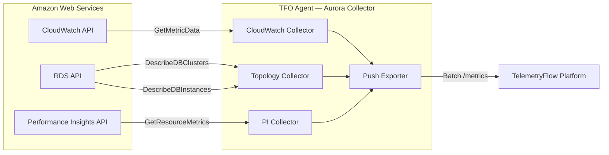
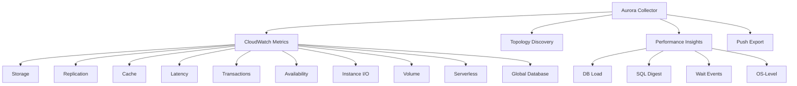

# Amazon Aurora Collector

Monitors Amazon Aurora database clusters via the AWS SDK. Collects CloudWatch metrics, cluster topology via RDS API, and optional Performance Insights data for query-level analysis.

## Data Source

- **CloudWatch GetMetricData** — batch metric retrieval with configurable batch size (default 500)
- **RDS DescribeDBClusters / DescribeDBInstances** — cluster topology discovery (writer/reader roles, engine version, PI status)
- **Performance Insights GetResourceMetrics** — query-level latency and load data (when PI is enabled)

## Architecture



## Sub-collector Hierarchy



## Sub-collectors

| Sub-collector        | Config flag                 | Description                                  |
| -------------------- | --------------------------- | -------------------------------------------- |
| CloudWatch Metrics   | `collection_interval: 60s`  | 60+ metrics from `AWS/RDS` namespace         |
| Topology Discovery   | `topology_int  erval: 300s` | Auto-discovers instances, roles, PI status   |
| Performance Insights | `enable_pi: true`           | db.load, SQL digest, wait events, OS metrics |
| Push Export          | `push_endpoint: "..."`      | Batches metrics to TFO Platform ingest API   |

---

## CloudWatch Metrics

All metrics use namespace `AWS/RDS` with dimension `DBInstanceIdentifier`. Metric names are prefixed with `aurora.` in the agent output.

### Storage

| Metric                                    | Type  | Unit      | Description                          |
| ----------------------------------------- | ----- | --------- | ------------------------------------ |
| `aurora.FreeStorageSpace`                 | Gauge | bytes     | Available storage space              |
| `aurora.FreeLocalStorage`                 | Gauge | bytes     | Local storage for temporary tables   |
| `aurora.StorageNetworkReceiveThroughput`  | Gauge | bytes/sec | Storage network receive throughput   |
| `aurora.StorageNetworkTransmitThroughput` | Gauge | bytes/sec | Storage network transmit throughput  |
| `aurora.StorageThroughputPercentage`      | Gauge | percent   | Provisioned storage throughput usage |
| `aurora.StorageIOPSPercentage`            | Gauge | percent   | Provisioned IOPS usage               |

### Replication

| Metric                               | Type  | Unit  | Description                              |
| ------------------------------------ | ----- | ----- | ---------------------------------------- |
| `aurora.AuroraReplicaLag`            | Gauge | ms    | Primary-to-replica lag                   |
| `aurora.AuroraReplicaLagMaximum`     | Gauge | ms    | Maximum replica lag across all replicas  |
| `aurora.AuroraReplicaLagMinimum`     | Gauge | ms    | Minimum replica lag across all replicas  |
| `aurora.OldestReplicationSlotLag`    | Gauge | MB    | Oldest replication slot lag (PostgreSQL) |
| `aurora.ReplicationSlotDiskUsage`    | Gauge | MB    | Disk used by replication slots           |
| `aurora.BinaryLogReplicationSlotLag` | Gauge | count | Binlog replica lag (MySQL)               |
| `aurora.BinLogDiskUsage`             | Gauge | bytes | Disk used by binary logs (MySQL)         |

### Cache

| Metric                                  | Type  | Unit    | Description                        |
| --------------------------------------- | ----- | ------- | ---------------------------------- |
| `aurora.BufferCacheHitRatio`            | Gauge | percent | Buffer cache hit ratio             |
| `aurora.ResultSetCacheHitRatio`         | Gauge | percent | Result set cache hit ratio (MySQL) |
| `aurora.AuroraMemoryEngineHitRatio`     | Gauge | percent | Memory engine hit ratio            |
| `aurora.AuroraMemoryEngineRequestCount` | Gauge | count   | Memory engine request count        |

### Latency

| Metric                              | Type  | Unit      | Description                     |
| ----------------------------------- | ----- | --------- | ------------------------------- |
| `aurora.ReadLatency`                | Gauge | seconds   | Average read latency            |
| `aurora.WriteLatency`               | Gauge | seconds   | Average write latency           |
| `aurora.CommitLatency`              | Gauge | seconds   | Average commit latency          |
| `aurora.AuroraSlowQueryCountPerSec` | Gauge | count/sec | Slow queries per second (MySQL) |
| `aurora.AuroraSlowQueryLatencyP99`  | Gauge | ms        | P99 slow query latency          |
| `aurora.NetworkTransmitThroughput`  | Gauge | bytes/sec | Network transmit throughput     |
| `aurora.NetworkReceiveThroughput`   | Gauge | bytes/sec | Network receive throughput      |

### Transactions

| Metric                       | Type  | Unit      | Description                    |
| ---------------------------- | ----- | --------- | ------------------------------ |
| `aurora.ActiveTransactions`  | Gauge | count     | Currently active transactions  |
| `aurora.BlockedTransactions` | Gauge | count     | Currently blocked transactions |
| `aurora.TransactionsPerSec`  | Gauge | count/sec | Transactions per second        |
| `aurora.CommitThroughput`    | Gauge | count/sec | Commits per second             |
| `aurora.SelectThroughput`    | Gauge | count/sec | SELECT queries per second      |
| `aurora.InsertThroughput`    | Gauge | count/sec | INSERT queries per second      |
| `aurora.UpdateThroughput`    | Gauge | count/sec | UPDATE queries per second      |
| `aurora.DeleteThroughput`    | Gauge | count/sec | DELETE queries per second      |
| `aurora.DDLThroughput`       | Gauge | count/sec | DDL operations per second      |
| `aurora.DMLThroughput`       | Gauge | count/sec | DML operations per second      |

### Availability

| Metric                             | Type  | Unit    | Description                  |
| ---------------------------------- | ----- | ------- | ---------------------------- |
| `aurora.DatabaseConnections`       | Gauge | count   | Current database connections |
| `aurora.CPUUtilization`            | Gauge | percent | CPU utilization              |
| `aurora.FreeableMemory`            | Gauge | bytes   | Freeable memory              |
| `aurora.SwapUsage`                 | Gauge | bytes   | Swap space used              |
| `aurora.EngineUptime`              | Gauge | seconds | Database engine uptime       |
| `aurora.LoginFailures`             | Gauge | count   | Failed login attempts        |
| `aurora.Deadlocks`                 | Gauge | count   | Deadlocks per second         |
| `aurora.ClusterMemoryLimitReached` | Gauge | count   | Cluster memory limit flag    |
| `aurora.ClusterReplicaLagExceeded` | Gauge | count   | Replica lag threshold flag   |

### Instance I/O

| Metric                   | Type  | Unit      | Description                       |
| ------------------------ | ----- | --------- | --------------------------------- |
| `aurora.DiskQueueDepth`  | Gauge | count     | IO requests waiting in disk queue |
| `aurora.ReadIOPS`        | Gauge | count/sec | Read IOPS                         |
| `aurora.WriteIOPS`       | Gauge | count/sec | Write IOPS                        |
| `aurora.ReadThroughput`  | Gauge | bytes/sec | Read throughput                   |
| `aurora.WriteThroughput` | Gauge | bytes/sec | Write throughput                  |

### Volume

| Metric                   | Type  | Unit      | Description               |
| ------------------------ | ----- | --------- | ------------------------- |
| `aurora.VolumeBytesUsed` | Gauge | bytes     | Total storage volume used |
| `aurora.VolumeReadIOPs`  | Gauge | count/sec | Volume read IOPS          |
| `aurora.VolumeWriteIOPs` | Gauge | count/sec | Volume write IOPS         |

### Serverless

| Metric                              | Type  | Unit    | Description                      |
| ----------------------------------- | ----- | ------- | -------------------------------- |
| `aurora.ServerlessDatabaseCapacity` | Gauge | ACU     | Aurora Serverless capacity units |
| `aurora.Capacity`                   | Gauge | count   | Current Serverless v2 capacity   |
| `aurora.ACUUtilization`             | Gauge | percent | ACU utilization percentage       |

### Global Database

| Metric                                    | Type  | Unit    | Description                       |
| ----------------------------------------- | ----- | ------- | --------------------------------- |
| `aurora.AuroraGlobalDBReplicationLag`     | Gauge | ms      | Cross-region replication lag      |
| `aurora.AuroraGlobalDBDataTransferBytes`  | Gauge | bytes   | Bytes transferred between regions |
| `aurora.AuroraGlobalDBReplicatedWriteIOs` | Gauge | count   | Write IOs replicated              |
| `aurora.AuroraGlobalDBLag`                | Gauge | seconds | Primary-to-secondary global lag   |

---

## Performance Insights Metrics

When `enable_pi: true`, additional query-level metrics are collected from the Performance Insights API. Metric names are prefixed with `aurora.pi.`.

### DB Load

| Metric                     | Type  | Unit  | Description                             |
| -------------------------- | ----- | ----- | --------------------------------------- |
| `aurora.pi.db_load_avg`    | Gauge | count | Average database load (active sessions) |
| `aurora.pi.db_load_sample` | Gauge | count | Sampled database load                   |

### SQL Digest

| Metric                            | Type  | Unit  | Description                    |
| --------------------------------- | ----- | ----- | ------------------------------ |
| `aurora.pi.db_sql_avg_latency`    | Gauge | ms    | Average latency per SQL digest |
| `aurora.pi.db_sql_executions`     | Gauge | count | SQL executions                 |
| `aurora.pi.db_sql_rows_affected`  | Gauge | count | Rows affected                  |
| `aurora.pi.db_sql_rows_processed` | Gauge | count | Rows processed                 |
| `aurora.pi.db_sql_rows_returned`  | Gauge | count | Rows returned                  |

### Wait Events

| Metric                                | Type  | Unit  | Description                |
| ------------------------------------- | ----- | ----- | -------------------------- |
| `aurora.pi.db_wait_event_avg_latency` | Gauge | ms    | Average wait event latency |
| `aurora.pi.db_wait_event_count`       | Gauge | count | Wait event count           |

### OS-Level

| Metric                        | Type  | Unit    | Description              |
| ----------------------------- | ----- | ------- | ------------------------ |
| `aurora.pi.os_cpuUtilization` | Gauge | percent | OS-level CPU utilization |
| `aurora.pi.os_freeMemory`     | Gauge | bytes   | OS-level free memory     |
| `aurora.pi.os_totalMemory`    | Gauge | bytes   | OS-level total memory    |

---

## Common Labels

All metrics carry these labels:

| Label                   | Description                                   |
| ----------------------- | --------------------------------------------- |
| `aurora_cluster`        | Cluster identifier from config                |
| `aurora_region`         | AWS region                                    |
| `aurora_instance_id`    | DB instance identifier                        |
| `aurora_instance_class` | Instance class (e.g. `db.r6g.large`)          |
| `aurora_engine`         | Engine name (aurora-mysql, aurora-postgresql) |
| `aurora_role`           | `writer` or `reader`                          |
| `aurora_az`             | Availability zone (when available)            |

---

## Configuration

```yaml
aurora:
  enabled: true
  clusters:
    - cluster_id: "my-aurora-cluster"
      region: "us-east-1"
      access_key_id: ""
      secret_access_key: ""
      session_token: ""
      role_arn: ""
      tags: {}
  collection_interval: 60s
  topology_interval: 300s
  pi_interval: 60s
  enable_pi: false
  cloudwatch_batch_size: 500
  cloudwatch_rate_limit: 40
  push_batch_size: 1000
  push_flush_interval: 10s
  push_endpoint: ""
  push_api_key_id: ""
  push_api_key_secret: ""
```

## Notes

- AWS clients are initialized lazily on the first collection cycle.
- CloudWatch API calls include exponential backoff on throttling (up to 10s).
- Topology changes (instance add/remove, failover) are detected automatically.
- When `push_endpoint` is empty, metrics are available through the standard OTLP export pipeline.
