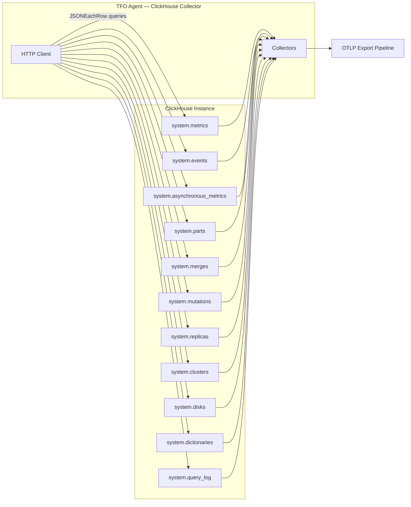
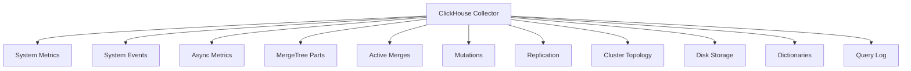

# ClickHouse Collector

Monitors ClickHouse instances via the HTTP interface (port 8123). Collects system metrics, events, MergeTree parts/merges/mutations, replication, storage, dictionaries, and query log analytics.

## Data Source

HTTP API on port 8123 using `JSONEachRow` query format. Queries `system.*` tables for all metrics.

## Architecture



## Sub-collector Hierarchy



## Sub-collectors

| Sub-collector    | Description                                         |
| ---------------- | --------------------------------------------------- |
| System Metrics   | Dynamic gauges from `system.metrics`                |
| System Events    | Delta counters from `system.events`                 |
| Async Metrics    | Dynamic gauges from `system.asynchronous_metrics`   |
| MergeTree Parts  | Part counts, sizes, compression from `system.parts` |
| Active Merges    | In-progress merge progress from `system.merges`     |
| Mutations        | Mutation status from `system.mutations`             |
| Replication      | Replica health from `system.replicas`               |
| Cluster Topology | Shard/replica info from `system.clusters`           |
| Disk Storage     | Space usage from `system.disks`                     |
| Dictionaries     | Cache health from `system.dictionaries`             |
| Query Log        | Aggregated query stats from `system.query_log`      |

---

## System Metrics

Dynamically discovered from `system.metrics`. Each row becomes a gauge with prefix `db.clickhouse.system.<metric_name>`. Common metrics include:

| Metric                                   | Description                 |
| ---------------------------------------- | --------------------------- |
| `db.clickhouse.system.query`             | Queries currently executing |
| `db.clickhouse.system.merge`             | Active merges               |
| `db.clickhouse.system.part`              | Active parts                |
| `db.clickhouse.system.replication.queue` | Replication queue entries   |

## System Events

Dynamically discovered from `system.events`. Emitted as delta counters (per-second rates) with prefix `db.clickhouse.events.<event_name>`. Counter resets are handled.

## Async Metrics

Dynamically discovered from `system.asynchronous_metrics`. Emitted as gauges with prefix `db.clickhouse.async.<metric_name>`.

---

## MergeTree Parts

Labels: `db`, `table`

| Metric                                       | Type  | Description             |
| -------------------------------------------- | ----- | ----------------------- |
| `db.clickhouse.mergetree.parts_count`        | Gauge | Number of active parts  |
| `db.clickhouse.mergetree.rows`               | Gauge | Total rows across parts |
| `db.clickhouse.mergetree.bytes_on_disk`      | Gauge | Bytes on disk           |
| `db.clickhouse.mergetree.compressed_bytes`   | Gauge | Compressed bytes        |
| `db.clickhouse.mergetree.uncompressed_bytes` | Gauge | Uncompressed bytes      |

---

## Active Merges

Labels: `db`, `table`

| Metric                                | Type  | Description                   |
| ------------------------------------- | ----- | ----------------------------- |
| `db.clickhouse.merge.elapsed_seconds` | Gauge | Elapsed time of current merge |
| `db.clickhouse.merge.progress`        | Gauge | Merge progress (0-1)          |
| `db.clickhouse.merge.num_parts`       | Gauge | Number of parts being merged  |
| `db.clickhouse.merge.rows_read`       | Gauge | Rows read so far              |
| `db.clickhouse.merge.rows_written`    | Gauge | Rows written so far           |
| `db.clickhouse.merge.memory_usage`    | Gauge | Memory used by merge          |

---

## Replication

Labels: `db`, `table`

| Metric                                  | Type  | Description                |
| --------------------------------------- | ----- | -------------------------- |
| `db.clickhouse.replica.is_leader`       | Gauge | Leader status (0/1)        |
| `db.clickhouse.replica.is_readonly`     | Gauge | Read-only status           |
| `db.clickhouse.replica.queue_size`      | Gauge | Replication queue size     |
| `db.clickhouse.replica.total_replicas`  | Gauge | Total replicas             |
| `db.clickhouse.replica.active_replicas` | Gauge | Active replicas            |
| `db.clickhouse.replica.absolute_delay`  | Gauge | Absolute replication delay |

---

## Disk Storage

Labels: `disk`, `disk_type`

| Metric                                | Type  | Description               |
| ------------------------------------- | ----- | ------------------------- |
| `db.clickhouse.disk.free_space`       | Gauge | Free space (bytes)        |
| `db.clickhouse.disk.total_space`      | Gauge | Total space (bytes)       |
| `db.clickhouse.disk.unreserved_space` | Gauge | Unreserved space (bytes)  |
| `db.clickhouse.disk.used_percent`     | Gauge | Used percentage (derived) |

---

## Dictionaries

Labels: `db`, `dict`, `status`

| Metric                                     | Type  | Description              |
| ------------------------------------------ | ----- | ------------------------ |
| `db.clickhouse.dictionary.status`          | Gauge | Status code (0-5)        |
| `db.clickhouse.dictionary.bytes_allocated` | Gauge | Memory allocated (bytes) |
| `db.clickhouse.dictionary.element_count`   | Gauge | Elements loaded          |
| `db.clickhouse.dictionary.load_factor`     | Gauge | Load factor              |

---

## Query Log

Labels: `query_kind`

| Metric                                     | Type    | Description           |
| ------------------------------------------ | ------- | --------------------- |
| `db.clickhouse.query_log.count`            | Counter | Query count           |
| `db.clickhouse.query_log.duration_ms_avg`  | Gauge   | Average duration (ms) |
| `db.clickhouse.query_log.duration_ms_max`  | Gauge   | Max duration (ms)     |
| `db.clickhouse.query_log.read_rows_total`  | Counter | Total rows read       |
| `db.clickhouse.query_log.read_bytes_total` | Counter | Total bytes read      |
| `db.clickhouse.query_log.errors`           | Counter | Error count           |

---

## Configuration

```yaml
clickhouse:
  enabled: true
  collection_interval: 15s
  query_log_interval: 60s
  max_query_log_rows: 10000
  instances:
    - name: "ch-prod-01"
      host: "localhost"
      http_port: 8123
      username: "default"
      password: ""
      database: "default"
      tls:
        enabled: false
        ca_cert: ""
        cert: ""
        key: ""
        skip_verify: false
      connect_timeout: 10s
      query_timeout: 30s
```

## Notes

- All system metrics are dynamically discovered — new ClickHouse versions automatically add new metrics.
- Event counters track deltas with reset detection.
- Query log uses watermarking for incremental processing.
- Exponential backoff reconnection (1s to 60s cap).
