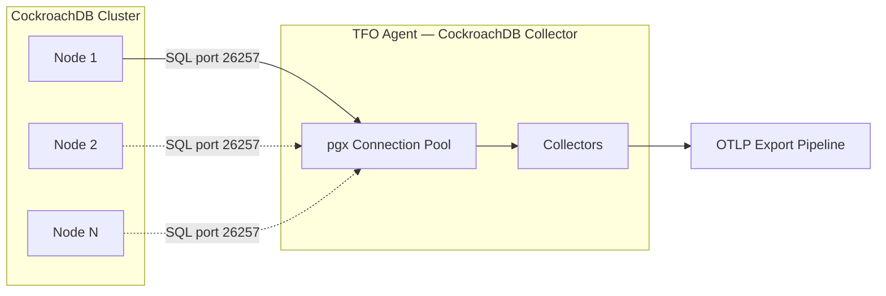
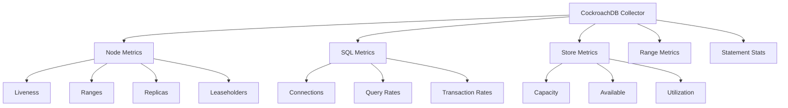

# CockroachDB Collector

Monitors CockroachDB nodes using the PostgreSQL wire protocol (pgx). Queries `crdb_internal.*` virtual tables for node metrics, SQL statistics, store capacity, range health, and statement analytics.

## Data Source

Direct database connection via pgx driver on the CockroachDB SQL port (26257). Queries `crdb_internal.node_status`, `crdb_internal.kv_store_status`, `crdb_internal.node_statement_statistics`, and built-in functions.

## Architecture



## Sub-collector Hierarchy



## Sub-collectors

| Sub-collector   | Interval                 | Description                                  |
| --------------- | ------------------------ | -------------------------------------------- |
| Node Metrics    | `instance_interval: 15s` | Liveness, ranges, replicas, leaseholders     |
| SQL Metrics     | `instance_interval: 15s` | Connections, queries, transaction rates      |
| Store Metrics   | `instance_interval: 15s` | Per-store capacity and utilization           |
| Range Metrics   | `range_interval: 30s`    | Total/under-replicated/unavailable ranges    |
| Statement Stats | `query_interval: 60s`    | Top statements by latency and resource usage |

---

## Node Metrics

| Metric                             | Type  | Description          |
| ---------------------------------- | ----- | -------------------- |
| `db.cockroachdb.node.is_live`      | Gauge | Node liveness (0/1)  |
| `db.cockroachdb.node.total_ranges` | Gauge | Total ranges on node |
| `db.cockroachdb.node.leaseholders` | Gauge | Leaseholder count    |
| `db.cockroachdb.node.replicas`     | Gauge | Replica count        |
| `db.cockroachdb.node.live_bytes`   | Gauge | Live data bytes      |

---

## SQL Metrics

| Metric                                  | Type    | Description           |
| --------------------------------------- | ------- | --------------------- |
| `db.cockroachdb.sql.connections`        | Gauge   | Total connections     |
| `db.cockroachdb.sql.connections.idle`   | Gauge   | Idle connections      |
| `db.cockroachdb.sql.connections.active` | Gauge   | Active connections    |
| `db.cockroachdb.sql.queries.total`      | Counter | Total queries         |
| `db.cockroachdb.sql.txn.commits`        | Counter | Transaction commits   |
| `db.cockroachdb.sql.txn.rollbacks`      | Counter | Transaction rollbacks |
| `db.cockroachdb.sql.txn.restarts`       | Counter | Transaction restarts  |
| `db.cockroachdb.sql.queries.rate`       | Rate    | Queries per second    |
| `db.cockroachdb.sql.txn.commit_rate`    | Rate    | Commits per second    |

---

## Store Metrics

Labels: `store_id`

| Metric                                    | Type  | Description                  |
| ----------------------------------------- | ----- | ---------------------------- |
| `db.cockroachdb.store.capacity`           | Gauge | Total store capacity (bytes) |
| `db.cockroachdb.store.available`          | Gauge | Available space (bytes)      |
| `db.cockroachdb.store.used`               | Gauge | Used space (bytes)           |
| `db.cockroachdb.store.utilization_pct`    | Gauge | Utilization %                |
| `db.cockroachdb.store.lease_count`        | Gauge | Lease count                  |
| `db.cockroachdb.store.range_count`        | Gauge | Range count                  |
| `db.cockroachdb.store.read_amplification` | Gauge | Read amplification factor    |

---

## Range Metrics

| Metric                                   | Type  | Description             |
| ---------------------------------------- | ----- | ----------------------- |
| `db.cockroachdb.ranges.total`            | Gauge | Total ranges            |
| `db.cockroachdb.ranges.total_replicas`   | Gauge | Total replicas          |
| `db.cockroachdb.ranges.under_replicated` | Gauge | Under-replicated ranges |
| `db.cockroachdb.ranges.unavailable`      | Gauge | Unavailable ranges      |

---

## Statement Statistics

Labels: `fingerprint_id`, `app_name`

| Metric                                    | Type    | Description                   |
| ----------------------------------------- | ------- | ----------------------------- |
| `db.cockroachdb.statement.count`          | Counter | Execution count               |
| `db.cockroachdb.statement.avg_latency_ns` | Gauge   | Average latency (nanoseconds) |
| `db.cockroachdb.statement.rows_read`      | Counter | Rows read                     |
| `db.cockroachdb.statement.rows_written`   | Counter | Rows written                  |
| `db.cockroachdb.statement.bytes_read`     | Counter | Bytes read                    |
| `db.cockroachdb.statement.network_bytes`  | Counter | Network bytes transferred     |

---

## Configuration

```yaml
cockroachdb:
  enabled: true
  instance_interval: 15s
  query_interval: 60s
  range_interval: 30s
  max_connections: 3
  top_statements_limit: 200
  instances:
    - name: "crdb-node-01"
      host: "localhost"
      sql_port: 26257
      admin_port: 8080
      user: "root"
      password: ""
      database: "system"
      sslmode: "disable"
      ssl_root_cert: ""
      ssl_cert: ""
      ssl_key: ""
      tags: {}
```

## Notes

- Uses PostgreSQL wire protocol — no CockroachDB-specific driver needed.
- Fallback queries handle different CRDB versions gracefully.
- Store capacity tracking includes derived utilization percentage.
- Range health monitoring surfaces under-replicated and unavailable ranges.
