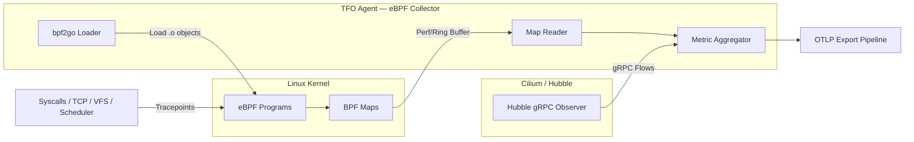
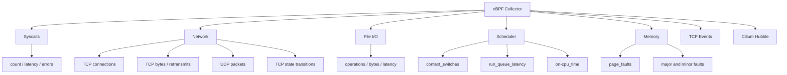

# eBPF Collector

Collects deep kernel-level observability data using eBPF programs. Provides per-process syscall tracing, TCP/UDP network stats, file I/O, scheduler events, memory faults, TCP state transitions, and Cilium Hubble network flow metrics.

## Architecture



## Sub-collector Hierarchy



**Linux only.** eBPF programs require a Linux kernel ≥ 5.4 and appropriate capabilities (CAP_BPF or CAP_SYS_ADMIN).

Non-Linux builds compile with no-ops for the eBPF sub-collectors.

## Sub-collectors

| Sub-collector | Config flag          | BPF program              | Description                                   |
| ------------- | -------------------- | ------------------------ | --------------------------------------------- |
| Syscalls      | `collect_syscalls`   | `syscall_stats`          | Per-process syscall counts, latency, errors   |
| Network       | `collect_network`    | `tcp_stats`, `udp_stats` | Per-process TCP/UDP traffic                   |
| File I/O      | `collect_fileio`     | `fileio_stats`           | Per-process VFS read/write/open operations    |
| Scheduler     | `collect_scheduler`  | `sched_stats`            | Context switches, run queue latency, CPU time |
| Memory        | `collect_memory`     | `mem_stats`              | Per-process page fault counts                 |
| TCP Events    | `collect_tcp_events` | `tcpstate_stats`         | TCP state transitions                         |
| Cilium Hubble | `cilium.enabled`     | gRPC client              | Network flows from Cilium Hubble              |

---

## Syscall Metrics

Labels: `pid`, `comm`, `syscall`

| Metric                    | Type    | Description                               |
| ------------------------- | ------- | ----------------------------------------- |
| `ebpf.syscall.count`      | Counter | Number of syscall invocations             |
| `ebpf.syscall.latency_ns` | Counter | Cumulative syscall latency in nanoseconds |
| `ebpf.syscall.errors`     | Counter | Number of syscall errors                  |

---

## Network Metrics

### TCP

Labels: `pid`, `comm`

| Metric                 | Type    | Description                                                         |
| ---------------------- | ------- | ------------------------------------------------------------------- |
| `ebpf.tcp.connections` | Counter | Total TCP connections established                                   |
| `ebpf.tcp.bytes_sent`  | Counter | Total bytes sent                                                    |
| `ebpf.tcp.bytes_recv`  | Counter | Total bytes received                                                |
| `ebpf.tcp.retransmits` | Counter | Total TCP retransmits                                               |
| `ebpf.tcp.rtt_ns`      | Gauge   | Current round-trip time in nanoseconds (emitted only when non-zero) |

### UDP

Labels: `pid`, `comm`

| Metric                  | Type    | Description                |
| ----------------------- | ------- | -------------------------- |
| `ebpf.udp.packets_sent` | Counter | Total UDP packets sent     |
| `ebpf.udp.packets_recv` | Counter | Total UDP packets received |

### TCP State Transitions

Labels: `pid`, `old_state`, `new_state`

| Metric                       | Type    | Description                |
| ---------------------------- | ------- | -------------------------- |
| `ebpf.tcp.state_transitions` | Counter | TCP state transition count |

**States:** ESTABLISHED, SYN_SENT, SYN_RECV, FIN_WAIT1, FIN_WAIT2, TIME_WAIT, CLOSE, CLOSE_WAIT, LAST_ACK, LISTEN, CLOSING

---

## File I/O Metrics

Labels: `pid`, `comm`, `operation`

**Operations:** `read`, `write`, `open`

| Metric                   | Type    | Description                           |
| ------------------------ | ------- | ------------------------------------- |
| `ebpf.fileio.operations` | Counter | Number of file I/O operations         |
| `ebpf.fileio.bytes`      | Counter | Bytes transferred                     |
| `ebpf.fileio.latency_ns` | Counter | Cumulative I/O latency in nanoseconds |

---

## Scheduler Metrics

Labels: `pid`, `comm`

| Metric                        | Type    | Description                           |
| ----------------------------- | ------- | ------------------------------------- |
| `ebpf.sched.context_switches` | Counter | Total context switches                |
| `ebpf.sched.runq_latency_ns`  | Gauge   | Run queue latency in nanoseconds      |
| `ebpf.sched.oncpu_ns`         | Counter | Cumulative time on CPU in nanoseconds |
| `ebpf.sched.migrations`       | Counter | CPU migrations                        |

---

## Memory Metrics

Labels: `pid`, `comm`

| Metric                     | Type    | Description                           |
| -------------------------- | ------- | ------------------------------------- |
| `ebpf.memory.page_faults`  | Counter | Total page faults                     |
| `ebpf.memory.major_faults` | Counter | Major page faults (disk I/O required) |
| `ebpf.memory.minor_faults` | Counter | Minor page faults (no disk I/O)       |

---

## Cilium Hubble Metrics

Collected from the Hubble gRPC observer endpoint when Cilium is deployed.

> Specific metrics depend on the Hubble metrics server configuration. Common metrics include:
>
> - `hubble_flows_processed_total` — network flows by verdict (FORWARDED, DROPPED)
> - `hubble_drop_total` — dropped flows by reason
> - `hubble_tcp_flags_total` — TCP flag counts
> - `hubble_dns_queries_total` / `hubble_dns_responses_total`

---

## Process Filtering

All per-process sub-collectors respect a `process_include` / `process_exclude` filter:

```yaml
ebpf:
  process_include: [] # empty = include all
  process_exclude:
    - "idle"
    - "swapper"
```

Filtering is by process `comm` (command name, max 15 chars).

---

## Configuration

```yaml
ebpf:
  enabled: true
  interval: 15s
  collect_syscalls: true
  collect_network: true
  collect_fileio: true
  collect_scheduler: true
  collect_memory: true
  collect_tcp_events: true
  process_include: []
  process_exclude: []
  cilium:
    enabled: false
    hubble_endpoint: "localhost:4245"
    tls: false
```

## Notes

- eBPF programs are loaded from pre-compiled `.o` objects generated by `bpf2go` (via `go generate`).
- When eBPF map is nil (program not loaded), sub-collectors return empty results without errors.
- All BPF map keys/values are defined in [internal/collector/ebpf/types.go](../../internal/collector/ebpf/types.go) and must match the C struct layout exactly.
