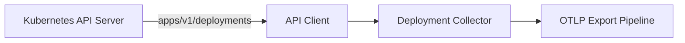
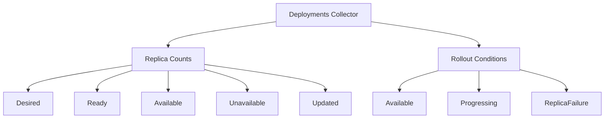

# Kubernetes Deployments Collector

Collects deployment replica counts and rollout condition metrics.

## Data Source

Kubernetes API: `apps/v1/deployments` (all namespaces, filtered by namespace rules).

## Architecture

## Sub-collector Hierarchy

## Metrics

### Replica Counts

| Metric                                | Type  | Labels                               | Description                                |
| ------------------------------------- | ----- | ------------------------------------ | ------------------------------------------ |
| `k8s.deployment.replicas`             | Gauge | `cluster`, `namespace`, `deployment` | Desired replica count (spec)               |
| `k8s.deployment.replicas.ready`       | Gauge | `cluster`, `namespace`, `deployment` | Ready replicas                             |
| `k8s.deployment.replicas.available`   | Gauge | `cluster`, `namespace`, `deployment` | Available replicas                         |
| `k8s.deployment.replicas.unavailable` | Gauge | `cluster`, `namespace`, `deployment` | Unavailable replicas                       |
| `k8s.deployment.replicas.updated`     | Gauge | `cluster`, `namespace`, `deployment` | Updated replicas (rolling update progress) |

### Conditions

| Metric                     | Type  | Labels                                            | Description                                                                |
| -------------------------- | ----- | ------------------------------------------------- | -------------------------------------------------------------------------- |
| `k8s.deployment.condition` | Gauge | `cluster`, `namespace`, `deployment`, `condition` | Condition status: 1=True, 0=False (Available, Progressing, ReplicaFailure) |

## State Fields (sent to platform)

- `Name`, `Namespace`, `Labels`
- `Replicas`, `ReadyReplicas`, `AvailableReplicas`, `UnavailableReplicas`, `UpdatedReplicas`
- `Conditions` — map[string]bool
- `Strategy` — `{Type, MaxUnavailable, MaxSurge}` (for RollingUpdate)
- `Containers` — list of `{Name, Image}` from pod template
- `Selector` — matchLabels map
- `Generation`, `ObservedGeneration`

## Use Cases

- Detect stuck rollouts: `replicas.updated < replicas` sustained over time
- Alert on unavailable replicas: `replicas.unavailable > 0`
- Track rollout completion: `replicas.available == replicas`
- Condition-based alerting: `k8s.deployment.condition{condition="Progressing"} == 0`
