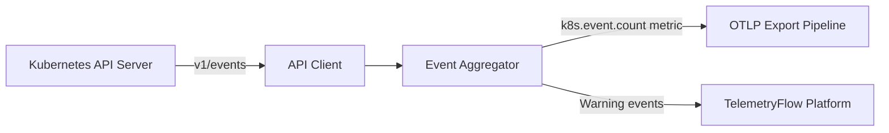
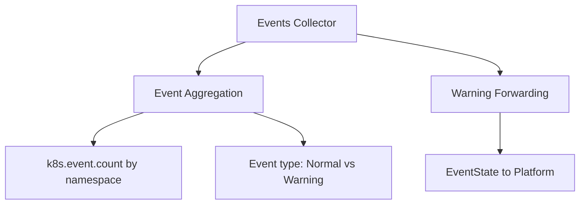

# Kubernetes Events Collector

Collects Kubernetes events and emits aggregate event count metrics by namespace and type.

## Data Source

Kubernetes API: `v1/events` (all namespaces, namespace-filtered).

## Architecture

## Sub-collector Hierarchy

## Metrics

| Metric            | Type  | Labels                         | Description                                          |
| ----------------- | ----- | ------------------------------ | ---------------------------------------------------- |
| `k8s.event.count` | Gauge | `cluster`, `namespace`, `type` | Event count by namespace and type (Normal / Warning) |

## State Fields (sent to platform)

Each `EventState` captures:

| Field            | Description                                                              |
| ---------------- | ------------------------------------------------------------------------ |
| `Type`           | `Normal` or `Warning`                                                    |
| `Reason`         | Short reason code (e.g. `Pulling`, `Failed`, `BackOff`, `OOMKilling`)    |
| `Message`        | Human-readable event message                                             |
| `Source`         | Component that generated the event (e.g. `kubelet`, `default-scheduler`) |
| `InvolvedKind`   | Resource kind (e.g. `Pod`, `Node`, `Deployment`)                         |
| `InvolvedName`   | Resource name                                                            |
| `Namespace`      | Namespace of the event                                                   |
| `Count`          | Number of times this event occurred                                      |
| `FirstTimestamp` | First occurrence (Unix milliseconds)                                     |
| `LastTimestamp`  | Most recent occurrence (Unix milliseconds)                               |

## Notes

- All Warning events are forwarded to the platform for display and alerting.
- `k8s.event.count` is an aggregated metric. Individual event state items are forwarded via the state channel, not as individual metrics.
- High `k8s.event.count{type="Warning"}` is a useful leading indicator for cluster health issues.

## Common Warning Reasons

| Reason             | Probable cause                            |
| ------------------ | ----------------------------------------- |
| `BackOff`          | CrashLoopBackOff — container restarting   |
| `OOMKilling`       | Container killed due to memory limit      |
| `Evicted`          | Pod evicted due to node resource pressure |
| `FailedScheduling` | Scheduler cannot find a suitable node     |
| `Unhealthy`        | Readiness/liveness probe failures         |
| `Failed`           | Container or image pull failed            |
