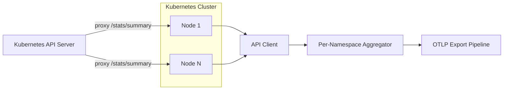
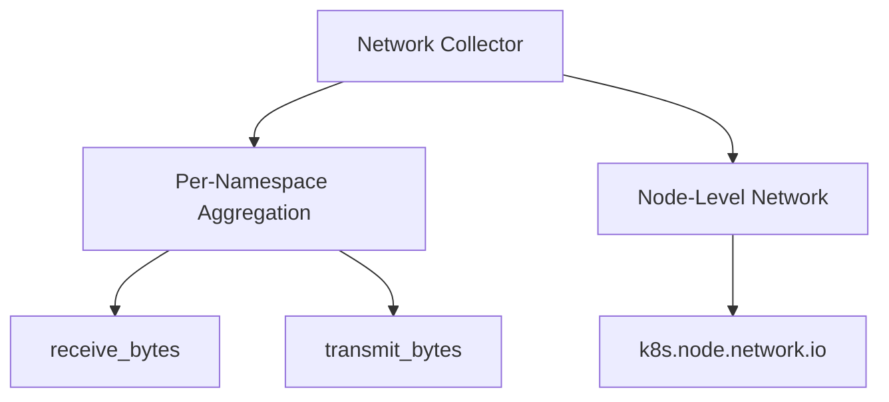

# Kubernetes Network Collector

Collects pod-level network I/O aggregated per namespace from the Kubelet `/stats/summary` API.

## Data Source

Kubelet `/stats/summary` via Kubernetes API server proxy:

```
GET /api/v1/nodes/{nodeName}/proxy/stats/summary
```

The collector iterates all unique nodes derived from the current pod list, fetches the Kubelet summary for each node, and aggregates `rxBytes`, `txBytes`, `rxErrors`, `txErrors` across all pod network interfaces per namespace.

## Architecture



## Sub-collector Hierarchy



## Metrics

| Metric                                 | Type  | Unit  | Labels                 | Description                                                             |
| -------------------------------------- | ----- | ----- | ---------------------- | ----------------------------------------------------------------------- |
| `k8s.namespace.network.receive_bytes`  | Gauge | bytes | `cluster`, `namespace` | Total cumulative network bytes received by all pods in the namespace    |
| `k8s.namespace.network.transmit_bytes` | Gauge | bytes | `cluster`, `namespace` | Total cumulative network bytes transmitted by all pods in the namespace |

## State Fields (sent to platform)

`NamespaceNetworkStats`:

- `Namespace`
- `RxBytes`, `TxBytes`
- `RxErrors`, `TxErrors`

> **Note:** Error counters are collected in state but not currently emitted as separate metrics. They are available for future dashboard use.

## Node-Level Network (in Nodes collector)

The Nodes collector also emits node-level aggregate network I/O from Kubelet summary:

| Metric                | Labels            | Description                                               |
| --------------------- | ----------------- | --------------------------------------------------------- |
| `k8s.node.network.io` | `cluster`, `node` | Node total cumulative network I/O (all interfaces, rx+tx) |

## Behavior When Kubelet Unavailable

- If the Kubelet `/stats/summary` endpoint is unreachable for a node, that node's pods are silently skipped.
- Debug-level log: `"Failed to fetch kubelet stats"` with node name and error.
- Collection does not fail — partial results are returned.

## Use Cases

- Namespace bandwidth breakdown: compare `receive_bytes` and `transmit_bytes` rates over time
- Noisy-neighbor detection: identify namespaces consuming disproportionate network bandwidth
- Combined with pod count: compute per-pod average throughput
