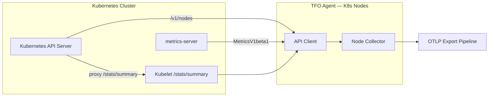
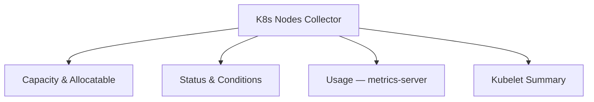

# Kubernetes Nodes Collector

Collects node-level capacity, allocatable resources, real-time usage, filesystem, image filesystem, and network I/O metrics.

## Data Sources

| Source                                            | What it provides                                                  |
| ------------------------------------------------- | ----------------------------------------------------------------- |
| Kubernetes API (`/v1/nodes`)                      | Capacity, allocatable, roles, conditions, addresses               |
| metrics-server (`MetricsV1beta1`)                 | Live CPU cores and memory usage                                   |
| Kubelet `/stats/summary` (proxied via API server) | CPU nanoseconds, memory working set, rootfs, imageFs, network I/O |

## Architecture



## Sub-collector Hierarchy



## Metrics

### Capacity & Allocatable

| Metric                                   | Type  | Unit  | Labels            | Description                   |
| ---------------------------------------- | ----- | ----- | ----------------- | ----------------------------- |
| `k8s.node.cpu.capacity`                  | Gauge | cores | `cluster`, `node` | Total CPU capacity            |
| `k8s.node.cpu.allocatable`               | Gauge | cores | `cluster`, `node` | Allocatable CPU               |
| `k8s.node.memory.capacity`               | Gauge | bytes | `cluster`, `node` | Total memory capacity         |
| `k8s.node.memory.allocatable`            | Gauge | bytes | `cluster`, `node` | Allocatable memory            |
| `k8s.node.ephemeral_storage.capacity`    | Gauge | bytes | `cluster`, `node` | Ephemeral storage capacity    |
| `k8s.node.ephemeral_storage.allocatable` | Gauge | bytes | `cluster`, `node` | Allocatable ephemeral storage |
| `k8s.node.pods.capacity`                 | Gauge | —     | `cluster`, `node` | Maximum pod capacity          |
| `k8s.node.pods.count`                    | Gauge | —     | `cluster`, `node` | Current running pod count     |

### Status & Conditions

| Metric               | Type  | Labels                         | Description                                                                            |
| -------------------- | ----- | ------------------------------ | -------------------------------------------------------------------------------------- |
| `k8s.node.status`    | Gauge | `cluster`, `node`              | Node readiness: 1=Ready, 0=NotReady                                                    |
| `k8s.node.condition` | Gauge | `cluster`, `node`, `condition` | Condition value (Ready, MemoryPressure, DiskPressure, PIDPressure, NetworkUnavailable) |

### Usage (metrics-server)

| Metric                  | Type  | Unit  | Labels            | Description         |
| ----------------------- | ----- | ----- | ----------------- | ------------------- |
| `k8s.node.cpu.usage`    | Gauge | cores | `cluster`, `node` | Actual CPU usage    |
| `k8s.node.memory.usage` | Gauge | bytes | `cluster`, `node` | Actual memory usage |

### Kubelet Summary Metrics

| Metric                            | Type    | Unit  | Labels            | Description                                                |
| --------------------------------- | ------- | ----- | ----------------- | ---------------------------------------------------------- |
| `k8s.node.cpu.usage_nanoseconds`  | Counter | ns    | `cluster`, `node` | Cumulative CPU usage in nanoseconds                        |
| `k8s.node.memory.working_set`     | Gauge   | bytes | `cluster`, `node` | Memory working set (excludes reclaimable cache)            |
| `k8s.node.filesystem.usage`       | Gauge   | bytes | `cluster`, `node` | Root filesystem used bytes                                 |
| `k8s.node.image_filesystem.usage` | Gauge   | bytes | `cluster`, `node` | Container image layer disk usage                           |
| `k8s.node.network.io`             | Gauge   | bytes | `cluster`, `node` | Total cumulative network I/O (rx+tx) across all interfaces |

## State Fields (sent to platform)

- `Name`, `Status`, `Roles`, `Labels`
- `KubeletVersion`, `ContainerRuntime`, `OS`, `Architecture`
- `CPUCapacity`, `CPUAllocatable`, `MemoryCapacity`, `MemoryAllocatable`
- `EphemeralStorageCapacity`, `EphemeralStorageAllocatable`
- `PodsCapacity`, `PodsCount`
- `Conditions` (map)
- `InternalIP`, `ExternalIP`
- `CPUUsage`, `MemoryUsage` (from metrics-server, optional)
- `CPUUsageNanoseconds`, `MemoryWorkingSetBytes`, `MemoryPageFaults`, `MemoryMajorPageFaults` (from Kubelet)
- `FSUsedBytes`, `FSCapacityBytes`, `ImageFSUsedBytes`, `ImageFSCapacityBytes`
- `NetworkRxBytes`, `NetworkTxBytes`

## Configuration

```yaml
kubernetes:
  metrics_api: true # enable metrics-server integration
  kubelet_stats: true # enable Kubelet /stats/summary
  label_selector: "" # optional K8s label selector
```
