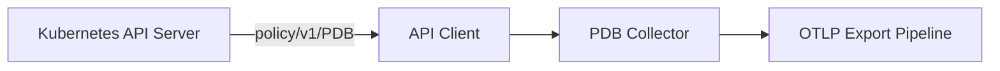
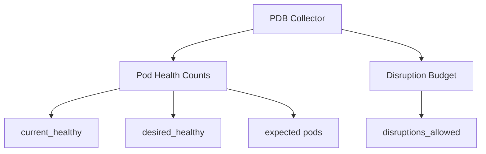

# Kubernetes PDB Collector

Collects PodDisruptionBudget health and disruption budget metrics.

## Data Source

Kubernetes API: `policy/v1/poddisruptionbudgets` (all namespaces, namespace-filtered).

## Architecture



## Sub-collector Hierarchy



## Metrics

| Metric                         | Type  | Labels                        | Description                                 |
| ------------------------------ | ----- | ----------------------------- | ------------------------------------------- |
| `k8s.pdb.pods.current_healthy` | Gauge | `cluster`, `namespace`, `pdb` | Number of currently healthy pods            |
| `k8s.pdb.pods.desired_healthy` | Gauge | `cluster`, `namespace`, `pdb` | Minimum desired healthy pods                |
| `k8s.pdb.pods.expected`        | Gauge | `cluster`, `namespace`, `pdb` | Total pods counted by this PDB              |
| `k8s.pdb.disruptions_allowed`  | Gauge | `cluster`, `namespace`, `pdb` | Number of pod disruptions currently allowed |

## State Fields (sent to platform)

- `Name`, `Namespace`
- `CurrentHealthy`, `DesiredHealthy`, `ExpectedPods`, `DisruptionsAllowed`
- `Labels`

## Configuration

```yaml
kubernetes:
  pdb: true # default: true
```

## Use Cases

- Disruption risk: `k8s.pdb.disruptions_allowed == 0` while a node drain or upgrade is in progress
- PDB violation risk: `k8s.pdb.pods.current_healthy < k8s.pdb.pods.desired_healthy`
- Capacity check: `k8s.pdb.pods.expected` for sizing validation
