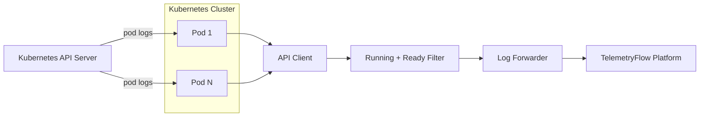
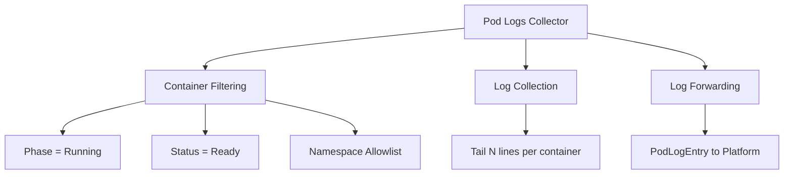

# Kubernetes Pod Logs Collector

Collects recent log lines from running containers for forwarding to the platform log ingestion pipeline.

## Data Source

Kubernetes API: `GET /api/v1/namespaces/{ns}/pods/{name}/log`

Options used per container:

- `TailLines`: last N lines (default: 100, configurable)
- `Container`: per-container request

## Architecture



## Sub-collector Hierarchy



## Collection Criteria

Only containers that meet **all** of the following are collected:

1. Pod phase is `Running`
2. Container status is `Ready`
3. Namespace passes the `PodLogsNamespaces` allowlist (or regular namespace filter)

## State Fields (sent to platform)

`PodLogEntry`:

| Field           | Description                                   |
| --------------- | --------------------------------------------- |
| `Namespace`     | Pod namespace                                 |
| `PodName`       | Pod name                                      |
| `ContainerName` | Container name                                |
| `Lines`         | Collected log lines (empty lines are skipped) |
| `CollectedAt`   | Timestamp when collection ran                 |

## Namespace Filtering

The pod logs collector has its own namespace allowlist (`PodLogsNamespaces`) that takes priority over the general namespace filter:

1. If `PodLogsNamespaces` is non-empty → only those namespaces are collected
2. Otherwise → falls back to the same `IncludeNamespaces` / `ExcludeNamespaces` rules used by all other collectors

## Configuration

```yaml
kubernetes:
  pod_logs: true # default: true
  pod_logs_tail_lines: 100 # lines per container per collection cycle
  pod_logs_namespaces: # optional allowlist (overrides general filter)
    - production
    - staging
```

## Notes

- Stream errors (e.g. container not found, terminated) are logged at DEBUG level and skipped — they do not fail the collection cycle.
- `CollectedAt` is a single timestamp for the entire collection cycle, not per-line.
- Log lines are forwarded as raw strings. Parsing (JSON, logfmt) is done on the platform side.
