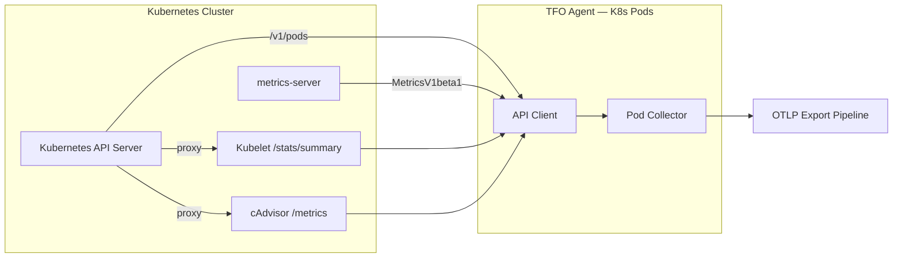
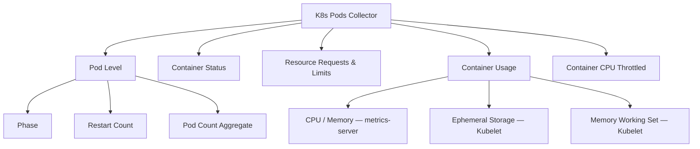

# Kubernetes Pods Collector

Collects pod-level phase, restart counts, container resource requests/limits/usage, ephemeral storage, memory working set, CPU throttling, and termination state.

## Data Sources

| Source                                 | What it provides                                                                       |
| -------------------------------------- | -------------------------------------------------------------------------------------- |
| Kubernetes API (`/v1/pods`)            | Phase, conditions, owner references, container specs, restart counts, last termination |
| metrics-server (`MetricsV1beta1`)      | Per-container CPU and memory usage                                                     |
| Kubelet `/stats/summary` (proxied)     | Per-container ephemeral storage (rootfs + logs) and memory working set                 |
| cAdvisor `/metrics/cadvisor` (proxied) | Per-container CPU throttle seconds (`container_cpu_cfs_throttled_seconds_total`)       |

## Architecture

## Sub-collector Hierarchy

## Metrics

### Pod Level

| Metric                  | Type  | Labels                                         | Description                                                   |
| ----------------------- | ----- | ---------------------------------------------- | ------------------------------------------------------------- |
| `k8s.pod.phase`         | Gauge | `cluster`, `namespace`, `pod`, `node`, `phase` | Phase: 1=Running, 2=Succeeded, 3=Pending, 4=Failed, 5=Unknown |
| `k8s.pod.restart_count` | Gauge | `cluster`, `namespace`, `pod`, `node`          | Total restart count across all containers                     |
| `k8s.pod.count`         | Gauge | `cluster`, `namespace`, `phase`                | Aggregate pod count by namespace and phase                    |

### Container Status

| Metric                              | Type  | Labels                                               | Description                                                           |
| ----------------------------------- | ----- | ---------------------------------------------------- | --------------------------------------------------------------------- |
| `k8s.pod.container.status`          | Gauge | `cluster`, `namespace`, `pod`, `container`, `status` | Container readiness: 1=ready, 0=not-ready                             |
| `k8s.pod.container.last_terminated` | Gauge | `cluster`, `namespace`, `pod`, `container`, `reason` | Last termination event (value=1, label carries reason e.g. OOMKilled) |

### Container Resource Requests & Limits (from Pod Spec)

| Metric                                        | Type  | Unit  | Labels                                             | Description               |
| --------------------------------------------- | ----- | ----- | -------------------------------------------------- | ------------------------- |
| `k8s.pod.container.cpu_request`               | Gauge | cores | `cluster`, `namespace`, `pod`, `node`, `container` | CPU request               |
| `k8s.pod.container.cpu_limit`                 | Gauge | cores | `cluster`, `namespace`, `pod`, `node`, `container` | CPU limit                 |
| `k8s.pod.container.memory_request`            | Gauge | bytes | `cluster`, `namespace`, `pod`, `node`, `container` | Memory request            |
| `k8s.pod.container.memory_limit`              | Gauge | bytes | `cluster`, `namespace`, `pod`, `node`, `container` | Memory limit              |
| `k8s.pod.container.ephemeral_storage_request` | Gauge | bytes | `cluster`, `namespace`, `pod`, `node`, `container` | Ephemeral storage request |
| `k8s.pod.container.ephemeral_storage_limit`   | Gauge | bytes | `cluster`, `namespace`, `pod`, `node`, `container` | Ephemeral storage limit   |

### Container Usage (metrics-server)

| Metric                           | Type  | Unit  | Labels                                             | Description         |
| -------------------------------- | ----- | ----- | -------------------------------------------------- | ------------------- |
| `k8s.pod.container.cpu_usage`    | Gauge | cores | `cluster`, `namespace`, `pod`, `node`, `container` | Actual CPU usage    |
| `k8s.pod.container.memory_usage` | Gauge | bytes | `cluster`, `namespace`, `pod`, `node`, `container` | Actual memory usage |

### Container Usage (Kubelet Summary)

| Metric                                      | Type  | Unit  | Labels                                             | Description                                     |
| ------------------------------------------- | ----- | ----- | -------------------------------------------------- | ----------------------------------------------- |
| `k8s.pod.container.ephemeral_storage_usage` | Gauge | bytes | `cluster`, `namespace`, `pod`, `node`, `container` | Actual ephemeral storage usage (rootfs + logs)  |
| `k8s.pod.container.memory_working_set`      | Gauge | bytes | `cluster`, `namespace`, `pod`, `node`, `container` | Memory working set (excludes reclaimable cache) |

### Container Usage (cAdvisor)

| Metric                            | Type    | Unit | Labels                                             | Description                                                                      |
| --------------------------------- | ------- | ---- | -------------------------------------------------- | -------------------------------------------------------------------------------- |
| `k8s.pod.container.cpu_throttled` | Counter | sec  | `cluster`, `namespace`, `pod`, `node`, `container` | Cumulative CPU throttled time (from `container_cpu_cfs_throttled_seconds_total`) |

## State Fields (sent to platform)

### PodState

- `Name`, `Namespace`, `Node`, `Phase`, `RestartCount`
- `Labels`, `OwnerKind`, `OwnerName`
- `IP`, `QOSClass`
- `StartTime`
- `Conditions` — map of pod condition names to bool (PodScheduled, Initialized, ContainersReady, Ready)
- `Containers` — list of ContainerState

### ContainerState

- `Name`, `Image`, `Ready`, `Status`, `RestartCount`
- `CPURequest`, `CPULimit`, `MemoryRequest`, `MemoryLimit`
- `EphemeralStorageRequest`, `EphemeralStorageLimit`
- `CPUUsage`, `MemoryUsage` (from metrics-server, optional pointers)
- `EphemeralStorageUsage` (from Kubelet, optional pointer)
- `MemoryWorkingSetBytes` (from Kubelet, optional pointer)
- `CPUThrottled` (from cAdvisor, optional pointer — cumulative seconds)
- `LastTerminationReason`, `LastTerminationCode`

## Notes

- Metrics with value 0 (no request/limit set) are not emitted to reduce cardinality.
- Ephemeral storage usage = `rootfs.UsedBytes + logs.UsedBytes` per container from Kubelet `/stats/summary`.
- metrics-server does **not** provide ephemeral storage or memory working set — Kubelet summary is the only source.
- CPU throttle data (`container_cpu_cfs_throttled_seconds_total`) is only available from cAdvisor. The Kubernetes collector fetches it via the API server proxy at `/api/v1/nodes/{name}/proxy/metrics/cadvisor`. This is separate from the standalone cAdvisor collector — no duplicate configuration needed.
- `k8s.pod.count` is an aggregate metric, not per-pod. Use it for namespace-level phase dashboards.
