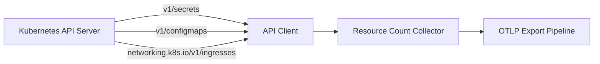
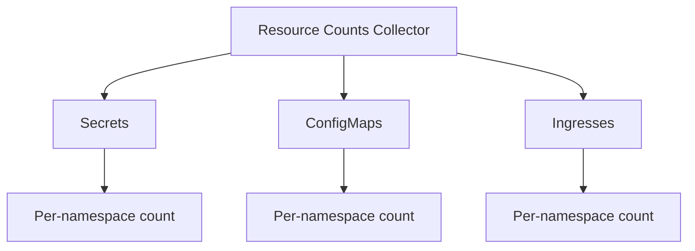

# Kubernetes Resource Counts Collector

Collects per-namespace counts of Secrets, ConfigMaps, and Ingresses.

## Data Source

Kubernetes API:

- `v1/secrets` — namespace-filtered
- `v1/configmaps` — namespace-filtered
- `networking.k8s.io/v1/ingresses` — namespace-filtered

## Architecture



## Sub-collector Hierarchy



## Metrics

| Metric                | Type  | Labels                 | Description                   |
| --------------------- | ----- | ---------------------- | ----------------------------- |
| `k8s.secret.count`    | Gauge | `cluster`, `namespace` | Secret count per namespace    |
| `k8s.configmap.count` | Gauge | `cluster`, `namespace` | ConfigMap count per namespace |
| `k8s.ingress.count`   | Gauge | `cluster`, `namespace` | Ingress count per namespace   |

## State Fields (sent to platform)

`ResourceCounts`:

```go
type ResourceCounts struct {
    Secrets    map[string]int  // namespace → count
    ConfigMaps map[string]int
    Ingresses  map[string]int
}
```

## Use Cases

- Config drift: unexpected growth in Secret or ConfigMap counts
- Ingress inventory: track how many Ingresses exist per namespace/team
- Quotas: compare against `ResourceQuota` limits
- Compliance: flag namespaces with too many secrets
