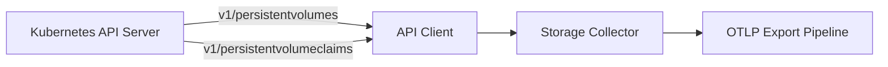
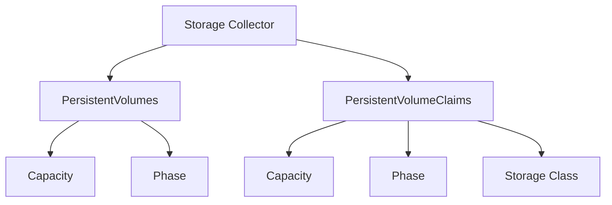

# Kubernetes Storage Collector

Collects PersistentVolume (PV) and PersistentVolumeClaim (PVC) capacity and phase metrics.

## Data Source

Kubernetes API:

- `v1/persistentvolumes` (cluster-scoped — no namespace filter applied)
- `v1/persistentvolumeclaims` (all namespaces — namespace filter applied)

## Architecture

## Sub-collector Hierarchy

## Metrics

### PersistentVolumes

| Metric                  | Type  | Unit  | Labels                                    | Description                |
| ----------------------- | ----- | ----- | ----------------------------------------- | -------------------------- |
| `k8s.pv.capacity_bytes` | Gauge | bytes | `cluster`, `pv`, `storage_class`, `phase` | PV total capacity in bytes |

### PersistentVolumeClaims

| Metric                   | Type  | Unit  | Labels                                                  | Description                                                    |
| ------------------------ | ----- | ----- | ------------------------------------------------------- | -------------------------------------------------------------- |
| `k8s.pvc.capacity_bytes` | Gauge | bytes | `cluster`, `namespace`, `pvc`, `storage_class`, `phase` | PVC allocated capacity (from status, fallback to spec request) |

## State Fields (sent to platform)

### PVState

- `Name`, `StorageClass`, `Capacity`, `Phase`
- `AccessModes` — list (ReadWriteOnce, ReadOnlyMany, ReadWriteMany)
- `ReclaimPolicy` — Retain, Delete, Recycle
- `VolumeMode` — Filesystem or Block
- `ClaimRef` — `{Name, Namespace}` of bound PVC (optional)

### PVCState

- `Name`, `Namespace`, `StorageClass`, `Capacity`, `Phase`
- `AccessModes`, `VolumeMode`
- `VolumeName` — name of the bound PV
- `Resources` — `{Requests, Limits}` maps (optional)

## Phase Values

| Phase       | Meaning                               |
| ----------- | ------------------------------------- |
| `Available` | PV is free and not bound              |
| `Bound`     | PV is bound to a PVC                  |
| `Released`  | PVC was deleted, PV not yet reclaimed |
| `Failed`    | PV reclaim failed                     |
| `Pending`   | PVC is waiting for a PV               |

## Use Cases

- Storage capacity planning: track `k8s.pvc.capacity_bytes` per storage class
- Detect unbound PVCs: `k8s.pvc.capacity_bytes{phase="Pending"}` sustained over time
- Detect released PVs: `k8s.pv.capacity_bytes{phase="Released"}` (resource leak)
