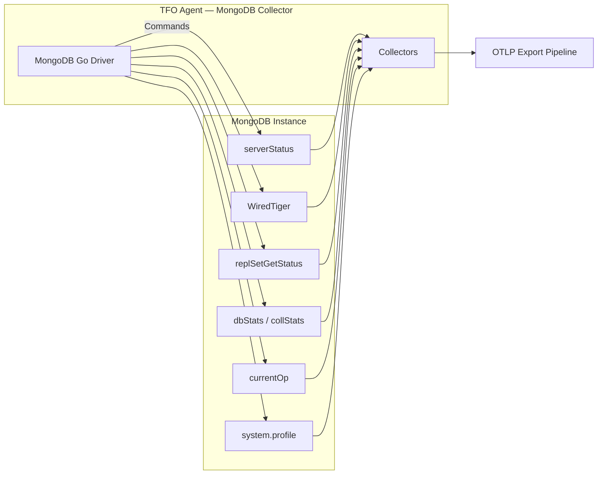
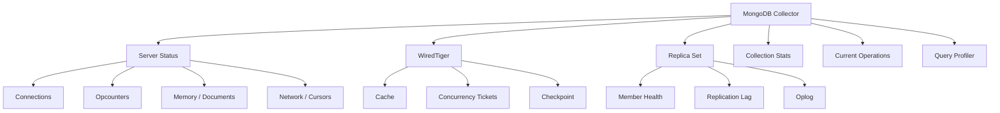

# MongoDB Collector

Monitors MongoDB Community instances via the Go MongoDB driver. Collects server status, WiredTiger engine metrics, replica set health, collection stats, current operations, and query profiler data.

## Data Source

MongoDB driver connecting to `mongodb://` URI. Queries `serverStatus`, `replSetGetStatus`, `dbStats`, `collStats`, `$indexStats`, `currentOp`, and `system.profile` commands.

## Architecture



## Sub-collector Hierarchy



## Sub-collectors

| Sub-collector      | Interval                   | Description                                                           |
| ------------------ | -------------------------- | --------------------------------------------------------------------- |
| Server Status      | `interval: 10s`            | Connections, opcounters, memory, documents, cursors, network, asserts |
| WiredTiger         | `interval: 10s`            | Cache, tickets, checkpoint, log, block manager                        |
| Replica Set        | `interval: 10s`            | Member health, replication lag, oplog window                          |
| Collection Stats   | `collstats_interval: 60s`  | Database/collection sizes, document counts, index access              |
| Current Operations | `current_op_interval: 10s` | Active ops, long-running queries, lock waits                          |
| Query Profiler     | `profile_interval: 60s`    | Slow query fingerprinting from `system.profile`                       |

---

## Server Status Metrics

### Connections

| Metric                                 | Type    | Description               |
| -------------------------------------- | ------- | ------------------------- |
| `db.mongodb.connections.current`       | Gauge   | Current connections       |
| `db.mongodb.connections.available`     | Gauge   | Available connections     |
| `db.mongodb.connections.total_created` | Counter | Total connections created |
| `db.mongodb.connections.active`        | Gauge   | Active connections        |

### Opcounters

| Metric                          | Type    | Description        |
| ------------------------------- | ------- | ------------------ |
| `db.mongodb.opcounters.insert`  | Counter | Insert operations  |
| `db.mongodb.opcounters.query`   | Counter | Query operations   |
| `db.mongodb.opcounters.update`  | Counter | Update operations  |
| `db.mongodb.opcounters.delete`  | Counter | Delete operations  |
| `db.mongodb.opcounters.command` | Counter | Command operations |
| `db.mongodb.opcounters.getmore` | Counter | GetMore operations |

Replicated counters (`db.mongodb.opcounters.repl.*`) are also collected.

### Memory & Documents

| Metric                          | Type    | Description          |
| ------------------------------- | ------- | -------------------- |
| `db.mongodb.memory.resident_mb` | Gauge   | Resident memory (MB) |
| `db.mongodb.memory.virtual_mb`  | Gauge   | Virtual memory (MB)  |
| `db.mongodb.document.inserted`  | Counter | Documents inserted   |
| `db.mongodb.document.returned`  | Counter | Documents returned   |
| `db.mongodb.document.updated`   | Counter | Documents updated    |
| `db.mongodb.document.deleted`   | Counter | Documents deleted    |

### Network & Cursors

| Metric                          | Type    | Description       |
| ------------------------------- | ------- | ----------------- |
| `db.mongodb.network.bytes_in`   | Counter | Bytes received    |
| `db.mongodb.network.bytes_out`  | Counter | Bytes sent        |
| `db.mongodb.network.requests`   | Counter | Total requests    |
| `db.mongodb.cursors.open.total` | Gauge   | Open cursors      |
| `db.mongodb.cursors.timed_out`  | Counter | Timed out cursors |

---

## WiredTiger Metrics

### Cache

| Metric                                                 | Type    | Description                   |
| ------------------------------------------------------ | ------- | ----------------------------- |
| `db.mongodb.wiredtiger.cache.bytes_in_cache`           | Gauge   | Bytes currently in cache      |
| `db.mongodb.wiredtiger.cache.bytes_dirty`              | Gauge   | Dirty bytes in cache          |
| `db.mongodb.wiredtiger.cache.max_bytes`                | Gauge   | Maximum cache size            |
| `db.mongodb.wiredtiger.cache.utilization_percent`      | Gauge   | Cache utilization % (derived) |
| `db.mongodb.wiredtiger.cache.pages_evicted_unmodified` | Counter | Unmodified pages evicted      |
| `db.mongodb.wiredtiger.cache.pages_evicted_modified`   | Counter | Modified pages evicted        |

### Concurrency Tickets

| Metric                                          | Type  | Description             |
| ----------------------------------------------- | ----- | ----------------------- |
| `db.mongodb.wiredtiger.tickets.read.available`  | Gauge | Available read tickets  |
| `db.mongodb.wiredtiger.tickets.read.out`        | Gauge | In-use read tickets     |
| `db.mongodb.wiredtiger.tickets.write.available` | Gauge | Available write tickets |
| `db.mongodb.wiredtiger.tickets.write.out`       | Gauge | In-use write tickets    |

### Checkpoint

| Metric                                         | Type    | Description                   |
| ---------------------------------------------- | ------- | ----------------------------- |
| `db.mongodb.wiredtiger.checkpoint.duration_ms` | Gauge   | Last checkpoint duration (ms) |
| `db.mongodb.wiredtiger.checkpoint.total`       | Counter | Total checkpoints             |

---

## Replica Set

Labels: `member`

| Metric                                        | Type  | Description               |
| --------------------------------------------- | ----- | ------------------------- |
| `db.mongodb.replication.my_state`             | Gauge | Current node state code   |
| `db.mongodb.replication.member_state`         | Gauge | Member state code         |
| `db.mongodb.replication.member_health`        | Gauge | Member health (0/1)       |
| `db.mongodb.replication.lag_seconds`          | Gauge | Replication lag (seconds) |
| `db.mongodb.replication.heartbeat_latency_ms` | Gauge | Heartbeat latency (ms)    |

### Oplog

| Metric                            | Type  | Description                 |
| --------------------------------- | ----- | --------------------------- |
| `db.mongodb.oplog.size_bytes`     | Gauge | Oplog size (bytes)          |
| `db.mongodb.oplog.max_size_bytes` | Gauge | Oplog max size (bytes)      |
| `db.mongodb.oplog.window_seconds` | Gauge | Oplog time window (derived) |

---

## Collection Stats

Labels: `database`, `collection`

| Metric                                          | Type    | Description               |
| ----------------------------------------------- | ------- | ------------------------- |
| `db.mongodb.database.document_count`            | Gauge   | Documents per database    |
| `db.mongodb.database.data_size_bytes`           | Gauge   | Data size per database    |
| `db.mongodb.database.storage_size_bytes`        | Gauge   | Storage size per database |
| `db.mongodb.database.index_size_bytes`          | Gauge   | Index size per database   |
| `db.mongodb.collection.document_count`          | Gauge   | Documents per collection  |
| `db.mongodb.collection.size_bytes`              | Gauge   | Collection size (bytes)   |
| `db.mongodb.collection.avg_document_size_bytes` | Gauge   | Average document size     |
| `db.mongodb.collection.total_index_size_bytes`  | Gauge   | Total index size          |
| `db.mongodb.collection.index_count`             | Gauge   | Index count               |
| `db.mongodb.index.accesses`                     | Counter | Index access count        |

---

## Current Operations

| Metric                                          | Type  | Description                 |
| ----------------------------------------------- | ----- | --------------------------- |
| `db.mongodb.operations.active`                  | Gauge | Active operations           |
| `db.mongodb.operations.waiting_for_lock`        | Gauge | Operations waiting for lock |
| `db.mongodb.operations.running_longer_than_1s`  | Gauge | Ops running >1s             |
| `db.mongodb.operations.running_longer_than_10s` | Gauge | Ops running >10s            |
| `db.mongodb.operations.running_longer_than_60s` | Gauge | Ops running >60s            |

---

## Query Profiler

Labels: `fingerprint`, `database`, `collection`, `operation`

| Metric                             | Type  | Description            |
| ---------------------------------- | ----- | ---------------------- |
| `db.mongodb.query.calls_rate`      | Gauge | Query calls per second |
| `db.mongodb.query.avg_duration_ms` | Gauge | Average duration (ms)  |
| `db.mongodb.query.max_duration_ms` | Gauge | Max duration (ms)      |
| `db.mongodb.query.docs_scanned`    | Gauge | Documents scanned      |
| `db.mongodb.query.docs_returned`   | Gauge | Documents returned     |

---

## Configuration

```yaml
mongodb_community:
  enabled: true
  interval: 10s
  current_op_interval: 10s
  profile_interval: 60s
  collstats_interval: 60s
  profile_level: 1
  slow_ms: 100
  discover_databases: true
  instances:
    - name: "rs-primary"
      uri: "mongodb://localhost:27017"
      username: ""
      password: ""
      tls_cert_file: ""
      tls_key_file: ""
      tls_ca_file: ""
      tls_insecure_skip_verify: false
      tags: {}
```

## Notes

- Auto-detects replica set, standalone, and sharded cluster topologies.
- Query profiling requires `profile_level >= 1` on the MongoDB instance.
- Database auto-discovery with caching avoids repeated `listDatabases` calls.
- Oplog window is derived from first/last entry timestamps in the oplog.
