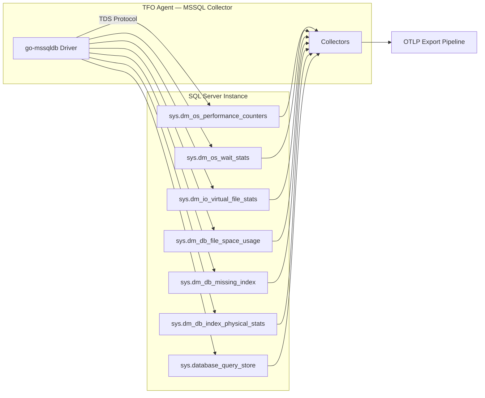
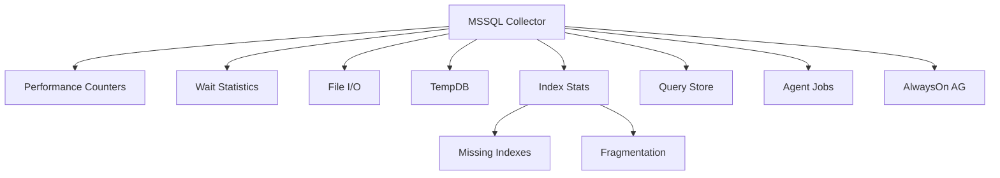

# Microsoft SQL Server Collector

Monitors Microsoft SQL Server instances using Dynamic Management Views (DMVs). Collects performance counters, wait statistics, file I/O, TempDB, index analysis, Query Store, agent jobs, and AlwaysOn availability groups.

## Data Source

Direct database connection using `go-mssqldb` driver. Queries `sys.dm_os_*`, `sys.dm_io_*`, `sys.dm_db_*` DMVs.

## Architecture



## Sub-collector Hierarchy



## Sub-collectors

| Sub-collector        | Interval                | Description                                         |
| -------------------- | ----------------------- | --------------------------------------------------- |
| Performance Counters | `metrics_interval: 15s` | Buffer cache, batch requests, deadlocks, memory     |
| Wait Statistics      | `metrics_interval: 15s` | Wait types with categorization and benign filtering |
| File I/O             | `metrics_interval: 15s` | Per-database read/write stalls and throughput       |
| TempDB               | `metrics_interval: 15s` | Space usage and PAGELATCH contention                |
| Index Stats          | `index_interval: 300s`  | Missing indexes and fragmentation                   |
| Query Store          | `query_interval: 60s`   | Top queries by duration (requires QS enabled)       |
| Agent Jobs           | `metrics_interval: 15s` | SQL Server Agent job status                         |

---

## Performance Counters

| Metric                             | Type  | Description                    |
| ---------------------------------- | ----- | ------------------------------ |
| `mssql.buffer_cache_hit_ratio`     | Gauge | Buffer cache hit ratio (%)     |
| `mssql.batch_requests_per_sec`     | Rate  | Batch requests per second      |
| `mssql.sql_compilations_per_sec`   | Rate  | SQL compilations per second    |
| `mssql.sql_recompilations_per_sec` | Rate  | SQL re-compilations per second |
| `mssql.deadlocks_per_sec`          | Rate  | Deadlocks per second           |
| `mssql.page_life_expectancy`       | Gauge | Page life expectancy (seconds) |
| `mssql.user_connections`           | Gauge | Current user connections       |
| `mssql.processes_blocked`          | Gauge | Currently blocked processes    |
| `mssql.memory_grants_pending`      | Gauge | Pending memory grants          |
| `mssql.target_server_memory_kb`    | Gauge | Target server memory (KB)      |
| `mssql.total_server_memory_kb`     | Gauge | Total server memory used (KB)  |
| `mssql.transactions_per_sec`       | Rate  | Transactions per second        |
| `mssql.checkpoint_pages_per_sec`   | Rate  | Checkpoint pages per second    |

---

## Wait Statistics

Labels: `mssql_wait_type`, `mssql_wait_category`

| Metric                           | Type  | Description            |
| -------------------------------- | ----- | ---------------------- |
| `mssql.wait.waiting_tasks_count` | Gauge | Total waiting tasks    |
| `mssql.wait.wait_time_ms`        | Gauge | Total wait time (ms)   |
| `mssql.wait.signal_wait_time_ms` | Gauge | Signal wait time (ms)  |
| `mssql.wait.max_wait_time_ms`    | Gauge | Maximum wait time (ms) |

**Wait categories**: Lock, Latches, Buffer I/O, Network I/O, Parallelism, CPU, Memory, Transaction Log, Backup I/O, I/O, Other. Over 40 benign wait types are automatically filtered.

---

## File I/O

Labels: `mssql_database`, `mssql_file_type`

| Metric                            | Type  | Description              |
| --------------------------------- | ----- | ------------------------ |
| `mssql.fileio.num_reads`          | Gauge | Number of reads          |
| `mssql.fileio.num_writes`         | Gauge | Number of writes         |
| `mssql.fileio.mb_read`            | Gauge | Megabytes read           |
| `mssql.fileio.mb_written`         | Gauge | Megabytes written        |
| `mssql.fileio.read_stall_ms`      | Gauge | Total read stall (ms)    |
| `mssql.fileio.write_stall_ms`     | Gauge | Total write stall (ms)   |
| `mssql.fileio.avg_read_stall_ms`  | Gauge | Average read stall (ms)  |
| `mssql.fileio.avg_write_stall_ms` | Gauge | Average write stall (ms) |
| `mssql.fileio.size_mb`            | Gauge | File size (MB)           |

---

## TempDB

| Metric                                 | Type  | Description                    |
| -------------------------------------- | ----- | ------------------------------ |
| `mssql.tempdb.user_objects_mb`         | Gauge | User objects space (MB)        |
| `mssql.tempdb.internal_objects_mb`     | Gauge | Internal objects space (MB)    |
| `mssql.tempdb.version_store_mb`        | Gauge | Version store space (MB)       |
| `mssql.tempdb.free_space_mb`           | Gauge | Free space (MB)                |
| `mssql.tempdb.total_size_mb`           | Gauge | Total size (MB)                |
| `mssql.tempdb.contention.wait_count`   | Gauge | PAGELATCH contention count     |
| `mssql.tempdb.contention.wait_time_ms` | Gauge | PAGELATCH contention time (ms) |

---

## Index Stats

### Missing Indexes (TOP 30)

Labels: `mssql_database`, `mssql_table`

| Metric                                    | Type  | Description               |
| ----------------------------------------- | ----- | ------------------------- |
| `mssql.index.missing.user_seeks`          | Gauge | User seeks                |
| `mssql.index.missing.user_scans`          | Gauge | User scans                |
| `mssql.index.missing.avg_cost`            | Gauge | Average query cost        |
| `mssql.index.missing.avg_impact`          | Gauge | Average impact %          |
| `mssql.index.missing.improvement_measure` | Gauge | Improvement measure score |

### Index Fragmentation (TOP 50, >10% frag, >1000 pages)

Labels: `mssql_database`, `mssql_table`, `mssql_index_name`

| Metric                                    | Type  | Description               |
| ----------------------------------------- | ----- | ------------------------- |
| `mssql.index.fragmentation_percent`       | Gauge | Fragmentation %           |
| `mssql.index.page_count`                  | Gauge | Page count                |
| `mssql.index.avg_page_space_used_percent` | Gauge | Average page space used % |

---

## Agent Jobs

Labels: `mssql_agent_job`, `mssql_agent_job_status`

| Metric                                 | Type  | Description                          |
| -------------------------------------- | ----- | ------------------------------------ |
| `mssql.agent_job.enabled`              | Gauge | Job enabled (0/1)                    |
| `mssql.agent_job.run_duration_seconds` | Gauge | Last run duration in seconds         |
| `mssql.agent_job.failed`               | Gauge | Failed flag (1 when last run failed) |

---

## Query Store

Labels: `mssql_query_store_id`, `mssql_query_store_plan_id`

| Metric                                | Type  | Description            |
| ------------------------------------- | ----- | ---------------------- |
| `mssql.querystore.avg_duration_ms`    | Gauge | Average duration (ms)  |
| `mssql.querystore.avg_cpu_ms`         | Gauge | Average CPU time (ms)  |
| `mssql.querystore.avg_logical_reads`  | Gauge | Average logical reads  |
| `mssql.querystore.avg_logical_writes` | Gauge | Average logical writes |
| `mssql.querystore.avg_physical_reads` | Gauge | Average physical reads |
| `mssql.querystore.count_executions`   | Gauge | Execution count        |

Reports top 30 queries by average duration in the last hour.

---

## Configuration

```yaml
mssql:
  enabled: true
  metrics_interval: 15s
  query_interval: 60s
  index_interval: 300s
  max_connections: 3
  top_queries_limit: 50
  collect_query_store: false
  collect_index_stats: true
  collect_ag_status: false
  collect_agent_jobs: false
  instances:
    - name: "sql-prod-01"
      host: "localhost"
      port: 1433
      instance_name: ""
      auth_type: "sql_server"
      username: "sa"
      password: "${MSSQL_PASSWORD}"
      database: "master"
      encrypt: "true"
      trust_server_certificate: false
      tags: {}
```

## Notes

- Benign wait types (40+) are filtered to reduce noise.
- Engine edition auto-detection distinguishes Azure SQL Database (5/6) from on-premise.
- Query Store collection requires QS to be enabled on the target database.
- Index fragmentation scan only reports indexes >10% fragmented with >1000 pages.
