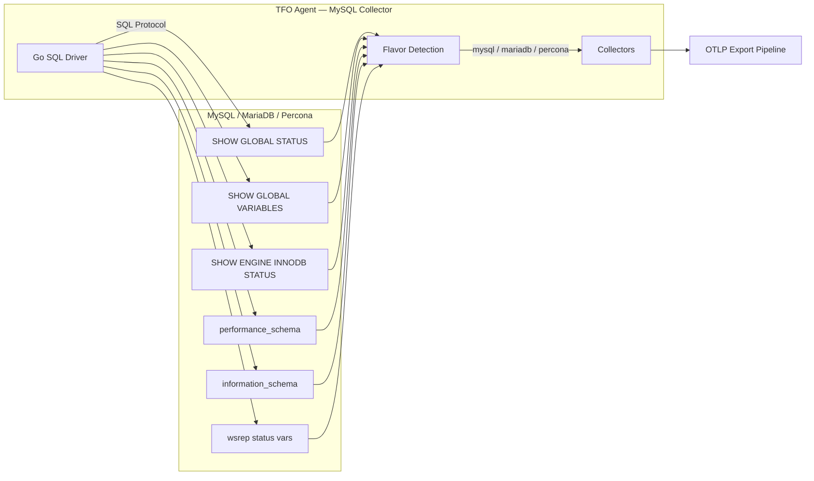
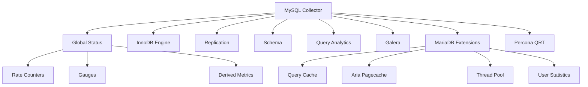

# MySQL / MariaDB / Percona Collector

Monitors MySQL, MariaDB, and Percona Server instances via direct database connection. Auto-detects the database flavor and enables engine-specific extensions.

## Data Source

Direct database connection using Go SQL driver. Queries `SHOW GLOBAL STATUS`, `SHOW GLOBAL VARIABLES`, `SHOW ENGINE INNODB STATUS`, `performance_schema`, `information_schema`, and flavor-specific commands.

## Architecture



## Sub-collector Hierarchy



## Sub-collectors

| Sub-collector      | Interval                | Description                                                               |
| ------------------ | ----------------------- | ------------------------------------------------------------------------- |
| Global Status      | `status_interval: 10s`  | Rate counters and gauges from `SHOW GLOBAL STATUS`                        |
| InnoDB Engine      | `status_interval: 10s`  | Buffer pool, row operations from `SHOW ENGINE INNODB STATUS`              |
| Replication        | `status_interval: 10s`  | Slave/replica status, multi-source support                                |
| Schema             | `schema_interval: 300s` | Table sizes, index stats, auto-increment usage                            |
| Query Analytics    | `query_interval: 60s`   | Top queries from `performance_schema.events_statements_summary_by_digest` |
| Galera             | `status_interval: 10s`  | Cluster health from `wsrep_%` status variables                            |
| MariaDB Extensions | `status_interval: 10s`  | Query cache, Aria, ColumnStore, Spider, thread pool, user stats           |
| Percona QRT        | `status_interval: 10s`  | Query response time buckets and percentiles                               |

---

## Global Status Metrics

### Rate Counters (per-second)

| Metric                                  | Source Variable           |
| --------------------------------------- | ------------------------- |
| `db.mysql.threads.created`              | `Threads_created`         |
| `db.mysql.connections.aborted_clients`  | `Aborted_clients`         |
| `db.mysql.connections.aborted_connects` | `Aborted_connects`        |
| `db.mysql.queries.total`                | `Queries`                 |
| `db.mysql.queries.select`               | `Com_select`              |
| `db.mysql.queries.insert`               | `Com_insert`              |
| `db.mysql.queries.update`               | `Com_update`              |
| `db.mysql.queries.delete`               | `Com_delete`              |
| `db.mysql.queries.commit`               | `Com_commit`              |
| `db.mysql.queries.rollback`             | `Com_rollback`            |
| `db.mysql.queries.slow`                 | `Slow_queries`            |
| `db.mysql.network.bytes_sent`           | `Bytes_sent`              |
| `db.mysql.network.bytes_received`       | `Bytes_received`          |
| `db.mysql.innodb.rows.read`             | `Innodb_rows_read`        |
| `db.mysql.innodb.rows.inserted`         | `Innodb_rows_inserted`    |
| `db.mysql.innodb.rows.updated`          | `Innodb_rows_updated`     |
| `db.mysql.innodb.rows.deleted`          | `Innodb_rows_deleted`     |
| `db.mysql.innodb.lock.waits`            | `Innodb_row_lock_waits`   |
| `db.mysql.innodb.deadlocks`             | `Innodb_deadlocks`        |
| `db.mysql.tmp_tables.memory`            | `Created_tmp_tables`      |
| `db.mysql.tmp_tables.disk`              | `Created_tmp_disk_tables` |
| `db.mysql.sort.rows`                    | `Sort_rows`               |
| `db.mysql.sort.merge_passes`            | `Sort_merge_passes`       |
| `db.mysql.handler.read_rnd_next`        | `Handler_read_rnd_next`   |
| `db.mysql.binlog.cache_use`             | `Binlog_cache_use`        |
| `db.mysql.binlog.cache_disk_use`        | `Binlog_cache_disk_use`   |

### Gauges

| Metric                                    | Source Variable                  |
| ----------------------------------------- | -------------------------------- |
| `db.mysql.threads.connected`              | `Threads_connected`              |
| `db.mysql.threads.running`                | `Threads_running`                |
| `db.mysql.innodb.buffer_pool.pages.total` | `Innodb_buffer_pool_pages_total` |
| `db.mysql.innodb.buffer_pool.pages.free`  | `Innodb_buffer_pool_pages_free`  |
| `db.mysql.innodb.buffer_pool.pages.dirty` | `Innodb_buffer_pool_pages_dirty` |
| `db.mysql.innodb.buffer_pool.bytes.data`  | `Innodb_buffer_pool_bytes_data`  |
| `db.mysql.open_tables`                    | `Open_tables`                    |
| `db.mysql.innodb.lock.time_avg`           | `Innodb_row_lock_time_avg`       |

### Derived Metrics

| Metric                                  | Description                         |
| --------------------------------------- | ----------------------------------- |
| `db.mysql.innodb.buffer_pool.hit_ratio` | 1 − (reads / read_requests)         |
| `db.mysql.connections.utilization`      | threads_connected / max_connections |
| `db.mysql.tmp_tables.disk_ratio`        | disk_tmp / total_tmp                |
| `db.mysql.threads.cache_hit_rate`       | 1 − (threads_created / connections) |

---

## InnoDB Engine Status

From `SHOW ENGINE INNODB STATUS`:

| Metric                                       | Description                     |
| -------------------------------------------- | ------------------------------- |
| `db.mysql.innodb.buffer_pool.pages.modified` | Modified (dirty) pages          |
| `db.mysql.innodb.read_views`                 | Active read views               |
| `db.mysql.innodb.queries_inside_innodb`      | Queries currently inside InnoDB |
| `db.mysql.innodb.queries_in_queue`           | Queries waiting in queue        |

---

## Replication

Labels: `replication_channel`

| Metric                                 | Description                |
| -------------------------------------- | -------------------------- |
| `db.mysql.replication.lag_seconds`     | Replication lag in seconds |
| `db.mysql.replication.io_running`      | IO thread running (0/1)    |
| `db.mysql.replication.sql_running`     | SQL thread running (0/1)   |
| `db.mysql.replication.relay_log_space` | Relay log space used       |
| `db.mysql.replication.last_error`      | Last error flag (0/1)      |

Supports multi-source replication via `SHOW ALL SLAVES STATUS` (MariaDB).

---

## Schema Metrics

Labels: `database`, `table`, `engine`

| Metric                                 | Description                     |
| -------------------------------------- | ------------------------------- |
| `db.mysql.schema.data_size`            | Data size in bytes              |
| `db.mysql.schema.index_size`           | Index size in bytes             |
| `db.mysql.schema.data_free`            | Free space in bytes             |
| `db.mysql.schema.rows`                 | Approximate row count           |
| `db.mysql.schema.auto_increment_usage` | Auto-increment usage percentage |

---

## Query Analytics

From `performance_schema.events_statements_summary_by_digest`. Labels: `digest`, `schema`

| Metric                         | Description                           |
| ------------------------------ | ------------------------------------- |
| `db.mysql.query.calls`         | Query execution count                 |
| `db.mysql.query.total_time_us` | Total execution time (microseconds)   |
| `db.mysql.query.avg_time_us`   | Average execution time (microseconds) |
| `db.mysql.query.rows_sent`     | Rows sent                             |
| `db.mysql.query.rows_examined` | Rows examined                         |

---

## Galera Cluster

| Metric                                | Description                  |
| ------------------------------------- | ---------------------------- |
| `db.mysql.galera.cluster_size`        | Cluster node count           |
| `db.mysql.galera.ready`               | Node ready (0/1)             |
| `db.mysql.galera.connected`           | Node connected (0/1)         |
| `db.mysql.galera.flow_control_paused` | Flow control paused fraction |
| `db.mysql.galera.recv_queue_avg`      | Average receive queue length |
| `db.mysql.galera.send_queue_avg`      | Average send queue length    |
| `db.mysql.galera.local_state`         | Local node state code        |

---

## MariaDB Extensions

### Query Cache

| Metric                             | Description                |
| ---------------------------------- | -------------------------- |
| `db.mysql.qcache.hit_ratio`        | Query cache hit ratio      |
| `db.mysql.qcache.fragmentation`    | Query cache fragmentation  |
| `db.mysql.qcache.free_memory`      | Free memory in query cache |
| `db.mysql.qcache.queries_in_cache` | Queries currently cached   |

### Aria Pagecache

| Metric                                  | Description              |
| --------------------------------------- | ------------------------ |
| `db.mysql.aria.pagecache.hit_ratio`     | Aria pagecache hit ratio |
| `db.mysql.aria.pagecache.blocks_used`   | Blocks used              |
| `db.mysql.aria.pagecache.blocks_unused` | Blocks unused            |

### Thread Pool

| Metric                               | Description               |
| ------------------------------------ | ------------------------- |
| `db.mysql.threadpool.threads`        | Total threads             |
| `db.mysql.threadpool.active_threads` | Active threads            |
| `db.mysql.threadpool.idle_threads`   | Idle threads              |
| `db.mysql.threadpool.utilization`    | Thread pool utilization % |

### User Statistics

Labels: `user`

| Metric                                 | Description                |
| -------------------------------------- | -------------------------- |
| `db.mysql.userstats.total_connections` | Total connections per user |
| `db.mysql.userstats.cpu_time`          | CPU time per user          |
| `db.mysql.userstats.rows_read`         | Rows read per user         |
| `db.mysql.userstats.rows_written`      | Rows written per user      |

---

## Common Labels

| Label            | Description                      |
| ---------------- | -------------------------------- |
| `mysql_instance` | Instance name from config        |
| `mysql_host`     | Instance host                    |
| `mysql_flavor`   | `mysql`, `mariadb`, or `percona` |
| `mysql_version`  | Server version string            |

---

## Configuration

```yaml
mysql:
  enabled: true
  status_interval: 10s
  query_interval: 60s
  schema_interval: 300s
  instances:
    - name: "primary"
      host: "localhost"
      port: 3306
      username: "root"
      password: "${MYSQL_PASSWORD}"
      database: ""
      tls_enabled: false
      tls_skip_verify: false
      max_open_conns: 3
      tags: {}
      include_databases: []
      exclude_databases: []
```

## Notes

- Flavor auto-detection: queries `@@version_comment` on first connection.
- Connection pooling with exponential backoff (1s to 60s cap).
- Schema metrics are only collected when `schema_interval > 0`.
- Percona Query Response Time requires the `query_response_time` plugin enabled.
