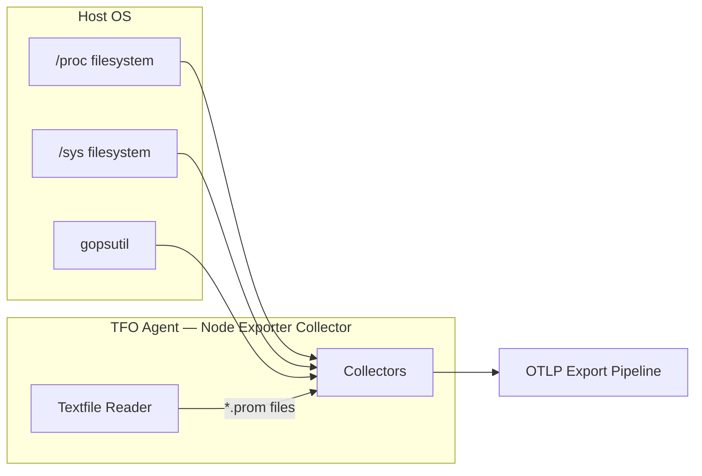
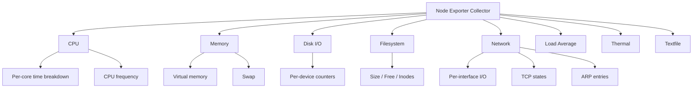

# Node Exporter Collector

Collects host-level OS metrics equivalent to Prometheus `node_exporter`. Uses `gopsutil` for cross-platform support and reads Linux `/proc`/`/sys` directly where needed.

## Architecture



## Sub-collector Hierarchy



## Sub-collectors

| Sub-collector | Config flag                | Description                               |
| ------------- | -------------------------- | ----------------------------------------- |
| CPU           | `collect_cpu: true`        | Per-core time breakdown and CPU frequency |
| Memory        | `collect_memory: true`     | Virtual memory and swap details           |
| Disk I/O      | `collect_disk_io: true`    | Per-device block I/O counters             |
| Filesystem    | `collect_filesystem: true` | Per-mountpoint size, free, inodes         |
| Network       | `collect_network: true`    | Per-interface I/O, TCP states, ARP        |
| Load Average  | `collect_load_avg: true`   | 1/5/15-minute load averages               |
| Thermal       | `collect_thermal: true`    | Hardware sensor temperatures              |
| Textfile      | `textfile_path: "/path"`   | Custom Prometheus `.prom` files           |

---

## CPU Metrics

| Metric                  | Type    | Unit    | Labels        | Description                |
| ----------------------- | ------- | ------- | ------------- | -------------------------- |
| `node.cpu.seconds`      | Counter | seconds | `cpu`, `mode` | CPU time per core per mode |
| `node.cpu.frequency_hz` | Gauge   | hertz   | `cpu`         | Current CPU frequency      |

**Modes:** `user`, `system`, `idle`, `iowait`, `irq`, `softirq`, `steal`, `guest`, `nice`

---

## Memory Metrics

| Metric                           | Type    | Unit  | Description         |
| -------------------------------- | ------- | ----- | ------------------- |
| `node.memory.total_bytes`        | Gauge   | bytes | Total memory        |
| `node.memory.free_bytes`         | Gauge   | bytes | Free memory         |
| `node.memory.available_bytes`    | Gauge   | bytes | Available memory    |
| `node.memory.buffers_bytes`      | Gauge   | bytes | Buffer memory       |
| `node.memory.cached_bytes`       | Gauge   | bytes | Cached memory       |
| `node.memory.active_bytes`       | Gauge   | bytes | Active memory       |
| `node.memory.inactive_bytes`     | Gauge   | bytes | Inactive memory     |
| `node.memory.wired_bytes`        | Gauge   | bytes | Wired memory        |
| `node.memory.shared_bytes`       | Gauge   | bytes | Shared memory       |
| `node.memory.slab_bytes`         | Gauge   | bytes | Slab memory         |
| `node.memory.page_tables_bytes`  | Gauge   | bytes | Page table memory   |
| `node.memory.committed_as_bytes` | Gauge   | bytes | Committed AS        |
| `node.memory.commit_limit_bytes` | Gauge   | bytes | Commit limit        |
| `node.memory.dirty_bytes`        | Gauge   | bytes | Dirty pages         |
| `node.memory.writeback_bytes`    | Gauge   | bytes | Writeback pages     |
| `node.memory.swap_total_bytes`   | Gauge   | bytes | Swap total          |
| `node.memory.swap_used_bytes`    | Gauge   | bytes | Swap used           |
| `node.memory.swap_free_bytes`    | Gauge   | bytes | Swap free           |
| `node.memory.swap_in_bytes`      | Counter | bytes | Cumulative swap in  |
| `node.memory.swap_out_bytes`     | Counter | bytes | Cumulative swap out |

---

## Disk I/O Metrics

Labels: `device`

| Metric                                     | Type    | Unit    | Description                |
| ------------------------------------------ | ------- | ------- | -------------------------- |
| `node.disk.read_bytes_total`               | Counter | bytes   | Total bytes read           |
| `node.disk.written_bytes_total`            | Counter | bytes   | Total bytes written        |
| `node.disk.reads_completed_total`          | Counter | —       | Read operations completed  |
| `node.disk.writes_completed_total`         | Counter | —       | Write operations completed |
| `node.disk.read_time_seconds_total`        | Counter | seconds | Time spent reading         |
| `node.disk.write_time_seconds_total`       | Counter | seconds | Time spent writing         |
| `node.disk.io_time_seconds_total`          | Counter | seconds | Time spent doing I/O       |
| `node.disk.io_time_weighted_seconds_total` | Counter | seconds | Weighted I/O time          |
| `node.disk.io_now`                         | Gauge   | —       | I/O operations in progress |

---

## Filesystem Metrics

Labels: `device`, `mountpoint`, `fstype`

| Metric                        | Type  | Unit  | Description                |
| ----------------------------- | ----- | ----- | -------------------------- |
| `node.filesystem.size_bytes`  | Gauge | bytes | Filesystem total size      |
| `node.filesystem.free_bytes`  | Gauge | bytes | Filesystem free space      |
| `node.filesystem.avail_bytes` | Gauge | bytes | Filesystem available space |
| `node.filesystem.files`       | Gauge | —     | Total inodes               |
| `node.filesystem.files_free`  | Gauge | —     | Free inodes                |

---

## Network Metrics

### Per-interface I/O

Labels: `device`

| Metric                                | Type    | Unit  | Description                 |
| ------------------------------------- | ------- | ----- | --------------------------- |
| `node.network.receive_bytes_total`    | Counter | bytes | Total bytes received        |
| `node.network.transmit_bytes_total`   | Counter | bytes | Total bytes transmitted     |
| `node.network.receive_packets_total`  | Counter | —     | Packets received            |
| `node.network.transmit_packets_total` | Counter | —     | Packets transmitted         |
| `node.network.receive_errs_total`     | Counter | —     | Receive errors              |
| `node.network.transmit_errs_total`    | Counter | —     | Transmit errors             |
| `node.network.receive_drop_total`     | Counter | —     | Received packets dropped    |
| `node.network.transmit_drop_total`    | Counter | —     | Transmitted packets dropped |
| `node.network.mtu`                    | Gauge   | —     | Interface MTU               |
| `node.network.up`                     | Gauge   | —     | Interface up (1) / down (0) |

### TCP States

Labels: `state`

| Metric                       | Type  | Description                   |
| ---------------------------- | ----- | ----------------------------- |
| `node.tcp.connection_states` | Gauge | TCP connection count by state |

### ARP

Labels: `device`

| Metric             | Type  | Description                                        |
| ------------------ | ----- | -------------------------------------------------- |
| `node.arp.entries` | Gauge | ARP entry count per device (Linux `/proc/net/arp`) |

---

## Load Average Metrics

| Metric        | Type  | Description            |
| ------------- | ----- | ---------------------- |
| `node.load1`  | Gauge | 1-minute load average  |
| `node.load5`  | Gauge | 5-minute load average  |
| `node.load15` | Gauge | 15-minute load average |

---

## Thermal Metrics

Labels: `sensor`

| Metric                             | Type  | Unit    | Description                     |
| ---------------------------------- | ----- | ------- | ------------------------------- |
| `node.thermal.temperature_celsius` | Gauge | celsius | Hardware temperature per sensor |

---

## Textfile Collector

Reads `*.prom` files from the configured `textfile_path` directory. Supports standard Prometheus exposition format:

```
metric_name{label="value"} 42.0
metric_name 100
```

Useful for injecting custom or external metrics into the agent pipeline.

---

## Configuration

```yaml
node_exporter:
  enabled: true
  interval: 15s
  collect_cpu: true
  collect_memory: true
  collect_disk_io: true
  collect_filesystem: true
  collect_network: true
  collect_load_avg: true
  collect_thermal: true
  textfile_path: ""
  exclude_disks: [] # device patterns to skip
  exclude_mounts: [] # mountpoint patterns to skip
  exclude_fs_types: [] # fstype patterns to skip (tmpfs, devfs, etc.)
  exclude_network_devices: []
```
