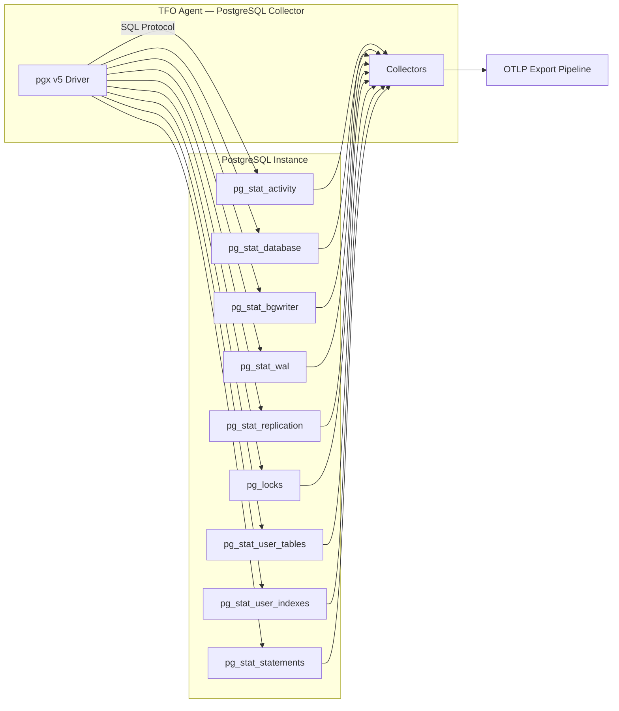
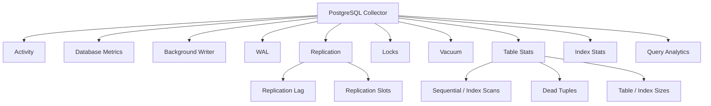

# PostgreSQL Collector

Monitors PostgreSQL instances via `pg_stat_*` views using the pgx driver. Covers connections, transactions, bgwriter, WAL (PG14+), replication, locks, vacuum progress, table/index stats, bloat estimates, and query analytics via `pg_stat_statements`.

## Data Source

Direct database connection using pgx v5 driver. Queries `pg_stat_activity`, `pg_stat_database`, `pg_stat_bgwriter`, `pg_stat_wal`, `pg_stat_replication`, `pg_locks`, `pg_stat_user_tables`, `pg_stat_user_indexes`, `pg_stat_statements`, and system catalogs.

## Architecture



## Sub-collector Hierarchy



## Sub-collectors

| Sub-collector     | Interval                    | Description                                       |
| ----------------- | --------------------------- | ------------------------------------------------- |
| Activity          | `activity_interval: 15s`    | Connections, idle, waiting, utilization           |
| Database Metrics  | `activity_interval: 15s`    | Cache hit ratio, transactions, tuples, temp files |
| Background Writer | `activity_interval: 15s`    | Checkpoint stats, buffer writes                   |
| WAL               | `activity_interval: 15s`    | WAL records, bytes, sync time (PG14+)             |
| Replication       | `activity_interval: 15s`    | Replication lag, slots, subscriptions             |
| Locks             | `activity_interval: 15s`    | Lock counts by type/mode, blocked sessions        |
| Vacuum            | `activity_interval: 15s`    | Vacuum progress, dead tuples, XID age             |
| Table Stats       | `table_stats_interval: 60s` | Sequential/index scans, dead tuples, I/O, sizes   |
| Index Stats       | `table_stats_interval: 60s` | Index usage, bloat, unused index detection        |
| Query Analytics   | `query_interval: 60s`       | Top queries from `pg_stat_statements`             |

---

## Connection Metrics

Labels: `dbname`

| Metric                                          | Type  | Description                         |
| ----------------------------------------------- | ----- | ----------------------------------- |
| `db.postgresql.connections.active`              | Gauge | Active connections                  |
| `db.postgresql.connections.idle`                | Gauge | Idle connections                    |
| `db.postgresql.connections.idle_in_transaction` | Gauge | Idle in transaction                 |
| `db.postgresql.connections.waiting`             | Gauge | Waiting connections                 |
| `db.postgresql.connections.total`               | Gauge | Total connections                   |
| `db.postgresql.connections.utilization_pct`     | Gauge | Connections as % of max_connections |

---

## Database Metrics

Labels: `dbname`

| Metric                                | Type    | Description              |
| ------------------------------------- | ------- | ------------------------ |
| `db.postgresql.cache.hit_ratio`       | Gauge   | Cache hit ratio %        |
| `db.postgresql.transactions.commit`   | Counter | Committed transactions   |
| `db.postgresql.transactions.rollback` | Counter | Rolled back transactions |
| `db.postgresql.tuples.returned`       | Counter | Tuples returned          |
| `db.postgresql.tuples.fetched`        | Counter | Tuples fetched           |
| `db.postgresql.tuples.inserted`       | Counter | Tuples inserted          |
| `db.postgresql.tuples.updated`        | Counter | Tuples updated           |
| `db.postgresql.tuples.deleted`        | Counter | Tuples deleted           |
| `db.postgresql.temp.files`            | Counter | Temporary files created  |
| `db.postgresql.temp.bytes`            | Counter | Temporary bytes written  |
| `db.postgresql.db_size.bytes`         | Gauge   | Database size in bytes   |

Per-second rate variants: `commit_rate`, `rollback_rate`, `returned_rate`, etc.

---

## Background Writer

| Metric                                         | Type    | Description                   |
| ---------------------------------------------- | ------- | ----------------------------- |
| `db.postgresql.bgwriter.checkpoints_timed`     | Counter | Scheduled checkpoints         |
| `db.postgresql.bgwriter.checkpoints_req`       | Counter | Requested checkpoints         |
| `db.postgresql.bgwriter.checkpoint_write_time` | Counter | Checkpoint write time (ms)    |
| `db.postgresql.bgwriter.checkpoint_sync_time`  | Counter | Checkpoint sync time (ms)     |
| `db.postgresql.bgwriter.buffers_checkpoint`    | Counter | Buffers written at checkpoint |
| `db.postgresql.bgwriter.buffers_clean`         | Counter | Buffers cleaned by bgwriter   |
| `db.postgresql.bgwriter.buffers_backend`       | Counter | Buffers written by backends   |

---

## WAL Metrics (PostgreSQL 14+)

| Metric                         | Type    | Description           |
| ------------------------------ | ------- | --------------------- |
| `db.postgresql.wal.records`    | Counter | WAL records generated |
| `db.postgresql.wal.bytes`      | Counter | WAL bytes generated   |
| `db.postgresql.wal.writes`     | Counter | WAL writes            |
| `db.postgresql.wal.syncs`      | Counter | WAL syncs             |
| `db.postgresql.wal.write_time` | Counter | WAL write time (ms)   |
| `db.postgresql.wal.sync_time`  | Counter | WAL sync time (ms)    |

---

## Replication

Labels: `client_addr`, `application_name`, `state`

| Metric                                     | Type  | Description             |
| ------------------------------------------ | ----- | ----------------------- |
| `db.postgresql.replication.write_lag_sec`  | Gauge | Write lag (seconds)     |
| `db.postgresql.replication.flush_lag_sec`  | Gauge | Flush lag (seconds)     |
| `db.postgresql.replication.replay_lag_sec` | Gauge | Replay lag (seconds)    |
| `db.postgresql.replication.lag_bytes`      | Gauge | Replication lag (bytes) |

### Replication Slots

Labels: `slot_name`, `slot_type`

| Metric                                        | Type  | Description          |
| --------------------------------------------- | ----- | -------------------- |
| `db.postgresql.replication.slot.active`       | Gauge | Slot active (0/1)    |
| `db.postgresql.replication.slot.retain_bytes` | Gauge | WAL retained (bytes) |

---

## Table Stats

Labels: `schemaname`, `tablename`

| Metric                                 | Type  | Description                  |
| -------------------------------------- | ----- | ---------------------------- |
| `db.postgresql.table.seq_scan`         | Gauge | Sequential scans             |
| `db.postgresql.table.idx_scan`         | Gauge | Index scans                  |
| `db.postgresql.table.n_live_tup`       | Gauge | Live tuples                  |
| `db.postgresql.table.n_dead_tup`       | Gauge | Dead tuples                  |
| `db.postgresql.table.dead_tuple_ratio` | Gauge | Dead tuple ratio % (derived) |
| `db.postgresql.table.hot_update_ratio` | Gauge | HOT update ratio % (derived) |
| `db.postgresql.table.table_size`       | Gauge | Table size (bytes)           |
| `db.postgresql.table.index_size`       | Gauge | Index size (bytes)           |
| `db.postgresql.table.total_size`       | Gauge | Total size including TOAST   |
| `db.postgresql.table.last_vacuum_ago`  | Gauge | Seconds since last vacuum    |
| `db.postgresql.table.last_analyze_ago` | Gauge | Seconds since last analyze   |

---

## Index Stats

Labels: `schemaname`, `tablename`, `indexname`

| Metric                             | Type  | Description               |
| ---------------------------------- | ----- | ------------------------- |
| `db.postgresql.index.idx_scan`     | Gauge | Index scans               |
| `db.postgresql.index.idx_tup_read` | Gauge | Tuples read via index     |
| `db.postgresql.index.bloat_pct`    | Gauge | Index bloat %             |
| `db.postgresql.index.unused`       | Gauge | Unused index flag (0/1)   |
| `db.postgresql.index.unused_bytes` | Gauge | Unused index size (bytes) |

---

## Query Analytics

From `pg_stat_statements`. Labels: `queryid`, `dbname`

| Metric                                 | Type    | Description               |
| -------------------------------------- | ------- | ------------------------- |
| `db.postgresql.query.calls`            | Counter | Query execution count     |
| `db.postgresql.query.total_time_ms`    | Counter | Total execution time (ms) |
| `db.postgresql.query.mean_time_ms`     | Gauge   | Mean execution time (ms)  |
| `db.postgresql.query.rows`             | Counter | Rows processed            |
| `db.postgresql.query.shared_blks_hit`  | Counter | Shared blocks hit         |
| `db.postgresql.query.shared_blks_read` | Counter | Shared blocks read        |

---

## Configuration

```yaml
postgresql:
  enabled: true
  activity_interval: 15s
  query_interval: 60s
  table_stats_interval: 60s
  max_connections: 3
  top_queries_limit: 200
  collect_pg_stat_statements: true
  collect_table_stats: true
  collect_replication: true
  instances:
    - name: "pg-primary"
      host: "localhost"
      port: 5432
      user: "postgres"
      password: "${PG_PASSWORD}"
      database: "postgres"
      sslmode: "prefer"
      ssl_root_cert: ""
      ssl_cert: ""
      ssl_key: ""
      tags: {}
```

### RDS PostgreSQL Variant

For AWS RDS PostgreSQL, use the `rds_postgresql` collector which adds:

- Automatic RDS CA bundle loading from well-known paths
- TLS configuration for RDS endpoints
- Platform reporter for TFO integration

## Notes

- WAL metrics require PostgreSQL 14+ (uses `pg_stat_wal` view).
- Query analytics requires `pg_stat_statements` extension enabled.
- Bloat estimation uses approximate formulas based on `pg_stat_user_tables`.
- Unused index detection excludes primary keys and unique constraints.
