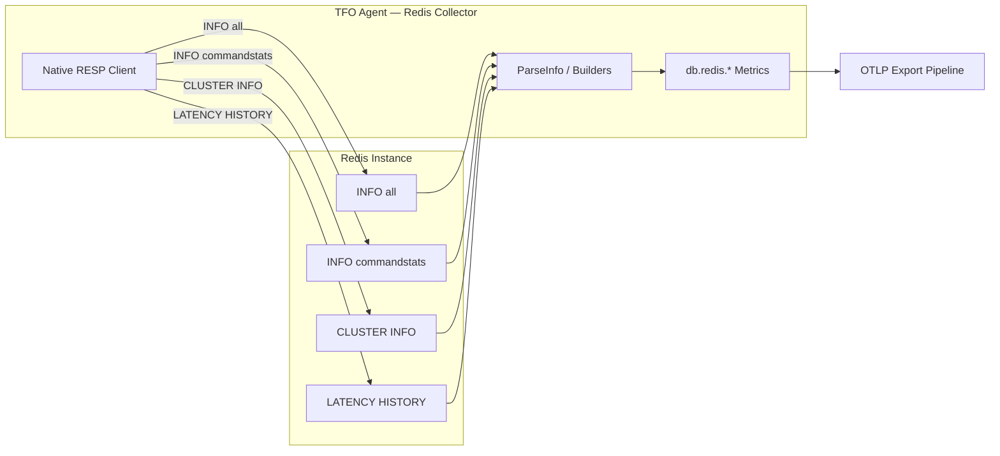
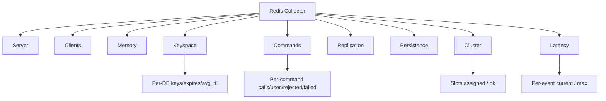

# Redis Collector

Monitors Redis 4.x and newer instances (including Valkey and Redis-compatible servers) by speaking the native **RESP** (REdis Serialization Protocol) wire protocol over TCP. The collector ships its own minimal RESP client — **no external Redis library is required** — so the binary stays small and the dependency surface stays frozen.

Collects `INFO all`, `INFO commandstats`, `CLUSTER INFO`, and (optionally) `LATENCY HISTORY` per instance, then maps every field into the `db.redis.*` metric namespace with consistent labels.

## Data Source

RESP client connecting to `host:port`. Sends `AUTH` / `SELECT` when configured, then issues:

- `INFO all` — server, clients, memory, persistence, stats, replication, keyspace
- `INFO commandstats` — per-command counters (`cmdstat_GET:calls=…`)
- `CLUSTER INFO` — cluster health (only when `cluster_enabled: 1`)
- `LATENCY HISTORY <event>` — per-event latency samples (only when `collect_latency: true`)

## Architecture



## Sub-collector Hierarchy



## Sub-collectors

| Sub-collector | Source                         | Interval                 | Description                                                       |
| ------------- | ------------------------------ | ------------------------ | ----------------------------------------------------------------- |
| Server        | `INFO all`                     | `info_interval: 15s`     | Uptime and semantic version components                            |
| Clients       | `INFO all`                     | `info_interval: 15s`     | Connected, blocked, rejected, total client counts                 |
| Memory        | `INFO all`                     | `info_interval: 15s`     | Used / RSS / peak / maxmemory / fragmentation / system memory     |
| Keyspace      | `INFO all` (`db0=…`)           | `info_interval: 15s`     | Per-DB keys, expires, avg TTL; hit/miss/expired/evicted counters  |
| Commands      | `INFO commandstats`            | `info_interval: 15s`     | Per-command calls, usec, usec_per_call, rejected_calls, failed_calls |
| Replication   | `INFO all`                     | `info_interval: 15s`     | Role, connected replicas, replication offset                      |
| Persistence   | `INFO all`                     | `info_interval: 15s`     | RDB bgsave and AOF rewrite state                                  |
| Cluster       | `CLUSTER INFO`                 | `info_interval: 15s`     | Cluster enabled flag, state, slot assignment                      |
| Latency       | `LATENCY HISTORY <event>`      | `info_interval: 15s`     | Per-event current and max latency (opt-in via `collect_latency`)  |

---

## Server Metrics

| Metric                       | Type    | Unit | Source INFO key      | Description                                  |
| ---------------------------- | ------- | ---- | -------------------- | -------------------------------------------- |
| `db.redis.uptime_seconds`    | Counter | s    | `uptime_in_seconds`  | Server uptime since boot                     |
| `db.redis.version_major`     | Gauge   |      | `redis_version`      | Major version component (e.g. `7`)           |
| `db.redis.version_minor`     | Gauge   |      | `redis_version`      | Minor version component (e.g. `2`)           |
| `db.redis.version_patch`     | Gauge   |      | `redis_version`      | Patch version component (e.g. `0`)           |

The `redis_version` string (e.g. `7.2.4`) is parsed into three numeric gauges so dashboards can alert on specific branches (for example "any Redis < 7.0").

## Clients Metrics

| Metric                                 | Type    | Source INFO key                | Description                                   |
| -------------------------------------- | ------- | ------------------------------ | --------------------------------------------- |
| `db.redis.connected_clients`          | Gauge   | `connected_clients`            | Currently connected client connections        |
| `db.redis.total_connections_received`  | Counter | `total_connections_received`   | Total connections accepted since start        |
| `db.redis.rejected_connections`        | Counter | `rejected_connections`         | Connections rejected due to `maxclients`      |
| `db.redis.blocked_clients`             | Gauge   | `blocked_clients`              | Clients blocked on `BLPOP`/`BRPOP`/`WAIT`/etc |

## Memory Metrics

| Metric                                | Type    | Unit  | Source INFO key           | Description                                              |
| ------------------------------------- | ------- | ----- | ------------------------- | -------------------------------------------------------- |
| `db.redis.used_memory`                | Gauge   | bytes | `used_memory`             | Memory allocated by Redis (via its allocator)            |
| `db.redis.used_memory_rss`            | Gauge   | bytes | `used_memory_rss`         | Memory as seen by the OS (resident set size)             |
| `db.redis.used_memory_peak`           | Gauge   | bytes | `used_memory_peak`        | Peak `used_memory` since start                           |
| `db.redis.maxmemory`                  | Gauge   | bytes | `maxmemory`               | Configured `maxmemory` limit (`0` = no limit)            |
| `db.redis.mem_fragmentation_ratio`    | Gauge   |       | `mem_fragmentation_ratio` | `used_memory_rss / used_memory` (>~1.5 indicates thrash) |
| `db.redis.system_memory`              | Counter | bytes | `total_system_memory`     | Total RAM on the host                                    |

> **Recommended alert:** `db.redis.mem_fragmentation_ratio > 1.5` for 10 min while `used_memory` is stable indicates allocator fragmentation — restart or defrag.

## Keyspace Metrics

Aggregate counters come from the `Stats` INFO section; per-database gauges are emitted from the `Keyspace` section (`db0:keys=N,expires=M,avg_ttl=T`).

| Metric                                  | Type    | Source INFO key       | Description                                |
| --------------------------------------- | ------- | --------------------- | ------------------------------------------ |
| `db.redis.expired_keys`                 | Counter | `expired_keys`        | Keys removed by TTL                        |
| `db.redis.evicted_keys`                 | Counter | `evicted_keys`        | Keys removed by `maxmemory-policy`         |
| `db.redis.keyspace_hits`                | Gauge   | `keyspace_hits`       | Successful key lookups                     |
| `db.redis.keyspace_misses`              | Gauge   | `keyspace_misses`     | Failed key lookups                         |
| `db.redis.keyspace.keys`                | Gauge   | `dbN:keys`            | Keys in DB `N` (label `redis_db=dbN`)      |
| `db.redis.keyspace.expires`             | Gauge   | `dbN:expires`         | Keys with TTL in DB `N`                    |
| `db.redis.keyspace.avg_ttl`             | Gauge   | `dbN:avg_ttl`         | Average remaining TTL in milliseconds      |

> **Hit ratio (derived in dashboards):** `rate(db.redis.keyspace_hits[5m]) / (rate(db.redis.keyspace_hits[5m]) + rate(db.redis.keyspace_misses[5m]))`.

## Command Metrics

Emitted only when `collect_command_stats: true` (default). One series per `(redis_instance, redis_command)` pair. Redis uppercases command names (`cmdstat_GET`, `cmdstat_SET`, `cmdstat_CONFIG|GET`, …).

| Metric                                  | Type    | Source INFO key                 | Description                                          |
| --------------------------------------- | ------- | ------------------------------- | ---------------------------------------------------- |
| `db.redis.total_commands_processed`     | Counter | `total_commands_processed`      | Commands processed since start                       |
| `db.redis.ops_per_sec`                  | Counter | `instantaneous_ops_per_sec`     | Instantaneous ops/s (Redis-computed)                 |
| `db.redis.net_input_bytes`              | Counter | `net_input_bytes`               | Total bytes read from clients                        |
| `db.redis.net_output_bytes`             | Counter | `net_output_bytes`              | Total bytes written to clients                       |
| `db.redis.command.calls`                | Counter | `cmdstat_X:calls`               | Invocations of command `X`                           |
| `db.redis.command.usec`                 | Counter | `cmdstat_X:usec`                | Total CPU microseconds spent in `X`                  |
| `db.redis.command.usec_per_call`         | Counter | `cmdstat_X:usec_per_call`       | Average µs per call (Redis-computed)                 |
| `db.redis.command.rejected_calls`        | Counter | `cmdstat_X:rejected_calls`      | Calls rejected before execution (Redis 7+)           |
| `db.redis.command.failed_calls`          | Counter | `cmdstat_X:failed_calls`        | Calls that raised an error during execution (7+)     |

## Replication Metrics

| Metric                              | Type    | Source INFO key  | Description                                            |
| ----------------------------------- | ------- | ---------------- | ------------------------------------------------------ |
| `db.redis.connected_slaves`         | Gauge   | `connected_slaves` | Number of currently connected replicas               |
| `db.redis.replication_offset`       | Gauge   | `repl_offset`    | Master replication offset (bytes)                      |
| `db.redis.role`                     | Gauge   | `role`           | Replication role (`1` = master, `0` = slave/replica)   |

> `role` is emitted as a numeric gauge so it can be aggregated with `max() by (redis_instance)` to detect split-brain (more than one master per shard).

## Persistence Metrics

| Metric                                       | Type    | Source INFO key                  | Description                                          |
| -------------------------------------------- | ------- | -------------------------------- | ---------------------------------------------------- |
| `db.redis.rdb_changes_since_last_save`       | Gauge   | `rdb_changes_since_last_save`    | Dirty pages since last `BGSAVE`                      |
| `db.redis.rdb_bgsave_in_progress`            | Counter | `rdb_bgsave_in_progress`         | `1` when a background RDB save is running            |
| `db.redis.aof_enabled`                       | Gauge   | `aof_enabled`                    | `1` when AOF persistence is enabled                  |
| `db.redis.aof_rewrite_in_progress`           | Counter | `aof_rewrite_in_progress`        | `1` when an AOF rewrite is currently running         |

## Cluster Metrics

Emitted only when the target reports `cluster_enabled:1` (collected via `CLUSTER INFO`). On standalone instances these series are absent — alert on `absent_over_time(db.redis.cluster_state[5m])` if you expect cluster mode.

| Metric                                | Type    | Source CLUSTER key        | Description                                            |
| ------------------------------------- | ------- | ------------------------- | ------------------------------------------------------ |
| `db.redis.cluster_enabled`            | Gauge   | `cluster_enabled`         | `1` when the node has cluster mode on                  |
| `db.redis.cluster_state`              | Gauge   | `cluster_state`           | `1` when `ok`, `0` when `fail`                         |
| `db.redis.cluster_slots_assigned`     | Gauge   | `cluster_slots_assigned`  | Total hash slots assigned to any node (target: 16384)  |
| `db.redis.cluster_slots_ok`           | Gauge   | `cluster_slots_ok`        | Hash slots in `OK` state                               |

## Latency Metrics (optional)

Emitted only when `collect_latency: true` (default: `false`). The collector walks the well-known latency events for the current Redis major version and emits per-event samples via `LATENCY HISTORY`. Latency monitoring must also be enabled on the Redis side (`latency-monitor-threshold > 0`).

| Metric                          | Type    | Unit | Labels | Description                                            |
| ------------------------------- | ------- | ---- | ------ | ------------------------------------------------------ |
| `db.redis.latency_ms`           | Gauge   | ms   | `event`| Most recent latency sample for the event               |
| `db.redis.latency_max_ms`       | Gauge   | ms   | `event`| Peak latency recorded for the event                    |

Default events surfaced: `command`, `fast-command`, `expire-cycle`, `eviction-cycle`, `aof-write`, `aof-fsync-always`, `rdb-unlink-temp-file`, `fork`. Any custom event raised by the server appears automatically.

---

## Labels Reference

Every metric emitted by the Redis collector carries the following base labels:

| Label              | Source                          | Description                                                |
| ------------------ | ------------------------------- | ---------------------------------------------------------- |
| `redis_instance`   | `instances[].name`              | Human instance name from config                            |
| `redis_host`       | `instances[].host`              | Hostname/IP the collector connected to                     |
| `db_system`        | Constant `redis`                | Allows cross-DB correlation in the TFO platform            |

Additional labels added on specific metric families:

| Label             | Applied to                                                | Description                                     |
| ----------------- | --------------------------------------------------------- | ----------------------------------------------- |
| `redis_db`        | `db.redis.keyspace.*`                                     | Logical database index (`db0`, `db1`, …)        |
| `redis_command`   | `db.redis.command.*`                                      | Uppercase command name (`GET`, `SET`, …)        |
| `event`           | `db.redis.latency_ms`, `db.redis.latency_max_ms`          | Latency event name (e.g. `command`)             |

User-supplied tags merge on top of the base labels. Collector-level `tags` are applied first; instance-level `tags` override them — this lets you set `env: prod` once and then refine `region: us-east-1` per instance.

---

## Configuration

Mirrors `RedisCollectorConfig` and `RedisInstanceConfig` in `internal/config/config.go`.

```yaml
redis:
  # Collector-level toggles
  enabled: true
  info_interval: 15s        # how often to scrape INFO / CLUSTER / LATENCY (default 15s)
  tags:                     # applied to every metric from every instance
    env: "prod"

  instances:
    - name: "cart-cache-primary"   # required; becomes the redis_instance label
      host: "127.0.0.1"
      port: 6379
      password: "${REDIS_PASSWORD}" # env-expanded; omit when ACL is used without password
      db: 0                         # logical DB to SELECT before running commands

      # TLS
      tls_enabled: false
      tls_skip_verify: false        # set true only for self-signed dev certs

      # Opt-in sub-collectors
      collect_latency: false        # NEW: enables LATENCY HISTORY (needs latency-monitor-threshold > 0)
      collect_command_stats: true   # INFO commandstats on/off

      tags:                         # merged over the collector-level tags
        role: "primary"
        shard: "0"
```

### Field Reference

#### `redis.*` (collector)

| Field           | Type             | Default | Description                                                                |
| --------------- | ---------------- | ------- | -------------------------------------------------------------------------- |
| `enabled`       | bool             | `false` | Enables the collector                                                      |
| `info_interval` | duration         | `15s`   | Scrape cadence for `INFO`, `CLUSTER INFO`, and `LATENCY HISTORY`           |
| `instances`     | list             | `[]`    | One entry per Redis instance to monitor                                    |
| `tags`          | map\<str,str\>   | `{}`    | Collector-level tags applied to every metric before instance tags override |

#### `redis.instances[]`

| Field                    | Type             | Default | Description                                                                                |
| ------------------------ | ---------------- | ------- | ------------------------------------------------------------------------------------------ |
| `name`                   | string           |         | Instance name; emitted as `redis_instance`                                                 |
| `host`                   | string           |         | Hostname or IP                                                                             |
| `port`                   | int              | `6379`  | TCP port                                                                                   |
| `password`               | string           | `""`    | AUTH password; env-expanded. Use ACL username via `name` if you rely on ACL identities.    |
| `db`                     | int              | `0`     | Logical DB to `SELECT` after AUTH (most INFO is global but `keyspace` honors the active DB)|
| `tls_enabled`            | bool             | `false` | Wrap the connection in TLS (Redis 6+ `tls-port` or a stunnel)                              |
| `tls_skip_verify`        | bool             | `false` | Skip TLS cert verification (use only for self-signed dev/staging)                          |
| `collect_latency`        | bool             | `false` | **NEW** — enable `LATENCY HISTORY` collection                                              |
| `collect_command_stats`  | bool             | `true`  | Enable `INFO commandstats` (turn off to reduce series cardinality on huge keyspaces)       |
| `tags`                   | map\<str,str\>   | `{}`    | Per-instance tags; override collector-level tags with the same key                         |

---

## TLS

Redis speaks plaintext RESP by default. To enable TLS:

1. Configure Redis 6+ with a `tls-port` (and a cert/key pair), or front the instance with `stunnel` / `haproxy` over TLS.
2. In `instances[].*`, set `tls_enabled: true`.
3. If the certificate is self-signed and you accept the risk for dev/staging, also set `tls_skip_verify: true`.

```yaml
instances:
  - name: "tls-redis"
    host: "redis.internal"
    port: 6380               # the tls-port
    tls_enabled: true
    tls_skip_verify: false    # keep false in prod; trust the CA via the system pool
```

> `tls_skip_verify: true` disables hostname and CA validation entirely. **Never** set it in production against instances reachable from untrusted networks. The TFO Agent relies on the system root CA pool; it does not (yet) accept a custom CA file for Redis — file an issue if your private CA isn't in the system pool.

---

## Multiple Instances

Each entry in `instances[]` is scraped independently in parallel, with its own connection lifecycle. This is the recommended pattern for monitoring both the primary and its replicas:

```yaml
redis:
  enabled: true
  info_interval: 15s
  tags:
    env: "prod"
    stack: "checkout"

  instances:
    - name: "checkout-primary"
      host: "redis-primary.internal"
      port: 6379
      password: "${REDIS_PRIMARY_PASSWORD}"
      collect_latency: true
      tags:
        role: "primary"

    - name: "checkout-replica-1"
      host: "redis-replica-1.internal"
      port: 6379
      password: "${REDIS_REPLICA_PASSWORD}"
      tags:
        role: "replica"

    - name: "checkout-replica-2"
      host: "redis-replica-2.internal"
      port: 6379
      password: "${REDIS_REPLICA_PASSWORD}"
      tags:
        role: "replica"
```

Use the `role` tag (or `db.redis.role` itself) to split dashboards by primary vs replica and to alert on replication-lag patterns via `connected_slaves` / `replication_offset`.

For a multi-shard cluster, add one instance per shard; each shard will surface its own `cluster_*` metrics so you can detect slot drift at the cluster level.

---

## Integration with the TFO Platform

When metrics flow into the TFO backend, the platform provisions the following out of the box:

### Dashboards

| Dashboard Panel                              | Source metrics                                                                              |
| -------------------------------------------- | ------------------------------------------------------------------------------------------- |
| Redis Overview                               | `connected_clients`, `ops_per_sec`, `used_memory`, `uptime_seconds`                         |
| Memory & Fragmentation                       | `used_memory`, `used_memory_rss`, `used_memory_peak`, `mem_fragmentation_ratio`             |
| Keyspace Hit Ratio                           | `keyspace_hits`, `keyspace_misses`                                                          |
| Top Commands                                 | `command.calls`, `command.usec_per_call` (sorted by `usec_per_call`)                        |
| Replication Health                           | `role`, `connected_slaves`, `replication_offset`                                            |
| Persistence State                            | `rdb_bgsave_in_progress`, `aof_rewrite_in_progress`, `rdb_changes_since_last_save`          |
| Cluster Slot Coverage (cluster mode)         | `cluster_slots_assigned`, `cluster_slots_ok`, `cluster_state`                               |
| Latency Events (when `collect_latency: true`)| `latency_ms`, `latency_max_ms` by `event`                                                   |

### Built-in Alertmanager Rules

| Alert                              | Expression (PromQL-style)                                                | Severity  |
| ---------------------------------- | ------------------------------------------------------------------------ | --------- |
| `RedisDown`                        | `up{db_system="redis"} == 0`                                             | critical  |
| `RedisHighMemory`                  | `used_memory / maxmemory > 0.9`                                          | warning   |
| `RedisMemoryFragmentation`         | `mem_fragmentation_ratio > 1.5 for 10m`                                  | warning   |
| `RedisRejectedConnections`         | `rate(rejected_connections[5m]) > 0`                                     | warning   |
| `RedisClusterStateNotOK`           | `cluster_state == 0`                                                     | critical  |
| `RedisClusterSlotsDegraded`        | `cluster_slots_ok < cluster_slots_assigned`                              | critical  |
| `RedisLatencySpike`                | `latency_max_ms{event="command"} > 100`                                  | warning   |
| `RedisReplicaSplitBrain`           | `count by (shard) (max by (redis_instance, shard) (role)) > 1`           | critical  |

---

## Troubleshooting

| Symptom                                            | Likely cause                                                                                                                                                            | Fix                                                                                                                                                              |
| -------------------------------------------------- | ----------------------------------------------------------------------------------------------------------------------------------------------------------------------- | ---------------------------------------------------------------------------------------------------------------------------------------------------------------- |
| `WRONGPASS invalid username-password pair`         | `password` is wrong, or the server requires ACL (`AUTH user pass`) but the username was concatenated into the password field.                                            | Verify with `redis-cli -a '<pw>' PING`. For ACL, set `password` to `<user> <pass>` (Redis accepts two-arg AUTH; TFO passes only one — file an issue if you need ACL). |
| `ERR DB index is out of range`                     | `db` configured beyond the server's `databases` setting.                                                                                                                | Set `db: 0` (INFO is global; the field rarely needs to change).                                                                                                   |
| `connect: connection refused`                      | Wrong `host`/`port`, the instance is down, or the agent host cannot reach the Redis network.                                                                            | `telnet host port` from the agent host; check security groups / firewalls.                                                                                        |
| `ERR unknown command 'INFO'`                       | `INFO` was renamed via `rename-command INFO ""` (hardening pattern).                                                                                                    | Re-enable `INFO` for the monitoring user via ACL or `rename-command`, or create a dedicated low-privilege ACL user with `+info`.                                  |
| `LATENCY HISTORY` returns an empty array           | `collect_latency: true` but `latency-monitor-threshold` is `0` (default).                                                                                              | `CONFIG SET latency-monitor-threshold 100` (or another ms threshold) on the Redis instance.                                                                       |
| `cluster_*` metrics absent                         | The target is a standalone Redis (`cluster_enabled: 0`). This is expected, not a failure.                                                                               | Alert on `absent_over_time(db.redis.cluster_state[5m])` **only** for instances you know are clustered.                                                            |
| High cardinality from `redis_command`              | Keyspace with thousands of unique commands or per-customer command renaming.                                                                                            | Set `collect_command_stats: false` for that instance.                                                                                                            |
| Metrics stop after a TLS cert rotation             | `tls_skip_verify: false` and the new cert is not signed by a CA in the system pool.                                                                                     | Add the new CA to the OS trust store (`/etc/ssl/certs`) and restart the agent.                                                                                   |

---

## Comparison with Telegraf `inputs.redis`

| Concern                              | Telegraf `inputs.redis`                                | TFO Redis Collector                                                          |
| ------------------------------------ | ------------------------------------------------------ | ---------------------------------------------------------------------------- |
| Wire protocol                        | Native Go via `gomodule/redigo`                        | **Native RESP** — no third-party client library                             |
| Auth                                 | `password` (single-arg)                                | `password` (single-arg), `db` `SELECT`                                       |
| TLS                                  | `tls_enable`, `tls_ca`, `tls_cert`, `tls_key`, `insecure_skip_verify` | `tls_enabled`, `tls_skip_verify` (custom CA not yet exposed)         |
| `INFO` sections                      | Server, clients, memory, keyspace, persistence, stats  | Same — plus per-DB `keyspace.*` gauges with `redis_db` label                |
| Per-command stats (`commandstats`)   | Optional                                               | Optional via `collect_command_stats`                                         |
| **Cluster metrics** (`CLUSTER INFO`) | Not collected                                          | **Yes** — `cluster_enabled`, `cluster_state`, `cluster_slots_assigned`, `cluster_slots_ok` |
| **Latency metrics** (`LATENCY HISTORY`) | Not collected                                       | **Yes (opt-in)** — `latency_ms`, `latency_max_ms` with `event` label, via `collect_latency` |
| Multiple instances                   | One `[[inputs.redis.servers]]` per target              | `instances[]` array                                                          |
| Labels                               | `server`, `port`, `replica_role`                       | `redis_instance`, `redis_host`, `db_system`, plus per-DB/command/event labels |
| Cardinality controls                 | `commands` toggle                                      | `collect_command_stats` and `collect_latency` toggles                        |
| Version parsing                      | Single `redis_version` string                          | Split into `version_major` / `version_minor` / `version_patch` gauges        |

**Net differences:** TFO collects **cluster** and **latency** data that Telegraf does not, splits the version string for branch-aware alerting, and ships with zero external Go dependencies — at the cost of not yet exposing a custom CA file for TLS.

---

## Notes

- `INFO all` is used so a single round-trip covers server, clients, memory, persistence, stats, replication, and keyspace; `commandstats` is a second round-trip gated on `collect_command_stats`.
- The collector logs a warning and skips an instance on connection failure — it does **not** propagate the error to the agent, so one bad instance cannot stall the rest of the cycle.
- All password values are env-expanded (`${VAR}`) by the agent's config loader before being passed to the RESP client; secrets never appear in metric labels or logs.
- The RESP client is shared with the Valkey collector (`internal/collector/redis/client.go`) so any hardening to the wire path benefits both.
