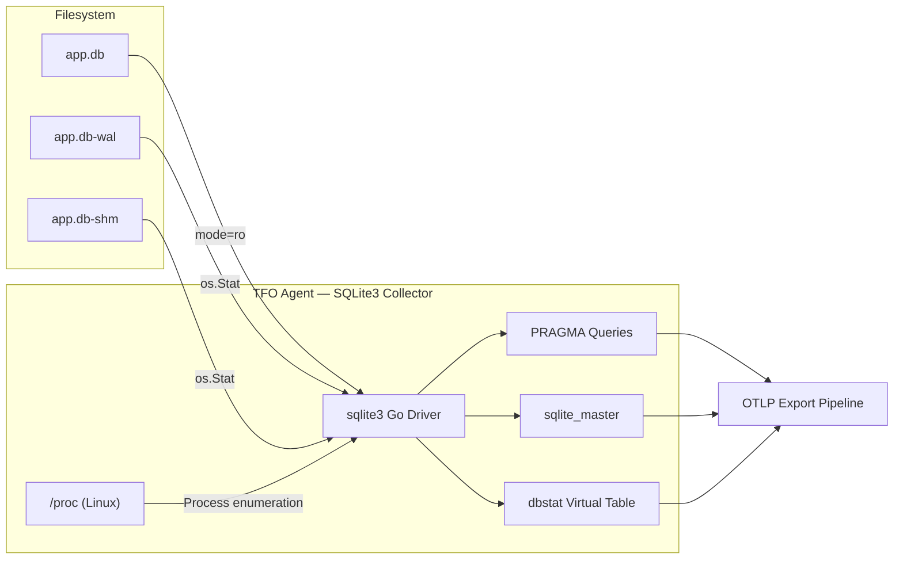
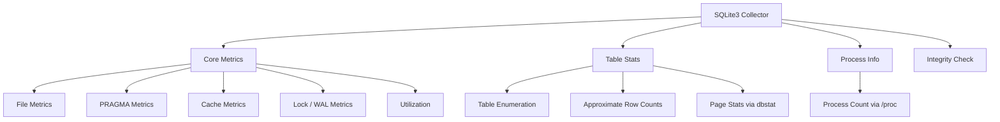

# SQLite3 Collector

Monitors SQLite3 database files using the `database/sql` interface with the `sqlite3` driver. Collects file-level metrics, PRAGMA statistics, cache and lock metrics, table-level statistics via `dbstat`, process enumeration (Linux), and periodic integrity checks.

## Data Source

Direct file access using the `sqlite3` Go driver in read-only mode (`?mode=ro`). Queries `PRAGMA` statements, `sqlite_master`, and the `dbstat` virtual table.

## Architecture



## Sub-collector Hierarchy



## Sub-collectors

| Sub-collector   | Interval                           | Description                                                           |
| --------------- | ---------------------------------- | --------------------------------------------------------------------- |
| Core Metrics    | `collection_interval: 60s`         | File sizes, PRAGMA values, cache stats, lock/WAL metrics, utilization |
| Table Stats     | `table_stats_interval: 300s`       | Table enumeration, approximate row counts, page stats via `dbstat`    |
| Process Info    | `process_interval: 120s`           | Processes with open file handles (Linux only)                         |
| Integrity Check | `integrity_interval: 0` (disabled) | `PRAGMA integrity_check` with duration tracking                       |

---

## File Metrics

Labels: `sqlite3_database`, `sqlite3_path`

| Metric                           | Type  | Description                                         |
| -------------------------------- | ----- | --------------------------------------------------- |
| `db.sqlite3.file.size`           | Gauge | Database file size (bytes)                          |
| `db.sqlite3.file.wal_size`       | Gauge | WAL file size (bytes)                               |
| `db.sqlite3.file.shm_size`       | Gauge | Shared memory file size (bytes)                     |
| `db.sqlite3.file.effective_size` | Gauge | Effective DB size = page_count \* page_size (bytes) |

---

## Page & PRAGMA Metrics

| Metric                               | Type  | Description                  |
| ------------------------------------ | ----- | ---------------------------- |
| `db.sqlite3.page.page_count`         | Gauge | Total pages                  |
| `db.sqlite3.page.page_size`          | Gauge | Page size (bytes)            |
| `db.sqlite3.page.freelist_count`     | Gauge | Freelist pages               |
| `db.sqlite3.page.auto_vacuum`        | Gauge | Auto-vacuum mode             |
| `db.sqlite3.page.schema_version`     | Gauge | Schema version               |
| `db.sqlite3.page.data_version`       | Gauge | Data version                 |
| `db.sqlite3.page.cache_size`         | Gauge | Cache size setting           |
| `db.sqlite3.page.mmap_size`          | Gauge | Memory-mapped I/O size       |
| `db.sqlite3.page.wal_autocheckpoint` | Gauge | WAL autocheckpoint threshold |
| `db.sqlite3.page.busy_timeout`       | Gauge | Busy timeout (ms)            |
| `db.sqlite3.freelist.count`          | Gauge | Freelist page count          |

---

## Utilization

| Metric                   | Type  | Description                                                |
| ------------------------ | ----- | ---------------------------------------------------------- |
| `db.sqlite3.utilization` | Gauge | Database utilization % = (pages - freelist) / pages \* 100 |

---

## Lock & WAL Metrics

| Metric                  | Type    | Description           |
| ----------------------- | ------- | --------------------- |
| `db.sqlite3.busy.count` | Counter | Busy event count      |
| `db.sqlite3.wal.size`   | Gauge   | WAL file size (bytes) |

---

## Table Statistics

Labels: `table_name`

| Metric                         | Type  | Description                          |
| ------------------------------ | ----- | ------------------------------------ |
| `db.sqlite3.table.count`       | Gauge | Table/view presence (1)              |
| `db.sqlite3.table.approx_rows` | Gauge | Approximate row count via MAX(rowid) |
| `db.sqlite3.table.page_count`  | Gauge | Page count from `dbstat`             |
| `db.sqlite3.table.unused_pct`  | Gauge | Unused space % from `dbstat`         |

---

## Process Metrics (Linux Only)

| Metric                     | Type  | Description                                |
| -------------------------- | ----- | ------------------------------------------ |
| `db.sqlite3.process.count` | Gauge | Number of processes with open file handles |

Enumerates `/proc/*/fd` to count processes holding open file descriptors to the database path.

---

## Integrity Check

Labels: `check_type`, `status`

| Metric                             | Type  | Description                                       |
| ---------------------------------- | ----- | ------------------------------------------------- |
| `db.sqlite3.integrity`             | Gauge | Integrity check result (1=ran, with status label) |
| `db.sqlite3.integrity.duration_ms` | Gauge | Check duration (ms)                               |

Status label values: `PASS`, `FAIL`, `ERROR`. Runs only when `integrity_interval` is configured > 0.

---

## Configuration

```yaml
sqlite3:
  enabled: true
  collection_interval: 60s
  table_stats_interval: 300s
  process_interval: 120s
  integrity_interval: 0s
  integrity_timeout: 300s
  databases:
    - name: "app-db"
      path: "/data/app.db"
      tags: {}
```

### Field Reference

| Field  | Default    | Description                                           |
| ------ | ---------- | ----------------------------------------------------- |
| `name` | (path)     | Display name for the database (defaults to file path) |
| `path` | (required) | Absolute path to the SQLite3 database file            |
| `tags` | `{}`       | Additional labels for all metrics from this database  |

## Notes

- Opens databases in read-only mode — no write operations performed.
- Connections are limited to `MaxOpenConns=1` and `MaxIdleConns=1` per database.
- `dbstat` virtual table must be compiled into the SQLite3 library for page-level table statistics.
- Process enumeration only works on Linux via `/proc` filesystem. Returns 0 on macOS.
- Integrity checks are disabled by default (`integrity_interval: 0`) since `PRAGMA integrity_check` can be slow on large databases.
- PRAGMA value changes (journal_mode, synchronous, locking_mode) are logged as info-level events.
- WAL checkpoint status is probed via `PRAGMA wal_checkpoint(PASSIVE)` during lock collection.
