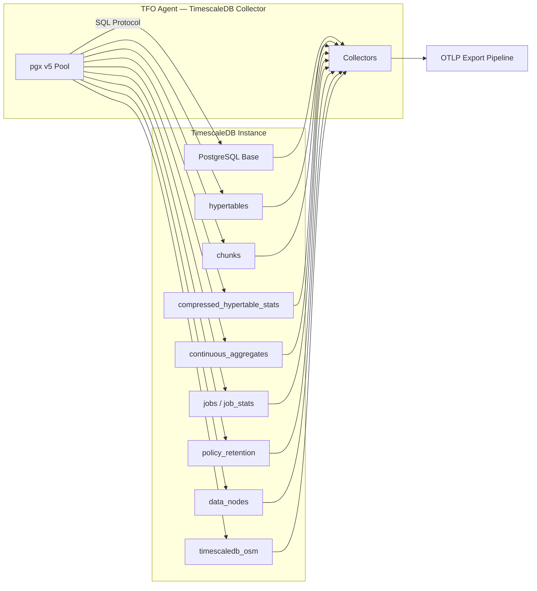
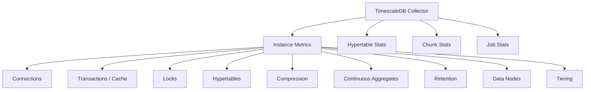

# TimescaleDB Collector

Monitors TimescaleDB instances via the PostgreSQL wire protocol using the pgx driver. Extends the base PostgreSQL metrics with TimescaleDB-specific telemetry: hypertables, chunks, compression, continuous aggregates, background jobs, retention policies, data nodes, and object storage tiering.

## Data Source

Direct database connection using pgx v5 connection pool. Queries `timescaledb_information.*` views, `pg_stat_activity`, `pg_stat_database`, and `pg_extension` for version detection.

## Architecture



## Sub-collector Hierarchy



## Sub-collectors

| Sub-collector    | Interval                   | Description                                                                             |
| ---------------- | -------------------------- | --------------------------------------------------------------------------------------- |
| Instance Metrics | `instance_interval: 10s`   | Connections, transactions, cache hit, locks, hypertables, compression, CAGGs, retention |
| Hypertable Stats | `hypertable_interval: 60s` | Per-hypertable size, chunk count, dimensions, compression status                        |
| Chunk Stats      | `chunk_interval: 120s`     | Per-hypertable chunk counts, compressed/uncompressed breakdown, sizes                   |
| Job Stats        | `job_interval: 60s`        | Background job success/failure/crash counts, run durations, next start                  |

---

## Connection Metrics

Labels: `timescaledb_instance`, `timescaledb_host`, `postgresql_version`, `timescaledb_version`

| Metric                                           | Type  | Description         |
| ------------------------------------------------ | ----- | ------------------- |
| `db.timescaledb.connections.active`              | Gauge | Active connections  |
| `db.timescaledb.connections.idle`                | Gauge | Idle connections    |
| `db.timescaledb.connections.idle_in_transaction` | Gauge | Idle in transaction |
| `db.timescaledb.connections.total`               | Gauge | Total connections   |

---

## Transaction & Cache Metrics

| Metric                                  | Type    | Description              |
| --------------------------------------- | ------- | ------------------------ |
| `db.timescaledb.transactions.commits`   | Counter | Committed transactions   |
| `db.timescaledb.transactions.rollbacks` | Counter | Rolled back transactions |
| `db.timescaledb.blocks.read`            | Counter | Disk blocks read         |
| `db.timescaledb.blocks.hit`             | Counter | Cache blocks hit         |
| `db.timescaledb.cache_hit_ratio`        | Gauge   | Cache hit ratio %        |

---

## Lock Metrics

| Metric                           | Type  | Description                           |
| -------------------------------- | ----- | ------------------------------------- |
| `db.timescaledb.locks.waiting`   | Gauge | Sessions waiting on locks             |
| `db.timescaledb.lwlocks.waiting` | Gauge | Sessions waiting on lightweight locks |

---

## Hypertable Metrics

Labels: `hypertable_schema`, `hypertable_name`

| Metric                                          | Type  | Description                   |
| ----------------------------------------------- | ----- | ----------------------------- |
| `db.timescaledb.hypertable.total_bytes`         | Gauge | Total hypertable size (bytes) |
| `db.timescaledb.hypertable.index_bytes`         | Gauge | Index size (bytes)            |
| `db.timescaledb.hypertable.toast_bytes`         | Gauge | TOAST size (bytes)            |
| `db.timescaledb.hypertable.num_chunks`          | Gauge | Number of chunks              |
| `db.timescaledb.hypertable.num_dimensions`      | Gauge | Number of dimensions          |
| `db.timescaledb.hypertable.compression_enabled` | Gauge | Compression enabled (0/1)     |
| `db.timescaledb.hypertable.count`               | Gauge | Total number of hypertables   |

---

## Chunk Metrics

Labels: `hypertable_schema`, `hypertable_name`

| Metric                                     | Type  | Description                         |
| ------------------------------------------ | ----- | ----------------------------------- |
| `db.timescaledb.chunks.count`              | Gauge | Chunks per hypertable               |
| `db.timescaledb.chunks.compressed_count`   | Gauge | Compressed chunks per hypertable    |
| `db.timescaledb.chunks.uncompressed_count` | Gauge | Uncompressed chunks per hypertable  |
| `db.timescaledb.chunks.total_size_bytes`   | Gauge | Total chunk size (bytes)            |
| `db.timescaledb.chunks.avg_size_bytes`     | Gauge | Average chunk size (bytes)          |
| `db.timescaledb.chunks.total`              | Gauge | Total chunks across all hypertables |
| `db.timescaledb.chunks.total_compressed`   | Gauge | Total compressed chunks             |
| `db.timescaledb.chunks.total_uncompressed` | Gauge | Total uncompressed chunks           |

---

## Compression Metrics

Labels: `hypertable_schema`, `hypertable_name`

| Metric                                           | Type  | Description                        |
| ------------------------------------------------ | ----- | ---------------------------------- |
| `db.timescaledb.compression.ratio`               | Gauge | Compression ratio (before/after)   |
| `db.timescaledb.compression.before_total_bytes`  | Gauge | Size before compression (bytes)    |
| `db.timescaledb.compression.after_total_bytes`   | Gauge | Size after compression (bytes)     |
| `db.timescaledb.compression.savings_bytes`       | Gauge | Space saved by compression (bytes) |
| `db.timescaledb.compression.chunks_compressed`   | Gauge | Number of compressed chunks        |
| `db.timescaledb.compression.chunks_uncompressed` | Gauge | Number of uncompressed chunks      |
| `db.timescaledb.compression.backlog_chunks`      | Gauge | Chunks awaiting compression        |

---

## Continuous Aggregate Metrics

Labels: `cagg_name`, `source_hypertable_schema`, `source_hypertable_name`

| Metric                                  | Type  | Description                           |
| --------------------------------------- | ----- | ------------------------------------- |
| `db.timescaledb.cagg.materialized_only` | Gauge | Materialized-only mode (0/1)          |
| `db.timescaledb.cagg.count`             | Gauge | Total number of continuous aggregates |

---

## Job Metrics

Labels: `proc_name`, `job_status`

| Metric                                         | Type    | Description                      |
| ---------------------------------------------- | ------- | -------------------------------- |
| `db.timescaledb.job.last_run_duration_seconds` | Gauge   | Last job run duration (seconds)  |
| `db.timescaledb.job.total_successes`           | Counter | Total successful runs            |
| `db.timescaledb.job.total_failures`            | Counter | Total failed runs                |
| `db.timescaledb.job.total_crashes`             | Counter | Total crashes                    |
| `db.timescaledb.job.next_start_in_seconds`     | Gauge   | Seconds until next scheduled run |

Summary:

| Metric                              | Type  | Description                          |
| ----------------------------------- | ----- | ------------------------------------ |
| `db.timescaledb.jobs.total`         | Gauge | Total registered jobs                |
| `db.timescaledb.jobs.scheduled`     | Gauge | Jobs with successful or empty status |
| `db.timescaledb.jobs.failed_total`  | Gauge | Jobs with any failures               |
| `db.timescaledb.jobs.crashed_total` | Gauge | Jobs with any crashes                |
| `db.timescaledb.jobs.stuck_count`   | Gauge | Potentially stuck jobs               |

---

## Retention Metrics

| Metric                                     | Type    | Description                         |
| ------------------------------------------ | ------- | ----------------------------------- |
| `db.timescaledb.retention.last_run_status` | Gauge   | Last retention run status (0=ok)    |
| `db.timescaledb.retention.total_failures`  | Counter | Total retention policy failures     |
| `db.timescaledb.retention.policy_missing`  | Gauge   | 1 if no retention policy configured |

---

## Data Node Metrics

Labels: `datanode_name`

| Metric                                 | Type  | Description                  |
| -------------------------------------- | ----- | ---------------------------- |
| `db.timescaledb.datanode.is_available` | Gauge | Data node availability (0/1) |
| `db.timescaledb.datanodes.total`       | Gauge | Total registered data nodes  |
| `db.timescaledb.datanodes.available`   | Gauge | Available data nodes         |

---

## Tiering Metrics

| Metric                           | Type  | Description                                                                |
| -------------------------------- | ----- | -------------------------------------------------------------------------- |
| `db.timescaledb.tiering.enabled` | Gauge | Object storage tiering enabled (0/1, requires `timescaledb_osm` extension) |

---

## Configuration

```yaml
timescaledb:
  enabled: true
  instance_interval: 10s
  hypertable_interval: 60s
  chunk_interval: 120s
  job_interval: 60s
  max_connections: 3
  instances:
    - name: "tsdb-primary"
      host: "localhost"
      port: 5432
      user: "postgres"
      password: "${TSDB_PASSWORD}"
      dbname: "postgres"
      sslmode: "prefer"
      ssl_root_cert: ""
      ssl_cert: ""
      ssl_key: ""
      tags: {}
```

## Notes

- Requires the `timescaledb` extension installed and enabled on the target database.
- Compression metrics require compression to be enabled on at least one hypertable.
- Data node metrics apply to multi-node (distributed) TimescaleDB deployments only.
- Tiering detection checks for the `timescaledb_osm` extension (TimescaleDB Tiered Storage).
- Retention policy missing detection surfaces a `policy_missing` gauge of 1 when no retention job is found.
- Connection pooling uses pgx with configurable max connections, 5-minute lifetime, and 30-second health checks.
- Passwords support environment variable interpolation via `${VAR}` or `${VAR:-default}` syntax.
