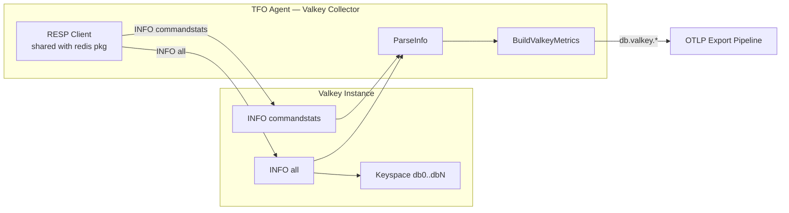
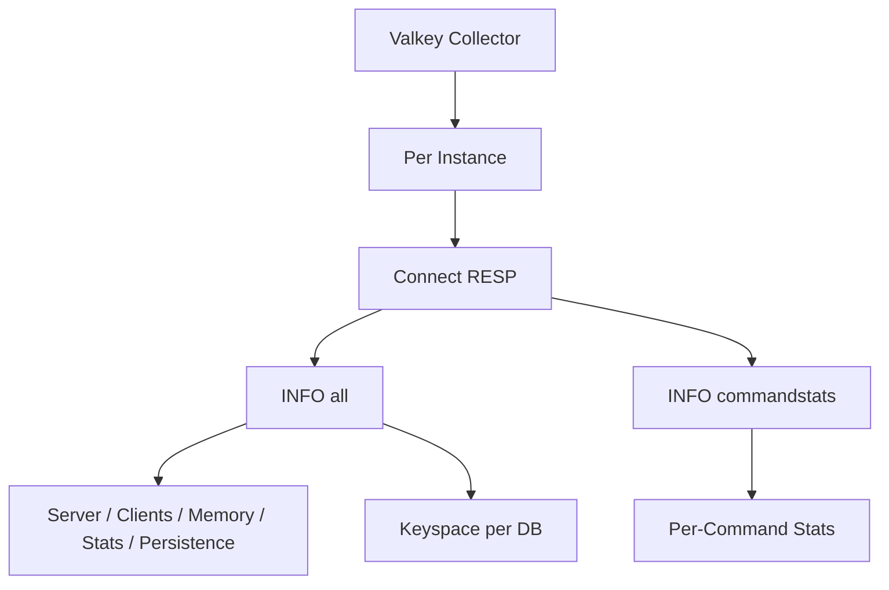

# Valkey Collector

Monitors [Valkey](https://valkey.io/) cache instances over the Redis-compatible RESP wire protocol. Valkey is the Linux Foundation fork of Redis, created after Redis switched to the SSPL/RSALv2 license in March 2024. Because Valkey speaks RESP, this collector reuses the `redis` package's RESP client and INFO parser and emits the same telemetry surface under the `db.valkey.*` namespace (parallel to `db.redis.*`). Supports Valkey 7.x and 8.x.

## Overview

| Attribute         | Value                                                              |
| ----------------- | ------------------------------------------------------------------ |
| Wire protocol     | RESP (Redis Serialization Protocol), text-based                    |
| Commands used     | `INFO all`, `INFO commandstats`                                    |
| Metric namespace  | `db.valkey.*`                                                      |
| `db_system` label | `valkey`                                                           |
| Compatibility     | Valkey 7.x+, Valkey 8.x+ (and any RESP-compatible server)         |
| Default interval  | `info_interval: 15s`                                               |
| Unique capability | Telegraf has **no** native Valkey input — tfo-agent exclusive      |

Valkey is a drop-in replacement for Redis at the protocol level, so the collector issues the same `INFO` sections and parses the same key/value layout. The differences from the Redis collector are:

1. Metric names are prefixed `db.valkey.*` instead of `db.redis.*`.
2. Labels are `valkey_instance` / `valkey_host` / `valkey_db` / `valkey_command` instead of the `redis_*` equivalents.
3. The `db_system` resource label is set to `valkey`, letting mixed Redis + Valkey fleets be separated in queries.

## Data Source

RESP client connecting to `host:port`. Authenticates with `AUTH` (optional), selects the logical `DB` with `SELECT`, then issues `INFO all` on every cycle and `INFO commandstats` when `collect_command_stats: true`. No external Go module is required — the RESP client is implemented in `internal/collector/redis` and shared by both collectors.

## Architecture



## Collection Path



| Step             | Default                | Description                                                          |
| ---------------- | ---------------------- | -------------------------------------------------------------------- |
| Connect          | 10s dial timeout       | TCP (or TLS) to `host:port`, optional `AUTH` + `SELECT db`           |
| `INFO all`       | `info_interval: 15s`   | Server, clients, memory, keyspace hits/misses, eviction, persistence |
| Keyspace parse   | each cycle             | Per-DB `keys`, `expires`, `avg_ttl` from `db0:keys=...` lines        |
| `INFO commandstats` | each cycle (optional) | Per-command `calls`, `usec`, `usec_per_call`, `rejected_calls`, `failed_calls` |

---

## Server Metrics

| Metric                          | Type    | Unit | Description                                  |
| ------------------------------- | ------- | ---- | -------------------------------------------- |
| `db.valkey.uptime_seconds`      | Counter | s    | Server uptime in seconds (`uptime_in_seconds`) |

## Client Metrics

| Metric                              | Type    | Unit | Description                                          |
| ----------------------------------- | ------- | ---- | ---------------------------------------------------- |
| `db.valkey.connected_clients`       | Gauge   |      | Connected client count (`connected_clients`)         |
| `db.valkey.rejected_connections`    | Counter |      | Connections rejected due to `maxclients`             |
| `db.valkey.blocked_clients`         | Gauge   |      | Clients blocked on blocking commands                 |

## Memory Metrics

| Metric                                | Type  | Unit  | Description                                          |
| ------------------------------------- | ----- | ----- | --------------------------------------------------- |
| `db.valkey.used_memory`              | Gauge | bytes | Memory allocated by Valkey (`used_memory`)           |
| `db.valkey.used_memory_rss`          | Gauge | bytes | Memory as seen by the OS, RSS (`used_memory_rss`)    |
| `db.valkey.used_memory_peak`         | Gauge | bytes | Peak memory usage (`used_memory_peak`)               |
| `db.valkey.maxmemory`                | Gauge | bytes | Configured `maxmemory` limit                         |
| `db.valkey.mem_fragmentation_ratio`  | Gauge |       | `used_memory_rss / used_memory` ratio                |

## Keyspace Metrics

| Metric                       | Type    | Unit | Description                                              |
| ---------------------------- | ------- | ---- | -------------------------------------------------------- |
| `db.valkey.expired_keys`     | Counter |      | Total keys expired by TTL                                |
| `db.valkey.evicted_keys`     | Counter |      | Keys evicted by `maxmemory` eviction policy              |
| `db.valkey.keyspace_hits`    | Gauge   |      | Successful key lookups (cumulative value as reported)    |
| `db.valkey.keyspace_misses`  | Gauge   |      | Failed key lookups (cumulative value as reported)        |

### Per-Database Keyspace

Label: `valkey_db` (e.g. `db0`, `db1`). Emitted once per populated logical database from the `INFO` keyspace section (`db0:keys=50,expires=10,avg_ttl=1200`).

| Metric                          | Type  | Unit | Description                              |
| ------------------------------- | ----- | ---- | ---------------------------------------- |
| `db.valkey.keyspace.keys`       | Gauge |      | Key count per logical DB                 |
| `db.valkey.keyspace.expires`    | Gauge |      | Keys with an expiry set, per logical DB  |
| `db.valkey.keyspace.avg_ttl`    | Gauge | ms   | Average TTL of expiring keys, per DB     |

## Command Metrics

| Metric                                  | Type    | Unit  | Description                                            |
| --------------------------------------- | ------- | ----- | ----------------------------------------------------- |
| `db.valkey.total_commands_processed`    | Counter |       | Total commands processed (`total_commands_processed`)  |
| `db.valkey.ops_per_sec`                 | Counter | ops/s | Instantaneous ops/sec (`instantaneous_ops_per_sec`)    |
| `db.valkey.net_input_bytes`             | Counter | bytes | Network input bytes (`net_input_bytes`)                |
| `db.valkey.net_output_bytes`            | Counter | bytes | Network output bytes (`net_output_bytes`)              |

### Per-Command Statistics

Label: `valkey_command` (e.g. `GET`, `SET`). Only collected when `collect_command_stats: true`. Sourced from `INFO commandstats` (`cmdstat_GET:calls=10,usec=20,...`).

| Metric                                    | Type    | Description                                   |
| ----------------------------------------- | ------- | --------------------------------------------- |
| `db.valkey.command.calls`                 | Counter | Total calls of the command                    |
| `db.valkey.command.usec`                  | Counter | Total CPU time in microseconds                |
| `db.valkey.command.usec_per_call`         | Counter | Average CPU time per call (microseconds)      |
| `db.valkey.command.rejected_calls`        | Counter | Calls rejected (e.g. OOM, auth)               |
| `db.valkey.command.failed_calls`          | Counter | Calls that failed during execution            |

## Replication Metrics

| Metric                          | Type  | Description                                       |
| ------------------------------- | ----- | ------------------------------------------------- |
| `db.valkey.connected_slaves`    | Gauge | Number of connected replicas (`connected_slaves`) |

## Persistence Metrics

| Metric                               | Type    | Description                                            |
| ------------------------------------ | ------- | ----------------------------------------------------- |
| `db.valkey.rdb_bgsave_in_progress`   | Counter | RDB background save in progress flag (0/1)            |
| `db.valkey.aof_enabled`              | Gauge   | Append-only-file enabled flag (0/1)                   |

---

## Labels Reference

Every Valkey metric carries these base labels, computed in `instanceLabels`:

| Label              | Source        | Description                                                       |
| ------------------ | ------------- | ----------------------------------------------------------------- |
| `valkey_instance`  | `instance.name` | Human-readable instance name from config                        |
| `valkey_host`      | `instance.host` | Configured host                                                  |
| `db_system`        | constant      | Always `valkey` — distinguishes from `redis` in mixed fleets      |

Additional labels applied to specific metric groups:

| Label             | Applied to                          | Description                                  |
| ----------------- | ----------------------------------- | -------------------------------------------- |
| `valkey_db`       | `db.valkey.keyspace.*`              | Logical database (`db0`, `db1`, ...)         |
| `valkey_command`  | `db.valkey.command.*`               | Command name (`GET`, `SET`, `EVAL`, ...)     |

Custom tags merge in this precedence order (later wins on key conflict):

1. `valkey.tags` (collector-level)
2. `instance.tags` (instance-level)

Example: with `valkey.tags.env=production` and `instance.tags.role=primary`, every metric from that instance gets both `env=production` and `role=primary`.

---

## Configuration

The configuration mirrors the `ValkeyCollectorConfig` and `ValkeyInstanceConfig` structs in `internal/config/config.go` exactly.

### Collector-level fields

| Field            | YAML key          | Type             | Default | Description                                            |
| ---------------- | ----------------- | ---------------- | ------- | ----------------------------------------------------- |
| `Enabled`        | `enabled`         | bool             | `false` | Enables the collector                                 |
| `InfoInterval`   | `info_interval`   | duration         | `15s`   | How often to issue `INFO` per instance                |
| `Tags`           | `tags`            | map[string]string | `{}`   | Tags applied to all metrics from all instances        |
| `Instances`      | `instances`       | list             | `[]`    | One entry per Valkey instance to monitor              |

### Instance-level fields

| Field                  | YAML key                | Type             | Default | Description                                                          |
| ---------------------- | ----------------------- | ---------------- | ------- | ------------------------------------------------------------------- |
| `Name`                 | `name`                  | string           | —       | Instance identifier, used as `valkey_instance` label (required)     |
| `Host`                 | `host`                  | string           | —       | Valkey hostname or IP (required)                                    |
| `Port`                 | `port`                  | int              | —       | Valkey TCP port (required)                                          |
| `Password`             | `password`              | string           | —       | AUTH password (env-var expansion `${VALKEY_PASSWORD}` supported)    |
| `DB`                   | `db`                    | int              | `0`     | Logical database index for `SELECT`                                 |
| `TLSEnabled`           | `tls_enabled`           | bool             | `false` | Enables TLS on the connection                                       |
| `TLSSkipVerify`        | `tls_skip_verify`       | bool             | `false` | Skips certificate verification (insecure, dev only)                 |
| `CollectCommandStats`  | `collect_command_stats` | bool             | `false` | Enables `INFO commandstats` collection (per-command metrics)        |
| `Tags`                 | `tags`                  | map[string]string | `{}`   | Instance-specific tags, merged over collector-level tags            |

> **Note on `CollectLatency`:** The Redis instance config exposes a `collect_latency` field for `LATENCY HISTORY` collection. The Valkey instance config does **not** expose this field today — see the [Roadmap](#roadmap--not-yet-implemented) section.

### Full Example

```yaml
valkey:
  enabled: true
  info_interval: 15s
  tags:
    env: "production"
    tier: "cache"
  instances:
    - name: "valkey-primary"
      host: "valkey-primary.internal"
      port: 6379
      password: "${VALKEY_PASSWORD}"
      db: 0
      tls_enabled: false
      tls_skip_verify: false
      collect_command_stats: true
      tags:
        role: "primary"
```

---

## TLS

Valkey supports TLS natively (compiled in by default on the official images). Enable it per instance:

```yaml
instances:
  - name: "valkey-tls"
    host: "valkey.internal"
    port: 6379
    password: "${VALKEY_PASSWORD}"
    tls_enabled: true
    tls_skip_verify: false        # set true ONLY for self-signed dev certs
    collect_command_stats: true
```

- `tls_enabled: true` wraps the TCP dial in TLS.
- `tls_skip_verify: true` disables certificate chain verification. This is insecure and should only be used in development with self-signed certificates.
- mTLS client certificate configuration is not currently exposed; connections authenticate with `AUTH password` after the TLS handshake.

---

## Multiple Instances

Each entry under `instances` is scraped independently and tagged with its own `valkey_instance` label, so a single agent can monitor an entire cache tier:

```yaml
valkey:
  enabled: true
  info_interval: 15s
  tags:
    env: "production"
    tier: "cache"
  instances:
    - name: "valkey-primary"
      host: "valkey-primary.internal"
      port: 6379
      password: "${VALKEY_PRIMARY_PASSWORD}"
      collect_command_stats: true
      tags:
        role: "primary"
        cluster: "payments"

    - name: "valkey-replica-1"
      host: "valkey-replica-1.internal"
      port: 6379
      password: "${VALKEY_REPLICA_PASSWORD}"
      collect_command_stats: false
      tags:
        role: "replica"
        cluster: "payments"

    - name: "valkey-sessions"
      host: "valkey-sessions.internal"
      port: 6380
      password: "${SESSIONS_PASSWORD}"
      db: 0
      tls_enabled: true
      tls_skip_verify: false
      tags:
        role: "sessions"
        cluster: "edge"
```

Querying a mixed fleet in your backend:

```promql
# Memory across all Valkey instances in the payments cluster
sum by (valkey_instance) (
  db_valkey_used_memory{db_system="valkey", cluster="payments"}
)
```

---

## Migration from Redis

Because Valkey is protocol-compatible with Redis, migrating is a configuration change, not a data change. For monitoring:

1. **Keep the Redis collector** pointing at any remaining Redis nodes.
2. **Add the Valkey collector** for new Valkey nodes.
3. **Split queries on `db_system`** — Redis emits `db_system="redis"` with `db.redis.*` metrics; Valkey emits `db_system="valkey"` with `db.valkey.*` metrics.

| Dimension      | Redis                          | Valkey                          |
| -------------- | ------------------------------ | ------------------------------- |
| Metric prefix  | `db.redis.*`                   | `db.valkey.*`                   |
| `db_system`    | `redis`                        | `valkey`                        |
| Instance label | `redis_instance`               | `valkey_instance`               |
| Host label     | `redis_host`                   | `valkey_host`                   |
| DB label       | `redis_db`                     | `valkey_db`                     |
| Command label  | `redis_command`                | `valkey_command`                |

When to switch the metrics namespace:

- **Don't rename existing dashboards.** During a rolling migration, keep both collectors running and query by `db_system` to compare node-for-node.
- **Cut over per cluster** once all nodes in a logical cache cluster are Valkey. Update dashboard filters from `db_system="redis"` to `db_system="valkey"` (or drop the filter and group by `db_system`).
- **Telling them apart at query time** requires no relabeling — the `db_system` label is set by the collector and is queryable immediately.

---

## Troubleshooting

| Symptom                                      | Cause                                                                 | Fix                                                                                       |
| -------------------------------------------- | --------------------------------------------------------------------- | ----------------------------------------------------------------------------------------- |
| `Valkey collection failed` in agent logs     | Network unreachable / wrong host or port                              | Verify `host:port` and firewall rules; check Valkey is listening                          |
| `NOAUTH Authentication required`             | Password not set or wrong                                             | Set `password` (use `${VAR}` env expansion, don't inline secrets)                         |
| `WRONGPASS invalid username-password pair`   | Incorrect password                                                    | Verify the credential and ACL user                                                        |
| No `db.valkey.command.*` metrics             | `collect_command_stats: false` (default)                              | Set `collect_command_stats: true` on the instance                                         |
| No `db.valkey.keyspace.*` metrics            | Logical DB is empty                                                    | Expected behavior — Valkey only reports `dbN:keys=...` lines for non-empty databases      |
| TLS handshake errors                         | TLS not enabled on server, or self-signed cert without skip-verify    | Confirm the Valkey build has TLS; set `tls_skip_verify: true` only for dev self-signed    |
| Mixed Redis/Valkey metrics look duplicated   | Same metric shape under two namespaces                                | Filter by `db_system`; this is expected — the namespaces are intentionally separate       |
| Valkey-specific RESP commands not supported  | Some Valkey 8.x extensions are not yet parsed                          | See [Roadmap](#roadmap--not-yet-implemented); `INFO`-based metrics are unaffected         |

Gotchas specific to Valkey:

- **`valkey_version` is not yet parsed** into major/minor/patch metrics (see Roadmap). The raw string is available in `INFO` but not emitted as a metric today.
- **Cluster mode (`CLUSTER INFO`)** is not yet collected; a cluster-enabled node will still report full single-node `INFO` stats, but cluster-level health is not yet exposed.
- **Active latency events (`LATENCY HISTORY`)** are not collected; the Valkey instance config has no `collect_latency` toggle (unlike Redis).

---

## Comparison with Telegraf

Telegraf ships a `redis` input plugin but **no native Valkey input**. The common workaround — pointing Telegraf's `redis` input at a Valkey endpoint — works at the protocol level but produces `redis_*`-named metrics with no way to distinguish them from real Redis in a mixed fleet.

| Capability                              | Telegraf (`redis` input pointed at Valkey) | tfo-agent Valkey collector             |
| --------------------------------------- | ------------------------------------------ | -------------------------------------- |
| Native Valkey support                   | No                                         | **Yes**                                |
| Metric namespace                        | `redis_*` (misleading)                     | `db.valkey.*`                          |
| Distinguishable from Redis in queries   | No                                         | **Yes**, via `db_system="valkey"`      |
| Per-command stats                       | Yes                                        | Yes (`collect_command_stats`)          |
| Per-DB keyspace stats                   | Yes                                        | Yes (`valkey_db` label)                |
| OTLP-native export                      | Requires output plugin + translation       | Native OTLP pipeline                    |
| Mixed Redis + Valkey fleet              | Indistinguishable                          | Fully separable                         |

This makes the Valkey collector a tfo-agent-unique capability: first-class Valkey observability without aliasing it through the Redis plugin.

---

## Roadmap / Not Yet Implemented

The following metrics are referenced in the Valkey INFO/CLUSTER surface and are candidates for future collection. They are **not emitted** by the current `BuildValkeyMetrics` implementation.

| Planned metric                              | Source                | Notes                                              |
| ------------------------------------------- | --------------------- | -------------------------------------------------- |
| `db.valkey.version_major` / `_minor` / `_patch` | `valkey_version`      | Parse the semver string into numeric gauges        |
| `db.valkey.cluster_enabled`                 | `CLUSTER INFO`        | `cluster_enabled:1`                                |
| `db.valkey.cluster_state`                   | `CLUSTER INFO`        | `cluster_state:ok` → normalized                    |
| `db.valkey.cluster_slots_assigned`          | `CLUSTER INFO`        | `cluster_slots_assigned`                           |
| `db.valkey.cluster_slots_ok`                | `CLUSTER INFO`        | `cluster_slots_ok`                                 |
| `db.valkey.latency_ms{event=...}`           | `LATENCY HISTORY`     | Requires a `collect_latency` instance field        |
| `db.valkey.latency_max_ms{event=...}`       | `LATENCY HISTORY`     | Requires a `collect_latency` instance field        |

To track implementation, see the collection path in `internal/collector/valkey/valkey.go`.

---

## Notes

- The Valkey collector reuses the RESP client and `ParseInfo` parser from `internal/collector/redis`; there is no second RESP implementation.
- Defaults: `enabled: false`, `info_interval: 15s` (see `internal/config/config.go`).
- Connection dial timeout is 10 seconds per instance; failed instances are logged at WARN and skipped without aborting the cycle.
- Secrets should be supplied via env-var expansion (`${VALKEY_PASSWORD}`) rather than inlined in YAML.
- The collector satisfies the `collector.Collector` interface and is registered under the name `valkey`.
