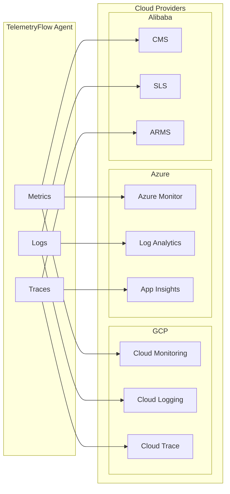
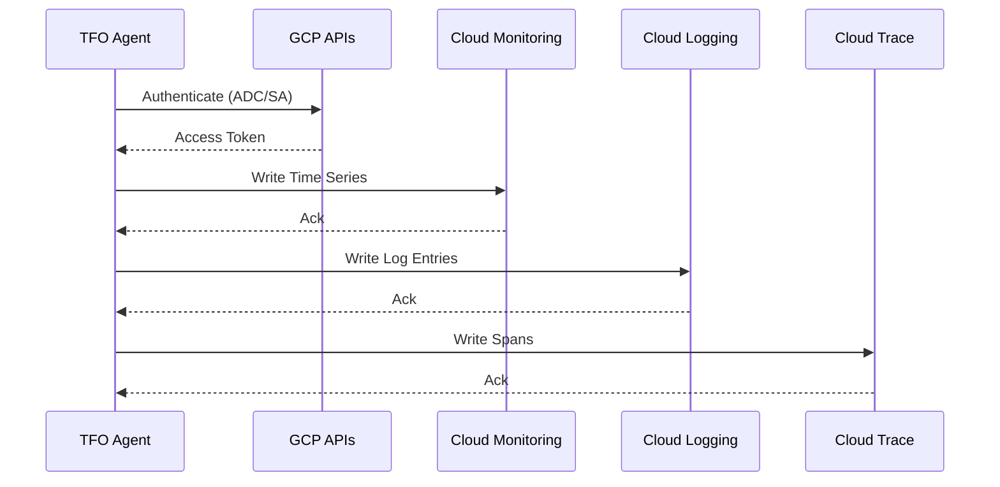
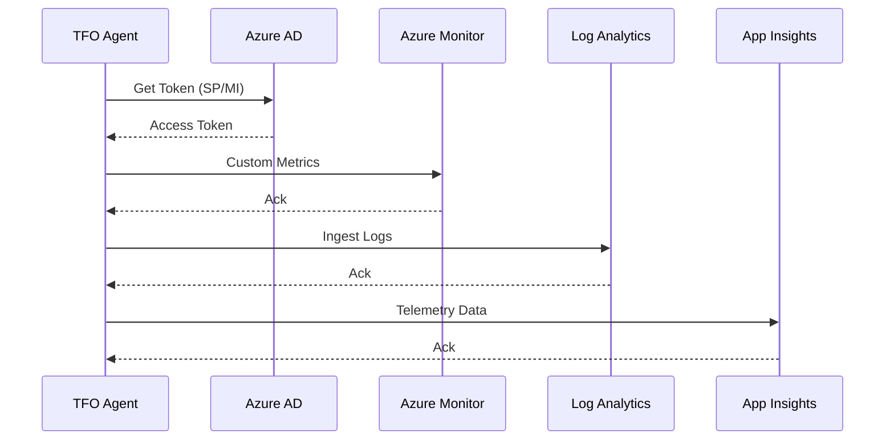
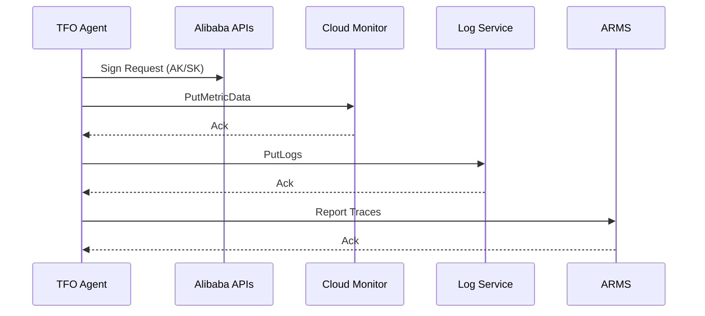

# Cloud Provider Integrations

[](../../CHANGELOG.md)

This document covers cloud provider integrations for exporting telemetry data to major cloud platforms.

## Overview



## Google Cloud Platform (GCP)

### Architecture



### Configuration

```yaml
integrations:
  gcp:
    enabled: true
    project_id: "${GCP_PROJECT_ID}"
    # credentials_file: /path/to/service-account.json
    region: "${GCP_REGION:-us-central1}"

    monitoring:
      enabled: true
      metric_prefix: "custom.googleapis.com/telemetryflow"

    logging:
      enabled: true
      log_name: "telemetryflow-agent"

    trace:
      enabled: false

    resource_type: "generic_task"
    resource_labels:
      project_id: "${GCP_PROJECT_ID}"
      location: "${GCP_REGION:-us-central1}"
      namespace: "telemetryflow"
      job: "tfo-agent"

    batch_size: 100
    timeout: 30s
```

### Authentication

| Method | Description |
|--------|-------------|
| Application Default Credentials | Auto-detected from environment |
| Service Account JSON | Explicit credential file |
| Workload Identity | GKE/Cloud Run integration |

### Collected Metrics

| Metric | Type | Description |
|--------|------|-------------|
| `custom.googleapis.com/telemetryflow/*` | Custom | Agent metrics |

---

## Microsoft Azure

### Architecture



### Configuration

```yaml
integrations:
  azure:
    enabled: true
    subscription_id: "${AZURE_SUBSCRIPTION_ID}"
    tenant_id: "${AZURE_TENANT_ID}"
    client_id: "${AZURE_CLIENT_ID}"
    client_secret: "${AZURE_CLIENT_SECRET}"
    resource_group: "${AZURE_RESOURCE_GROUP}"

    monitor:
      enabled: true
      workspace_id: "${AZURE_WORKSPACE_ID}"
      workspace_key: "${AZURE_WORKSPACE_KEY}"
      log_type: "TelemetryFlow"

    application_insights:
      enabled: false
      instrumentation_key: "${AZURE_APP_INSIGHTS_KEY}"

    use_managed_identity: false
    region: "${AZURE_REGION:-eastus}"
    batch_size: 100
    timeout: 30s
```

### Authentication

| Method | Description |
|--------|-------------|
| Service Principal | Client ID + Secret |
| Managed Identity | Azure VM/AKS integration |
| Certificate | Client ID + Certificate |

---

## Alibaba Cloud (Aliyun)

### Architecture



### Configuration

```yaml
integrations:
  alibaba:
    enabled: true
    access_key_id: "${ALIBABA_ACCESS_KEY_ID}"
    access_key_secret: "${ALIBABA_ACCESS_KEY_SECRET}"
    region: "${ALIBABA_REGION:-cn-hangzhou}"

    cms:
      enabled: true
      namespace: "TelemetryFlow"
      metric_prefix: "tfo"

    sls:
      enabled: true
      project: "${ALIBABA_SLS_PROJECT}"
      logstore: "${ALIBABA_SLS_LOGSTORE}"
      endpoint: "${ALIBABA_SLS_ENDPOINT}"

    arms:
      enabled: false

    batch_size: 100
    timeout: 30s
```

### Authentication

Uses HMAC-SHA1 signature for API authentication with Access Key ID and Secret.

---

## Comparison

| Feature | GCP | Azure | Alibaba |
|---------|-----|-------|---------|
| Metrics | Cloud Monitoring | Azure Monitor | CMS |
| Logs | Cloud Logging | Log Analytics | SLS |
| Traces | Cloud Trace | App Insights | ARMS |
| Auth | ADC/SA | SP/MI | AK/SK |
| Regions | Global | Global | China/International |

## Environment Variables

```bash
# GCP
export GCP_PROJECT_ID="my-project"
export GCP_REGION="us-central1"
export GOOGLE_APPLICATION_CREDENTIALS="/path/to/sa.json"

# Azure
export AZURE_SUBSCRIPTION_ID="xxx"
export AZURE_TENANT_ID="xxx"
export AZURE_CLIENT_ID="xxx"
export AZURE_CLIENT_SECRET="xxx"
export AZURE_RESOURCE_GROUP="my-rg"
export AZURE_WORKSPACE_ID="xxx"
export AZURE_WORKSPACE_KEY="xxx"

# Alibaba
export ALIBABA_ACCESS_KEY_ID="xxx"
export ALIBABA_ACCESS_KEY_SECRET="xxx"
export ALIBABA_REGION="cn-hangzhou"
export ALIBABA_SLS_PROJECT="my-project"
export ALIBABA_SLS_LOGSTORE="my-logstore"
```

---

**Copyright (c) 2024-2026 DevOpsCorner Indonesia. All rights reserved.**
