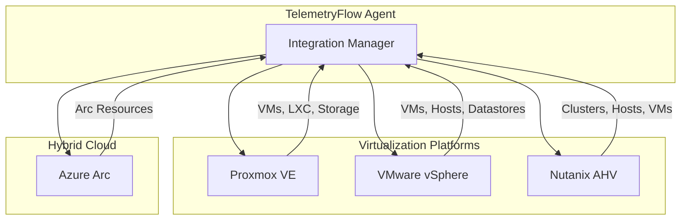
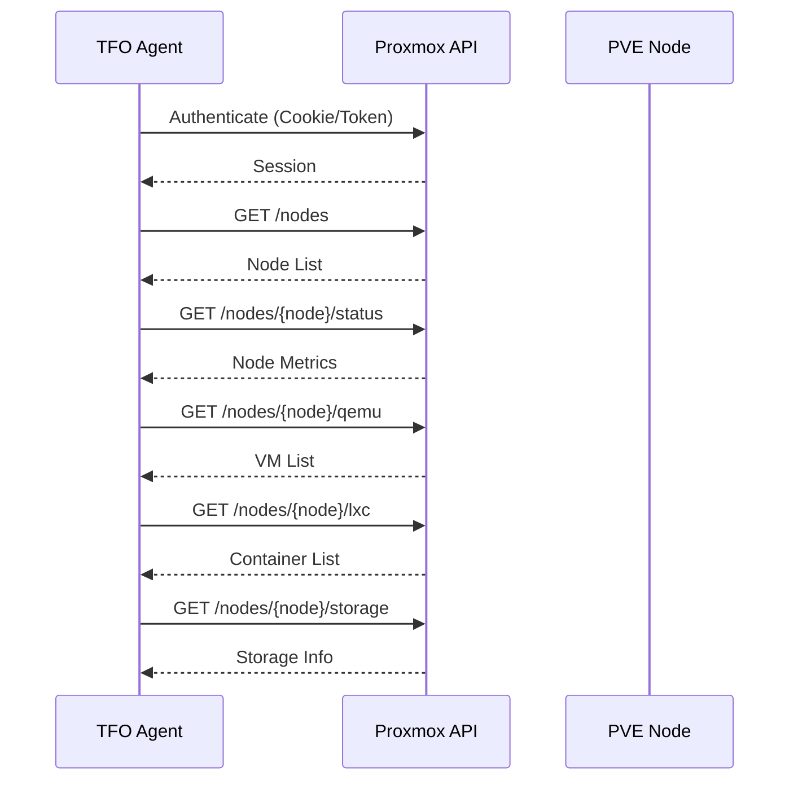
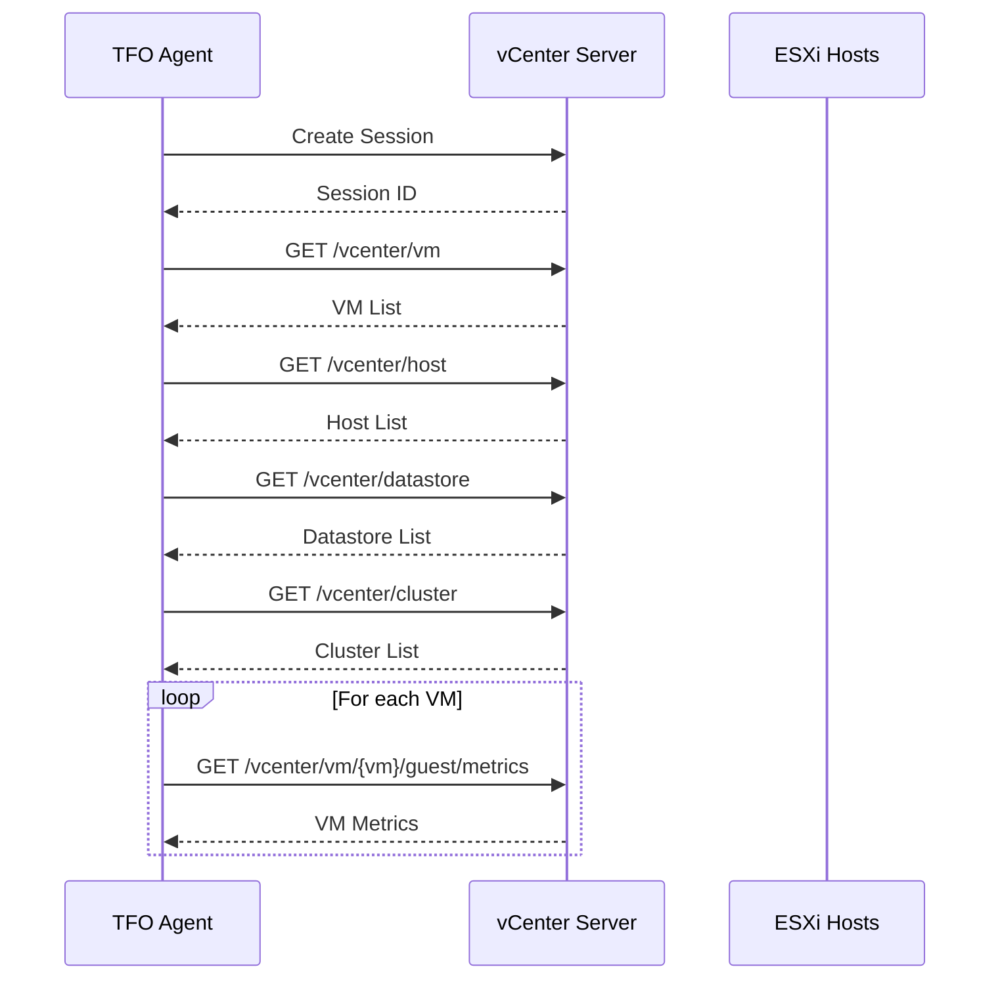
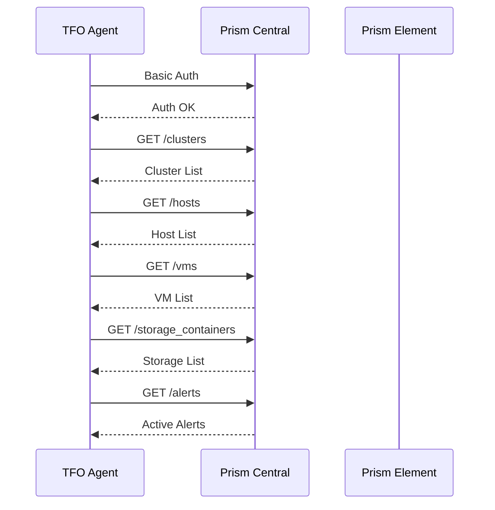
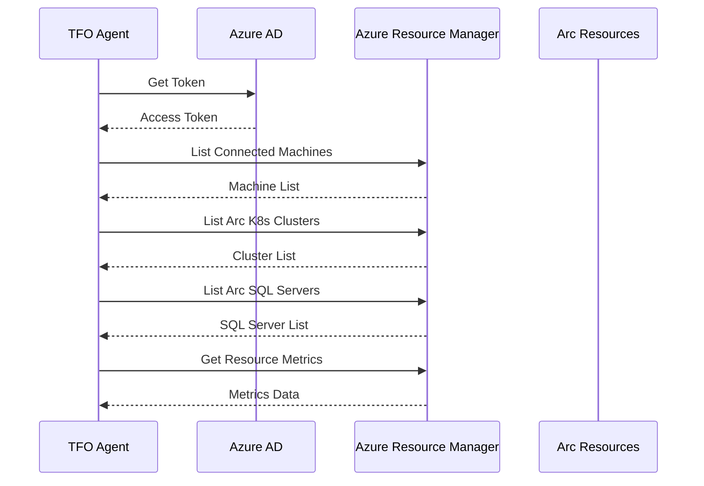

# Infrastructure Integrations

[](../../CHANGELOG.md)

This document covers infrastructure platform integrations for virtualization and hybrid cloud environments.

## Overview



## Proxmox VE

### Architecture



### Configuration

```yaml
integrations:
  proxmox:
    enabled: true
    api_url: "https://proxmox.example.com:8006"
    username: "${PROXMOX_USERNAME}"
    password: "${PROXMOX_PASSWORD}"
    # token_id: "${PROXMOX_TOKEN_ID}"
    # token_secret: "${PROXMOX_TOKEN_SECRET}"
    realm: "pam"
    node: ""  # Empty for all nodes
    tls_skip_verify: false
    scrape_interval: 60s
    timeout: 30s

    collect_vms: true
    collect_containers: true
    collect_storage: true
    collect_network: true
    collect_cluster: true
```

### Metrics

| Metric | Type | Description |
|--------|------|-------------|
| `proxmox_node_cpu_usage` | gauge | Node CPU usage percentage |
| `proxmox_node_memory_used_bytes` | gauge | Node memory used |
| `proxmox_node_uptime_seconds` | counter | Node uptime |
| `proxmox_vm_cpu_usage` | gauge | VM CPU usage |
| `proxmox_vm_memory_used_bytes` | gauge | VM memory used |
| `proxmox_vm_status` | gauge | VM power state (1=running) |
| `proxmox_storage_used_bytes` | gauge | Storage used |
| `proxmox_storage_available_bytes` | gauge | Storage available |

---

## VMware vSphere

### Architecture



### Configuration

```yaml
integrations:
  vmware:
    enabled: true
    vcenter_url: "https://vcenter.example.com"
    username: "${VMWARE_USERNAME}"
    password: "${VMWARE_PASSWORD}"
    tls_skip_verify: false
    datacenter: ""  # Empty for all
    scrape_interval: 60s
    timeout: 30s

    collect_vms: true
    collect_hosts: true
    collect_datastores: true
    collect_clusters: true
    collect_resource_pools: false
    performance_level: 2
```

### Metrics

| Metric | Type | Description |
|--------|------|-------------|
| `vmware_vm_cpu_usage_percent` | gauge | VM CPU usage |
| `vmware_vm_memory_used_mib` | gauge | VM memory used |
| `vmware_vm_disk_read_kbps` | gauge | Disk read rate |
| `vmware_vm_disk_write_kbps` | gauge | Disk write rate |
| `vmware_vm_network_rx_kbps` | gauge | Network receive rate |
| `vmware_vm_network_tx_kbps` | gauge | Network transmit rate |
| `vmware_host_cpu_usage_percent` | gauge | Host CPU usage |
| `vmware_datastore_capacity_bytes` | gauge | Datastore total capacity |
| `vmware_datastore_free_bytes` | gauge | Datastore free space |

---

## Nutanix

### Architecture



### Configuration

```yaml
integrations:
  nutanix:
    enabled: true
    prism_central_url: "https://prism-central.example.com:9440"
    # prism_element_url: "https://prism-element.example.com:9440"
    username: "${NUTANIX_USERNAME}"
    password: "${NUTANIX_PASSWORD}"
    tls_skip_verify: false
    scrape_interval: 60s
    timeout: 30s
    api_version: "v2.0"

    collect_vms: true
    collect_hosts: true
    collect_clusters: true
    collect_storage: true
    collect_containers: true
    collect_networks: false
    collect_alerts: true
```

### Metrics

| Metric | Type | Description |
|--------|------|-------------|
| `nutanix_cluster_cpu_usage_percent` | gauge | Cluster CPU usage |
| `nutanix_cluster_memory_usage_percent` | gauge | Cluster memory usage |
| `nutanix_cluster_storage_usage_bytes` | gauge | Storage used |
| `nutanix_cluster_iops` | gauge | Cluster IOPS |
| `nutanix_host_cpu_usage_percent` | gauge | Host CPU usage |
| `nutanix_host_vms` | gauge | VMs on host |
| `nutanix_vm_cpu_usage_percent` | gauge | VM CPU usage |
| `nutanix_vm_memory_usage_percent` | gauge | VM memory usage |
| `nutanix_alerts_active_total` | gauge | Active alerts count |

---

## Azure Arc

### Architecture



### Configuration

```yaml
integrations:
  azure_arc:
    enabled: true
    subscription_id: "${AZURE_SUBSCRIPTION_ID}"
    tenant_id: "${AZURE_TENANT_ID}"
    client_id: "${AZURE_CLIENT_ID}"
    client_secret: "${AZURE_CLIENT_SECRET}"
    resource_group: "${AZURE_RESOURCE_GROUP}"
    location: "${AZURE_LOCATION:-eastus}"
    machine_name: "${HOSTNAME}"
    use_managed_identity: false
    scrape_interval: 60s
    timeout: 30s

    collect_machines: true
    collect_kubernetes: true
    collect_data_services: false
    collect_sql_servers: false
```

### Metrics

| Metric | Type | Description |
|--------|------|-------------|
| `azure_arc_machine_connected` | gauge | Machine connection status |
| `azure_arc_machine_extensions` | gauge | Number of extensions |
| `azure_arc_k8s_cluster_nodes` | gauge | Cluster node count |
| `azure_arc_k8s_cluster_cores` | gauge | Cluster core count |
| `azure_arc_sql_server_up` | gauge | SQL Server availability |

---

## Comparison

| Feature | Proxmox | VMware | Nutanix | Azure Arc |
|---------|---------|--------|---------|-----------|
| VMs | ✅ | ✅ | ✅ | ✅ |
| Containers | ✅ (LXC) | ❌ | ❌ | ✅ (K8s) |
| Hosts | ✅ | ✅ | ✅ | ✅ |
| Storage | ✅ | ✅ | ✅ | ❌ |
| Clusters | ✅ | ✅ | ✅ | ✅ |
| Alerts | ❌ | ❌ | ✅ | ❌ |
| Auth | Cookie/Token | Session | Basic | OAuth2/MI |

---

**Copyright (c) 2024-2026 DevOpsCorner Indonesia. All rights reserved.**
