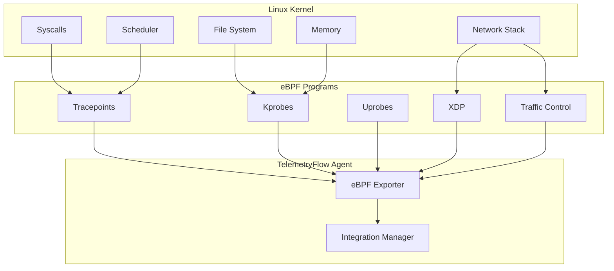
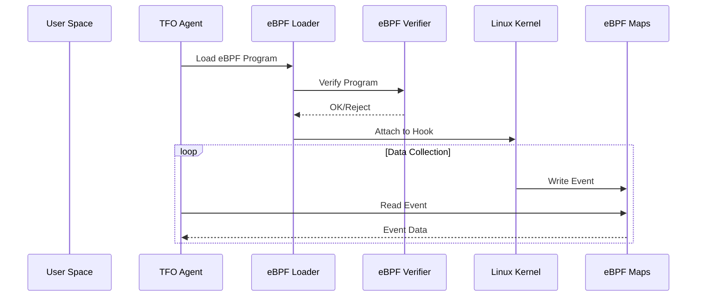
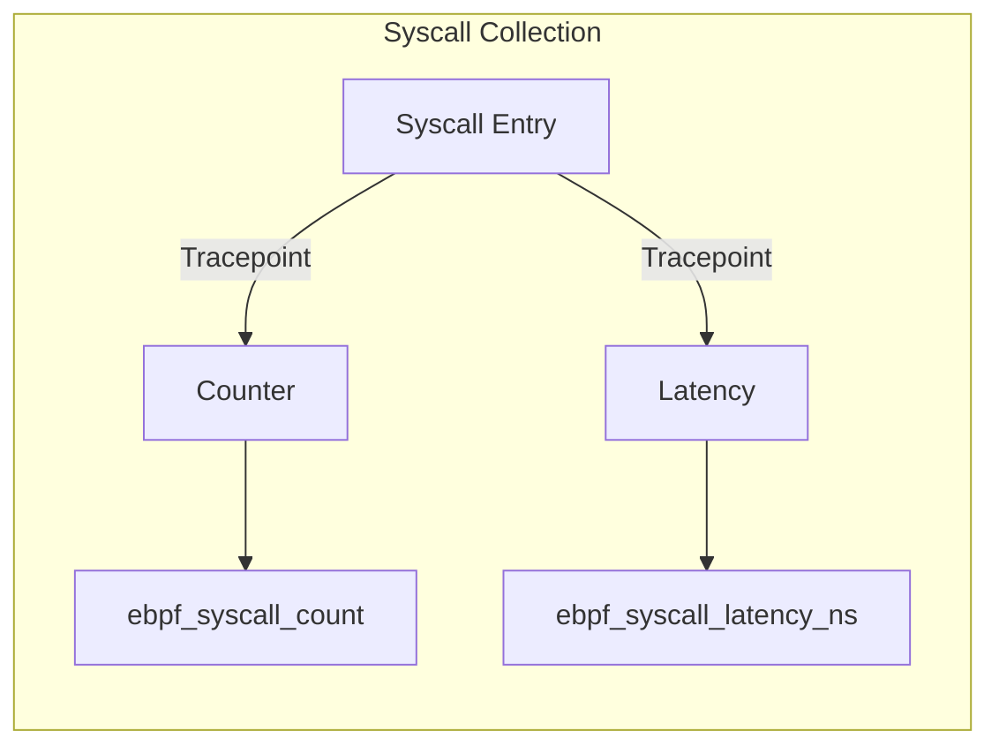
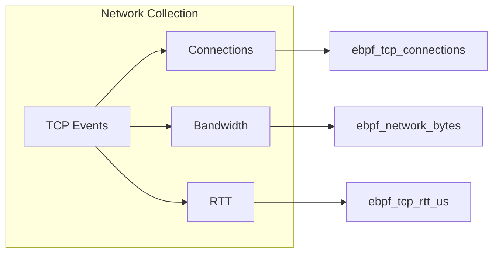
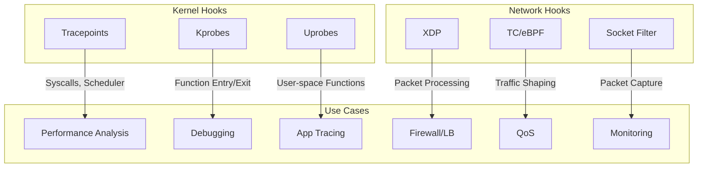
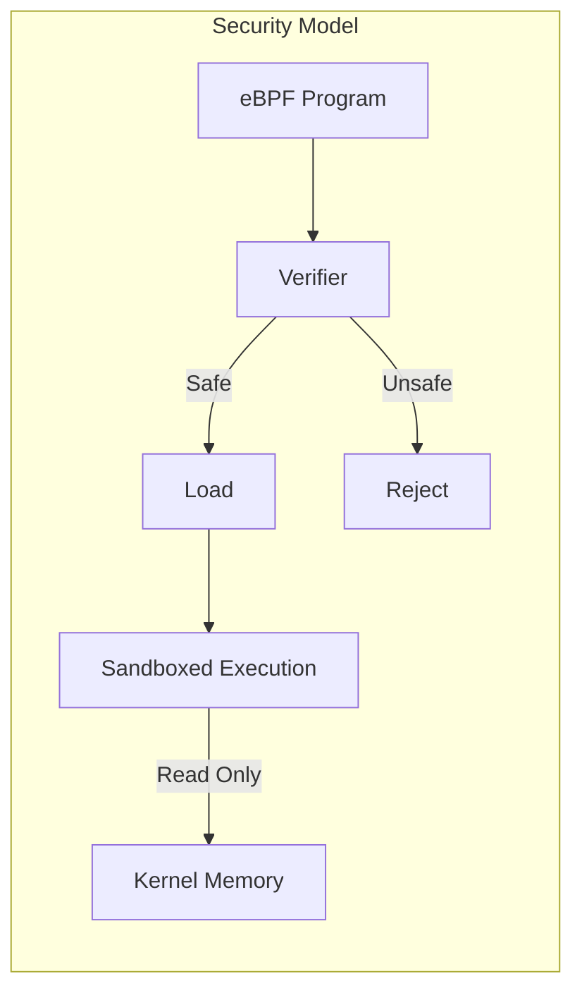
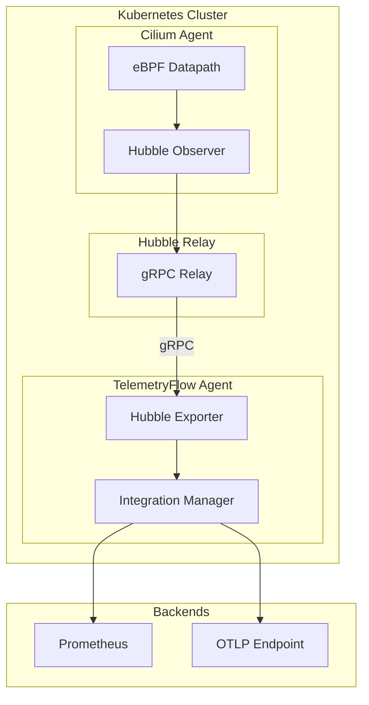
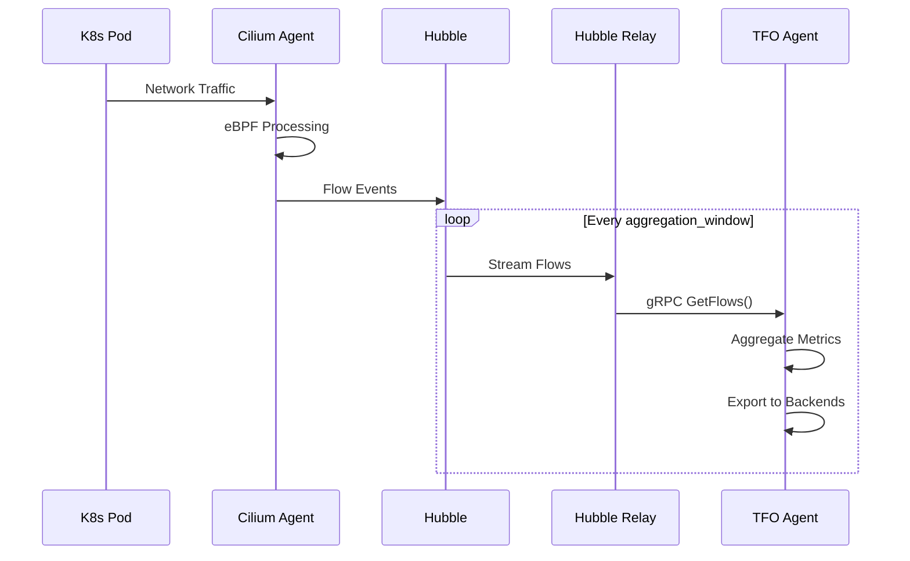

# Kernel/System Integrations

[](../../CHANGELOG.md)

This document covers kernel-level observability integrations using eBPF.

## Overview



## eBPF (Extended Berkeley Packet Filter)

### What is eBPF?

eBPF is a revolutionary technology that allows running sandboxed programs in the Linux kernel without changing kernel source code or loading kernel modules. It provides:

- **Low overhead** - Runs at kernel speed with minimal impact
- **Safety** - Programs are verified before execution
- **Flexibility** - Can attach to various kernel hooks
- **Portability** - CO-RE (Compile Once, Run Everywhere)

### Architecture



### Requirements

| Requirement | Minimum Version |
|-------------|-----------------|
| Linux Kernel | 4.15+ (5.x recommended) |
| BTF Support | Kernel 5.2+ |
| CAP_SYS_ADMIN | Required |
| BPF FS | Mounted at /sys/fs/bpf |

### Configuration

```yaml
integrations:
  ebpf:
    enabled: true
    programs_path: /var/lib/tfo-agent/ebpf
    pin_path: /sys/fs/bpf/tfo-agent
    scrape_interval: 15s

    # Collection options
    collect_syscalls: true
    collect_network: true
    collect_file_io: true
    collect_scheduler: false
    collect_memory: false
    collect_tcp_events: true
    collect_dns: false
    collect_http: false

    # Process filtering
    process_filter: []
    # - nginx
    # - postgres

    container_filter: []
    namespace_filter: []

    exclude_processes:
      - tfo-agent
      - systemd

    # Sampling settings
    sample_rate: 100  # Percentage (1-100)
    ring_buffer_size: 65536
    perf_buffer_size: 8192
    max_stack_depth: 20

    # BTF path for CO-RE
    btf_path: ""  # Auto-detected
```

### Collected Data

#### Syscall Metrics



| Metric | Type | Description |
|--------|------|-------------|
| `ebpf_syscall_count` | counter | Syscall count by type |
| `ebpf_syscall_latency_ns` | histogram | Syscall latency |
| `ebpf_syscall_errors` | counter | Failed syscalls |

#### Network Metrics



| Metric | Type | Description |
|--------|------|-------------|
| `ebpf_network_bytes_total` | counter | Bytes sent/received |
| `ebpf_network_packets_total` | counter | Packets sent/received |
| `ebpf_tcp_connections` | gauge | Active TCP connections |
| `ebpf_tcp_connect_latency_ns` | histogram | TCP connect time |
| `ebpf_tcp_rtt_us` | gauge | TCP round-trip time |
| `ebpf_tcp_retransmits` | counter | TCP retransmissions |

#### File I/O Metrics

| Metric | Type | Description |
|--------|------|-------------|
| `ebpf_file_read_bytes` | counter | Bytes read |
| `ebpf_file_write_bytes` | counter | Bytes written |
| `ebpf_file_open_count` | counter | File opens |
| `ebpf_file_io_latency_ns` | histogram | I/O latency |

#### Scheduler Metrics

| Metric | Type | Description |
|--------|------|-------------|
| `ebpf_process_runtime_ns` | counter | Process CPU time |
| `ebpf_context_switches` | counter | Context switches |
| `ebpf_runqueue_latency_ns` | histogram | Scheduler latency |

#### Memory Metrics

| Metric | Type | Description |
|--------|------|-------------|
| `ebpf_page_faults` | counter | Page fault count |
| `ebpf_memory_allocations` | counter | Memory allocations |
| `ebpf_oom_kills` | counter | OOM kill events |

### eBPF Program Types



### Platform Support

| Platform | Support |
|----------|---------|
| Linux x86_64 | ✅ Full |
| Linux aarch64 | ✅ Full |
| macOS | ❌ Not supported |
| Windows | ❌ Not supported |

### Troubleshooting

#### Check eBPF Support

```bash
# Check kernel version
uname -r

# Check BTF support
ls /sys/kernel/btf/vmlinux

# Check BPF filesystem
mount | grep bpf

# Check capabilities
capsh --print | grep cap_sys_admin
```

#### Common Issues

| Issue | Solution |
|-------|----------|
| Permission denied | Run as root or with CAP_SYS_ADMIN |
| BTF not found | Install kernel BTF or provide btf_path |
| Program load failed | Check kernel version compatibility |
| Ring buffer overflow | Increase ring_buffer_size |

### Security Considerations



- eBPF programs are verified before execution
- Programs run in a sandboxed environment
- Memory access is strictly controlled
- Stack size is limited
- Loops must be bounded

---

## Cilium Hubble Integration

TelemetryFlow Agent provides native integration with [Cilium](https://cilium.io/) and [Hubble](https://docs.cilium.io/en/stable/observability/hubble/) for advanced Kubernetes network observability.

### What is Cilium Hubble?

Cilium is an eBPF-based networking, observability, and security solution for Kubernetes. Hubble is the observability layer that provides:

- **Network Flow Visibility** - L3/L4 network flows with identity awareness
- **Service Dependency Maps** - Automatic service topology discovery
- **L7 Protocol Visibility** - HTTP, gRPC, DNS, Kafka observability
- **Network Policy Verdicts** - Real-time policy enforcement monitoring
- **Kubernetes-native** - Pod, Service, Namespace enrichment

### Hubble Architecture



### Hubble Configuration

```yaml
integrations:
  ebpf:
    enabled: true
    # ... other eBPF settings ...

    # Cilium Hubble integration
    cilium:
      enabled: true

      # Hubble Relay connection
      hubble_address: "hubble-relay.kube-system.svc:4245"
      hubble_tls_enabled: true
      hubble_tls_cert: /etc/hubble/tls.crt
      hubble_tls_key: /etc/hubble/tls.key
      hubble_tls_ca: /etc/hubble/ca.crt

      # Flow collection
      collect_flows: true        # L3/L4 network flows
      collect_l7_flows: true     # HTTP, gRPC, DNS, Kafka
      collect_drops: true        # Dropped packets
      collect_policies: true     # Network policy verdicts
      collect_services: true     # Service mesh metrics

      # Kubernetes integration
      kubernetes_enabled: true
      watch_namespaces: []       # Empty = all namespaces
      exclude_namespaces:
        - kube-system
        - cilium

      # Performance settings
      flow_buffer_size: 4096
      flow_sample_rate: 1        # 1 = 100%, 10 = 10%
      max_flows_per_second: 10000
      aggregation_window: 10s
```

### Hubble Metrics

#### Flow Metrics

| Metric | Type | Description |
|--------|------|-------------|
| `hubble_flows_total` | counter | Total flows by protocol/verdict |
| `hubble_flow_bytes_total` | counter | Total bytes by flow |
| `hubble_tcp_connections_total` | counter | TCP connections |
| `hubble_tcp_connection_duration_seconds` | histogram | TCP connection duration |
| `hubble_udp_flows_total` | counter | UDP flows |

#### L7 Protocol Metrics

| Metric | Type | Description |
|--------|------|-------------|
| `hubble_http_requests_total` | counter | HTTP requests by method |
| `hubble_http_request_duration_seconds` | histogram | HTTP request latency |
| `hubble_http_responses_total` | counter | HTTP responses by status |
| `hubble_grpc_requests_total` | counter | gRPC requests |
| `hubble_grpc_request_duration_seconds` | histogram | gRPC request latency |
| `hubble_dns_queries_total` | counter | DNS queries by type |
| `hubble_dns_responses_total` | counter | DNS responses by rcode |
| `hubble_kafka_requests_total` | counter | Kafka requests |

#### Drop Metrics

| Metric                   | Type    | Description                |
|--------------------------|---------|----------------------------|
| `hubble_drop_total`      | counter | Dropped packets by reason  |
| `hubble_drop_bytes_total`| counter | Dropped bytes by reason    |

Common drop reasons:

- `POLICY_DENIED` - Blocked by network policy
- `INVALID_SOURCE_IP` - Invalid source address
- `CT_UNKNOWN_L4_PROTOCOL` - Unknown protocol
- `STALE_OR_UNROUTABLE_IP` - Routing issue

#### Network Policy Metrics

| Metric                        | Type    | Description                                 |
|-------------------------------|---------|---------------------------------------------|
| `hubble_policy_verdicts_total`| counter | Policy verdicts (ALLOWED/DENIED/AUDIT)      |
| `hubble_policy_match_total`   | counter | Policy matches by type (L3, L4, L7)         |

#### Service Metrics

| Metric | Type | Description |
|--------|------|-------------|
| `hubble_service_requests_total` | counter | Service requests |
| `hubble_service_errors_total` | counter | Service errors |
| `hubble_service_request_duration_seconds` | histogram | Service latency |
| `hubble_endpoint_count` | gauge | Active endpoints |
| `hubble_endpoint_ready` | gauge | Ready endpoints |

### Data Flow



### Prerequisites

| Requirement   | Minimum Version   |
|---------------|-------------------|
| Kubernetes    | 1.21+             |
| Cilium        | 1.12+             |
| Hubble        | Enabled in Cilium |
| Hubble Relay  | Deployed          |

### Installation with Cilium

```bash
# Install Cilium with Hubble enabled
cilium install --set hubble.enabled=true \
               --set hubble.relay.enabled=true \
               --set hubble.ui.enabled=true

# Verify Hubble status
cilium hubble port-forward &
hubble status

# Check flows
hubble observe --follow
```

### Kubernetes Deployment

```yaml
apiVersion: apps/v1
kind: DaemonSet
metadata:
  name: tfo-agent
  namespace: telemetryflow
spec:
  selector:
    matchLabels:
      app: tfo-agent
  template:
    spec:
      containers:
      - name: tfo-agent
        image: telemetryflow/telemetryflow-agent:1.1.2
        volumeMounts:
        - name: hubble-tls
          mountPath: /etc/hubble
          readOnly: true
        - name: config
          mountPath: /etc/tfo-agent
      volumes:
      - name: hubble-tls
        secret:
          secretName: hubble-relay-client-certs
      - name: config
        configMap:
          name: tfo-agent-config
```

### Troubleshooting Cilium Integration

```bash
# Check Cilium status
cilium status

# Check Hubble Relay
kubectl -n kube-system get pods -l k8s-app=hubble-relay

# Test Hubble connection
hubble status --server hubble-relay.kube-system.svc:4245

# View Hubble flows
hubble observe -n default

# Check TFO Agent logs
kubectl logs -n telemetryflow -l app=tfo-agent | grep hubble
```

| Issue                | Solution                        |
|----------------------|---------------------------------|
| Connection refused   | Verify Hubble Relay is running  |
| TLS handshake failed | Check TLS certificates          |
| No flows received    | Verify Cilium is the CNI        |
| Missing L7 metrics   | Enable L7 visibility in Cilium  |

---

**Copyright (c) 2024-2026 DevOpsCorner Indonesia. All rights reserved.**
