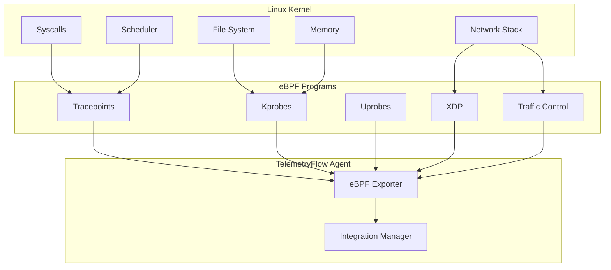
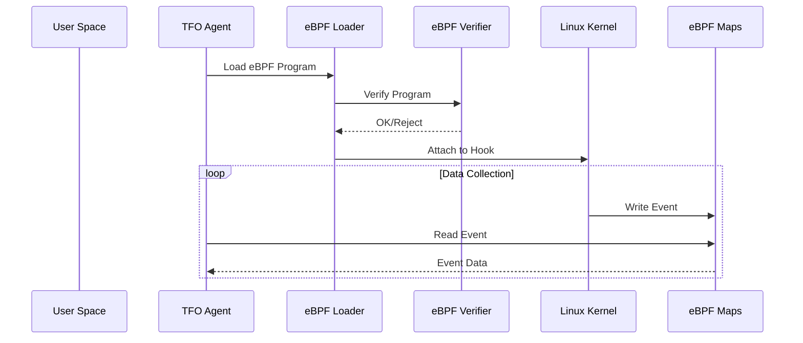
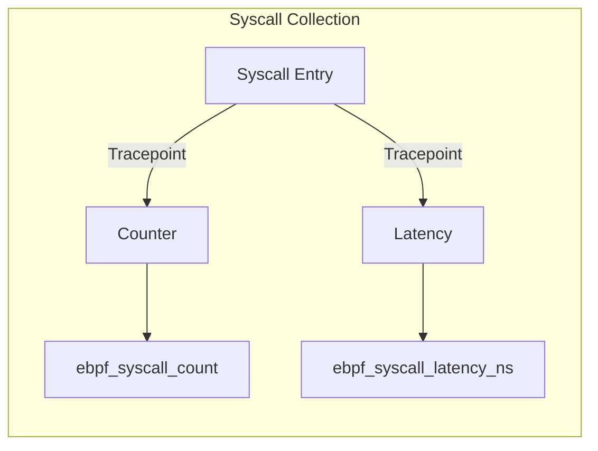
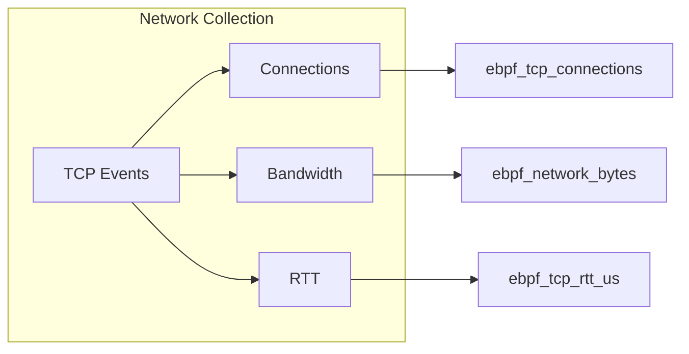
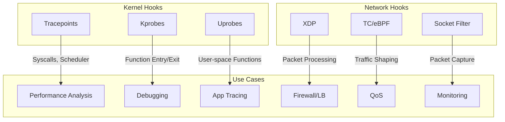
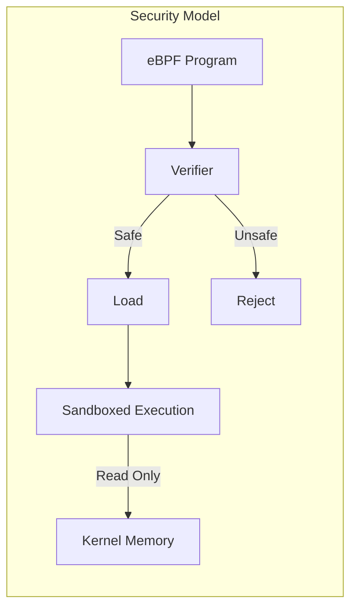

# Kernel/System Integrations

[](../../CHANGELOG.md)

This document covers kernel-level observability integrations using eBPF.

## Overview


```mermaid
flowchart TB
    subgraph "Linux Kernel"
        SC[Syscalls]
        NET[Network Stack]
        FS[File System]
        SCHED[Scheduler]
        MEM[Memory]
    end

    subgraph "eBPF Programs"
        TP[Tracepoints]
        KP[Kprobes]
        UP[Uprobes]
        XDP[XDP]
        TC[Traffic Control]
    end

    subgraph "TelemetryFlow Agent"
        EBPF[eBPF Exporter]
        IM[Integration Manager]
    end

    SC --> TP
    NET --> XDP & TC
    FS --> KP
    SCHED --> TP
    MEM --> KP

    TP & KP & UP & XDP & TC --> EBPF
    EBPF --> IM
```

## eBPF (Extended Berkeley Packet Filter)

### What is eBPF?

eBPF is a revolutionary technology that allows running sandboxed programs in the Linux kernel without changing kernel source code or loading kernel modules. It provides:

- **Low overhead** - Runs at kernel speed with minimal impact
- **Safety** - Programs are verified before execution
- **Flexibility** - Can attach to various kernel hooks
- **Portability** - CO-RE (Compile Once, Run Everywhere)

### Architecture


```mermaid
sequenceDiagram
    participant User as User Space
    participant Agent as TFO Agent
    participant Loader as eBPF Loader
    participant Verifier as eBPF Verifier
    participant Kernel as Linux Kernel
    participant Maps as eBPF Maps

    Agent->>Loader: Load eBPF Program
    Loader->>Verifier: Verify Program
    Verifier-->>Loader: OK/Reject

    Loader->>Kernel: Attach to Hook

    loop Data Collection
        Kernel->>Maps: Write Event
        Agent->>Maps: Read Event
        Maps-->>Agent: Event Data
    end
```

### Requirements

| Requirement | Minimum Version |
|-------------|-----------------|
| Linux Kernel | 4.15+ (5.x recommended) |
| BTF Support | Kernel 5.2+ |
| CAP_SYS_ADMIN | Required |
| BPF FS | Mounted at /sys/fs/bpf |

### Configuration

```yaml
integrations:
  ebpf:
    enabled: true
    programs_path: /var/lib/tfo-agent/ebpf
    pin_path: /sys/fs/bpf/tfo-agent
    scrape_interval: 15s

    # Collection options
    collect_syscalls: true
    collect_network: true
    collect_file_io: true
    collect_scheduler: false
    collect_memory: false
    collect_tcp_events: true
    collect_dns: false
    collect_http: false

    # Process filtering
    process_filter: []
    # - nginx
    # - postgres

    container_filter: []
    namespace_filter: []

    exclude_processes:
      - tfo-agent
      - systemd

    # Sampling settings
    sample_rate: 100  # Percentage (1-100)
    ring_buffer_size: 65536
    perf_buffer_size: 8192
    max_stack_depth: 20

    # BTF path for CO-RE
    btf_path: ""  # Auto-detected
```

### Collected Data

#### Syscall Metrics


```mermaid
graph LR
    subgraph "Syscall Collection"
        SYS[Syscall Entry] --> |Tracepoint| COUNT[Counter]
        SYS --> |Tracepoint| LAT[Latency]
        COUNT --> M1[ebpf_syscall_count]
        LAT --> M2[ebpf_syscall_latency_ns]
    end
```

| Metric | Type | Description |
|--------|------|-------------|
| `ebpf_syscall_count` | counter | Syscall count by type |
| `ebpf_syscall_latency_ns` | histogram | Syscall latency |
| `ebpf_syscall_errors` | counter | Failed syscalls |

#### Network Metrics


```mermaid
graph LR
    subgraph "Network Collection"
        TCP[TCP Events] --> CONN[Connections]
        TCP --> BW[Bandwidth]
        TCP --> RTT[RTT]
    end

    CONN --> M1[ebpf_tcp_connections]
    BW --> M2[ebpf_network_bytes]
    RTT --> M3[ebpf_tcp_rtt_us]
```

| Metric | Type | Description |
|--------|------|-------------|
| `ebpf_network_bytes_total` | counter | Bytes sent/received |
| `ebpf_network_packets_total` | counter | Packets sent/received |
| `ebpf_tcp_connections` | gauge | Active TCP connections |
| `ebpf_tcp_connect_latency_ns` | histogram | TCP connect time |
| `ebpf_tcp_rtt_us` | gauge | TCP round-trip time |
| `ebpf_tcp_retransmits` | counter | TCP retransmissions |

#### File I/O Metrics

| Metric | Type | Description |
|--------|------|-------------|
| `ebpf_file_read_bytes` | counter | Bytes read |
| `ebpf_file_write_bytes` | counter | Bytes written |
| `ebpf_file_open_count` | counter | File opens |
| `ebpf_file_io_latency_ns` | histogram | I/O latency |

#### Scheduler Metrics

| Metric | Type | Description |
|--------|------|-------------|
| `ebpf_process_runtime_ns` | counter | Process CPU time |
| `ebpf_context_switches` | counter | Context switches |
| `ebpf_runqueue_latency_ns` | histogram | Scheduler latency |

#### Memory Metrics

| Metric | Type | Description |
|--------|------|-------------|
| `ebpf_page_faults` | counter | Page fault count |
| `ebpf_memory_allocations` | counter | Memory allocations |
| `ebpf_oom_kills` | counter | OOM kill events |

### eBPF Program Types


```mermaid
graph TB
    subgraph "Kernel Hooks"
        TP[Tracepoints]
        KP[Kprobes]
        UP[Uprobes]
    end

    subgraph "Network Hooks"
        XDP[XDP]
        TC[TC/eBPF]
        SK[Socket Filter]
    end

    subgraph "Use Cases"
        TP --> |Syscalls, Scheduler| PERF[Performance Analysis]
        KP --> |Function Entry/Exit| DEBUG[Debugging]
        UP --> |User-space Functions| APP[App Tracing]
        XDP --> |Packet Processing| FW[Firewall/LB]
        TC --> |Traffic Shaping| QOS[QoS]
        SK --> |Packet Capture| MON[Monitoring]
    end
```

### Platform Support

| Platform | Support |
|----------|---------|
| Linux x86_64 | ✅ Full |
| Linux aarch64 | ✅ Full |
| macOS | ❌ Not supported |
| Windows | ❌ Not supported |

### Troubleshooting

#### Check eBPF Support

```bash
# Check kernel version
uname -r

# Check BTF support
ls /sys/kernel/btf/vmlinux

# Check BPF filesystem
mount | grep bpf

# Check capabilities
capsh --print | grep cap_sys_admin
```

#### Common Issues

| Issue | Solution |
|-------|----------|
| Permission denied | Run as root or with CAP_SYS_ADMIN |
| BTF not found | Install kernel BTF or provide btf_path |
| Program load failed | Check kernel version compatibility |
| Ring buffer overflow | Increase ring_buffer_size |

### Security Considerations


```mermaid
flowchart LR
    subgraph "Security Model"
        PROG[eBPF Program] --> VER[Verifier]
        VER --> |Safe| LOAD[Load]
        VER --> |Unsafe| REJ[Reject]

        LOAD --> SANDBOX[Sandboxed Execution]
        SANDBOX --> |Read Only| KERNEL[Kernel Memory]
    end
```

- eBPF programs are verified before execution
- Programs run in a sandboxed environment
- Memory access is strictly controlled
- Stack size is limited
- Loops must be bounded

---

**Copyright (c) 2024-2026 DevOpsCorner Indonesia. All rights reserved.**
