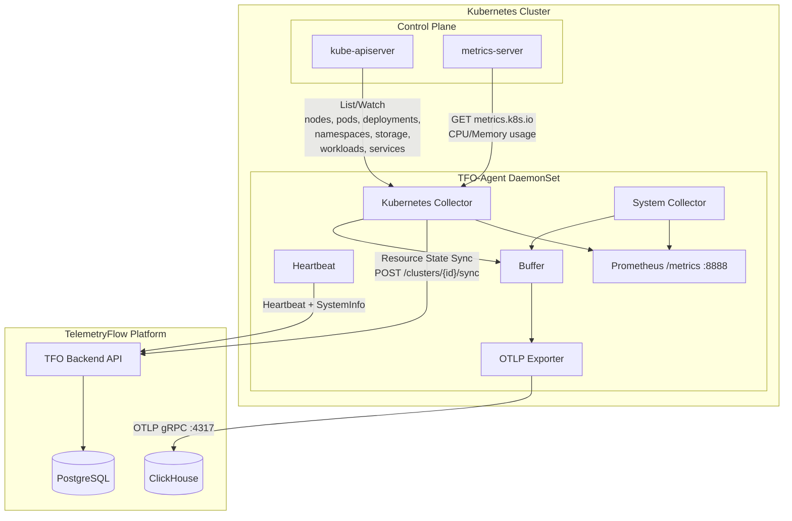
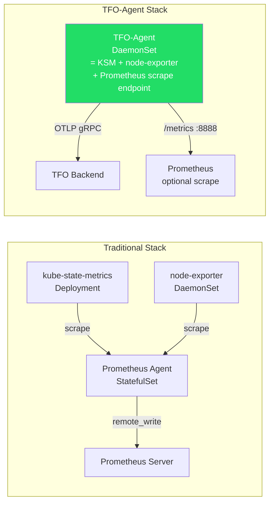
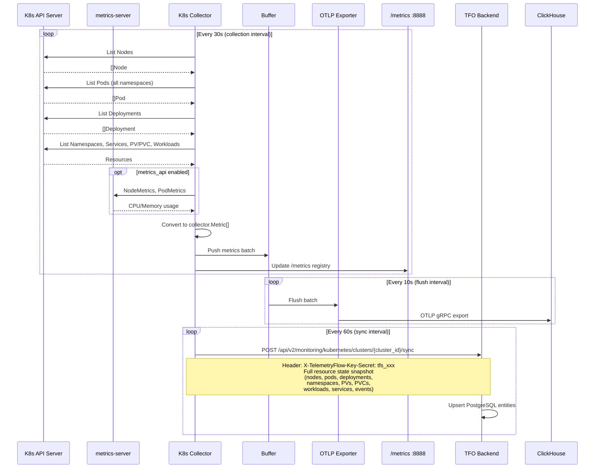

# Kubernetes Metrics Collector

## Overview

The Kubernetes Metrics Collector is TFO-Agent's built-in replacement for **kube-state-metrics** and the metrics collection portion of **Prometheus Agent**. It collects Kubernetes resource state metrics directly from the Kubernetes API server using `k8s.io/client-go`, eliminating the need for separate kube-state-metrics and Prometheus Agent deployments.

## Architecture



## Comparison: TFO-Agent vs Separate Components



| Capability         | kube-state-metrics | Prometheus Agent   | node-exporter | **TFO-Agent**                         |
| ------------------ | ------------------ | ------------------ | ------------- | ------------------------------------- |
| K8s Resource State | Yes                | -                  | -             | **Yes**                               |
| K8s Actual Usage   | -                  | Via metrics-server | -             | **Yes** (metrics API)                 |
| System Metrics     | -                  | -                  | Yes           | **Yes** (built-in)                    |
| Prometheus Scrape  | -                  | Remote Write       | /metrics      | **/metrics**                          |
| OTLP Export        | -                  | -                  | -             | **Yes** (gRPC + HTTP)                 |
| Backend Sync       | -                  | -                  | -             | **Yes** (REST API)                    |
| Deployment         | Deployment         | StatefulSet        | DaemonSet     | **DaemonSet** (single binary)         |
| Agent Lifecycle    | -                  | -                  | -             | **Yes** (register, heartbeat, health) |
| Offline Resilience | -                  | WAL                | -             | **Yes** (disk buffer)                 |

## Configuration

### Minimal (In-Cluster)

```yaml
collectors:
  kubernetes:
    enabled: true
```

When running as a DaemonSet with a ServiceAccount, the collector auto-detects the in-cluster config. No kubeconfig needed.

### Full Configuration

```yaml
collectors:
  kubernetes:
    # Enable Kubernetes metrics collection
    enabled: false

    # Collection interval (heavier than system metrics, use 30s+)
    interval: 30s

    # Kubeconfig path (empty = in-cluster auto-detection via ServiceAccount)
    kubeconfig: ""

    # Kubeconfig context name (empty = current-context)
    context: ""

    # Namespace filtering (empty = all namespaces)
    namespaces: []

    # Namespaces to exclude from collection
    exclude_namespaces:
      - kube-system

    # Kubernetes label selector (empty = all resources)
    label_selector: ""

    # Resource collectors (individually toggleable)
    nodes: true
    pods: true
    deployments: true
    namespaces_collect: true
    storage: true # PersistentVolume + PersistentVolumeClaim
    services: true # Service + Endpoints
    workloads: true # StatefulSet, DaemonSet, ReplicaSet, Job, CronJob

    # Fetch actual CPU/Memory usage from metrics-server
    # Requires metrics-server deployed in cluster
    metrics_api: true

    # Sync resource state to TFO backend (PostgreSQL entities)
    sync_to_backend: true
    sync_interval: 60s

    # Cluster metadata (auto-detected if empty)
    cluster_name: ""
    cluster_provider: "" # eks, gke, aks, k3s, self-managed, etc.
```

### Environment Variables

| Variable                             | Config Key                               | Default                      |
| ------------------------------------ | ---------------------------------------- | ---------------------------- |
| `TELEMETRYFLOW_K8S_ENABLED`          | `collectors.kubernetes.enabled`          | `false`                      |
| `TELEMETRYFLOW_K8S_CLUSTER_ID`       | `collectors.kubernetes.cluster_id`       | `""` (**required for sync**) |
| `TELEMETRYFLOW_K8S_KUBECONFIG`       | `collectors.kubernetes.kubeconfig`       | `""` (in-cluster)            |
| `TELEMETRYFLOW_K8S_NAMESPACES`       | `collectors.kubernetes.namespaces`       | `[]` (all)                   |
| `TELEMETRYFLOW_K8S_CLUSTER_NAME`     | `collectors.kubernetes.cluster_name`     | `""` (auto)                  |
| `TELEMETRYFLOW_K8S_CLUSTER_PROVIDER` | `collectors.kubernetes.cluster_provider` | `""` (auto)                  |

> **`TELEMETRYFLOW_K8S_CLUSTER_ID`** is required for the resource state sync to the TFO Platform.
> Obtain it by registering a cluster in the TFO Platform UI (**Kubernetes → Clusters → Register Cluster**)
> or via the REST API. See [KUBERNETES-REGISTRATION.md](./KUBERNETES-REGISTRATION.md) for the full workflow.

## Metrics Reference

### Node Metrics

Collected from `v1/nodes` API + `metrics.k8s.io/v1beta1/nodes`.

| Metric Name                   | Type  | Unit  | Labels                   | Description                                                                                  |
| ----------------------------- | ----- | ----- | ------------------------ | -------------------------------------------------------------------------------------------- |
| `k8s.node.status`             | gauge | -     | cluster, node            | 1=Ready, 0=NotReady                                                                          |
| `k8s.node.condition`          | gauge | -     | cluster, node, condition | Node condition status (Ready, MemoryPressure, DiskPressure, PIDPressure, NetworkUnavailable) |
| `k8s.node.cpu.capacity`       | gauge | cores | cluster, node            | Total CPU capacity                                                                           |
| `k8s.node.cpu.allocatable`    | gauge | cores | cluster, node            | Allocatable CPU (capacity - reserved)                                                        |
| `k8s.node.memory.capacity`    | gauge | bytes | cluster, node            | Total memory capacity                                                                        |
| `k8s.node.memory.allocatable` | gauge | bytes | cluster, node            | Allocatable memory                                                                           |
| `k8s.node.pods.capacity`      | gauge | -     | cluster, node            | Maximum pod count                                                                            |
| `k8s.node.pods.count`         | gauge | -     | cluster, node            | Current running pods                                                                         |
| `k8s.node.cpu.usage`          | gauge | cores | cluster, node            | Actual CPU usage (metrics-server)                                                            |
| `k8s.node.memory.usage`       | gauge | bytes | cluster, node            | Actual memory usage (metrics-server)                                                         |

### Pod Metrics

Collected from `v1/pods` API + `metrics.k8s.io/v1beta1/pods`.

| Metric Name                        | Type  | Unit  | Labels                                     | Description                                                        |
| ---------------------------------- | ----- | ----- | ------------------------------------------ | ------------------------------------------------------------------ |
| `k8s.pod.phase`                    | gauge | -     | cluster, namespace, pod, node, phase       | 1 for current phase (Pending, Running, Succeeded, Failed, Unknown) |
| `k8s.pod.restart_count`            | gauge | -     | cluster, namespace, pod                    | Total container restart count                                      |
| `k8s.pod.container.status`         | gauge | -     | cluster, namespace, pod, container, status | Container status (running, waiting, terminated)                    |
| `k8s.pod.container.cpu_request`    | gauge | cores | cluster, namespace, pod, container         | CPU resource request                                               |
| `k8s.pod.container.cpu_limit`      | gauge | cores | cluster, namespace, pod, container         | CPU resource limit                                                 |
| `k8s.pod.container.memory_request` | gauge | bytes | cluster, namespace, pod, container         | Memory resource request                                            |
| `k8s.pod.container.memory_limit`   | gauge | bytes | cluster, namespace, pod, container         | Memory resource limit                                              |
| `k8s.pod.container.cpu_usage`      | gauge | cores | cluster, namespace, pod, container         | Actual CPU usage (metrics-server)                                  |
| `k8s.pod.container.memory_usage`   | gauge | bytes | cluster, namespace, pod, container         | Actual memory usage (metrics-server)                               |
| `k8s.pod.count`                    | gauge | -     | cluster, namespace, phase                  | Pod count aggregated per namespace and phase                       |

### Deployment Metrics

Collected from `apps/v1/deployments` API.

| Metric Name                           | Type  | Unit | Labels                                            | Description                                                   |
| ------------------------------------- | ----- | ---- | ------------------------------------------------- | ------------------------------------------------------------- |
| `k8s.deployment.replicas`             | gauge | -    | cluster, namespace, deployment                    | Desired replica count                                         |
| `k8s.deployment.replicas.ready`       | gauge | -    | cluster, namespace, deployment                    | Ready replica count                                           |
| `k8s.deployment.replicas.available`   | gauge | -    | cluster, namespace, deployment                    | Available replica count                                       |
| `k8s.deployment.replicas.unavailable` | gauge | -    | cluster, namespace, deployment                    | Unavailable replica count                                     |
| `k8s.deployment.replicas.updated`     | gauge | -    | cluster, namespace, deployment                    | Updated replica count (during rollout)                        |
| `k8s.deployment.condition`            | gauge | -    | cluster, namespace, deployment, condition, status | Deployment condition (Progressing, Available, ReplicaFailure) |

### Workload Metrics

| Metric Name                        | Type  | Labels                          | Description                     |
| ---------------------------------- | ----- | ------------------------------- | ------------------------------- |
| `k8s.statefulset.replicas`         | gauge | cluster, namespace, statefulset | Desired replicas                |
| `k8s.statefulset.replicas.ready`   | gauge | cluster, namespace, statefulset | Ready replicas                  |
| `k8s.statefulset.replicas.current` | gauge | cluster, namespace, statefulset | Current replicas                |
| `k8s.daemonset.desired`            | gauge | cluster, namespace, daemonset   | Desired node count              |
| `k8s.daemonset.current`            | gauge | cluster, namespace, daemonset   | Current scheduled count         |
| `k8s.daemonset.ready`              | gauge | cluster, namespace, daemonset   | Ready count                     |
| `k8s.daemonset.available`          | gauge | cluster, namespace, daemonset   | Available count                 |
| `k8s.daemonset.misscheduled`       | gauge | cluster, namespace, daemonset   | Misscheduled count              |
| `k8s.replicaset.replicas`          | gauge | cluster, namespace, replicaset  | Desired replicas                |
| `k8s.replicaset.replicas.ready`    | gauge | cluster, namespace, replicaset  | Ready replicas                  |
| `k8s.job.active`                   | gauge | cluster, namespace, job         | Active pods                     |
| `k8s.job.succeeded`                | gauge | cluster, namespace, job         | Succeeded pods                  |
| `k8s.job.failed`                   | gauge | cluster, namespace, job         | Failed pods                     |
| `k8s.cronjob.active`               | gauge | cluster, namespace, cronjob     | Active job count                |
| `k8s.cronjob.last_schedule_time`   | gauge | cluster, namespace, cronjob     | Unix timestamp of last schedule |

### Storage Metrics

| Metric Name              | Type  | Unit  | Labels                                        | Description                                              |
| ------------------------ | ----- | ----- | --------------------------------------------- | -------------------------------------------------------- |
| `k8s.pv.capacity_bytes`  | gauge | bytes | cluster, pv, storage_class, phase             | PersistentVolume capacity                                |
| `k8s.pv.phase`           | gauge | -     | cluster, pv, phase                            | 1 for current phase (Available, Bound, Released, Failed) |
| `k8s.pvc.capacity_bytes` | gauge | bytes | cluster, namespace, pvc, storage_class, phase | PersistentVolumeClaim requested storage                  |
| `k8s.pvc.phase`          | gauge | -     | cluster, namespace, pvc, phase                | 1 for current phase (Pending, Bound, Lost)               |

### Namespace & Service Metrics

| Metric Name           | Type  | Labels                      | Description                                               |
| --------------------- | ----- | --------------------------- | --------------------------------------------------------- |
| `k8s.namespace.phase` | gauge | cluster, namespace, phase   | 1 for current phase (Active, Terminating)                 |
| `k8s.namespace.count` | gauge | cluster                     | Total namespace count                                     |
| `k8s.service.count`   | gauge | cluster, namespace, type    | Service count by type (ClusterIP, NodePort, LoadBalancer) |
| `k8s.endpoint.count`  | gauge | cluster, namespace, service | Ready endpoint addresses per service                      |

## Authentication

### In-Cluster (Recommended)

When deployed as a DaemonSet, TFO-Agent uses the mounted ServiceAccount token automatically:

```
/var/run/secrets/kubernetes.io/serviceaccount/token
/var/run/secrets/kubernetes.io/serviceaccount/ca.crt
```

No additional configuration needed — `kubeconfig: ""` triggers in-cluster detection.

### Kubeconfig (Out-of-Cluster)

For development or external monitoring:

```yaml
collectors:
  kubernetes:
    enabled: true
    kubeconfig: /home/user/.kube/config
    context: my-cluster-context
```

## RBAC Requirements

TFO-Agent requires **read-only** access to Kubernetes resources:

```yaml
apiVersion: rbac.authorization.k8s.io/v1
kind: ClusterRole
metadata:
  name: tfo-agent
rules:
  # Core resources
  - apiGroups: [""]
    resources:
      - nodes
      - pods
      - services
      - endpoints
      - namespaces
      - persistentvolumes
      - persistentvolumeclaims
      - resourcequotas
    verbs: ["get", "list", "watch"]

  # Workload resources
  - apiGroups: ["apps"]
    resources:
      - deployments
      - statefulsets
      - daemonsets
      - replicasets
    verbs: ["get", "list", "watch"]

  # Batch resources
  - apiGroups: ["batch"]
    resources:
      - jobs
      - cronjobs
    verbs: ["get", "list", "watch"]

  # Metrics API (requires metrics-server)
  - apiGroups: ["metrics.k8s.io"]
    resources:
      - nodes
      - pods
    verbs: ["get", "list"]
```

## Data Flow



## Backend Sync

The collector syncs Kubernetes resource state to the TFO backend every 60 seconds, populating PostgreSQL entities.

**Endpoint:** `POST /api/v2/monitoring/kubernetes/clusters/{cluster_id}/sync`
**Auth:** `X-TelemetryFlow-Key-Secret: tfs_xxx` (TFO API key)

The `cluster_id` path parameter is the UUID returned when the cluster was registered in TFO Platform. Configure it via `TELEMETRYFLOW_K8S_CLUSTER_ID`. If this variable is not set, the sync loop is disabled with a warning and **no backend data is written**.

| K8s Resource          | Backend Entity         | Table                                 |
| --------------------- | ---------------------- | ------------------------------------- |
| Cluster metadata      | `KubernetesCluster`    | `kubernetes_clusters`                 |
| Node                  | `KubernetesNode`       | `kubernetes_nodes`                    |
| Pod                   | `KubernetesPod`        | `kubernetes_pods`                     |
| Deployment            | `KubernetesDeployment` | `kubernetes_deployments`              |
| Namespace             | `KubernetesNamespace`  | `kubernetes_namespaces`               |
| PersistentVolume      | `KubernetesPV`         | `kubernetes_persistent_volumes`       |
| PersistentVolumeClaim | `KubernetesPVC`        | `kubernetes_persistent_volume_claims` |
| StatefulSet/DaemonSet | `KubernetesWorkload`   | `kubernetes_workloads`                |
| Service               | `KubernetesService`    | `kubernetes_services`                 |
| Event                 | `KubernetesEvent`      | `kubernetes_events`                   |

Node and pod CPU/memory usage metrics are also written to ClickHouse (`kubernetes_metrics` table) as part of each sync.

## Cluster Provider Detection

If `cluster_provider` is not set, the collector auto-detects the provider by inspecting node labels, annotations, and providerIDs in priority order:

### Managed Cloud Providers

| Signal                                         | Provider |
| ---------------------------------------------- | -------- |
| Node label `eks.amazonaws.com/nodegroup`       | `eks`    |
| Node providerID prefix `aws://`                | `eks`    |
| Node label `cloud.google.com/gke-nodepool`     | `gke`    |
| Node providerID prefix `gce://`                | `gke`    |
| Node label `kubernetes.azure.com/agentpool`    | `aks`    |
| Node providerID prefix `azure://`              | `aks`    |
| Node label `alibabacloud.com/nodepool-id`      | `ack`    |
| Node providerID prefix `alicloud://`           | `ack`    |
| Node label `cce.cloud.com/cce-nodepool`        | `cce`    |
| Node providerID prefix `huawei://` or `cce://` | `cce`    |

### Distributions & Local

| Signal                                                  | Provider       |
| ------------------------------------------------------- | -------------- |
| Node annotation `rke.cattle.io/` or `cattle.io/creator` | `rancher`      |
| Node label `node.openshift.io/os_id` (OpenShift)        | `openshift`    |
| Namespace `openshift-apiserver` exists                  | `openshift`    |
| Namespace `openshift-apiserver` + OKD build annotations | `okd`          |
| Node annotation `microshift.openshift.io/`              | `microshift`   |
| Namespace `kubesphere-system` with `ks-apiserver` pod   | `kubesphere`   |
| Node annotation `k3s.io/`                               | `k3s`          |
| Platform `kind` detected                                | `kind`         |
| Platform `minikube` detected                            | `minikube`     |
| Fallback                                                | `self-managed` |

### Full Provider Enum

| Value          | Name                                    |
| -------------- | --------------------------------------- |
| `eks`          | Amazon Elastic Kubernetes Service (AWS) |
| `gke`          | Google Kubernetes Engine (GCP)          |
| `aks`          | Azure Kubernetes Service (Azure)        |
| `ack`          | Alibaba Cloud Kubernetes Service (ACK)  |
| `cce`          | Huawei Cloud Container Engine (CCE)     |
| `rancher`      | Rancher (RKE / RKE2)                    |
| `openshift`    | Red Hat OpenShift                       |
| `okd`          | OKD — Origin Kubernetes Distribution    |
| `microshift`   | MicroShift (OpenShift for Edge)         |
| `kubesphere`   | KubeSphere                              |
| `k3s`          | K3s (Lightweight Kubernetes)            |
| `kind`         | Kind (Kubernetes IN Docker)             |
| `minikube`     | Minikube                                |
| `self-managed` | Self-managed / bare-metal               |
| `other`        | Other / Unknown                         |

## Namespace Filtering

Three modes of namespace filtering:

1. **All namespaces** (default): `namespaces: []` + `exclude_namespaces: []`
2. **Include list**: `namespaces: [default, monitoring, app]` — only these namespaces
3. **Exclude list**: `exclude_namespaces: [kube-system, kube-public]` — all except these

Include takes precedence over exclude when both are set.

## Resource Limits

The Kubernetes collector respects the agent's resource limits:

```yaml
resources:
  enabled: true
  cpu:
    max_percent: 5.0 # Max 5% CPU for entire agent
  memory:
    max_mb: 128 # Max 128MB for entire agent
  adaptive_collection:
    enabled: true
    high_load_threshold: 80.0
    reduced_interval: 60s # Slow down collection under high load
```

When adaptive collection detects high system load, the K8s collection interval increases from 30s to 60s automatically.

## Deployment

### DaemonSet (Recommended)

Deploy one TFO-Agent pod per node:

```bash
# Apply RBAC, ConfigMap, and DaemonSet
kubectl apply -f deploy/kubernetes/rbac.yaml
kubectl apply -f deploy/kubernetes/configmap.yaml
kubectl apply -f deploy/kubernetes/daemonset.yaml

# Or use Makefile
make deploy-k8s
```

### Sidecar

For application-level monitoring alongside K8s metrics:

```yaml
spec:
  containers:
    - name: app
      image: my-app:latest
    - name: tfo-agent
      image: telemetryflow/telemetryflow-agent:1.1.7
      env:
        - name: TELEMETRYFLOW_K8S_ENABLED
          value: "true"
      volumeMounts:
        - name: config
          mountPath: /etc/tfo-agent
```

## Troubleshooting

### Metrics-server not available

If `metrics_api: true` but metrics-server is not deployed:

```
WARN  kubernetes collector: metrics API unavailable, skipping actual usage metrics
```

The collector gracefully degrades — capacity and request/limit metrics still work.

### Permission denied

```
ERROR kubernetes collector: forbidden: pods is forbidden: User "system:serviceaccount:telemetryflow:tfo-agent" cannot list resource "pods" in API group "" at the cluster scope
```

Apply RBAC: `kubectl apply -f deploy/kubernetes/rbac.yaml`

### High API server load

If the K8s API server reports rate limiting:

1. Increase `interval` to `60s` or higher
2. Use `namespaces` filter to reduce scope
3. Disable unused sub-collectors (`workloads: false`, `storage: false`)
4. Use `label_selector` to filter specific resources

## File Structure

```
internal/collector/kubernetes/
  config.go          # KubernetesCollectorConfig
  client.go          # K8s clientset factory (in-cluster/kubeconfig)
  types.go           # ClusterState, NodeState, PodState, etc.
  kubernetes.go      # Main collector (implements collector.Collector)
  nodes.go           # Node metrics collection
  pods.go            # Pod metrics collection
  deployments.go     # Deployment metrics collection
  namespaces.go      # Namespace metrics collection
  storage.go         # PV/PVC metrics collection
  workloads.go       # StatefulSet, DaemonSet, ReplicaSet, Job, CronJob
  services.go        # Service + Endpoints metrics
  helpers.go         # CPU/Memory parsing, node role detection
```
