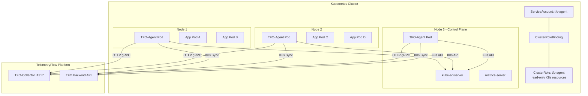

# Kubernetes Deployment Guide

## Overview

This guide covers deploying TFO-Agent as a **DaemonSet** in a Kubernetes cluster for comprehensive node-level system metrics and cluster-wide Kubernetes resource metrics collection.

## Architecture



## Prerequisites

- Kubernetes cluster v1.26+
- `kubectl` configured with cluster admin access
- TFO-Agent Docker image: `telemetryflow/telemetryflow-agent:1.1.4`
- TelemetryFlow API Key (from TFO Platform)
- (Optional) metrics-server deployed for actual CPU/Memory usage

## Quick Start

```bash
# 1. Create namespace
kubectl create namespace telemetryflow

# 2. Create secret with API keys
kubectl create secret generic tfo-agent-secret \
  --namespace telemetryflow \
  --from-literal=api-key-id=tfk_your_key_id \
  --from-literal=api-key-secret=tfs_your_key_secret

# 3. Deploy RBAC, ConfigMap, and DaemonSet
kubectl apply -f deploy/kubernetes/

# Or step by step:
kubectl apply -f deploy/kubernetes/rbac.yaml
kubectl apply -f deploy/kubernetes/configmap.yaml
kubectl apply -f deploy/kubernetes/daemonset.yaml

# 4. Verify deployment
kubectl -n telemetryflow get ds tfo-agent
kubectl -n telemetryflow get pods -l app.kubernetes.io/name=tfo-agent
```

## Manifests

### Namespace

```yaml
apiVersion: v1
kind: Namespace
metadata:
  name: telemetryflow
  labels:
    app.kubernetes.io/part-of: telemetryflow
```

### RBAC

```yaml
apiVersion: v1
kind: ServiceAccount
metadata:
  name: tfo-agent
  namespace: telemetryflow
  labels:
    app.kubernetes.io/name: tfo-agent
    app.kubernetes.io/component: agent
    app.kubernetes.io/part-of: telemetryflow
---
apiVersion: rbac.authorization.k8s.io/v1
kind: ClusterRole
metadata:
  name: tfo-agent
  labels:
    app.kubernetes.io/name: tfo-agent
rules:
  # Core resources
  - apiGroups: [""]
    resources:
      - nodes
      - pods
      - services
      - endpoints
      - namespaces
      - persistentvolumes
      - persistentvolumeclaims
      - resourcequotas
    verbs: ["get", "list", "watch"]
  # Workload resources
  - apiGroups: ["apps"]
    resources:
      - deployments
      - statefulsets
      - daemonsets
      - replicasets
    verbs: ["get", "list", "watch"]
  # Batch resources
  - apiGroups: ["batch"]
    resources:
      - jobs
      - cronjobs
    verbs: ["get", "list", "watch"]
  # Metrics API
  - apiGroups: ["metrics.k8s.io"]
    resources:
      - nodes
      - pods
    verbs: ["get", "list"]
---
apiVersion: rbac.authorization.k8s.io/v1
kind: ClusterRoleBinding
metadata:
  name: tfo-agent
  labels:
    app.kubernetes.io/name: tfo-agent
roleRef:
  apiGroup: rbac.authorization.k8s.io
  kind: ClusterRole
  name: tfo-agent
subjects:
  - kind: ServiceAccount
    name: tfo-agent
    namespace: telemetryflow
```

### ConfigMap

```yaml
apiVersion: v1
kind: ConfigMap
metadata:
  name: tfo-agent-config
  namespace: telemetryflow
  labels:
    app.kubernetes.io/name: tfo-agent
data:
  tfo-agent.yaml: |
    telemetryflow:
      endpoint: "collector.telemetryflow.svc.cluster.local:4317"
      protocol: grpc
      tls:
        enabled: false

    agent:
      name: "TelemetryFlow Agent (Kubernetes)"
      tags:
        environment: production
        deployment: kubernetes

    heartbeat:
      interval: 60s
      include_system_info: true

    collectors:
      system:
        enabled: true
        interval: 15s
        cpu: true
        memory: true
        disk: true
        network: true

      kubernetes:
        enabled: true
        interval: 30s
        nodes: true
        pods: true
        deployments: true
        namespaces_collect: true
        storage: true
        services: true
        workloads: true
        metrics_api: true
        sync_to_backend: true
        sync_interval: 60s
        exclude_namespaces:
          - kube-system
          - kube-public
          - kube-node-lease

    exporter:
      otlp:
        enabled: true
        endpoint_version: v2
        batch_size: 200
        flush_interval: 10s
        compression: gzip
        metrics:
          enabled: true

    prometheus_server:
      enabled: true
      port: 8888
      path: /metrics
      metric_prefix: tfo

    buffer:
      enabled: true
      max_size_mb: 50
      path: /var/lib/tfo-agent/buffer

    logging:
      level: info
      format: json

    resources:
      enabled: true
      cpu:
        max_percent: 5.0
      memory:
        max_mb: 200
```

### DaemonSet

```yaml
apiVersion: apps/v1
kind: DaemonSet
metadata:
  name: tfo-agent
  namespace: telemetryflow
  labels:
    app.kubernetes.io/name: tfo-agent
    app.kubernetes.io/component: agent
    app.kubernetes.io/part-of: telemetryflow
    app.kubernetes.io/version: "1.1.4"
spec:
  selector:
    matchLabels:
      app.kubernetes.io/name: tfo-agent
  updateStrategy:
    type: RollingUpdate
    rollingUpdate:
      maxUnavailable: 1
  template:
    metadata:
      labels:
        app.kubernetes.io/name: tfo-agent
        app.kubernetes.io/component: agent
      annotations:
        prometheus.io/scrape: "true"
        prometheus.io/port: "8888"
        prometheus.io/path: "/metrics"
    spec:
      serviceAccountName: tfo-agent
      priorityClassName: system-node-critical
      terminationGracePeriodSeconds: 30

      # Tolerate all taints to run on every node
      tolerations:
        - operator: Exists

      # Schedule on all nodes including control plane
      nodeSelector: {}

      containers:
        - name: tfo-agent
          image: telemetryflow/telemetryflow-agent:1.1.4
          imagePullPolicy: Always
          args:
            - start
            - --config=/etc/tfo-agent/tfo-agent.yaml

          ports:
            - name: metrics
              containerPort: 8888
              protocol: TCP
            - name: health
              containerPort: 13133
              protocol: TCP

          env:
            # API Keys from Secret
            - name: TELEMETRYFLOW_API_KEY_ID
              valueFrom:
                secretKeyRef:
                  name: tfo-agent-secret
                  key: api-key-id
            - name: TELEMETRYFLOW_API_KEY_SECRET
              valueFrom:
                secretKeyRef:
                  name: tfo-agent-secret
                  key: api-key-secret

            # Kubernetes Downward API
            - name: NODE_NAME
              valueFrom:
                fieldRef:
                  fieldPath: spec.nodeName
            - name: POD_NAME
              valueFrom:
                fieldRef:
                  fieldPath: metadata.name
            - name: POD_NAMESPACE
              valueFrom:
                fieldRef:
                  fieldPath: metadata.namespace
            - name: POD_IP
              valueFrom:
                fieldRef:
                  fieldPath: status.podIP

            # Agent hostname = node name
            - name: TELEMETRYFLOW_HOSTNAME
              valueFrom:
                fieldRef:
                  fieldPath: spec.nodeName

          resources:
            requests:
              cpu: 50m
              memory: 64Mi
            limits:
              cpu: 200m
              memory: 256Mi

          livenessProbe:
            httpGet:
              path: /
              port: health
            initialDelaySeconds: 15
            periodSeconds: 30
            timeoutSeconds: 5
            failureThreshold: 3

          readinessProbe:
            httpGet:
              path: /ready
              port: metrics
            initialDelaySeconds: 5
            periodSeconds: 10
            timeoutSeconds: 3
            failureThreshold: 3

          volumeMounts:
            - name: config
              mountPath: /etc/tfo-agent
              readOnly: true
            - name: buffer
              mountPath: /var/lib/tfo-agent/buffer

      volumes:
        - name: config
          configMap:
            name: tfo-agent-config
        - name: buffer
          emptyDir:
            sizeLimit: 100Mi
```

## Cloud Provider Specifics

### Amazon EKS

```yaml
# Additional environment variables for EKS
env:
  - name: TELEMETRYFLOW_K8S_CLUSTER_PROVIDER
    value: "eks"
  - name: TELEMETRYFLOW_K8S_CLUSTER_NAME
    value: "my-eks-cluster"
```

EKS with IRSA (IAM Roles for Service Accounts):

```yaml
apiVersion: v1
kind: ServiceAccount
metadata:
  name: tfo-agent
  namespace: telemetryflow
  annotations:
    eks.amazonaws.com/role-arn: arn:aws:iam::123456789012:role/tfo-agent-role
```

### Google GKE

```yaml
env:
  - name: TELEMETRYFLOW_K8S_CLUSTER_PROVIDER
    value: "gke"
  - name: TELEMETRYFLOW_K8S_CLUSTER_NAME
    value: "my-gke-cluster"
```

GKE Autopilot note: Resource requests/limits must be within Autopilot allowed ranges.

### Azure AKS

```yaml
env:
  - name: TELEMETRYFLOW_K8S_CLUSTER_PROVIDER
    value: "aks"
  - name: TELEMETRYFLOW_K8S_CLUSTER_NAME
    value: "my-aks-cluster"
```

AKS with Azure Workload Identity:

```yaml
apiVersion: v1
kind: ServiceAccount
metadata:
  name: tfo-agent
  namespace: telemetryflow
  annotations:
    azure.workload.identity/client-id: <client-id>
  labels:
    azure.workload.identity/use: "true"
```

## Monitoring the Agent

### Verify Pods

```bash
# Check DaemonSet status
kubectl -n telemetryflow get ds tfo-agent

# List all agent pods
kubectl -n telemetryflow get pods -l app.kubernetes.io/name=tfo-agent -o wide

# Check logs
kubectl -n telemetryflow logs -l app.kubernetes.io/name=tfo-agent --tail=50

# Check metrics endpoint
kubectl -n telemetryflow port-forward ds/tfo-agent 8888:8888
curl http://localhost:8888/metrics
```

### Prometheus Scraping

If Prometheus is deployed in the cluster, it will auto-discover TFO-Agent pods via the `prometheus.io/*` annotations:

```bash
# Verify Prometheus targets
curl http://prometheus:9090/api/v1/targets | jq '.data.activeTargets[] | select(.labels.job == "tfo-agent")'
```

### Health Check

```bash
# Liveness check
kubectl -n telemetryflow exec ds/tfo-agent -- curl -s http://localhost:13133/

# Readiness check
kubectl -n telemetryflow exec ds/tfo-agent -- curl -s http://localhost:8888/ready
```

## Scaling Considerations

### Large Clusters (100+ nodes)

For clusters with many nodes, adjust collection intervals:

```yaml
collectors:
  kubernetes:
    interval: 60s # Increase from 30s
    sync_interval: 120s # Increase from 60s
    workloads: false # Disable if not needed
    storage: false # Disable if not needed
    exclude_namespaces:
      - kube-system
      - kube-public
      - kube-node-lease
```

### Resource Adjustment

For resource-constrained nodes:

```yaml
resources:
  requests:
    cpu: 25m
    memory: 32Mi
  limits:
    cpu: 100m
    memory: 128Mi
```

### Namespace Filtering for Multi-Tenant

```yaml
collectors:
  kubernetes:
    namespaces:
      - team-a
      - team-b
      - monitoring
```

## Upgrade

### Rolling Update

```bash
# Update image
kubectl -n telemetryflow set image ds/tfo-agent tfo-agent=telemetryflow/telemetryflow-agent:1.2.1

# Or update the full manifest
kubectl apply -f deploy/kubernetes/daemonset.yaml

# Monitor rollout
kubectl -n telemetryflow rollout status ds/tfo-agent
```

### Canary Update

```bash
# Pause rollout after first node
kubectl -n telemetryflow rollout pause ds/tfo-agent

# Verify on one node
kubectl -n telemetryflow logs <pod-on-updated-node> --tail=20

# Resume rollout
kubectl -n telemetryflow rollout resume ds/tfo-agent
```

## Uninstall

```bash
kubectl delete -f deploy/kubernetes/daemonset.yaml
kubectl delete -f deploy/kubernetes/configmap.yaml
kubectl delete -f deploy/kubernetes/rbac.yaml
kubectl delete secret tfo-agent-secret -n telemetryflow
kubectl delete namespace telemetryflow
```
