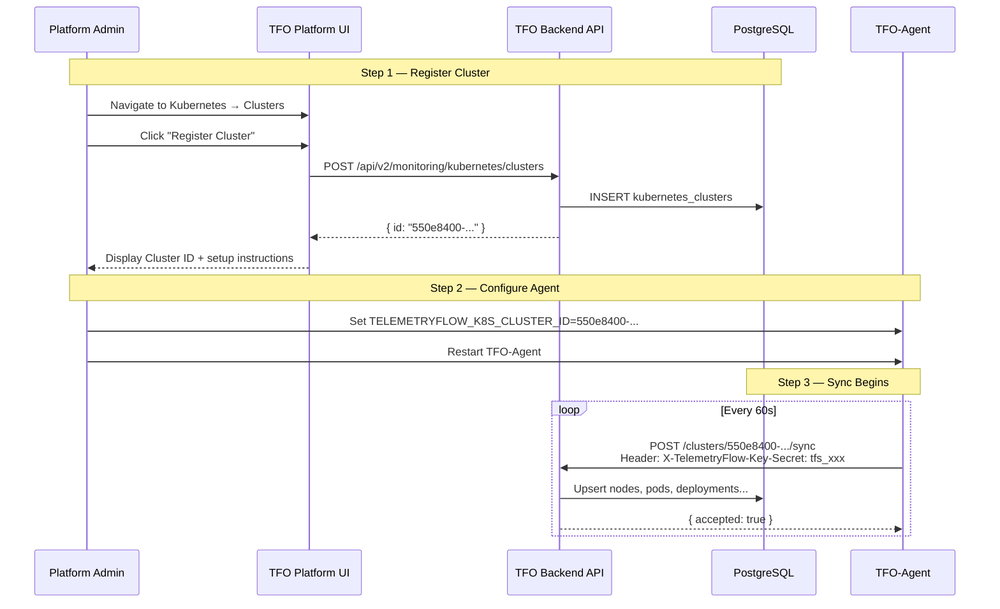
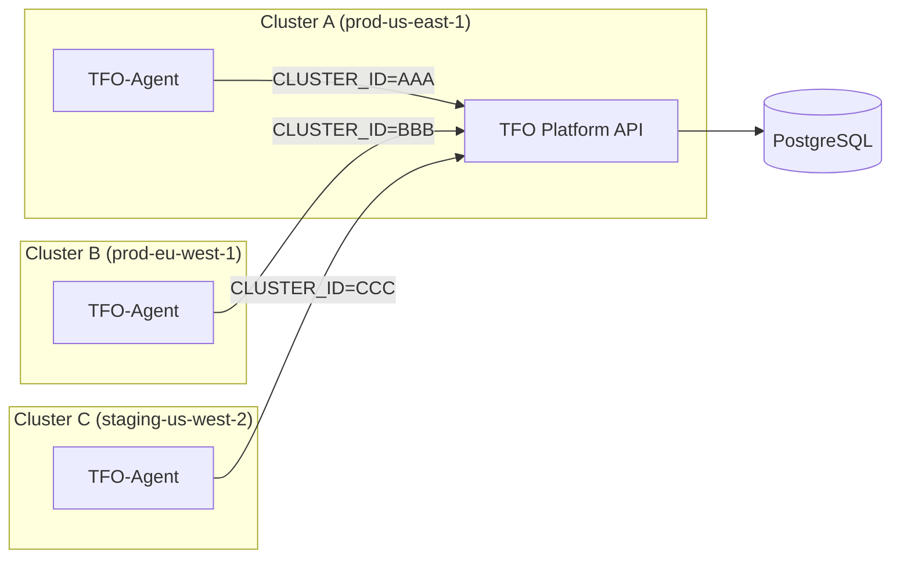

# Kubernetes Cluster Registration Guide

This guide explains how to register a Kubernetes cluster in the TFO Platform and configure the TFO-Agent to sync resource state.

## Overview

The TFO Platform tracks Kubernetes clusters as first-class entities in PostgreSQL. Before the TFO-Agent can sync node/pod/deployment state, the cluster must be **registered** via the TFO Platform — this produces a **Cluster UUID** that the agent uses to route sync payloads to the correct cluster record.



---

## Step 1 — Register a Cluster

### Option A: TFO Platform UI

1. Navigate to **Kubernetes → Clusters** in the sidebar.
2. Click **Register Cluster**.
3. Fill in the registration form:

| Field              | Required | Description                                                                                |
| ------------------ | -------- | ------------------------------------------------------------------------------------------ |
| Cluster Name       | Yes      | Machine-readable identifier (`prod-us-east-1`)                                             |
| Display Name       | No       | Human-readable label shown in dashboards                                                   |
| Cloud Provider     | No       | eks, gke, aks, ack, cce, rancher, openshift, okd, microshift, kubesphere, k3s, kind, other |
| Region             | No       | Cloud region (e.g. `us-east-1`)                                                            |
| API Server URL     | No       | `https://k8s-api.example.com`                                                              |
| Kubernetes Version | No       | e.g. `1.34.0`                                                                              |

4. Click **Register**. A success panel displays the **Cluster ID** — copy it immediately.

> The Cluster ID is the value for `TELEMETRYFLOW_K8S_CLUSTER_ID`.

### Option B: REST API

Requires a JWT bearer token with `monitoring:kubernetes:write` permission.

```bash
curl -X POST https://platform.telemetryflow.id/api/v2/monitoring/kubernetes/clusters \
  -H "Authorization: Bearer ${JWT_TOKEN}" \
  -H "Content-Type: application/json" \
  -d '{
    "name": "prod-us-east-1",
    "displayName": "Production — US East",
    "provider": "eks",
    "region": "us-east-1",
    "apiServerUrl": "https://k8s.example.com",
    "version": "1.29.3"
  }'
```

**Response:**

```json
{
  "id": "550e8400-e29b-41d4-a716-446655440000",
  "name": "prod-us-east-1",
  "displayName": "Production — US East",
  "provider": "eks",
  "region": "us-east-1",
  "status": "pending",
  "nodeCount": 0,
  "podCount": 0,
  "namespaceCount": 0,
  "organizationId": "...",
  "createdAt": "2026-03-01T00:00:00Z"
}
```

The `id` field is the Cluster UUID to use for `TELEMETRYFLOW_K8S_CLUSTER_ID`.

### Option C: List Existing Clusters

If the cluster was previously registered and you need to find its ID:

```bash
curl https://platform.telemetryflow.id/api/v2/monitoring/kubernetes/clusters \
  -H "Authorization: Bearer ${JWT_TOKEN}"
```

---

## Step 2 — Configure the TFO Agent

Set the Cluster ID in the agent environment **before** enabling Kubernetes collection.

### Environment file (`.env`)

```env
# Kubernetes collector
TELEMETRYFLOW_K8S_ENABLED=true
TELEMETRYFLOW_K8S_CLUSTER_ID=550e8400-e29b-41d4-a716-446655440000
```

### Config file (`config.yaml`)

```yaml
collectors:
  kubernetes:
    enabled: true
    cluster_id: "550e8400-e29b-41d4-a716-446655440000"
    sync_to_backend: true
    sync_interval: 60s
```

### Kubernetes DaemonSet (recommended)

Store the Cluster ID in a Kubernetes Secret and inject it as an environment variable:

```yaml
# Create Secret
kubectl create secret generic tfo-credentials \
--namespace telemetryflow \
--from-literal=api-key-id="${TELEMETRYFLOW_API_KEY_ID}" \
--from-literal=api-key-secret="${TELEMETRYFLOW_API_KEY_SECRET}" \
--from-literal=k8s-cluster-id="${TELEMETRYFLOW_K8S_CLUSTER_ID}"
```

```yaml
# DaemonSet env section
env:
  - name: TELEMETRYFLOW_K8S_ENABLED
    value: "true"
  - name: TELEMETRYFLOW_K8S_CLUSTER_ID
    valueFrom:
      secretKeyRef:
        name: tfo-credentials
        key: k8s-cluster-id
  - name: TELEMETRYFLOW_API_KEY_ID
    valueFrom:
      secretKeyRef:
        name: tfo-credentials
        key: api-key-id
  - name: TELEMETRYFLOW_API_KEY_SECRET
    valueFrom:
      secretKeyRef:
        name: tfo-credentials
        key: api-key-secret
```

> **Security:** Never embed the Cluster ID or API key secrets directly in ConfigMaps or image layers. Always use Kubernetes Secrets.

---

## Step 3 — Verify the Sync

After restarting the agent, verify the sync is working:

### Check agent logs

```bash
# Docker
docker logs tfo-agent 2>&1 | grep -i "kubernetes\|sync\|cluster"

# Kubernetes
kubectl logs -n telemetryflow -l app=tfo-agent --tail=50 | grep -i "sync"
```

Expected output on successful sync:

```
INFO  kubernetes sync: cluster state accepted  cluster_id=550e8400-...  duration=230ms
```

If the Cluster ID is missing:

```
WARN  kubernetes sync: disabled — cluster_id not configured in collectors.kubernetes
```

### Verify via TFO Platform UI

1. Go to **Kubernetes → Clusters**.
2. The registered cluster status changes from **Pending** → **Healthy** after the first successful sync.
3. Navigate to **Kubernetes → Nodes** or **Pods** — data populates within 60–90 seconds.

### Verify via API

```bash
curl https://platform.telemetryflow.id/api/v2/monitoring/kubernetes/clusters/550e8400-... \
  -H "Authorization: Bearer ${JWT_TOKEN}"
```

A healthy response shows `"status": "healthy"` and non-zero `nodeCount`, `podCount`.

---

## Sync Payload Reference

Each sync POSTs a `ClusterState` JSON snapshot to:

```
POST /api/v2/monitoring/kubernetes/clusters/{cluster_id}/sync
Header: X-TelemetryFlow-Key-Secret: tfs_xxx
```

The agent uses the **TFO API key** (not a JWT) for sync authentication, since it runs unattended inside the cluster. The API key must belong to the same organization that registered the cluster.

**Minimal payload example:**

```json
{
  "cluster_name": "prod-us-east-1",
  "cluster_provider": "eks",
  "collected_at": "2026-03-01T00:00:00Z",
  "nodes": [
    {
      "name": "ip-10-0-1-100.ec2.internal",
      "status": "Ready",
      "roles": ["worker"],
      "cpu_capacity": 4000,
      "memory_capacity": 16106127360,
      "pods_count": 22,
      "cpu_usage": 0.45,
      "memory_usage": 8053063680
    }
  ],
  "pods": [
    {
      "name": "api-gateway-7f9b8-xxxx",
      "namespace": "production",
      "node": "ip-10-0-1-100.ec2.internal",
      "phase": "Running",
      "restart_count": 0,
      "containers": [
        {
          "name": "api",
          "image": "nginx:1.25",
          "ready": true,
          "restart_count": 0,
          "status": "running"
        }
      ]
    }
  ],
  "namespaces": [{ "name": "production", "phase": "Active" }],
  "deployments": [],
  "pvs": [],
  "pvcs": [],
  "statefulsets": [],
  "daemonsets": [],
  "replicasets": [],
  "jobs": [],
  "cronjobs": [],
  "services": [],
  "events": []
}
```

**Response:** `200 OK` → `{ "accepted": true }`

---

## Multi-Cluster Setup

Each cluster requires its own registration and a separate TFO-Agent deployment with a unique `TELEMETRYFLOW_K8S_CLUSTER_ID`.



All clusters within an organization share the same TFO API key. The `TELEMETRYFLOW_K8S_CLUSTER_ID` is the only value that differs per cluster.

---

## Cluster Management API Reference

| Endpoint                                                 | Method | Auth    | Description                     |
| -------------------------------------------------------- | ------ | ------- | ------------------------------- |
| `/api/v2/monitoring/kubernetes/clusters`                 | GET    | JWT     | List all registered clusters    |
| `/api/v2/monitoring/kubernetes/clusters`                 | POST   | JWT     | Register a new cluster          |
| `/api/v2/monitoring/kubernetes/clusters/{id}`            | GET    | JWT     | Get cluster details             |
| `/api/v2/monitoring/kubernetes/clusters/{id}`            | PUT    | JWT     | Update cluster metadata         |
| `/api/v2/monitoring/kubernetes/clusters/{id}`            | DELETE | JWT     | Deregister cluster              |
| `/api/v2/monitoring/kubernetes/clusters/{id}/sync`       | POST   | API Key | Agent state sync endpoint       |
| `/api/v2/monitoring/kubernetes/clusters/{id}/nodes`      | GET    | JWT     | List nodes in cluster           |
| `/api/v2/monitoring/kubernetes/clusters/{id}/pods`       | GET    | JWT     | List pods in cluster            |
| `/api/v2/monitoring/kubernetes/clusters/{id}/namespaces` | GET    | JWT     | List namespaces                 |
| `/api/v2/monitoring/kubernetes/clusters/{id}/metrics`    | GET    | JWT     | Cluster metrics from ClickHouse |

---

## Troubleshooting

### Cluster stuck in "Pending" status

The cluster remains `pending` until the first successful sync. Check:

1. Is `TELEMETRYFLOW_K8S_CLUSTER_ID` set to the correct UUID?
2. Is `TELEMETRYFLOW_K8S_ENABLED=true`?
3. Is the TFO API key valid? Test with:
   ```bash
   curl -I https://platform.telemetryflow.id/api/v2/monitoring/kubernetes/clusters \
     -H "X-TelemetryFlow-Key-Secret: ${TELEMETRYFLOW_API_KEY_SECRET}"
   ```
4. Can the agent reach the TFO Platform endpoint?
   ```bash
   curl -v https://platform.telemetryflow.id/api/v2/monitoring/kubernetes/clusters/${CLUSTER_ID}/sync
   ```

### 404 — Cluster not found

The `cluster_id` does not match any cluster registered under the organization of the API key. Re-register or verify the UUID.

### 401 — Unauthorized

The API key is invalid, revoked, or belongs to a different organization. Generate a new key in **Settings → API Keys**.

### Sync accepted but no data appears

The sync was received but ClickHouse or PostgreSQL writes may have failed. Check TFO Platform backend logs:

```bash
kubectl logs -n telemetryflow -l app=tfo-backend --tail=100 | grep -i "k8s\|kubernetes\|sync"
```

---

## Related Documentation

- [KUBERNETES-COLLECTOR.md](./KUBERNETES-COLLECTOR.md) — Full collector configuration reference
- [KUBERNETES-DEPLOYMENT.md](./KUBERNETES-DEPLOYMENT.md) — DaemonSet deployment guide
- [TFO-PLATFORM-INTEGRATION.md](../TFO-PLATFORM-INTEGRATION.md) — Full platform integration guide
