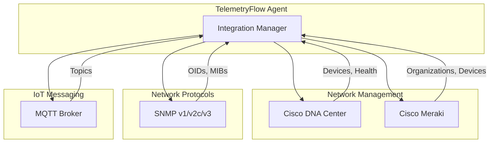
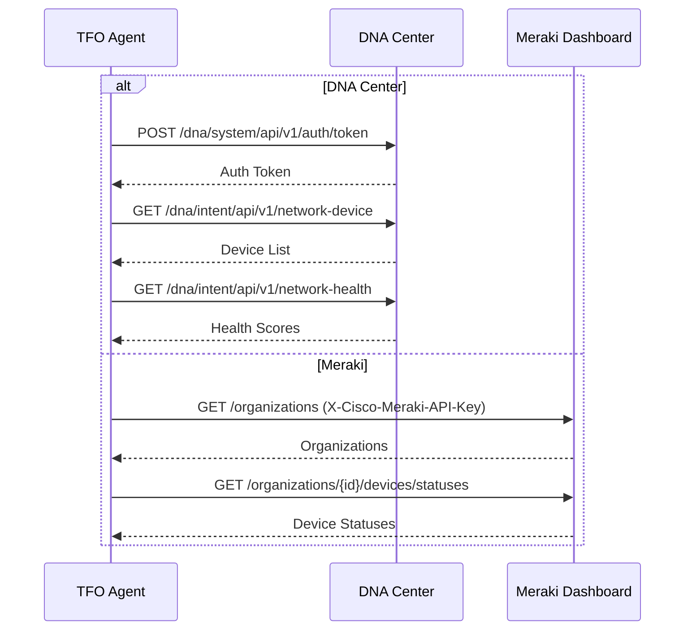
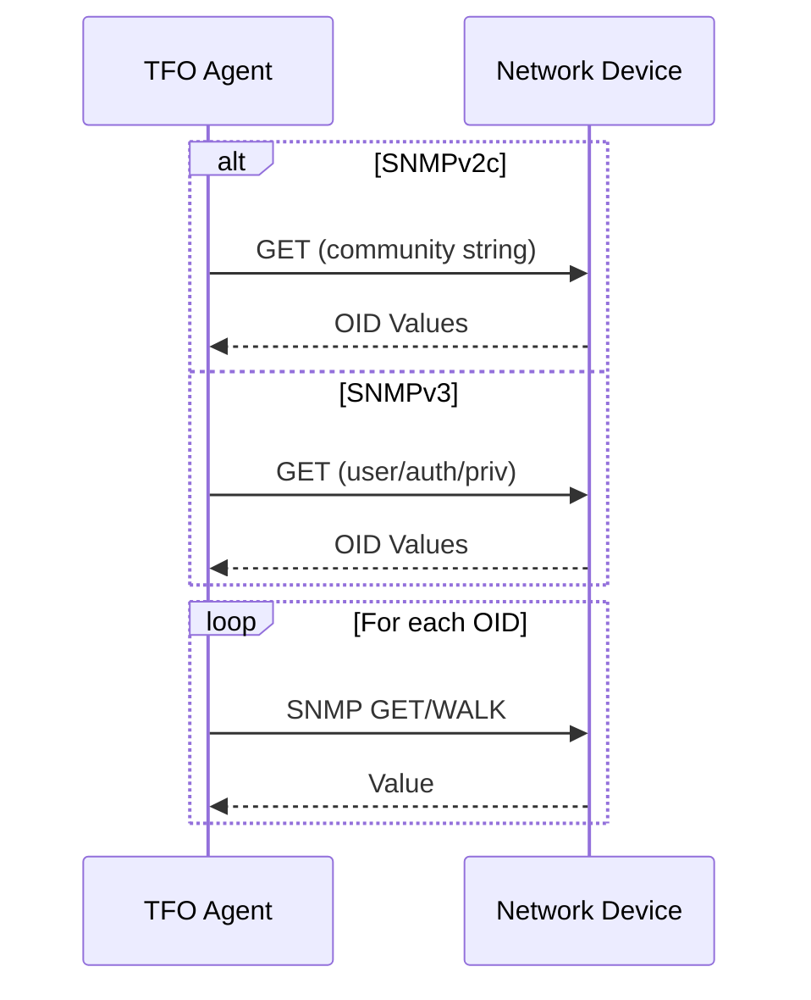
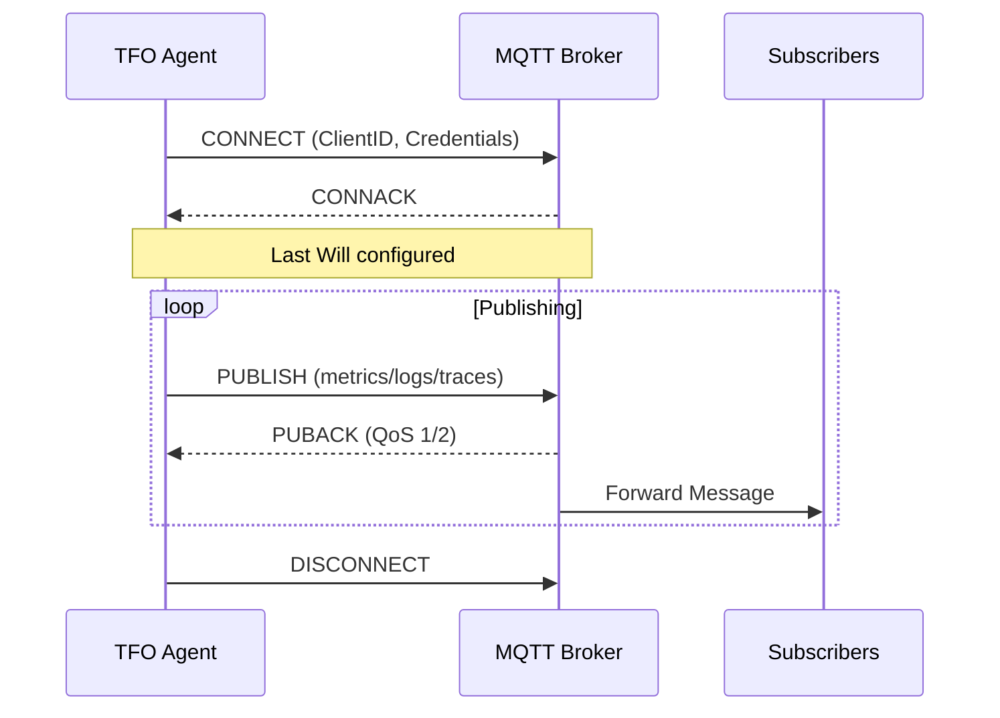

# Network & IoT Integrations

[](../../CHANGELOG.md)

This document covers network device and IoT messaging integrations.

## Overview



## Cisco (DNA Center / Meraki)

### Architecture



### Configuration

```yaml
integrations:
  cisco:
    enabled: true
    api_type: dnac  # or meraki

    # DNA Center configuration
    dnac:
      endpoint: "https://dnac.example.com"
      username: "${CISCO_DNAC_USERNAME}"
      password: "${CISCO_DNAC_PASSWORD}"

    # Meraki configuration
    meraki:
      api_key: "${CISCO_MERAKI_API_KEY}"
      # org_id: "${CISCO_MERAKI_ORG_ID}"

    tls_skip_verify: false
    scrape_interval: 60s
    timeout: 30s

    collect_devices: true
    collect_networks: true
    collect_clients: true
    collect_health: true
    collect_events: false
```

### Metrics

#### DNA Center

| Metric | Type | Description |
|--------|------|-------------|
| `cisco_dnac_device_up` | gauge | Device reachability (1=up) |
| `cisco_dnac_device_uptime_seconds` | gauge | Device uptime |
| `cisco_dnac_network_health_score` | gauge | Network health (0-100) |
| `cisco_dnac_client_health_score` | gauge | Client health (0-100) |
| `cisco_dnac_application_health_score` | gauge | App health (0-100) |

#### Meraki

| Metric | Type | Description |
|--------|------|-------------|
| `cisco_meraki_device_online` | gauge | Device online status |
| `cisco_meraki_device_using_cellular` | gauge | Cellular failover active |
| `cisco_meraki_organization_devices_total` | gauge | Total devices |

---

## SNMP

### Architecture



### Configuration

```yaml
integrations:
  snmp:
    enabled: true
    version: v2c  # v1, v2c, v3
    community: "${SNMP_COMMUNITY:-public}"
    port: 161
    timeout: 10s
    retries: 3
    scrape_interval: 60s
    max_repetitions: 10

    # SNMPv3 settings
    security_level: noAuthNoPriv  # noAuthNoPriv, authNoPriv, authPriv
    username: "${SNMP_USERNAME}"
    auth_protocol: SHA  # MD5, SHA
    auth_password: "${SNMP_AUTH_PASSWORD}"
    priv_protocol: AES  # DES, AES
    priv_password: "${SNMP_PRIV_PASSWORD}"

    targets:
      - address: "switch1.example.com"
        port: 161
        name: "Core Switch 1"
        community: "private"
        labels:
          location: datacenter1

      - address: "router1.example.com"
        name: "Edge Router 1"

    walk_oids:
      - "1.3.6.1.2.1.2.2"  # IF-MIB::ifTable
      - "1.3.6.1.2.1.1"    # SNMPv2-MIB::system

    get_oids:
      - oid: "1.3.6.1.2.1.1.3.0"
        name: "sysUpTime"
        type: counter
      - oid: "1.3.6.1.2.1.1.5.0"
        name: "sysName"
        type: string
```

### Default OIDs

| OID | Name | Type |
|-----|------|------|
| 1.3.6.1.2.1.1.3.0 | sysUpTime | counter |
| 1.3.6.1.2.1.1.5.0 | sysName | string |
| 1.3.6.1.2.1.2.2.1.10 | ifInOctets | counter |
| 1.3.6.1.2.1.2.2.1.16 | ifOutOctets | counter |
| 1.3.6.1.4.1.2021.11.9.0 | ssCpuUser | gauge |
| 1.3.6.1.4.1.2021.4.5.0 | memTotalReal | gauge |

### Metrics

| Metric | Type | Description |
|--------|------|-------------|
| `snmp_target_up` | gauge | Target reachability |
| `snmp_sysuptime` | counter | System uptime ticks |
| `snmp_ifinoctets` | counter | Interface bytes in |
| `snmp_ifoutoctets` | counter | Interface bytes out |
| `snmp_sspcuuser` | gauge | CPU user percentage |

---

## MQTT

### Architecture



### Configuration

```yaml
integrations:
  mqtt:
    enabled: true
    broker: "tcp://mqtt.example.com:1883"
    # broker: "ssl://mqtt.example.com:8883"
    # broker: "ws://mqtt.example.com:8083/mqtt"
    client_id: "${HOSTNAME}-tfo-agent"
    username: "${MQTT_USERNAME}"
    password: "${MQTT_PASSWORD}"

    metrics_topic: "telemetryflow/metrics"
    logs_topic: "telemetryflow/logs"
    traces_topic: "telemetryflow/traces"
    topic_prefix: ""

    qos: 1  # 0, 1, or 2
    retained: false
    clean_session: true

    connect_timeout: 30s
    keep_alive: 60s
    ping_timeout: 10s
    auto_reconnect: true
    max_reconnect_interval: 5m

    tls:
      enabled: false
      ca_file: ""
      cert_file: ""
      key_file: ""
      skip_verify: false

    encoding: json  # json, protobuf
    batch_size: 100
    flush_interval: 10s

    will:
      enabled: true
      topic: "telemetryflow/status/${HOSTNAME}"
      payload: '{"status": "offline"}'
      qos: 1
      retained: true
```

### Topic Structure

```
telemetryflow/
├── metrics              # Metric data
├── logs                 # Log entries
├── traces               # Trace spans
└── status/
    └── {hostname}       # Agent status (LWT)
```

### Message Format (JSON)

**Metrics:**
```json
{
  "timestamp": "2024-12-29T10:30:00Z",
  "name": "cpu_usage",
  "value": 45.5,
  "type": "gauge",
  "tags": {
    "host": "server1"
  }
}
```

**Logs:**
```json
{
  "timestamp": "2024-12-29T10:30:00Z",
  "level": "info",
  "message": "Service started",
  "source": "app.main",
  "trace_id": "abc123"
}
```

### QoS Levels

| QoS | Name | Guarantee |
|-----|------|-----------|
| 0 | At most once | Fire and forget |
| 1 | At least once | Acknowledged delivery |
| 2 | Exactly once | Two-phase commit |

---

## Comparison

| Feature | Cisco DNAC | Cisco Meraki | SNMP | MQTT |
|---------|------------|--------------|------|------|
| Protocol | REST API | REST API | UDP | TCP |
| Auth | Token | API Key | Community/USM | User/Pass |
| Direction | Pull | Pull | Pull | Push |
| Metrics | ✅ | ✅ | ✅ | ✅ |
| Logs | ❌ | ❌ | ❌ | ✅ |
| Traces | ❌ | ❌ | ❌ | ✅ |
| Real-time | ❌ | ❌ | ❌ | ✅ |

---

**Copyright (c) 2024-2026 DevOpsCorner Indonesia. All rights reserved.**
