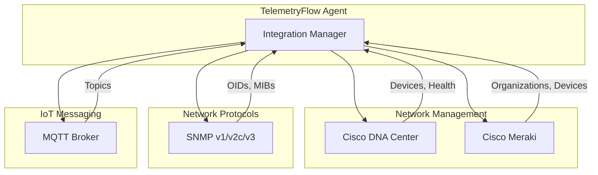
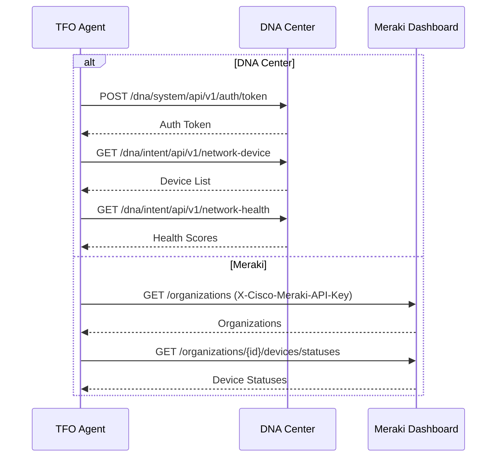
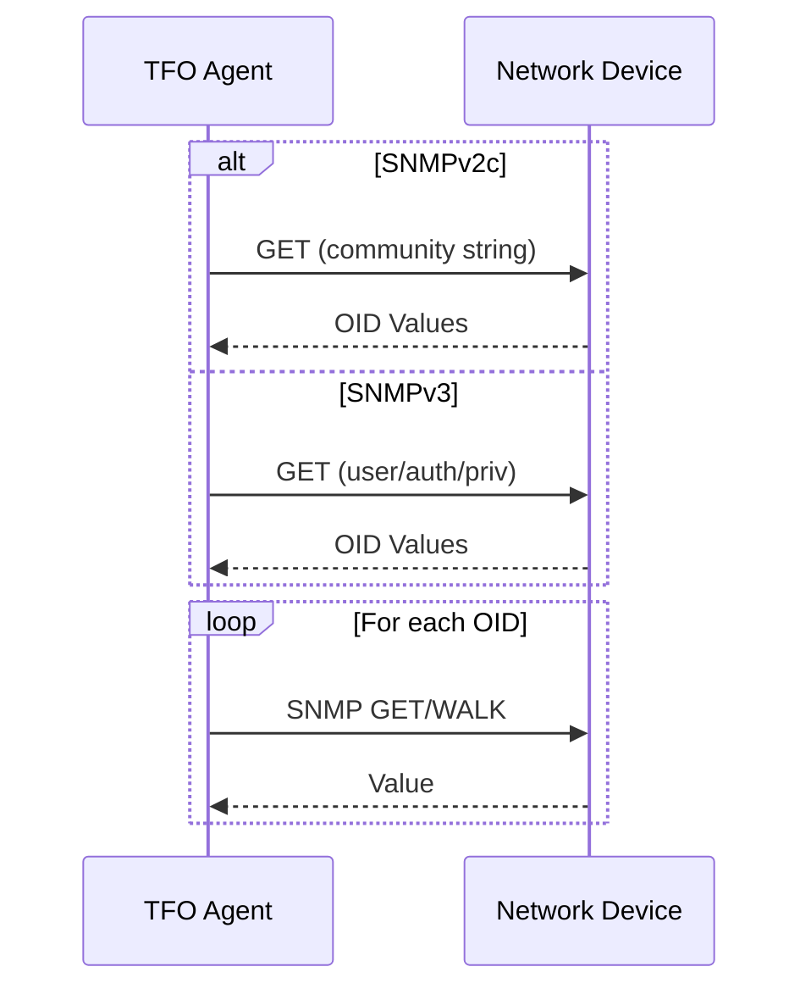
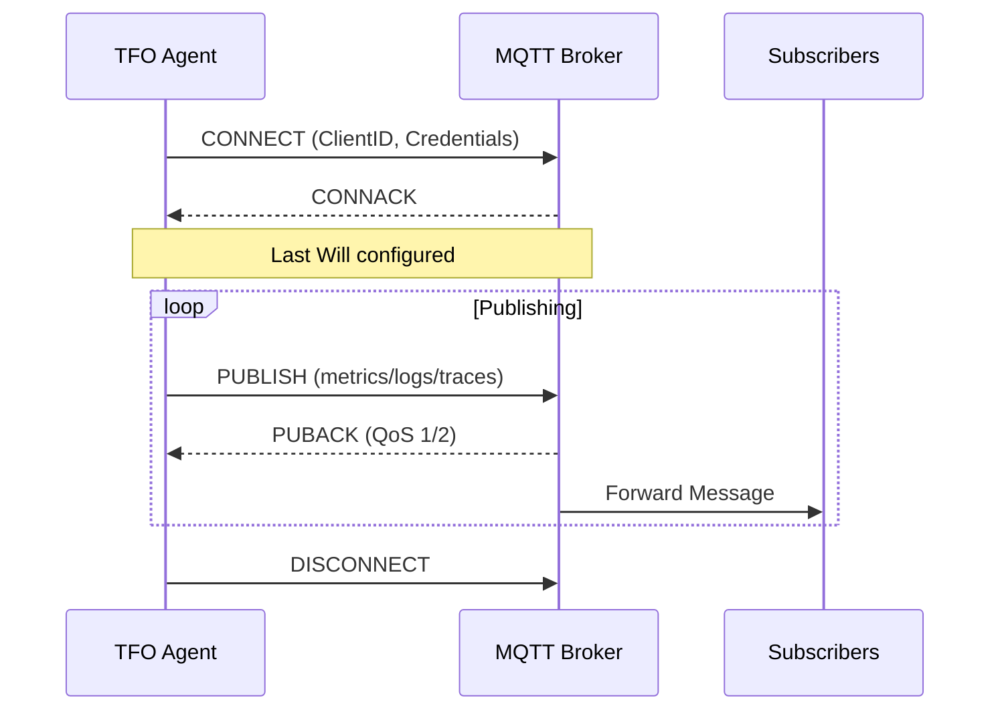

# Network & IoT Integrations

[](../../CHANGELOG.md)

This document covers network device and IoT messaging integrations.

## Overview


```mermaid
flowchart TB
    subgraph "TelemetryFlow Agent"
        IM[Integration Manager]
    end

    subgraph "Network Management"
        DNAC[Cisco DNA Center]
        MERAKI[Cisco Meraki]
    end

    subgraph "Network Protocols"
        SNMP[SNMP v1/v2c/v3]
    end

    subgraph "IoT Messaging"
        MQTT[MQTT Broker]
    end

    IM --> DNAC & MERAKI
    IM --> SNMP
    IM --> MQTT

    DNAC --> |Devices, Health| IM
    MERAKI --> |Organizations, Devices| IM
    SNMP --> |OIDs, MIBs| IM
    MQTT --> |Topics| IM
```

## Cisco (DNA Center / Meraki)

### Architecture


```mermaid
sequenceDiagram
    participant Agent as TFO Agent
    participant DNAC as DNA Center
    participant Meraki as Meraki Dashboard

    alt DNA Center
        Agent->>DNAC: POST /dna/system/api/v1/auth/token
        DNAC-->>Agent: Auth Token

        Agent->>DNAC: GET /dna/intent/api/v1/network-device
        DNAC-->>Agent: Device List

        Agent->>DNAC: GET /dna/intent/api/v1/network-health
        DNAC-->>Agent: Health Scores
    else Meraki
        Agent->>Meraki: GET /organizations (X-Cisco-Meraki-API-Key)
        Meraki-->>Agent: Organizations

        Agent->>Meraki: GET /organizations/{id}/devices/statuses
        Meraki-->>Agent: Device Statuses
    end
```

### Configuration

```yaml
integrations:
  cisco:
    enabled: true
    api_type: dnac # or meraki

    # DNA Center configuration
    dnac:
      endpoint: "https://dnac.example.com"
      username: "${CISCO_DNAC_USERNAME}"
      password: "${CISCO_DNAC_PASSWORD}"

    # Meraki configuration
    meraki:
      api_key: "${CISCO_MERAKI_API_KEY}"
      # org_id: "${CISCO_MERAKI_ORG_ID}"

    tls_skip_verify: false
    scrape_interval: 60s
    timeout: 30s

    collect_devices: true
    collect_networks: true
    collect_clients: true
    collect_health: true
    collect_events: false
```

### Metrics

#### DNA Center

| Metric                                | Type  | Description                |
| ------------------------------------- | ----- | -------------------------- |
| `cisco_dnac_device_up`                | gauge | Device reachability (1=up) |
| `cisco_dnac_device_uptime_seconds`    | gauge | Device uptime              |
| `cisco_dnac_network_health_score`     | gauge | Network health (0-100)     |
| `cisco_dnac_client_health_score`      | gauge | Client health (0-100)      |
| `cisco_dnac_application_health_score` | gauge | App health (0-100)         |

#### Meraki

| Metric                                    | Type  | Description              |
| ----------------------------------------- | ----- | ------------------------ |
| `cisco_meraki_device_online`              | gauge | Device online status     |
| `cisco_meraki_device_using_cellular`      | gauge | Cellular failover active |
| `cisco_meraki_organization_devices_total` | gauge | Total devices            |

---

## SNMP

### Architecture


```mermaid
sequenceDiagram
    participant Agent as TFO Agent
    participant Device as Network Device

    alt SNMPv2c
        Agent->>Device: GET (community string)
        Device-->>Agent: OID Values
    else SNMPv3
        Agent->>Device: GET (user/auth/priv)
        Device-->>Agent: OID Values
    end

    loop For each OID
        Agent->>Device: SNMP GET/WALK
        Device-->>Agent: Value
    end
```

### Configuration

```yaml
integrations:
  snmp:
    enabled: true
    version: v2c # v1, v2c, v3
    community: "${SNMP_COMMUNITY:-public}"
    port: 161
    timeout: 10s
    retries: 3
    scrape_interval: 60s
    max_repetitions: 10

    # SNMPv3 settings
    security_level: noAuthNoPriv # noAuthNoPriv, authNoPriv, authPriv
    username: "${SNMP_USERNAME}"
    auth_protocol: SHA # MD5, SHA
    auth_password: "${SNMP_AUTH_PASSWORD}"
    priv_protocol: AES # DES, AES
    priv_password: "${SNMP_PRIV_PASSWORD}"

    targets:
      - address: "switch1.example.com"
        port: 161
        name: "Core Switch 1"
        community: "private"
        labels:
          location: datacenter1

      - address: "router1.example.com"
        name: "Edge Router 1"

    # walk_oids / get_oids are optional. When omitted, the agent applies the
    # industry-standard defaults below (system scalars + full IF-MIB tables).
    walk_oids:
      - "1.3.6.1.2.1.2.2" # IF-MIB::ifTable
      - "1.3.6.1.2.1.31.1.1.1" # IF-MIB::ifXTable (64-bit HC counters, ifName)

    get_oids:
      - oid: "1.3.6.1.2.1.1.3.0"
        name: "sysUpTime"
        type: counter
      - oid: "1.3.6.1.2.1.1.5.0"
        name: "sysName"
        type: string
```

### Default OIDs

When no `get_oids` / `walk_oids` are configured, the agent polls a standard
baseline. Scalars are collected via SNMP **GET**; per-interface metrics are
collected by **WALK**ing the IF-MIB tables, so a fresh target yields useful
interface data with no manual OID mapping.

**Scalar GET defaults (SNMPv2-MIB / UCD-SNMP-MIB):**

| OID                      | Name         | Type    | Unit    |
| ------------------------ | ------------ | ------- | ------- |
| 1.3.6.1.2.1.1.1.0        | sysDescr     | string  | —       |
| 1.3.6.1.2.1.1.3.0        | sysUpTime    | counter | ticks   |
| 1.3.6.1.2.1.1.5.0        | sysName      | string  | —       |
| 1.3.6.1.4.1.2021.11.9.0  | ssCpuUser    | gauge   | percent |
| 1.3.6.1.4.1.2021.11.11.0 | ssCpuIdle    | gauge   | percent |
| 1.3.6.1.4.1.2021.4.5.0   | memTotalReal | gauge   | kB      |
| 1.3.6.1.4.1.2021.4.6.0   | memAvailReal | gauge   | kB      |

**Interface WALK defaults (IF-MIB — RFC 1213 + RFC 2233):**

| Table root           | Provides                                                            |
| -------------------- | ------------------------------------------------------------------- |
| 1.3.6.1.2.1.2.2      | `ifTable` — ifSpeed, ifOperStatus, ifIn/OutOctets, errors, discards |
| 1.3.6.1.2.1.31.1.1.1 | `ifXTable` — ifName, **ifHCIn/OutOctets** (64-bit), ifHighSpeed     |

> **64-bit counters:** ifXTable HC counters are collected because 32-bit
> `ifInOctets`/`ifOutOctets` wrap in seconds on ≥1 Gbps links and cannot be
> used for accurate rate calculation. This matches standard NMS practice
> (LibreNMS, Observium, Prometheus snmp_exporter).

Each walked row carries an `index` tag (the interface index) so per-interface
series stay distinct — feeding the platform's **Interface Utilization** view
(in/out, capacity, errors, discards, oper status) directly.

### Metrics

| Metric                              | Type    | Source (IF-MIB) | Description                  |
| ----------------------------------- | ------- | --------------- | ---------------------------- |
| `snmp_target_up`                    | gauge   | probe           | Target reachability (0/1)    |
| `snmp_sysuptime`                    | counter | sysUpTime       | System uptime ticks          |
| `snmp_walk_1_3_6_1_2_1_31_1_1_1_6`  | counter | ifHCInOctets    | Interface bytes in (64-bit)  |
| `snmp_walk_1_3_6_1_2_1_31_1_1_1_10` | counter | ifHCOutOctets   | Interface bytes out (64-bit) |
| `snmp_walk_1_3_6_1_2_1_2_2_1_14`    | counter | ifInErrors      | Interface inbound errors     |
| `snmp_walk_1_3_6_1_2_1_2_2_1_13`    | counter | ifInDiscards    | Interface inbound discards   |
| `snmp_walk_1_3_6_1_2_1_2_2_1_8`     | gauge   | ifOperStatus    | Interface operational status |
| `snmp_sscpuuser`                    | gauge   | ssCpuUser       | CPU user percentage          |

> Walk metric names default to `snmp_walk_<oid>`; assign a friendly `name` in a
> `get_oids`/MIB mapping to rename them.

### Operational Notes

- **Concurrent polling:** targets are polled in parallel (bounded pool) so one
  slow or timing-out device does not delay the rest of the scrape.
- **Health check:** `Health()` issues a real SNMP GET for `sysUpTime.0` per
  target — a device counts as reachable only if it actually answers SNMP (a UDP
  socket opening is not treated as reachability).
- **SNMPv3:** privacy (encryption) is enabled whenever `security_level:
authPriv` is set; auth-only and no-auth levels are honored independently.
- **Cancellation:** in-flight GET/WALK I/O is bounded by `timeout` and unwound
  on context cancellation (agent shutdown) so no poll leaks a connection.

---

## MQTT

### Architecture


```mermaid
sequenceDiagram
    participant Agent as TFO Agent
    participant Broker as MQTT Broker
    participant Sub as Subscribers

    Agent->>Broker: CONNECT (ClientID, Credentials)
    Broker-->>Agent: CONNACK

    Note over Agent,Broker: Last Will configured

    loop Publishing
        Agent->>Broker: PUBLISH (metrics/logs/traces)
        Broker-->>Agent: PUBACK (QoS 1/2)
        Broker->>Sub: Forward Message
    end

    Agent->>Broker: DISCONNECT
```

### Configuration

```yaml
integrations:
  mqtt:
    enabled: true
    broker: "tcp://mqtt.example.com:1883"
    # broker: "ssl://mqtt.example.com:8883"
    # broker: "ws://mqtt.example.com:8083/mqtt"
    client_id: "${HOSTNAME}-tfo-agent"
    username: "${MQTT_USERNAME}"
    password: "${MQTT_PASSWORD}"

    metrics_topic: "telemetryflow/metrics"
    logs_topic: "telemetryflow/logs"
    traces_topic: "telemetryflow/traces"
    topic_prefix: ""

    qos: 1 # 0, 1, or 2
    retained: false
    clean_session: true

    connect_timeout: 30s
    keep_alive: 60s
    ping_timeout: 10s
    auto_reconnect: true
    max_reconnect_interval: 5m

    tls:
      enabled: false
      ca_file: ""
      cert_file: ""
      key_file: ""
      skip_verify: false

    encoding: json # json, protobuf
    batch_size: 100
    flush_interval: 10s

    will:
      enabled: true
      topic: "telemetryflow/status/${HOSTNAME}"
      payload: '{"status": "offline"}'
      qos: 1
      retained: true
```

### Topic Structure

```
telemetryflow/
├── metrics              # Metric data
├── logs                 # Log entries
├── traces               # Trace spans
└── status/
    └── {hostname}       # Agent status (LWT)
```

### Message Format (JSON)

**Metrics:**

```json
{
  "timestamp": "2024-12-29T10:30:00Z",
  "name": "cpu_usage",
  "value": 45.5,
  "type": "gauge",
  "tags": {
    "host": "server1"
  }
}
```

**Logs:**

```json
{
  "timestamp": "2024-12-29T10:30:00Z",
  "level": "info",
  "message": "Service started",
  "source": "app.main",
  "trace_id": "abc123"
}
```

### QoS Levels

| QoS | Name          | Guarantee             |
| --- | ------------- | --------------------- |
| 0   | At most once  | Fire and forget       |
| 1   | At least once | Acknowledged delivery |
| 2   | Exactly once  | Two-phase commit      |

---

## Comparison

| Feature   | Cisco DNAC | Cisco Meraki | SNMP          | MQTT      |
| --------- | ---------- | ------------ | ------------- | --------- |
| Protocol  | REST API   | REST API     | UDP           | TCP       |
| Auth      | Token      | API Key      | Community/USM | User/Pass |
| Direction | Pull       | Pull         | Pull          | Push      |
| Metrics   | ✅         | ✅           | ✅            | ✅        |
| Logs      | ❌         | ❌           | ❌            | ✅        |
| Traces    | ❌         | ❌           | ❌            | ✅        |
| Real-time | ❌         | ❌           | ❌            | ✅        |

---

**Copyright (c) 2024-2026 Telemetri Data Indonesia. All rights reserved.**
