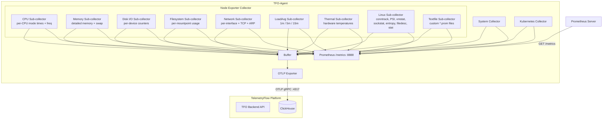
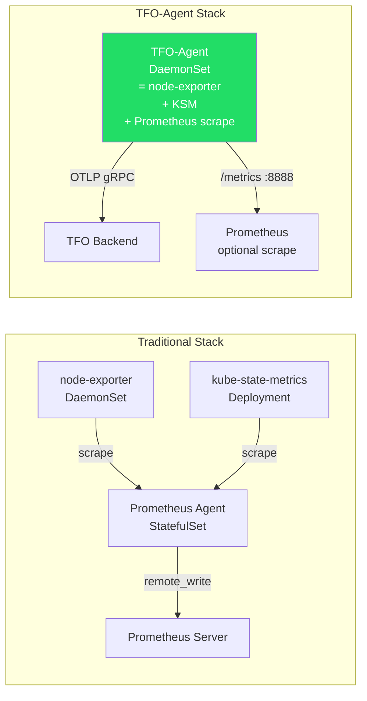
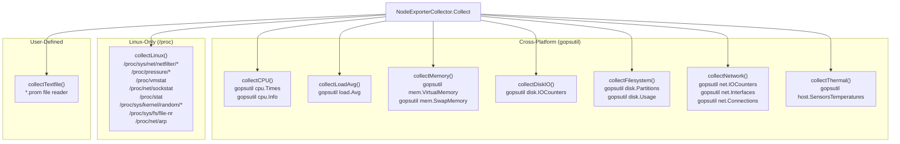

# Node Exporter Collector

## Overview

The Node Exporter Collector is TFO-Agent's built-in replacement for **prometheus/node_exporter**. It collects detailed system metrics (per-CPU, per-device, per-interface, per-mountpoint) as continuous time-series that flow through both OTLP export and the Prometheus `/metrics` endpoint.

When enabled, users can disable their standalone `node_exporter` DaemonSet and get equivalent metrics from TFO-Agent.

## Architecture



## Comparison: TFO-Agent vs Separate Components



| Capability         | node-exporter | kube-state-metrics | Prometheus Agent | **TFO-Agent**                 |
| ------------------ | ------------- | ------------------ | ---------------- | ----------------------------- |
| System Metrics     | Yes           | -                  | -                | **Yes** (built-in)            |
| Per-CPU Metrics    | Yes           | -                  | -                | **Yes** (node_exporter)       |
| Per-Device Disk    | Yes           | -                  | -                | **Yes** (node_exporter)       |
| Filesystem Metrics | Yes           | -                  | -                | **Yes** (node_exporter)       |
| Network Metrics    | Yes           | -                  | -                | **Yes** (node_exporter)       |
| Linux /proc        | Yes           | -                  | -                | **Yes** (conntrack, PSI, etc) |
| K8s Resource State | -             | Yes                | -                | **Yes** (k8s collector)       |
| Prometheus Scrape  | /metrics      | /metrics           | Remote Write     | **/metrics**                  |
| OTLP Export        | -             | -                  | -                | **Yes** (gRPC + HTTP)         |
| Deployment         | DaemonSet     | Deployment         | StatefulSet      | **DaemonSet** (single binary) |
| Textfile Collector | Yes           | -                  | -                | **Yes** (\*.prom files)       |

## Configuration

### Minimal

```yaml
collectors:
  node_exporter:
    enabled: true
```

All sub-collectors are enabled by default when `node_exporter` is enabled.

### Full Configuration

```yaml
collectors:
  node_exporter:
    # Enable node exporter metrics collection (drop-in replacement for prometheus/node_exporter)
    enabled: false
    interval: 15s

    # Sub-collector toggles (all enabled by default)
    cpu: true # Per-CPU-mode time (user, system, idle, etc.) + frequency
    memory: true # Detailed memory (cached, buffers, slab, swap)
    diskio: true # Per-device disk I/O counters
    filesystem: true # Per-mountpoint usage + inodes
    network: true # Per-interface stats + TCP states + ARP
    loadavg: true # Load averages (1m, 5m, 15m)
    thermal: true # CPU/hardware temperatures
    textfile: false # Custom *.prom file collector

    # Linux-only sub-collectors (gracefully no-op on macOS/Windows)
    conntrack: true # nf_conntrack count/max
    psi: true # Pressure Stall Information
    vmstat: true # /proc/vmstat page I/O
    sockstat: true # Socket statistics by protocol
    entropy: true # Available entropy
    filedesc: true # File descriptor usage
    stat: true # Context switches, interrupts, forks

    # Filtering (regex patterns)
    filesystem_mount_exclude: "^/(dev|proc|sys|run)($|/)"
    filesystem_type_exclude: "^(autofs|binfmt_misc|bpf|cgroup2?|configfs|debugfs|devpts|devtmpfs|fusectl|hugetlbfs|iso9660|mqueue|nsfs|overlay|proc|procfs|pstore|rpc_pipefs|securityfs|selinuxfs|squashfs|sysfs|tracefs|tmpfs)$"
    network_device_exclude: "^(veth|docker|br-|lo).*$"
    disk_device_exclude: "^(ram|loop|fd|sr)\\d+$"
    textfile_path: /var/lib/tfo-agent/textfile
```

### Environment Variables

| Variable                                    | Description                    | Default                       |
| ------------------------------------------- | ------------------------------ | ----------------------------- |
| `TELEMETRYFLOW_NODE_EXPORTER_ENABLED`       | Enable node exporter collector | `false`                       |
| `TELEMETRYFLOW_NODE_EXPORTER_TEXTFILE_PATH` | Directory for \*.prom files    | `/var/lib/tfo-agent/textfile` |

## Sub-Collector Architecture



## Metric Catalog

All metrics use prefix `node.` internally, which becomes `tfo_node_*` in Prometheus exposition format.

### CPU Metrics (`cpu.go`)

| Metric                  | Type    | Unit    | Labels        | Description                          |
| ----------------------- | ------- | ------- | ------------- | ------------------------------------ |
| `node.cpu.seconds`      | counter | seconds | `cpu`, `mode` | CPU time in seconds per mode per CPU |
| `node.cpu.frequency_hz` | gauge   | hertz   | `cpu`         | Current CPU frequency in Hz per CPU  |

**CPU modes**: `user`, `system`, `idle`, `iowait`, `irq`, `softirq`, `steal`, `guest`, `nice`

### Memory Metrics (`memory.go`)

| Metric                           | Type    | Unit  | Description       |
| -------------------------------- | ------- | ----- | ----------------- |
| `node.memory.total_bytes`        | gauge   | bytes | Total memory      |
| `node.memory.free_bytes`         | gauge   | bytes | Free memory       |
| `node.memory.available_bytes`    | gauge   | bytes | Available memory  |
| `node.memory.buffers_bytes`      | gauge   | bytes | Buffer memory     |
| `node.memory.cached_bytes`       | gauge   | bytes | Cached memory     |
| `node.memory.active_bytes`       | gauge   | bytes | Active memory     |
| `node.memory.inactive_bytes`     | gauge   | bytes | Inactive memory   |
| `node.memory.wired_bytes`        | gauge   | bytes | Wired memory      |
| `node.memory.shared_bytes`       | gauge   | bytes | Shared memory     |
| `node.memory.slab_bytes`         | gauge   | bytes | Slab memory       |
| `node.memory.page_tables_bytes`  | gauge   | bytes | Page table memory |
| `node.memory.committed_as_bytes` | gauge   | bytes | Committed AS      |
| `node.memory.commit_limit_bytes` | gauge   | bytes | Commit limit      |
| `node.memory.dirty_bytes`        | gauge   | bytes | Dirty pages       |
| `node.memory.writeback_bytes`    | gauge   | bytes | Writeback pages   |
| `node.memory.swap_total_bytes`   | gauge   | bytes | Swap total        |
| `node.memory.swap_used_bytes`    | gauge   | bytes | Swap used         |
| `node.memory.swap_free_bytes`    | gauge   | bytes | Swap free         |
| `node.memory.swap_in_bytes`      | counter | bytes | Swap in total     |
| `node.memory.swap_out_bytes`     | counter | bytes | Swap out total    |

### Disk I/O Metrics (`disk.go`)

| Metric                                     | Type    | Unit    | Labels   | Description         |
| ------------------------------------------ | ------- | ------- | -------- | ------------------- |
| `node.disk.read_bytes_total`               | counter | bytes   | `device` | Total bytes read    |
| `node.disk.written_bytes_total`            | counter | bytes   | `device` | Total bytes written |
| `node.disk.reads_completed_total`          | counter | -       | `device` | Total read ops      |
| `node.disk.writes_completed_total`         | counter | -       | `device` | Total write ops     |
| `node.disk.read_time_seconds_total`        | counter | seconds | `device` | Time spent reading  |
| `node.disk.write_time_seconds_total`       | counter | seconds | `device` | Time spent writing  |
| `node.disk.io_time_seconds_total`          | counter | seconds | `device` | Total I/O time      |
| `node.disk.io_time_weighted_seconds_total` | counter | seconds | `device` | Weighted I/O time   |
| `node.disk.io_now`                         | gauge   | -       | `device` | I/O ops in progress |

### Filesystem Metrics (`filesystem.go`)

| Metric                        | Type  | Unit  | Labels                           | Description           |
| ----------------------------- | ----- | ----- | -------------------------------- | --------------------- |
| `node.filesystem.size_bytes`  | gauge | bytes | `device`, `mountpoint`, `fstype` | Filesystem total size |
| `node.filesystem.free_bytes`  | gauge | bytes | `device`, `mountpoint`, `fstype` | Free space            |
| `node.filesystem.avail_bytes` | gauge | bytes | `device`, `mountpoint`, `fstype` | Available space       |
| `node.filesystem.files`       | gauge | -     | `device`, `mountpoint`, `fstype` | Total inodes          |
| `node.filesystem.files_free`  | gauge | -     | `device`, `mountpoint`, `fstype` | Free inodes           |

### Network Metrics (`network.go`)

| Metric                                | Type    | Unit  | Labels   | Description               |
| ------------------------------------- | ------- | ----- | -------- | ------------------------- |
| `node.network.receive_bytes_total`    | counter | bytes | `device` | Total bytes received      |
| `node.network.transmit_bytes_total`   | counter | bytes | `device` | Total bytes transmitted   |
| `node.network.receive_packets_total`  | counter | -     | `device` | Total packets received    |
| `node.network.transmit_packets_total` | counter | -     | `device` | Total packets sent        |
| `node.network.receive_errs_total`     | counter | -     | `device` | Total receive errors      |
| `node.network.transmit_errs_total`    | counter | -     | `device` | Total transmit errors     |
| `node.network.receive_drop_total`     | counter | -     | `device` | Total receive drops       |
| `node.network.transmit_drop_total`    | counter | -     | `device` | Total transmit drops      |
| `node.network.mtu`                    | gauge   | -     | `device` | Network device MTU        |
| `node.network.up`                     | gauge   | -     | `device` | Device up (1) or down (0) |
| `node.tcp.connection_states`          | gauge   | -     | `state`  | TCP connections by state  |
| `node.arp.entries`                    | gauge   | -     | `device` | ARP entries per device    |

### Load Average Metrics (`loadavg.go`)

| Metric        | Type  | Description            |
| ------------- | ----- | ---------------------- |
| `node.load1`  | gauge | 1-minute load average  |
| `node.load5`  | gauge | 5-minute load average  |
| `node.load15` | gauge | 15-minute load average |

### Thermal Metrics (`thermal.go`)

| Metric                             | Type  | Unit    | Labels   | Description          |
| ---------------------------------- | ----- | ------- | -------- | -------------------- |
| `node.thermal.temperature_celsius` | gauge | celsius | `sensor` | Hardware temperature |

### Linux-Only Metrics (`linux.go`)

These metrics are only available on Linux. On macOS/Windows, the sub-collectors gracefully return no metrics.

#### Conntrack

| Metric                         | Type  | Description               |
| ------------------------------ | ----- | ------------------------- |
| `node.conntrack.entries`       | gauge | Current conntrack entries |
| `node.conntrack.entries_limit` | gauge | Maximum conntrack entries |

#### PSI (Pressure Stall Information)

| Metric                             | Type    | Labels     | Description                             |
| ---------------------------------- | ------- | ---------- | --------------------------------------- |
| `node.pressure.some.seconds_total` | counter | `resource` | PSI some pressure total (cpu/memory/io) |
| `node.pressure.full.seconds_total` | counter | `resource` | PSI full pressure total (memory/io)     |

#### VMStat

| Metric                   | Type    | Description       |
| ------------------------ | ------- | ----------------- |
| `node.vmstat.pgpgin`     | counter | Pages paged in    |
| `node.vmstat.pgpgout`    | counter | Pages paged out   |
| `node.vmstat.pswpin`     | counter | Pages swapped in  |
| `node.vmstat.pswpout`    | counter | Pages swapped out |
| `node.vmstat.pgfault`    | counter | Page faults       |
| `node.vmstat.pgmajfault` | counter | Major page faults |
| `node.vmstat.oom_kill`   | counter | OOM kills         |

#### Sockstat

| Metric                       | Type  | Description           |
| ---------------------------- | ----- | --------------------- |
| `node.sockstat.sockets_used` | gauge | Total sockets in use  |
| `node.sockstat.tcp_inuse`    | gauge | TCP sockets in use    |
| `node.sockstat.tcp_tw`       | gauge | TCP sockets TIME_WAIT |
| `node.sockstat.udp_inuse`    | gauge | UDP sockets in use    |

#### Entropy

| Metric                        | Type  | Description       |
| ----------------------------- | ----- | ----------------- |
| `node.entropy.available_bits` | gauge | Available entropy |
| `node.entropy.pool_size_bits` | gauge | Entropy pool size |

#### File Descriptors

| Metric                  | Type  | Description                |
| ----------------------- | ----- | -------------------------- |
| `node.filefd.allocated` | gauge | Allocated file descriptors |
| `node.filefd.maximum`   | gauge | Maximum file descriptors   |

#### Stat (from /proc/stat)

| Metric                        | Type    | Description              |
| ----------------------------- | ------- | ------------------------ |
| `node.context_switches_total` | counter | Total context switches   |
| `node.interrupts_total`       | counter | Total interrupts         |
| `node.softirq_total`          | counter | Total soft interrupts    |
| `node.forks_total`            | counter | Total forks              |
| `node.procs_running`          | gauge   | Processes running        |
| `node.procs_blocked`          | gauge   | Processes blocked on I/O |

### Textfile Metrics (`textfile.go`)

User-defined metrics read from `*.prom` files in the configured `textfile_path` directory. File format follows the standard Prometheus exposition format:

```
# HELP my_custom_metric A custom metric from a script
# TYPE my_custom_metric gauge
my_custom_metric{label="value"} 42.0
my_other_metric 123.45
```

## File Structure

```
internal/collector/nodeexporter/
├── config.go          # Config wrapper, regex compilation, exclusion filters
├── nodeexporter.go    # Main collector (implements collector.Collector)
├── cpu.go             # Per-CPU mode times + frequency
├── memory.go          # Detailed memory + swap
├── disk.go            # Per-device disk I/O counters
├── filesystem.go      # Per-mountpoint filesystem usage
├── network.go         # Per-interface stats + TCP states + ARP
├── loadavg.go         # Load averages (1m, 5m, 15m)
├── thermal.go         # Hardware temperatures
├── linux.go           # Linux-only: conntrack, PSI, vmstat, sockstat, entropy, filedesc, stat
├── linux_other.go     # Non-Linux stubs (no-op)
└── textfile.go        # Custom *.prom file reader
```

## Filtering

### Filesystem Filtering

Exclude mountpoints and filesystem types using regex patterns:

```yaml
# Default: exclude virtual filesystems
filesystem_mount_exclude: "^/(dev|proc|sys|run)($|/)"
filesystem_type_exclude: "^(autofs|binfmt_misc|bpf|cgroup2?|...)$"
```

### Network Device Filtering

```yaml
# Default: exclude virtual interfaces
network_device_exclude: "^(veth|docker|br-|lo).*$"
```

### Disk Device Filtering

```yaml
# Default: exclude virtual devices
disk_device_exclude: "^(ram|loop|fd|sr)\\d+$"
```

## Prometheus Exposition

When both `node_exporter` and `prometheus_server` are enabled, metrics are exposed at `:8888/metrics`:

```
# HELP tfo_node_cpu_seconds CPU time in seconds
# TYPE tfo_node_cpu_seconds counter
tfo_node_cpu_seconds{cpu="0",mode="user"} 1234.56
tfo_node_cpu_seconds{cpu="0",mode="system"} 567.89
tfo_node_cpu_seconds{cpu="0",mode="idle"} 98765.43
...

# HELP tfo_node_memory_total_bytes Total memory in bytes
# TYPE tfo_node_memory_total_bytes gauge
tfo_node_memory_total_bytes 17179869184

# HELP tfo_node_filesystem_size_bytes Filesystem size in bytes
# TYPE tfo_node_filesystem_size_bytes gauge
tfo_node_filesystem_size_bytes{device="/dev/sda1",mountpoint="/",fstype="ext4"} 512110190592

# HELP tfo_node_network_receive_bytes_total Total bytes received
# TYPE tfo_node_network_receive_bytes_total counter
tfo_node_network_receive_bytes_total{device="eth0"} 12345678
```

## Testing

```bash
# Run Node Exporter collector tests
make test-nodeexporter

# Run all unit tests
make test-unit
```

## Metric Count

With all sub-collectors enabled, expect:

| Platform                                 | Approximate Metric Series |
| ---------------------------------------- | ------------------------- |
| Linux (8 CPU, 2 disks, 3 NICs, 5 mounts) | 120-150+                  |
| macOS (8 CPU, 1 disk, 2 NICs, 2 mounts)  | 90-110+                   |

The actual count depends on the number of CPUs, disks, network interfaces, and mountpoints on the host.

---

**Copyright (c) 2024-2026 DevOpsCorner Indonesia. All rights reserved.**
