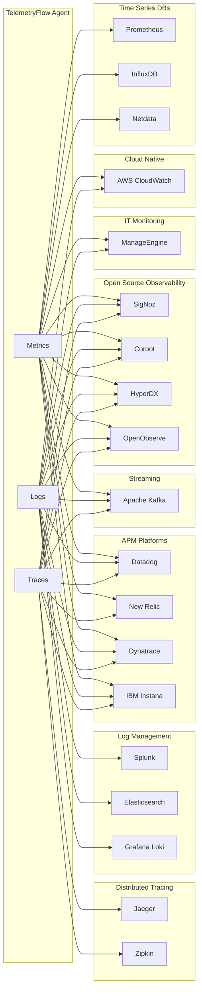
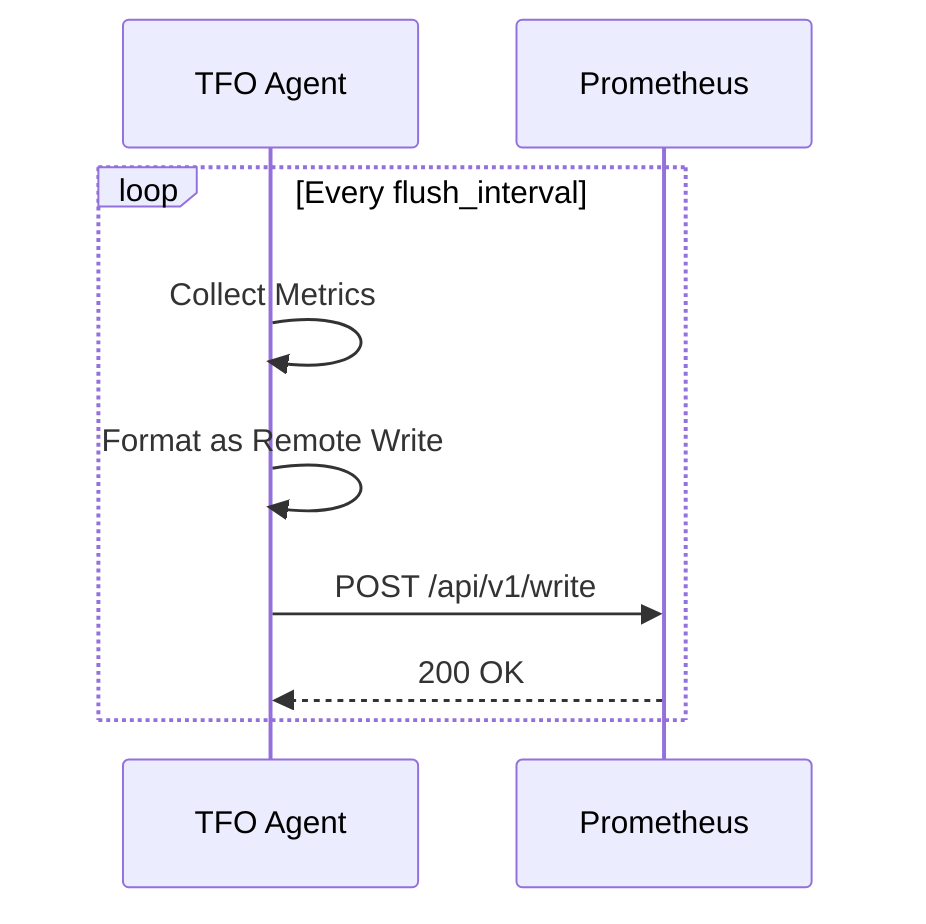
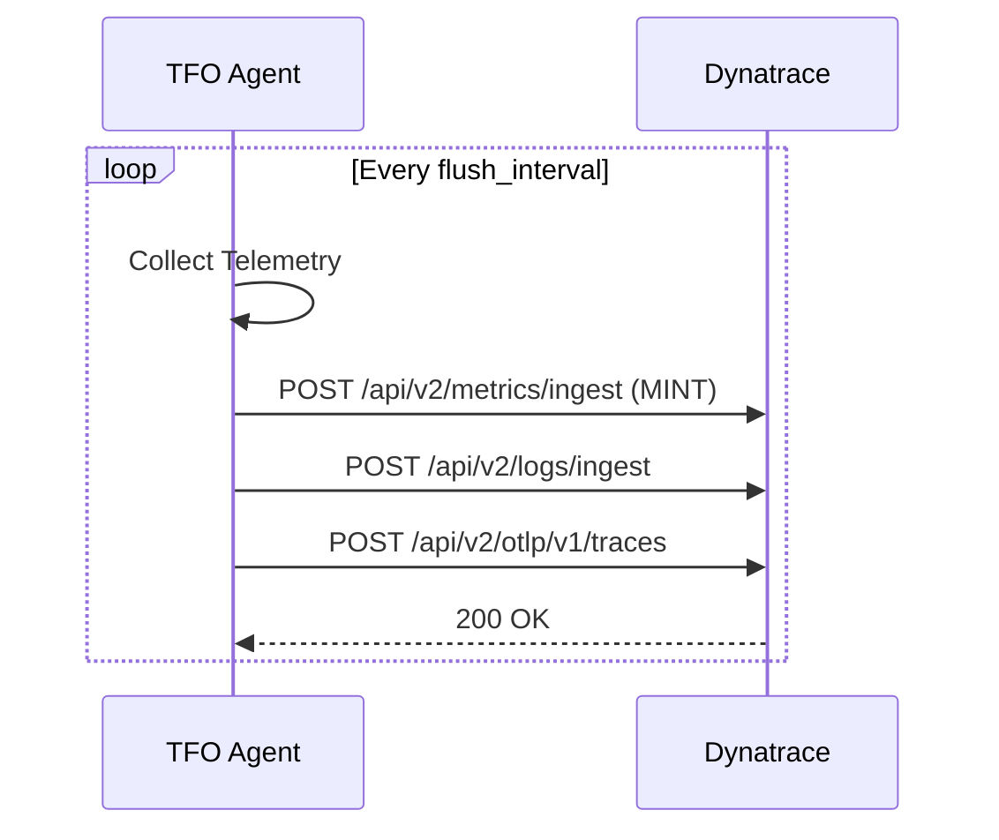
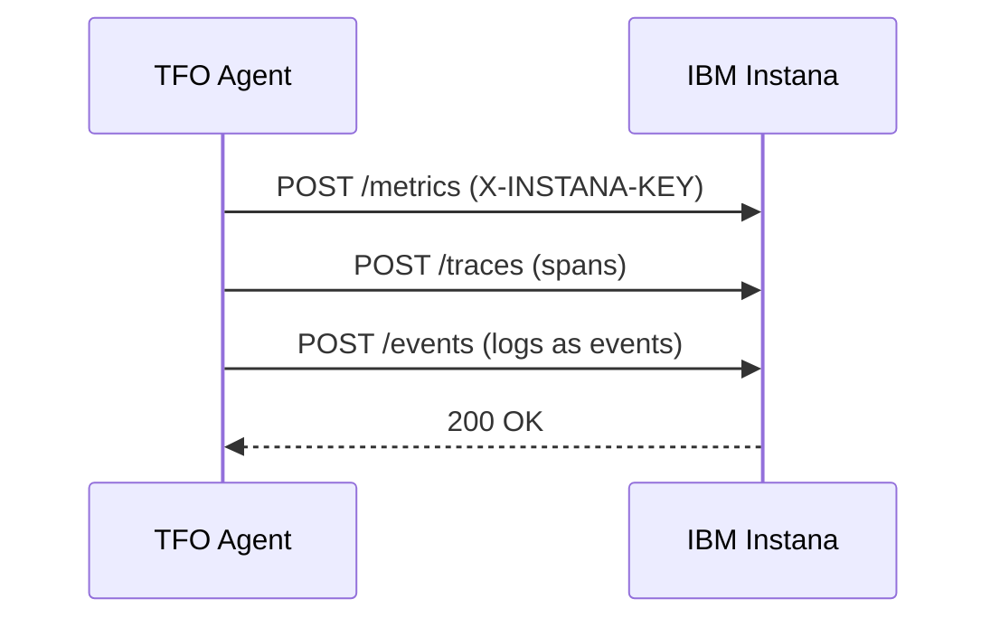
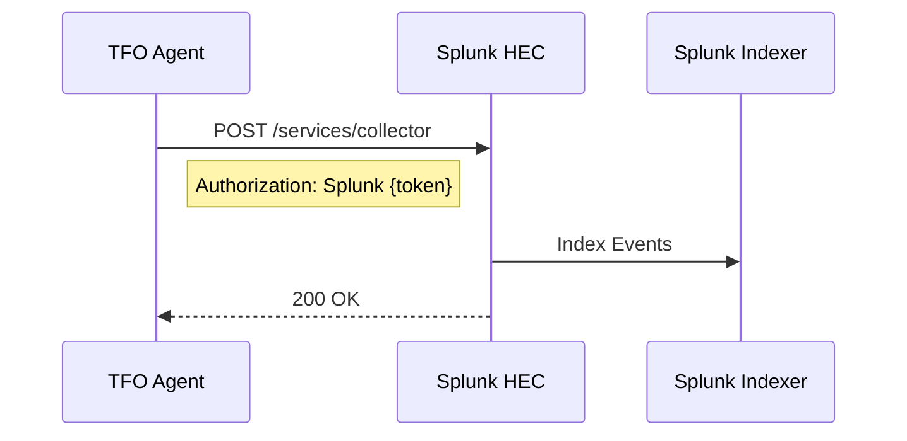
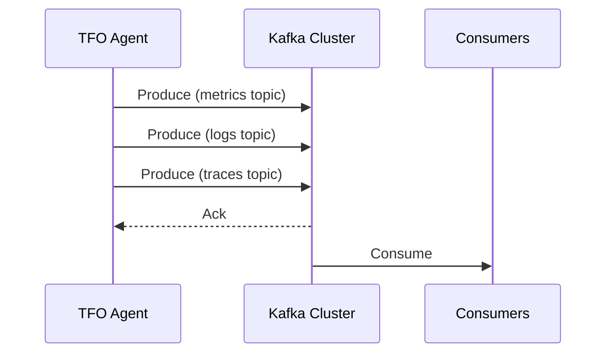
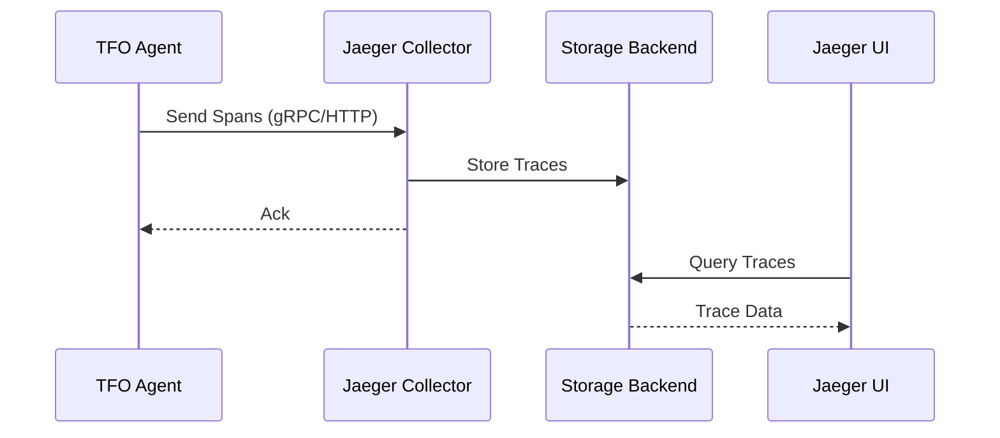
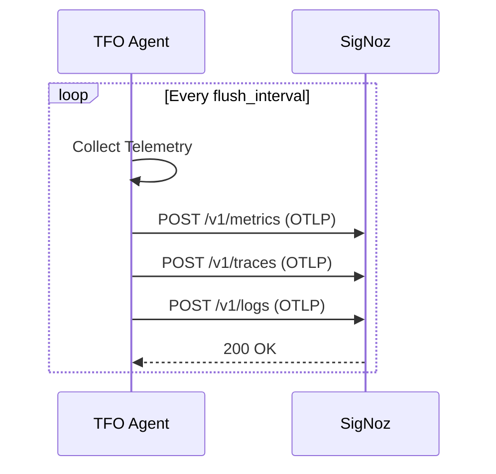
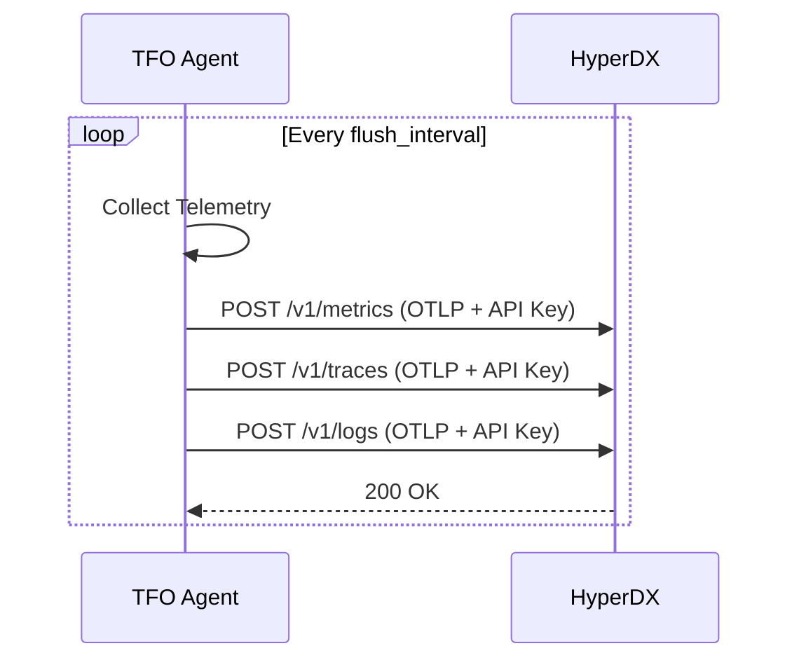
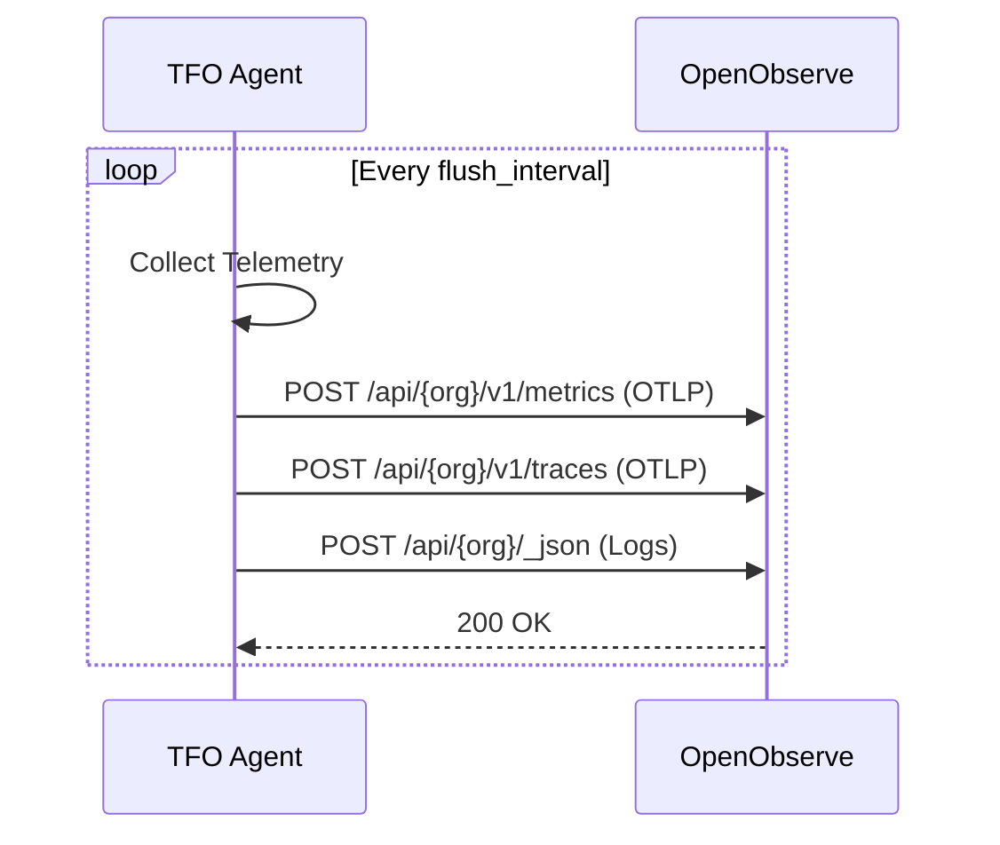

# Observability Backend Integrations

[](../../CHANGELOG.md)

This document covers integrations with observability backends and monitoring systems.

## Overview



## Quick Reference

| Integration | Metrics | Logs | Traces | Protocol |
|-------------|---------|------|--------|----------|
| Coroot | ✅ | ✅ | ✅ | OTLP/HTTP |
| Datadog | ✅ | ✅ | ✅ | HTTP/API |
| Dynatrace | ✅ | ✅ | ✅ | REST/OTLP |
| Elasticsearch | ✅ | ✅ | ❌ | Bulk API |
| HyperDX | ✅ | ✅ | ✅ | OTLP/HTTP |
| IBM Instana | ✅ | ✅ | ✅ | REST |
| InfluxDB | ✅ | ❌ | ❌ | Line Protocol |
| Jaeger | ❌ | ❌ | ✅ | gRPC/Thrift |
| Kafka | ✅ | ✅ | ✅ | Producer |
| CloudWatch | ✅ | ✅ | ❌ | AWS SDK |
| Loki | ❌ | ✅ | ❌ | Push API |
| ManageEngine | ✅ | ✅ | ❌ | REST |
| Netdata | ✅ | ❌ | ❌ | REST |
| New Relic | ✅ | ✅ | ✅ | HTTP/API |
| OpenObserve | ✅ | ✅ | ✅ | OTLP/HTTP |
| Prometheus | ✅ | ❌ | ❌ | Remote Write |
| SigNoz | ✅ | ✅ | ✅ | OTLP/HTTP |
| Splunk | ✅ | ✅ | ❌ | HEC |
| Zipkin | ❌ | ❌ | ✅ | HTTP |

## Prometheus

### Configuration

```yaml
integrations:
  prometheus:
    enabled: true
    endpoint: "http://prometheus:9090/api/v1/write"
    batch_size: 500
    flush_interval: 30s
    timeout: 30s
    external_labels:
      environment: production
```

### Remote Write Flow



## Datadog

### Configuration

```yaml
integrations:
  datadog:
    enabled: true
    api_key: "${DATADOG_API_KEY}"
    site: us1  # us1, us3, us5, eu1, ap1
    tags:
      - "env:production"
      - "service:tfo-agent"
    metrics:
      enabled: true
      batch_size: 100
    logs:
      enabled: true
    apm:
      enabled: false
```

## Dynatrace

### Configuration

```yaml
integrations:
  dynatrace:
    enabled: true
    api_token: "${DYNATRACE_API_TOKEN}"
    environment_id: "${DYNATRACE_ENV_ID}"
    environment_url: "https://${DYNATRACE_ENV_ID}.live.dynatrace.com"
    # Optional: Override default endpoints
    # metrics_endpoint: "https://abc.live.dynatrace.com/api/v2/metrics/ingest"
    # logs_endpoint: "https://abc.live.dynatrace.com/api/v2/logs/ingest"
    # traces_endpoint: "https://abc.live.dynatrace.com/api/v2/otlp/v1/traces"
    tls_skip_verify: false
    timeout: 30s
    batch_size: 1000
    flush_interval: 10s
    tags:
      environment: production
```

### Dynatrace Flow



## IBM Instana

### Configuration

```yaml
integrations:
  instana:
    enabled: true
    agent_key: "${INSTANA_AGENT_KEY}"
    endpoint_url: "https://serverless-us-west-2.instana.io"
    zone: "us-west-2"
    service_name: "tfo-agent"
    host_id: "${HOSTNAME}"
    tls_skip_verify: false
    timeout: 30s
    batch_size: 1000
    flush_interval: 10s
    tags:
      environment: production
```

### Instana Flow



## ManageEngine

### Configuration

```yaml
integrations:
  manageengine:
    enabled: true
    api_key: "${MANAGEENGINE_API_KEY}"
    base_url: "https://opmanager.example.com:8060"
    product: opmanager  # opmanager, site24x7, applications_manager
    account_id: "${MANAGEENGINE_ACCOUNT_ID}"
    monitor_group: "TelemetryFlow"
    tls_skip_verify: false
    timeout: 30s
    batch_size: 500
    flush_interval: 10s
    tags:
      environment: production
```

### Supported Products

| Product                | Description                          |
|------------------------|--------------------------------------|
| `opmanager`            | ManageEngine OpManager (on-premise)  |
| `site24x7`             | Site24x7 SaaS monitoring             |
| `applications_manager` | Applications Manager APM             |

## Splunk

### Configuration

```yaml
integrations:
  splunk:
    enabled: true
    endpoint: "https://splunk:8088/services/collector"
    token: "${SPLUNK_HEC_TOKEN}"
    index: "main"
    source: "tfo-agent"
    source_type: "tfo-agent"
    batch_size: 100
    timeout: 30s
    tls_skip_verify: false
    metrics: true
    logs: true
```

### HEC Flow



## Elasticsearch

### Configuration

```yaml
integrations:
  elasticsearch:
    enabled: true
    endpoints:
      - "https://elasticsearch:9200"
    index: "telemetryflow-%Y.%m.%d"
    # username: "${ES_USERNAME}"
    # password: "${ES_PASSWORD}"
    # api_key: "${ES_API_KEY}"
    batch_size: 100
    flush_interval: 10s
    metrics: true
    logs: true
```

## InfluxDB

### Configuration

```yaml
integrations:
  influxdb:
    enabled: true
    endpoint: "http://influxdb:8086"
    # InfluxDB 2.x
    token: "${INFLUXDB_TOKEN}"
    org: "${INFLUXDB_ORG}"
    bucket: "telemetryflow"
    version: 2
    # InfluxDB 1.x
    # database: "telemetryflow"
    # username: "${INFLUXDB_USERNAME}"
    # password: "${INFLUXDB_PASSWORD}"
    # version: 1
    precision: ns
    batch_size: 1000
```

## Apache Kafka

### Configuration

```yaml
integrations:
  kafka:
    enabled: true
    brokers:
      - "kafka:9092"
    topic: "telemetryflow-metrics"
    logs_topic: "telemetryflow-logs"
    traces_topic: "telemetryflow-traces"
    compression: snappy
    batch_size: 100
    encoding: json
    partition_key: hostname
```

### Producer Flow



## AWS CloudWatch

### Configuration

```yaml
integrations:
  cloudwatch:
    enabled: true
    region: "${AWS_REGION:-us-west-2}"
    namespace: "TelemetryFlow"
    log_group: "/tfo-agent/logs"
    log_stream: "${HOSTNAME}"
    metrics: true
    logs: false
    batch_size: 100
    flush_interval: 60s
```

## Grafana Loki

### Configuration

```yaml
integrations:
  loki:
    enabled: true
    endpoint: "http://loki:3100/loki/api/v1/push"
    tenant_id: ""
    batch_size: 100
    flush_interval: 5s
    labels:
      job: tfo-agent
```

## Jaeger

### Configuration

```yaml
integrations:
  jaeger:
    enabled: true
    endpoint: "http://jaeger:14268/api/traces"
    protocol: grpc  # grpc, http/thrift
    service_name: "tfo-agent"
    batch_size: 100
```

### Trace Flow



## Zipkin

### Configuration

```yaml
integrations:
  zipkin:
    enabled: true
    endpoint: "http://zipkin:9411/api/v2/spans"
    service_name: "tfo-agent"
    batch_size: 100
    timeout: 30s
```

## SigNoz

[SigNoz](https://signoz.io/) is an open-source APM and observability platform built on OpenTelemetry. It provides a unified view of metrics, traces, and logs.

### Configuration

```yaml
integrations:
  signoz:
    enabled: true
    endpoint: "${SIGNOZ_ENDPOINT:-http://localhost:4318}"
    access_token: "${SIGNOZ_ACCESS_TOKEN}"
    # OTLP endpoints (auto-derived if not specified)
    metrics_endpoint: ""
    traces_endpoint: ""
    logs_endpoint: ""
    service_name: "tfo-agent"
    tls_skip_verify: false
    timeout: 30s
    batch_size: 1000
    flush_interval: 10s
    tags:
      source: tfo-agent
```

### SigNoz Flow



## Coroot

[Coroot](https://coroot.com/) is an open-source eBPF-based observability solution that provides automatic instrumentation and service map discovery.

### Configuration

```yaml
integrations:
  coroot:
    enabled: true
    endpoint: "${COROOT_ENDPOINT:-http://localhost:8080}"
    api_key: "${COROOT_API_KEY}"
    # OTLP endpoints (auto-derived if not specified)
    metrics_endpoint: ""
    traces_endpoint: ""
    logs_endpoint: ""
    service_name: "tfo-agent"
    tls_skip_verify: false
    timeout: 30s
    batch_size: 100
    flush_interval: 10s
    tags:
      source: tfo-agent
```

## HyperDX (ClickStack)

[HyperDX](https://hyperdx.io/) (formerly ClickStack) is an open-source observability platform built on ClickHouse for fast log and trace analysis.

### Configuration

```yaml
integrations:
  hyperdx:
    enabled: true
    endpoint: "${HYPERDX_ENDPOINT:-https://in-otel.hyperdx.io}"
    api_key: "${HYPERDX_API_KEY}"
    # OTLP endpoints (auto-derived if not specified)
    metrics_endpoint: ""
    traces_endpoint: ""
    logs_endpoint: ""
    service_name: "tfo-agent"
    tls_skip_verify: false
    timeout: 30s
    batch_size: 100
    flush_interval: 10s
    tags:
      source: tfo-agent
```

### HyperDX Flow



## OpenObserve

[OpenObserve](https://openobserve.ai/) is an open-source observability platform optimized for logs, metrics, and traces with efficient storage and fast search capabilities.

### Configuration

```yaml
integrations:
  openobserve:
    enabled: true
    endpoint: "${OPENOBSERVE_ENDPOINT:-http://localhost:5080}"
    username: "${OPENOBSERVE_USERNAME}"
    password: "${OPENOBSERVE_PASSWORD}"
    organization: "${OPENOBSERVE_ORG:-default}"
    stream_name: "${OPENOBSERVE_STREAM:-default}"
    # OTLP endpoints (auto-derived if not specified)
    metrics_endpoint: ""
    traces_endpoint: ""
    logs_endpoint: ""
    tls_skip_verify: false
    timeout: 30s
    batch_size: 100
    flush_interval: 10s
    tags:
      source: tfo-agent
```

### OpenObserve Flow



## Netdata

[Netdata](https://netdata.cloud/) is a real-time infrastructure monitoring solution that focuses on system metrics with minimal overhead.

### Configuration

```yaml
integrations:
  netdata:
    enabled: true
    endpoint: "${NETDATA_ENDPOINT:-https://api.netdata.cloud}"
    api_token: "${NETDATA_API_TOKEN}"
    space_id: "${NETDATA_SPACE_ID}"
    room_id: "${NETDATA_ROOM_ID}"
    claim_token: "${NETDATA_CLAIM_TOKEN}"
    metrics_endpoint: ""
    tls_skip_verify: false
    timeout: 30s
    batch_size: 1000
    flush_interval: 10s
    hostname_override: ""
    tags:
      source: tfo-agent
```

> **Note**: Netdata Cloud primarily supports metrics. Logs and traces are not natively supported.

## Webhook (Generic)

### Configuration

```yaml
integrations:
  webhook:
    enabled: true
    endpoints:
      - name: "custom-webhook"
        url: "https://example.com/webhook"
        method: POST
        headers:
          Authorization: "Bearer ${WEBHOOK_TOKEN}"
        encoding: json
        batch_size: 100
        timeout: 30s
        retry_attempts: 3
        metrics: true
        logs: true
        traces: false
```

---

**Copyright (c) 2024-2026 DevOpsCorner Indonesia. All rights reserved.**
