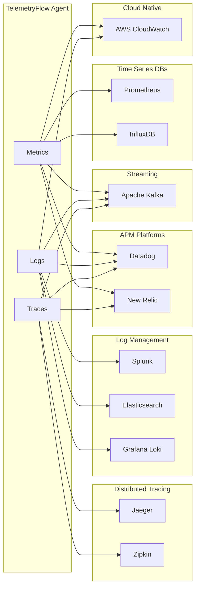
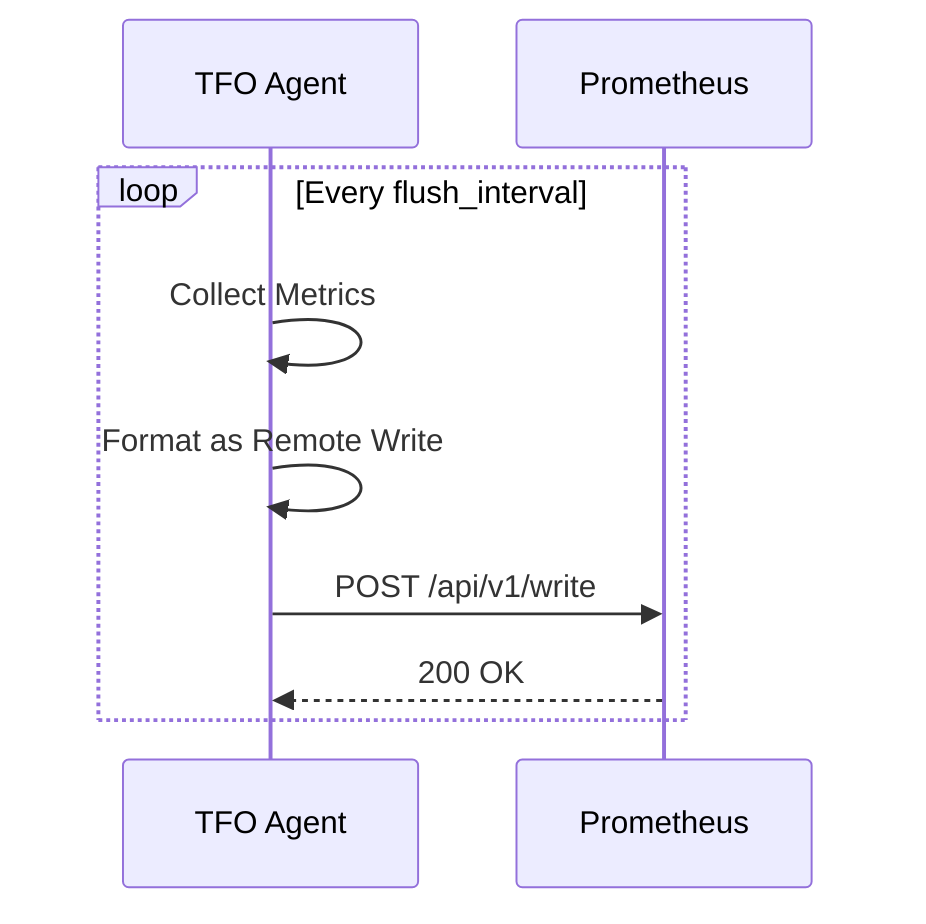
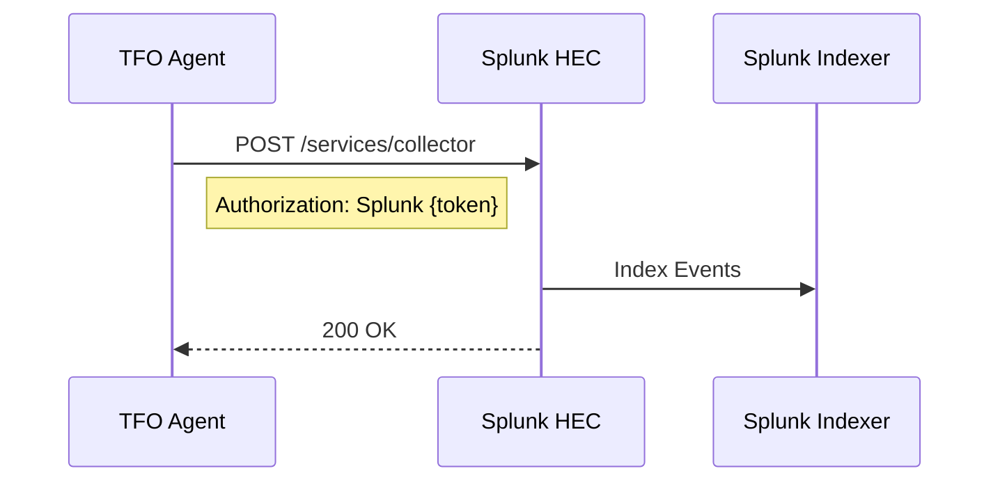
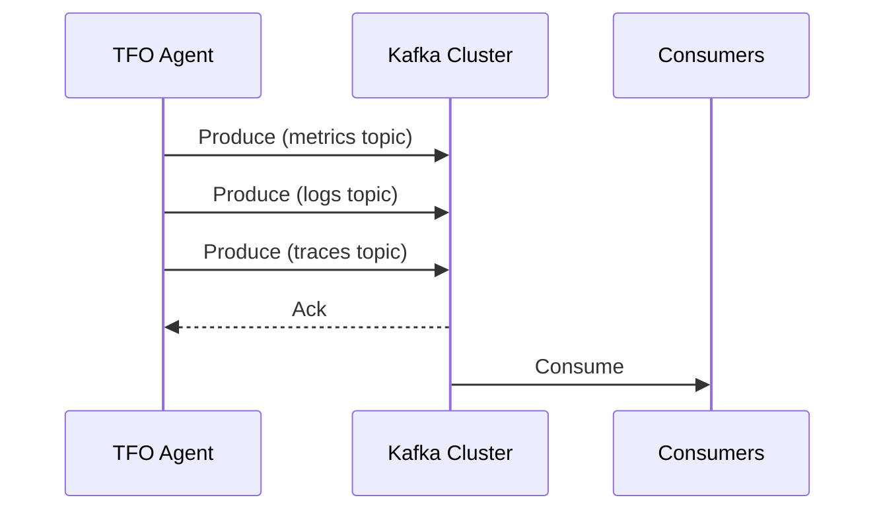
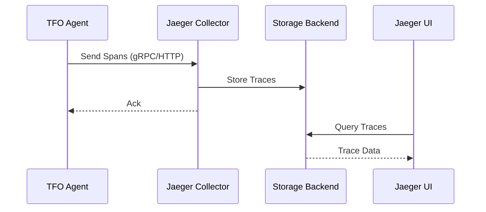

# Observability Backend Integrations

[](../../CHANGELOG.md)

This document covers integrations with observability backends and monitoring systems.

## Overview


```mermaid
flowchart LR
    subgraph "TelemetryFlow Agent"
        M[Metrics]
        L[Logs]
        T[Traces]
    end

    subgraph "Time Series DBs"
        PROM[Prometheus]
        INFLUX[InfluxDB]
    end

    subgraph "APM Platforms"
        DD[Datadog]
        NR[New Relic]
    end

    subgraph "Log Management"
        SPLUNK[Splunk]
        ES[Elasticsearch]
        LOKI[Grafana Loki]
    end

    subgraph "Distributed Tracing"
        JAEGER[Jaeger]
        ZIPKIN[Zipkin]
    end

    subgraph "Streaming"
        KAFKA[Apache Kafka]
    end

    subgraph "Cloud Native"
        CW[AWS CloudWatch]
    end

    M --> PROM & INFLUX & DD & NR & CW
    L --> SPLUNK & ES & LOKI & DD & CW
    T --> JAEGER & ZIPKIN & DD & NR
    M & L & T --> KAFKA
```

## Quick Reference

| Integration | Metrics | Logs | Traces | Protocol |
|-------------|---------|------|--------|----------|
| Prometheus | ✅ | ❌ | ❌ | Remote Write |
| Datadog | ✅ | ✅ | ✅ | HTTP/API |
| New Relic | ✅ | ✅ | ✅ | HTTP/API |
| Splunk | ✅ | ✅ | ❌ | HEC |
| Elasticsearch | ✅ | ✅ | ❌ | Bulk API |
| InfluxDB | ✅ | ❌ | ❌ | Line Protocol |
| Kafka | ✅ | ✅ | ✅ | Producer |
| CloudWatch | ✅ | ✅ | ❌ | AWS SDK |
| Loki | ❌ | ✅ | ❌ | Push API |
| Jaeger | ❌ | ❌ | ✅ | gRPC/Thrift |
| Zipkin | ❌ | ❌ | ✅ | HTTP |

## Prometheus

### Configuration

```yaml
integrations:
  prometheus:
    enabled: true
    endpoint: "http://prometheus:9090/api/v1/write"
    batch_size: 500
    flush_interval: 30s
    timeout: 30s
    external_labels:
      environment: production
```

### Remote Write Flow


```mermaid
sequenceDiagram
    participant Agent as TFO Agent
    participant Prom as Prometheus

    loop Every flush_interval
        Agent->>Agent: Collect Metrics
        Agent->>Agent: Format as Remote Write
        Agent->>Prom: POST /api/v1/write
        Prom-->>Agent: 200 OK
    end
```

## Datadog

### Configuration

```yaml
integrations:
  datadog:
    enabled: true
    api_key: "${DATADOG_API_KEY}"
    site: us1  # us1, us3, us5, eu1, ap1
    tags:
      - "env:production"
      - "service:tfo-agent"
    metrics:
      enabled: true
      batch_size: 100
    logs:
      enabled: true
    apm:
      enabled: false
```

## Splunk

### Configuration

```yaml
integrations:
  splunk:
    enabled: true
    endpoint: "https://splunk:8088/services/collector"
    token: "${SPLUNK_HEC_TOKEN}"
    index: "main"
    source: "tfo-agent"
    source_type: "tfo-agent"
    batch_size: 100
    timeout: 30s
    metrics: true
    logs: true
```

### HEC Flow


```mermaid
sequenceDiagram
    participant Agent as TFO Agent
    participant HEC as Splunk HEC
    participant Idx as Splunk Indexer

    Agent->>HEC: POST /services/collector
    Note right of Agent: Authorization: Splunk {token}
    HEC->>Idx: Index Events
    HEC-->>Agent: 200 OK
```

## Elasticsearch

### Configuration

```yaml
integrations:
  elasticsearch:
    enabled: true
    endpoints:
      - "https://elasticsearch:9200"
    index: "telemetryflow-%Y.%m.%d"
    # username: "${ES_USERNAME}"
    # password: "${ES_PASSWORD}"
    # api_key: "${ES_API_KEY}"
    batch_size: 100
    flush_interval: 10s
    metrics: true
    logs: true
```

## InfluxDB

### Configuration

```yaml
integrations:
  influxdb:
    enabled: true
    endpoint: "http://influxdb:8086"
    # InfluxDB 2.x
    token: "${INFLUXDB_TOKEN}"
    org: "${INFLUXDB_ORG}"
    bucket: "telemetryflow"
    version: 2
    # InfluxDB 1.x
    # database: "telemetryflow"
    # username: "${INFLUXDB_USERNAME}"
    # password: "${INFLUXDB_PASSWORD}"
    # version: 1
    precision: ns
    batch_size: 1000
```

## Apache Kafka

### Configuration

```yaml
integrations:
  kafka:
    enabled: true
    brokers:
      - "kafka:9092"
    topic: "telemetryflow-metrics"
    logs_topic: "telemetryflow-logs"
    traces_topic: "telemetryflow-traces"
    compression: snappy
    batch_size: 100
    encoding: json
    partition_key: hostname
```

### Producer Flow


```mermaid
sequenceDiagram
    participant Agent as TFO Agent
    participant Kafka as Kafka Cluster
    participant Consumer as Consumers

    Agent->>Kafka: Produce (metrics topic)
    Agent->>Kafka: Produce (logs topic)
    Agent->>Kafka: Produce (traces topic)
    Kafka-->>Agent: Ack

    Kafka->>Consumer: Consume
```

## AWS CloudWatch

### Configuration

```yaml
integrations:
  cloudwatch:
    enabled: true
    region: "${AWS_REGION:-us-west-2}"
    namespace: "TelemetryFlow"
    log_group: "/tfo-agent/logs"
    log_stream: "${HOSTNAME}"
    metrics: true
    logs: false
    batch_size: 100
    flush_interval: 60s
```

## Grafana Loki

### Configuration

```yaml
integrations:
  loki:
    enabled: true
    endpoint: "http://loki:3100/loki/api/v1/push"
    tenant_id: ""
    batch_size: 100
    flush_interval: 5s
    labels:
      job: tfo-agent
```

## Jaeger

### Configuration

```yaml
integrations:
  jaeger:
    enabled: true
    endpoint: "http://jaeger:14268/api/traces"
    protocol: grpc  # grpc, http/thrift
    service_name: "tfo-agent"
    batch_size: 100
```

### Trace Flow


```mermaid
sequenceDiagram
    participant Agent as TFO Agent
    participant Collector as Jaeger Collector
    participant Storage as Storage Backend
    participant UI as Jaeger UI

    Agent->>Collector: Send Spans (gRPC/HTTP)
    Collector->>Storage: Store Traces
    Collector-->>Agent: Ack

    UI->>Storage: Query Traces
    Storage-->>UI: Trace Data
```

## Zipkin

### Configuration

```yaml
integrations:
  zipkin:
    enabled: true
    endpoint: "http://zipkin:9411/api/v2/spans"
    service_name: "tfo-agent"
    batch_size: 100
    timeout: 30s
```

## Webhook (Generic)

### Configuration

```yaml
integrations:
  webhook:
    enabled: true
    endpoints:
      - name: "custom-webhook"
        url: "https://example.com/webhook"
        method: POST
        headers:
          Authorization: "Bearer ${WEBHOOK_TOKEN}"
        encoding: json
        batch_size: 100
        timeout: 30s
        retry_attempts: 3
        metrics: true
        logs: true
        traces: false
```

---

**Copyright (c) 2024-2026 DevOpsCorner Indonesia. All rights reserved.**
