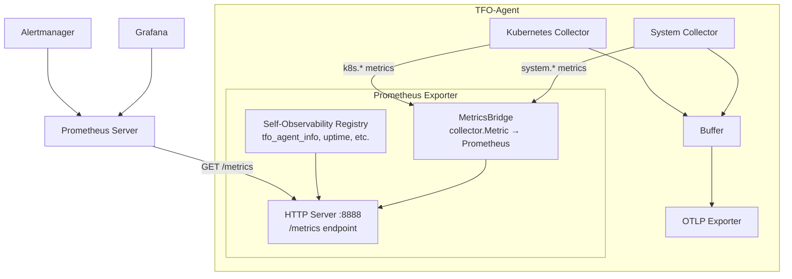
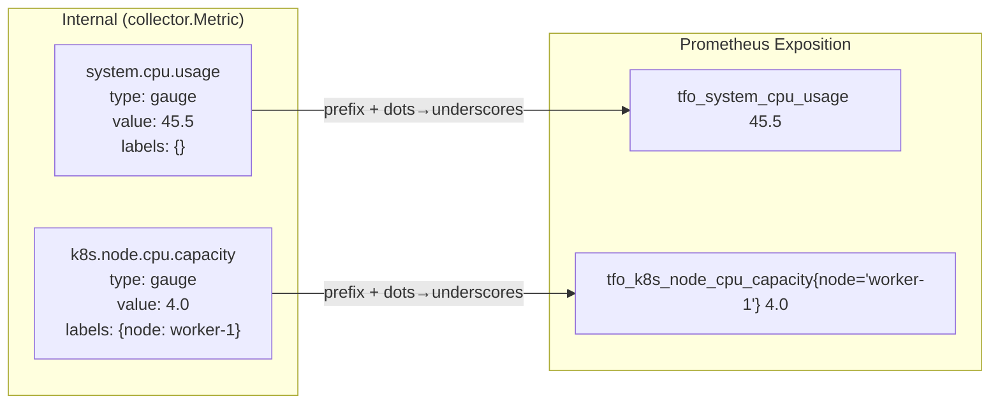
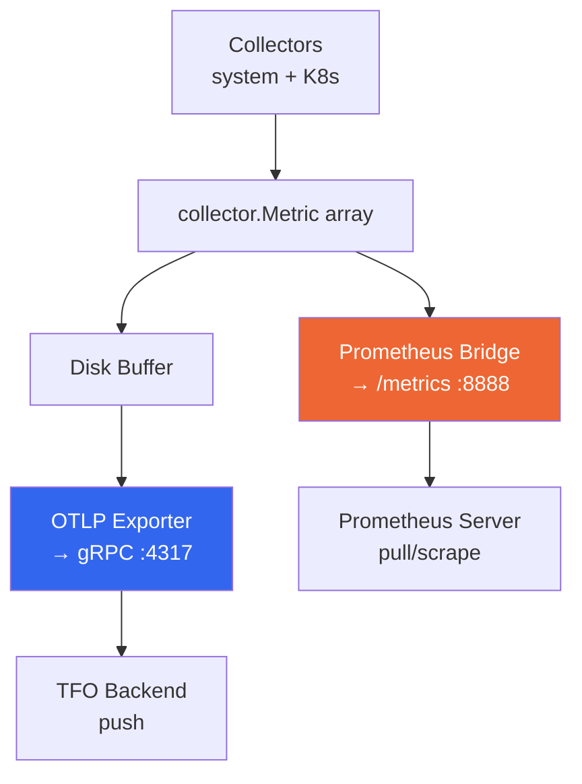

# Prometheus Metrics Exporter

## Overview

The Prometheus Metrics Exporter provides a standard Prometheus-compatible `/metrics` HTTP endpoint on port 8888. It exposes all collected metrics (system, Kubernetes, agent self-observability) in Prometheus text exposition format, allowing Prometheus to scrape TFO-Agent directly.

This replaces the need for a separate **Prometheus Agent** + **node-exporter** setup by serving metrics directly from TFO-Agent.

## Architecture



## Metric Translation



### Naming Rules

| Internal Name           | Prometheus Name                 | Rule                             |
| ----------------------- | ------------------------------- | -------------------------------- |
| `system.cpu.usage`      | `tfo_system_cpu_usage`          | Prefix `tfo_` + `.` → `_`        |
| `system.memory.total`   | `tfo_system_memory_total_bytes` | + `_bytes` suffix for byte units |
| `k8s.node.status`       | `tfo_k8s_node_status`           | Same rule                        |
| `k8s.pod.restart_count` | `tfo_k8s_pod_restart_count`     | Same rule                        |

The prefix is configurable via `metric_prefix` (default: `tfo`).

## Configuration

### Minimal

```yaml
prometheus_server:
  enabled: true
```

### Full Configuration

```yaml
prometheus_server:
  # Enable Prometheus /metrics endpoint
  enabled: false

  # HTTP port for the metrics server
  port: 8888

  # URL path for the metrics endpoint
  path: /metrics

  # Include Go runtime metrics (goroutines, GC, memory)
  include_go_metrics: true

  # Include process metrics (CPU, memory, file descriptors)
  include_process_metrics: true

  # Prefix for all metric names (e.g., tfo_system_cpu_usage)
  metric_prefix: tfo

  # HTTP server timeouts
  read_timeout: 10s
  write_timeout: 10s
```

### Environment Variables

| Variable                           | Config Key                  | Default |
| ---------------------------------- | --------------------------- | ------- |
| `TELEMETRYFLOW_PROMETHEUS_ENABLED` | `prometheus_server.enabled` | `false` |
| `TELEMETRYFLOW_PROMETHEUS_PORT`    | `prometheus_server.port`    | `8888`  |

## Exposed Endpoints

| Path       | Description                                              |
| ---------- | -------------------------------------------------------- |
| `/metrics` | Prometheus text exposition format (main endpoint)        |
| `/ready`   | Readiness probe (returns 200 when metrics are available) |
| `/`        | Redirects to `/metrics`                                  |

## Metrics Reference

### Agent Self-Observability

These metrics are always present when the Prometheus server is enabled:

| Metric Name                             | Type      | Labels                        | Description                                 |
| --------------------------------------- | --------- | ----------------------------- | ------------------------------------------- |
| `tfo_agent_info`                        | gauge     | version, go_version, os, arch | Agent build information (always 1)          |
| `tfo_agent_uptime_seconds`              | gauge     | -                             | Agent uptime in seconds                     |
| `tfo_agent_collection_duration_seconds` | histogram | collector                     | Time spent collecting metrics per collector |
| `tfo_agent_collection_errors_total`     | counter   | collector                     | Collection error count per collector        |
| `tfo_agent_metrics_collected_total`     | counter   | collector                     | Total metrics collected per collector       |
| `tfo_agent_buffer_size_bytes`           | gauge     | -                             | Current disk buffer size                    |
| `tfo_agent_buffer_entries`              | gauge     | -                             | Current buffered entry count                |
| `tfo_agent_export_errors_total`         | counter   | destination                   | Export error count per destination          |
| `tfo_agent_export_bytes_total`          | counter   | destination                   | Total bytes exported per destination        |
| `tfo_agent_heartbeat_success_total`     | counter   | -                             | Successful heartbeat count                  |
| `tfo_agent_heartbeat_errors_total`      | counter   | -                             | Failed heartbeat count                      |

### System Metrics (from System Collector)

When `collectors.system.enabled: true`:

| Metric Name                          | Type  | Unit    | Description               |
| ------------------------------------ | ----- | ------- | ------------------------- |
| `tfo_system_cpu_usage`               | gauge | percent | CPU usage percentage      |
| `tfo_system_cpu_cores`               | gauge | -       | CPU core count            |
| `tfo_system_memory_total_bytes`      | gauge | bytes   | Total memory              |
| `tfo_system_memory_used_bytes`       | gauge | bytes   | Used memory               |
| `tfo_system_memory_available_bytes`  | gauge | bytes   | Available memory          |
| `tfo_system_memory_usage`            | gauge | percent | Memory usage percentage   |
| `tfo_system_disk_total_bytes`        | gauge | bytes   | Disk total (labels: path) |
| `tfo_system_disk_used_bytes`         | gauge | bytes   | Disk used (labels: path)  |
| `tfo_system_disk_free_bytes`         | gauge | bytes   | Disk free (labels: path)  |
| `tfo_system_disk_usage`              | gauge | percent | Disk usage (labels: path) |
| `tfo_system_network_bytes_sent`      | gauge | bytes   | Network bytes sent        |
| `tfo_system_network_bytes_recv`      | gauge | bytes   | Network bytes received    |
| `tfo_system_network_bytes_sent_rate` | gauge | bytes/s | Send rate                 |
| `tfo_system_network_bytes_recv_rate` | gauge | bytes/s | Receive rate              |

### Kubernetes Metrics (from Kubernetes Collector)

When `collectors.kubernetes.enabled: true`, all `k8s.*` metrics are exposed with the configured prefix. See [KUBERNETES-COLLECTOR.md](KUBERNETES-COLLECTOR.md) for the full list.

Example output:

```
# HELP tfo_k8s_node_status Node readiness status (1=Ready, 0=NotReady)
# TYPE tfo_k8s_node_status gauge
tfo_k8s_node_status{cluster="production",node="worker-1"} 1
tfo_k8s_node_status{cluster="production",node="worker-2"} 1
tfo_k8s_node_status{cluster="production",node="worker-3"} 0

# HELP tfo_k8s_pod_count Pod count by namespace and phase
# TYPE tfo_k8s_pod_count gauge
tfo_k8s_pod_count{cluster="production",namespace="default",phase="Running"} 12
tfo_k8s_pod_count{cluster="production",namespace="monitoring",phase="Running"} 5
tfo_k8s_pod_count{cluster="production",namespace="default",phase="Pending"} 2
```

### Go Runtime Metrics

When `include_go_metrics: true` (default):

| Metric Name               | Type    | Description             |
| ------------------------- | ------- | ----------------------- |
| `go_goroutines`           | gauge   | Current goroutine count |
| `go_gc_duration_seconds`  | summary | GC pause duration       |
| `go_memstats_alloc_bytes` | gauge   | Allocated memory        |
| `go_memstats_sys_bytes`   | gauge   | System memory           |
| `go_threads`              | gauge   | OS thread count         |

### Process Metrics

When `include_process_metrics: true` (default):

| Metric Name                     | Type    | Description           |
| ------------------------------- | ------- | --------------------- |
| `process_cpu_seconds_total`     | counter | CPU time used         |
| `process_resident_memory_bytes` | gauge   | RSS memory            |
| `process_open_fds`              | gauge   | Open file descriptors |
| `process_max_fds`               | gauge   | Max file descriptors  |
| `process_start_time_seconds`    | gauge   | Process start time    |

## Prometheus Scrape Configuration

### Static Configuration

```yaml
# prometheus.yml
scrape_configs:
  - job_name: "tfo-agent"
    scrape_interval: 30s
    static_configs:
      - targets: ["tfo-agent-host:8888"]
```

### Kubernetes Service Discovery

When running as a DaemonSet with Prometheus annotations:

```yaml
# DaemonSet pod annotations (auto-applied)
metadata:
  annotations:
    prometheus.io/scrape: "true"
    prometheus.io/port: "8888"
    prometheus.io/path: "/metrics"
```

Prometheus with Kubernetes SD:

```yaml
# prometheus.yml
scrape_configs:
  - job_name: "tfo-agent"
    kubernetes_sd_configs:
      - role: pod
    relabel_configs:
      - source_labels: [__meta_kubernetes_pod_annotation_prometheus_io_scrape]
        action: keep
        regex: true
      - source_labels: [__meta_kubernetes_pod_annotation_prometheus_io_port]
        action: replace
        target_label: __address__
        regex: (.+)
        replacement: ${1}:${2}
      - source_labels: [__meta_kubernetes_pod_annotation_prometheus_io_path]
        action: replace
        target_label: __metrics_path__
        regex: (.+)
```

## Dual Export: Prometheus + OTLP

TFO-Agent supports both export paths simultaneously:



Both paths receive the same metrics. Configure in parallel:

```yaml
# Push to TFO Backend via OTLP
exporter:
  otlp:
    enabled: true
    endpoint_version: v2

# Pull by Prometheus via /metrics
prometheus_server:
  enabled: true
  port: 8888
```

## Implementation

### Component Structure

```mermaid
classDiagram
    class PrometheusServer {
        -config PrometheusServerConfig
        -logger *zap.Logger
        -server *http.Server
        -bridge *MetricsBridge
        -running bool
        +Start(ctx) error
        +Stop() error
        +IsRunning() bool
        +UpdateMetrics([]Metric)
    }

    class MetricsBridge {
        -registry *prometheus.Registry
        -gauges map[string]*GaugeVec
        -counters map[string]*CounterVec
        -prefix string
        +UpdateMetrics([]Metric)
        +Registry() *prometheus.Registry
    }

    class SelfMetrics {
        -agentInfo *GaugeVec
        -uptime Gauge
        -collectionDuration *HistogramVec
        -collectionErrors *CounterVec
        -bufferSize Gauge
        +Register(registry)
        +RecordCollection(collector, duration, err)
    }

    PrometheusServer --> MetricsBridge
    PrometheusServer --> SelfMetrics
    MetricsBridge --> "prometheus.Registry"
```

### File Structure

```
internal/exporter/
  prometheus_server.go    # HTTP server lifecycle (Start/Stop)
  prometheus_bridge.go    # Metric translation (collector.Metric → Prometheus)
  prometheus_registry.go  # Agent self-observability metric definitions
```

## Grafana Dashboard

The Prometheus metrics are compatible with standard Grafana dashboards. Example queries:

```promql
# CPU Usage
tfo_system_cpu_usage

# Memory Usage %
tfo_system_memory_used_bytes / tfo_system_memory_total_bytes * 100

# K8s Node Readiness
tfo_k8s_node_status{cluster="production"}

# Pods Running per Namespace
tfo_k8s_pod_count{phase="Running"}

# Deployment Availability
tfo_k8s_deployment_replicas_available / tfo_k8s_deployment_replicas

# Agent Collection Latency (p99)
histogram_quantile(0.99, rate(tfo_agent_collection_duration_seconds_bucket[5m]))

# Agent Error Rate
rate(tfo_agent_collection_errors_total[5m])
```

## Troubleshooting

### Port already in use

```
ERROR prometheus server: listen tcp :8888: bind: address already in use
```

Change port: `prometheus_server.port: 9090` or set `TELEMETRYFLOW_PROMETHEUS_PORT=9090`.

### No metrics showing

1. Verify server is running: `curl http://localhost:8888/ready`
2. Check collectors are enabled: `curl http://localhost:8888/metrics | head -20`
3. If only `tfo_agent_*` metrics appear, enable collectors:
   ```yaml
   collectors:
     system:
       enabled: true
     kubernetes:
       enabled: true
   ```

### High cardinality

If `/metrics` response is too large (>10MB), reduce cardinality:

- Disable per-container pod metrics: individual container-level metrics
- Use `exclude_namespaces` to skip noisy namespaces
- Disable `include_go_metrics` and `include_process_metrics` if not needed
- Use `label_selector` on the K8s collector to limit scope
