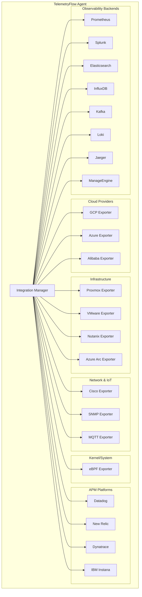
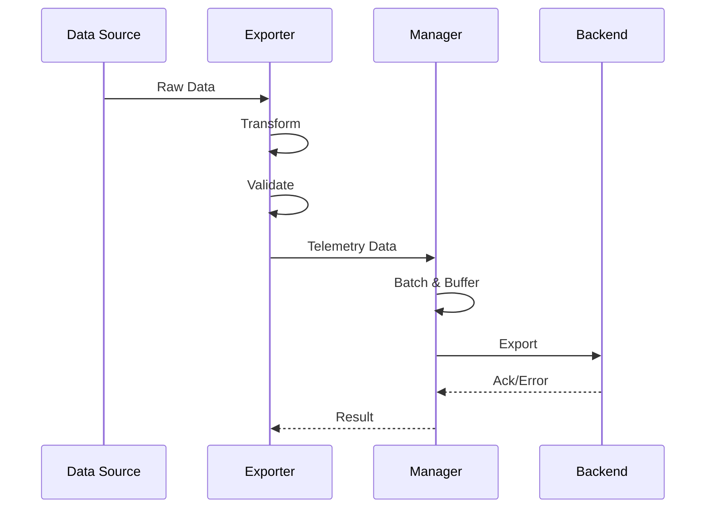
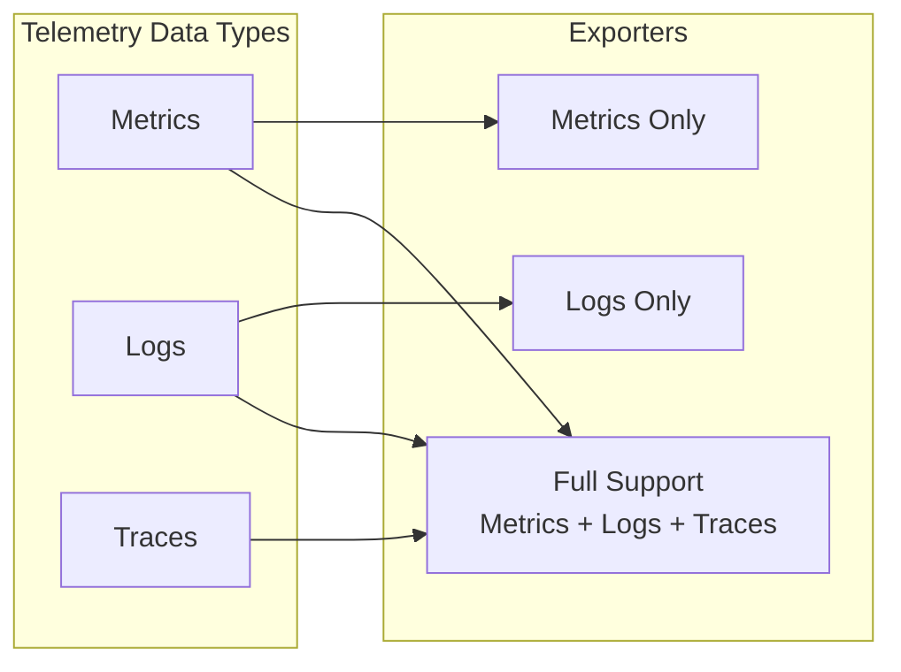
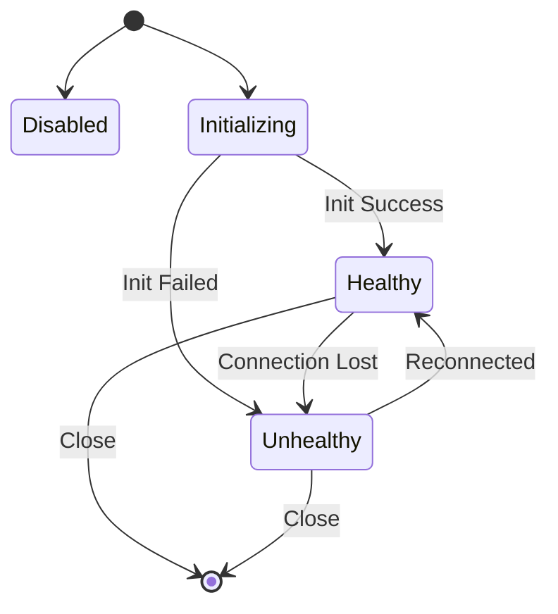

# TelemetryFlow Agent Integrations

[](../../CHANGELOG.md)

This document provides an overview of all third-party integrations supported by the TelemetryFlow Agent.

## Integration Architecture



## Integration Categories

| Category | Integrations | Description |
|----------|-------------|-------------|
| [Cloud Providers](CLOUD-PROVIDERS.md) | GCP, Azure, Alibaba | Major cloud platform integrations |
| [Infrastructure](INFRASTRUCTURE.md) | Proxmox, VMware, Nutanix, Azure Arc | Virtualization and hybrid cloud |
| [Network & IoT](NETWORK.md) | Cisco, SNMP, MQTT | Network devices and IoT messaging |
| [Kernel/System](KERNEL.md) | eBPF | Linux kernel-level observability |
| [Observability](OBSERVABILITY.md) | Prometheus, Datadog, Dynatrace, Instana, ManageEngine, Splunk, etc. | APM & monitoring backends |

## Data Flow



## Integration Interface

All integrations implement the `Exporter` interface:

```go
type Exporter interface {
    Name() string
    Type() string
    IsEnabled() bool
    SupportedDataTypes() []DataType
    Init(ctx context.Context) error
    Validate() error
    Export(ctx context.Context, data *TelemetryData) (*ExportResult, error)
    ExportMetrics(ctx context.Context, metrics []Metric) (*ExportResult, error)
    ExportTraces(ctx context.Context, traces []Trace) (*ExportResult, error)
    ExportLogs(ctx context.Context, logs []LogEntry) (*ExportResult, error)
    Health(ctx context.Context) (*HealthStatus, error)
    Close(ctx context.Context) error
}
```

## Supported Data Types



| Integration | Metrics | Logs | Traces |
|-------------|---------|------|--------|
| GCP | ✅ | ✅ | ✅ |
| Azure | ✅ | ✅ | ✅ |
| Alibaba | ✅ | ✅ | ✅ |
| Proxmox | ✅ | ❌ | ❌ |
| VMware | ✅ | ❌ | ❌ |
| Nutanix | ✅ | ❌ | ❌ |
| Azure Arc | ✅ | ❌ | ❌ |
| Cisco | ✅ | ❌ | ❌ |
| SNMP | ✅ | ❌ | ❌ |
| MQTT | ✅ | ✅ | ✅ |
| eBPF | ✅ | ❌ | ❌ |
| Dynatrace | ✅ | ✅ | ✅ |
| IBM Instana | ✅ | ✅ | ✅ |
| ManageEngine | ✅ | ✅ | ❌ |

## Configuration

All integrations are configured in the `integrations` section of `tfo-agent.yaml`:

```yaml
integrations:
  # Cloud Providers
  gcp:
    enabled: false
    project_id: "${GCP_PROJECT_ID}"

  azure:
    enabled: false
    subscription_id: "${AZURE_SUBSCRIPTION_ID}"

  # Infrastructure
  proxmox:
    enabled: false
    api_url: "https://proxmox:8006"

  vmware:
    enabled: false
    vcenter_url: "https://vcenter.example.com"

  # Network
  cisco:
    enabled: false
    api_type: dnac

  snmp:
    enabled: false
    version: v2c

  mqtt:
    enabled: false
    broker: "tcp://mqtt:1883"

  # System
  ebpf:
    enabled: false
```

## Health Monitoring

Each integration reports health status:



## Quick Links

- [Cloud Providers](CLOUD-PROVIDERS.md) - GCP, Azure, Alibaba Cloud
- [Infrastructure](INFRASTRUCTURE.md) - Proxmox, VMware, Nutanix, Azure Arc
- [Network & IoT](NETWORK.md) - Cisco, SNMP, MQTT
- [Kernel/System](KERNEL.md) - eBPF observability
- [Observability Backends](OBSERVABILITY.md) - Prometheus, Datadog, etc.

---

**Copyright (c) 2024-2026 DevOpsCorner Indonesia. All rights reserved.**
