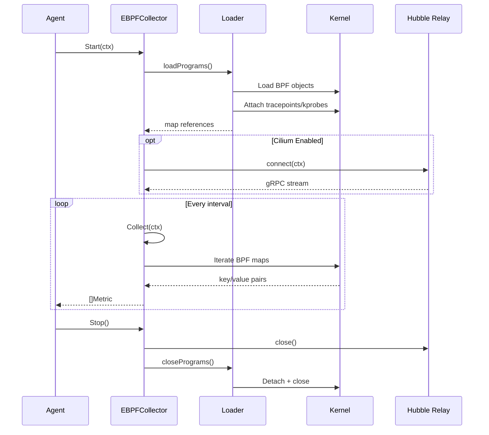

# eBPF Collector - Architecture

## Overview

The eBPF collector is a first-class `Collector` implementation at
`internal/collector/ebpf/` that uses the `cilium/ebpf` Go library to load
and interact with BPF programs in the Linux kernel.

```mermaid
graph TB
    subgraph "User Space (Go)"
        Agent[TFO Agent]
        Collector[EBPFCollector]
        Syscalls[Syscall Sub-collector]
        Network[Network Sub-collector]
        FileIO[FileIO Sub-collector]
        Sched[Scheduler Sub-collector]
        Memory[Memory Sub-collector]
        TCPState[TCP State Sub-collector]
        Hubble[Hubble gRPC Client]
    end

    subgraph "Kernel Space (BPF)"
        TP1[tracepoint/raw_syscalls/sys_enter]
        TP2[tracepoint/raw_syscalls/sys_exit]
        KP1[kprobe/tcp_connect]
        KP2[kprobe/tcp_sendmsg]
        KP3[kprobe/vfs_read]
        KP4[kprobe/vfs_write]
        TP3[tracepoint/sched/sched_switch]
        TP4[tracepoint/exceptions/page_fault_user]
        TP5[tracepoint/sock/inet_sock_set_state]
    end

    subgraph "BPF Maps (Shared Memory)"
        M1[syscall_stats<br/>HASH map]
        M2[tcp_stats / udp_stats<br/>HASH maps]
        M3[fileio_stats<br/>HASH map]
        M4[sched_stats<br/>HASH map]
        M5[mem_stats<br/>HASH map]
        M6[tcpstate_stats<br/>HASH map]
    end

    Agent --> Collector
    Collector --> Syscalls
    Collector --> Network
    Collector --> FileIO
    Collector --> Sched
    Collector --> Memory
    Collector --> TCPState
    Collector --> Hubble

    TP1 --> M1
    TP2 --> M1
    KP1 --> M2
    KP2 --> M2
    KP3 --> M3
    KP4 --> M3
    TP3 --> M4
    TP4 --> M5
    TP5 --> M6

    Syscalls -.->|iterate| M1
    Network -.->|iterate| M2
    FileIO -.->|iterate| M3
    Sched -.->|iterate| M4
    Memory -.->|iterate| M5
    TCPState -.->|iterate| M6
```



## Collector Interface

The `EBPFCollector` implements the standard `collector.Collector` interface:

```go
type Collector interface {
    Name() string
    Start(ctx context.Context) error
    Stop() error
    Collect(ctx context.Context) ([]Metric, error)
    IsRunning() bool
}
```

## Lifecycle



## File Layout

```
internal/collector/ebpf/
  config.go           Config wrapper, process filtering, validation
  collector.go        EBPFCollector struct, Start/Stop/Collect lifecycle
  gen.go              go:generate bpf2go directives
  types.go            Go equivalents of BPF map key/value structs
  loader.go           BPF program loading via cilium/ebpf (Linux-only)
  linux.go            Sub-collector implementations (Linux-only)
  linux_other.go      No-op stubs for non-Linux
  helpers.go          Syscall name mapping, TCP state name mapping
  hubble.go           Cilium Hubble gRPC client

  bpf/
    headers/
      common.h        Shared BPF types, macros, map definitions
    syscalls.bpf.c    Syscall tracing BPF program
    network.bpf.c     Network monitoring BPF program
    fileio.bpf.c      File I/O tracing BPF program
    scheduler.bpf.c   Scheduler analysis BPF program
    memory.bpf.c      Memory event tracing BPF program
    tcpstate.bpf.c    TCP state transition BPF program
```

## Platform Strategy

| Platform        | Behavior                                   |
| --------------- | ------------------------------------------ |
| Linux 5.2+      | Full eBPF instrumentation                  |
| Linux < 5.2     | Degrades gracefully (some probes may fail) |
| macOS / Windows | Returns empty metrics, no error            |

Build tags (`//go:build linux` / `//go:build !linux`) ensure only
platform-relevant code is compiled.

## Sub-Collector Design

Each sub-collector follows the same pattern:

1. Check if the corresponding BPF map is loaded (non-nil)
2. Iterate the BPF hash map (`map.Iterate(&key, &val)`)
3. Apply process filtering (`shouldIncludeProcess(comm)`)
4. Convert key/value pairs to `collector.Metric` with labels
5. Return the metric slice

Sub-collectors are individually togglable via config flags:

| Flag                 | Sub-Collector | BPF Map                  |
| -------------------- | ------------- | ------------------------ |
| `collect_syscalls`   | Syscall       | `syscall_stats`          |
| `collect_network`    | Network       | `tcp_stats`, `udp_stats` |
| `collect_file_io`    | FileIO        | `fileio_stats`           |
| `collect_scheduler`  | Scheduler     | `sched_stats`            |
| `collect_memory`     | Memory        | `mem_stats`              |
| `collect_tcp_events` | TCP State     | `tcpstate_stats`         |
| `cilium.enabled`     | Hubble        | N/A (gRPC)               |
