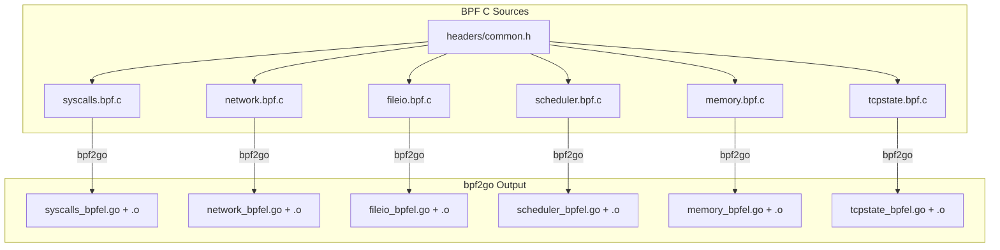
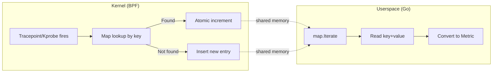

# eBPF Collector - BPF Program Design

## Overview

Six BPF C programs are compiled via `bpf2go` into Go bytecode at build time.
All programs share a common header (`common.h`) defining map key/value structs
and helper macros.



## Shared Header (`common.h`)

The common header defines:

- **Type stubs** for when `vmlinux.h` is not available (`__u32`, `__u64`, etc.)
- **Map key/value structs** shared between BPF programs and Go userspace
- **Constants**: `TASK_COMM_LEN=16`, `MAX_ENTRIES=10240`, `MAX_SYSCALL_NR=512`
- **Helper macros**: `GET_PID()`, `GET_TID()`

### Map Key/Value Structs

```c
// Syscall aggregation
struct syscall_key { __u32 pid; __u32 syscall_nr; };
struct syscall_val { __u64 count; __u64 total_ns; __u64 errors; char comm[16]; };

// Network (TCP + UDP)
struct net_key    { __u32 pid; };
struct tcp_val    { __u64 connections; __u64 bytes_sent; __u64 bytes_recv;
                    __u64 rtt_ns; __u64 retransmits; char comm[16]; };
struct udp_val    { __u64 packets_sent; __u64 packets_recv; char comm[16]; };

// File I/O
struct fileio_key { __u32 pid; __u32 operation; };
struct fileio_val { __u64 count; __u64 bytes; __u64 total_ns; char comm[16]; };

// Scheduler
struct sched_key  { __u32 pid; };
struct sched_val  { __u64 context_switches; __u64 runq_latency_ns;
                    __u64 oncpu_ns; __u64 migrations; char comm[16]; };

// Memory
struct mem_key    { __u32 pid; };
struct mem_val    { __u64 page_faults; __u64 major_faults;
                    __u64 minor_faults; char comm[16]; };

// TCP State
struct tcpstate_key { __u32 pid; __u32 old_state; __u32 new_state; };
struct tcpstate_val { __u64 count; };
```

## Map Strategy

All programs use `BPF_MAP_TYPE_HASH` for per-key aggregation:



Key design decisions:

- **Hash maps** (not ring buffers) for aggregation — reduces user-kernel data transfer
- **Atomic operations** (`__sync_fetch_and_add`) for lock-free concurrent updates
- **BPF_NOEXIST** flag on insert to handle races between lookup and insert
- **MAX_ENTRIES=10240** — limits memory footprint per map

## Program Details

### syscalls.bpf.c

**Attach points**: `tracepoint/raw_syscalls/sys_enter`, `tracepoint/raw_syscalls/sys_exit`

**Maps**:
| Map | Type | Key | Value | Purpose |
|-----|------|-----|-------|---------|
| `syscall_start` | HASH | `__u64` (tid) | `struct ts_entry` | Entry timestamp |
| `syscall_nr_map` | HASH | `__u64` (tid) | `__u32` (nr) | Syscall number |
| `syscall_stats` | HASH | `struct syscall_key` | `struct syscall_val` | Aggregated stats |

**Flow**:

1. `sys_enter`: Record timestamp + syscall number in per-TID maps
2. `sys_exit`: Calculate latency, check return code, update aggregated map

### network.bpf.c

**Attach points**: 6 kprobes

| Kprobe               | Action                         |
| -------------------- | ------------------------------ |
| `tcp_connect`        | Increment connection count     |
| `tcp_sendmsg`        | Accumulate bytes sent          |
| `tcp_recvmsg`        | Accumulate bytes received      |
| `tcp_retransmit_skb` | Increment retransmit count     |
| `udp_sendmsg`        | Increment UDP packets sent     |
| `udp_recvmsg`        | Increment UDP packets received |

**Maps**: `tcp_stats` (per-PID TCP), `udp_stats` (per-PID UDP)

### fileio.bpf.c

**Attach points**: `kprobe/vfs_read`, `kretprobe/vfs_read`, `kprobe/vfs_write`,
`kretprobe/vfs_write`, `kprobe/vfs_open`

**Maps**: `fileio_start` (entry timestamp), `fileio_stats` (aggregated)

**Operations**: `0=read`, `1=write`, `2=open`

### scheduler.bpf.c

**Attach point**: `tracepoint/sched/sched_switch`

**Maps**:
| Map | Purpose |
|-----|---------|
| `sched_enqueue` | Track when task entered run queue |
| `sched_oncpu` | Track when task started running |
| `sched_stats` | Aggregated scheduler metrics |

**Flow**:

1. Task switched **out** (prev): Calculate on-CPU time, record enqueue timestamp
2. Task switched **in** (next): Calculate run-queue latency, record on-CPU start

### memory.bpf.c

**Attach points**: `tracepoint/exceptions/page_fault_user`,
`tracepoint/exceptions/page_fault_kernel`

**Maps**: `mem_stats` (per-PID page fault counts)

Major fault detection: `error_code & 0x10`

### tcpstate.bpf.c

**Attach point**: `tracepoint/sock/inet_sock_set_state`

**Maps**: `tcpstate_stats` (per PID + old_state + new_state)

Filters: Only TCP (protocol == 6)

## Building BPF Programs

### Prerequisites

```bash
# Ubuntu/Debian
apt install clang llvm libbpf-dev

# Install bpf2go
go install github.com/cilium/ebpf/cmd/bpf2go@latest
```

### Generate

```bash
# From repo root
go generate ./internal/collector/ebpf/...

# Or via Makefile
make generate-ebpf
```

### gen.go Directives

Each directive produces a pair of Go files (little-endian + big-endian) plus
compiled `.o` bytecode:

```go
//go:generate go run github.com/cilium/ebpf/cmd/bpf2go -target bpfel,bpfeb \
    -cc clang -type syscall_key -type syscall_val \
    syscalls bpf/syscalls.bpf.c -- -I bpf
```

The `-type` flags auto-generate Go struct definitions that match the C struct
layout. The manual `types.go` provides cross-platform compilation when generated
files are not yet available.

## CO-RE (Compile Once, Run Everywhere)

Programs are compiled with BTF (BPF Type Format) information embedded. At
runtime, `cilium/ebpf` performs CO-RE relocation, adjusting struct field offsets
to match the running kernel. This allows a single compiled `.o` to work across
different kernel versions without recompilation.

BTF detection order:

1. `btf_path` config (if set)
2. `/sys/kernel/btf/vmlinux` (standard location)
3. Fallback: non-CO-RE mode (tracepoint args used directly)
