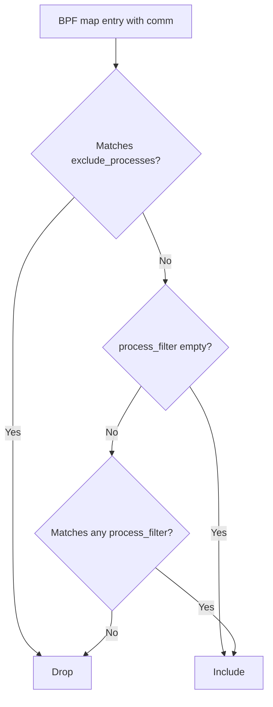

# eBPF Collector - Configuration Reference

## YAML Configuration

All eBPF settings live under `collectors.ebpf` in `configs/tfo-agent.yaml`:

```yaml
collectors:
  ebpf:
    # Master switch - disabled by default
    enabled: false

    # Collection interval
    interval: 15s

    # ─── Sub-Collector Toggles ──────────────────────────────────
    collect_syscalls: true # Syscall tracing (sys_enter/sys_exit)
    collect_network: true # TCP/UDP connection monitoring
    collect_file_io: true # VFS file I/O tracking
    collect_scheduler: false # Scheduler analysis (context switches)
    collect_memory: false # Memory page fault tracking
    collect_tcp_events: true # TCP state transitions

    # ─── Process Filtering ──────────────────────────────────────
    # Include only processes matching these regex patterns (empty = all)
    process_filter: []

    # Exclude processes matching these exact names
    exclude_processes:
      - tfo-agent
      - systemd

    # ─── Performance Tuning ─────────────────────────────────────
    # Percentage of events to sample (1-100)
    sample_rate: 100

    # Ring buffer size in bytes (for BPF_MAP_TYPE_RINGBUF)
    ring_buffer_size: 262144 # 256 KB

    # Perf buffer pages (for BPF_MAP_TYPE_PERF_EVENT_ARRAY)
    perf_buffer_size: 64

    # ─── BPF Runtime ────────────────────────────────────────────
    # Path to BTF vmlinux (empty = auto-detect from /sys/kernel/btf/vmlinux)
    btf_path: ""

    # Pin path for BPF maps (enables map persistence across restarts)
    pin_path: /sys/fs/bpf/tfo-agent

    # Additional labels applied to all eBPF metrics
    labels: {}

    # ─── Cilium Hubble Integration ──────────────────────────────
    cilium:
      enabled: false
      hubble_address: "localhost:4245"
      hubble_tls_enabled: false
      hubble_tls_cert: ""
      hubble_tls_key: ""
      hubble_tls_ca: ""
      collect_flows: true # L3/L4 network flows
      collect_l7_flows: false # HTTP/gRPC/DNS flows
      collect_drops: true # Dropped packets
      collect_policies: true # Network policy verdicts
```

## Environment Variables

| Variable                      | Config Path                | Default                 |
| ----------------------------- | -------------------------- | ----------------------- |
| `TELEMETRYFLOW_EBPF_ENABLED`  | `collectors.ebpf.enabled`  | `false`                 |
| `TELEMETRYFLOW_EBPF_BTF_PATH` | `collectors.ebpf.btf_path` | `""`                    |
| `TELEMETRYFLOW_EBPF_PIN_PATH` | `collectors.ebpf.pin_path` | `/sys/fs/bpf/tfo-agent` |

## Config Field Reference

### Top-Level Fields

| Field                | Type     | Default                 | Description               |
| -------------------- | -------- | ----------------------- | ------------------------- |
| `enabled`            | bool     | `false`                 | Enable eBPF collector     |
| `interval`           | duration | `15s`                   | Collection interval       |
| `collect_syscalls`   | bool     | `true`                  | Syscall tracing           |
| `collect_network`    | bool     | `true`                  | TCP/UDP monitoring        |
| `collect_file_io`    | bool     | `true`                  | VFS I/O tracking          |
| `collect_scheduler`  | bool     | `false`                 | Scheduler analysis        |
| `collect_memory`     | bool     | `false`                 | Page fault tracking       |
| `collect_tcp_events` | bool     | `true`                  | TCP state transitions     |
| `process_filter`     | []string | `[]`                    | Include regex patterns    |
| `exclude_processes`  | []string | `[tfo-agent, systemd]`  | Exclude exact names       |
| `sample_rate`        | int      | `100`                   | Sample percentage (1-100) |
| `ring_buffer_size`   | int      | `262144`                | Ring buffer bytes         |
| `perf_buffer_size`   | int      | `64`                    | Perf buffer pages         |
| `btf_path`           | string   | `""`                    | BTF vmlinux path          |
| `pin_path`           | string   | `/sys/fs/bpf/tfo-agent` | BPF pin directory         |
| `labels`             | map      | `{}`                    | Additional metric labels  |

### Cilium Fields

| Field                       | Type   | Default          | Description               |
| --------------------------- | ------ | ---------------- | ------------------------- |
| `cilium.enabled`            | bool   | `false`          | Enable Hubble integration |
| `cilium.hubble_address`     | string | `localhost:4245` | Hubble Relay address      |
| `cilium.hubble_tls_enabled` | bool   | `false`          | Use TLS for Hubble        |
| `cilium.hubble_tls_cert`    | string | `""`             | Client certificate path   |
| `cilium.hubble_tls_key`     | string | `""`             | Client key path           |
| `cilium.hubble_tls_ca`      | string | `""`             | CA certificate path       |
| `cilium.collect_flows`      | bool   | `true`           | L3/L4 flow collection     |
| `cilium.collect_l7_flows`   | bool   | `false`          | L7 flow collection        |
| `cilium.collect_drops`      | bool   | `true`           | Drop event collection     |
| `cilium.collect_policies`   | bool   | `true`           | Policy verdict collection |

## Validation Rules

- `sample_rate` must be 1-100
- `ring_buffer_size` must be >= 0
- `perf_buffer_size` must be >= 0
- Invalid `process_filter` regex patterns are skipped with a warning
- `exclude_processes` are exact-match (wrapped in `^...$`)

## Process Filtering



### Examples

Only trace NGINX and PostgreSQL:

```yaml
process_filter:
  - "nginx"
  - "postgres.*"
```

Exclude noisy system processes:

```yaml
exclude_processes:
  - tfo-agent
  - systemd
  - kworker
  - rcu_sched
```

## Tuning Guide

### High-Volume Systems (> 100k events/sec)

```yaml
collectors:
  ebpf:
    interval: 30s
    sample_rate: 50
    ring_buffer_size: 1048576 # 1 MB
    collect_scheduler: false
    collect_memory: false
    exclude_processes:
      - tfo-agent
      - systemd
      - kworker
      - rcu_sched
      - ksoftirqd
```

### Minimal Overhead

```yaml
collectors:
  ebpf:
    interval: 60s
    collect_syscalls: false
    collect_network: true
    collect_file_io: false
    collect_scheduler: false
    collect_memory: false
    collect_tcp_events: true
```

### Full Observability

```yaml
collectors:
  ebpf:
    interval: 10s
    collect_syscalls: true
    collect_network: true
    collect_file_io: true
    collect_scheduler: true
    collect_memory: true
    collect_tcp_events: true
    sample_rate: 100
    cilium:
      enabled: true
      collect_flows: true
      collect_l7_flows: true
      collect_drops: true
      collect_policies: true
```
